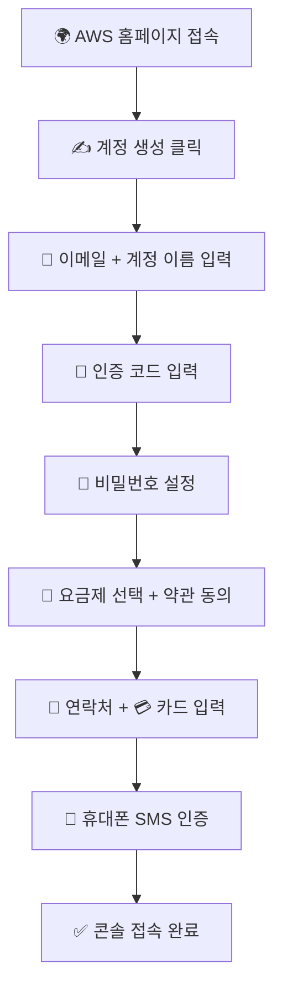

# 🌐 AWS 계정 생성 가이드 (2025 기준)

> 📝 작성자: [yjshin@Velog]  
> 📌 주제: AWS 계정 생성 절차를 쉽게 따라하는 단계별 안내서  
> 📅 업데이트: 2025년 기준 최신 UI 반영

---

## ✅ 계정 생성 전체 흐름 요약

| 단계 | 설명 |
|------|------|
| 1️⃣ | AWS 공식 홈페이지 접속 및 계정 생성 시작 |
| 2️⃣ | 이메일 및 계정 이름 입력 |
| 3️⃣ | 이메일 인증 코드 확인 및 입력 |
| 4️⃣ | 비밀번호 설정 (루트 계정) |
| 5️⃣ | 요금제 선택 (Free Tier 권장) |
| 6️⃣ | 연락처 및 결제 카드 정보 입력 |
| 7️⃣ | 휴대폰 번호 인증 (SMS) |
| 8️⃣ | AWS 콘솔 접속 완료 🎉 |

---

## 🧭 따라하기: 계정 생성 절차

### 🔹 1. AWS 홈페이지 접속
- 👉 https://aws.amazon.com/ko/ 로 접속
- 🟦 **"무료 계정 생성"** 버튼 클릭

### 🔹 2. 이메일 주소 & 계정 이름 입력
- 📧 이메일: `your.email+aws@gmail.com` 형태 추천
- 🧾 계정 이름: 개인이 알아보기 쉬운 이름으로 입력

### 🔹 3. 이메일 인증
- 📥 받은 편지함에서 6자리 인증 코드 확인
- 🔐 AWS 페이지에 코드 입력 후 계속

### 🔹 4. 비밀번호 설정
- 🔒 보안성 높은 비밀번호 설정
- ✅ 루트 사용자 기준

### 🔹 5. 요금제 선택
- 💸 **Free Tier (무료 요금제)** 선택 권장
- 🧑 개인 / 비즈니스 선택 후 이용 약관 동의

### 🔹 6. 결제 정보 입력
- 💳 신용카드 또는 체크카드 정보 입력 (필수)
- 📌 모든 동의 항목 체크 필수

### 🔹 7. 휴대폰 인증 (2단계 인증)
- 📱 전화번호 입력 → 인증코드 SMS 수신
- 🔐 4자리 코드 입력 → 본인 인증 완료

### 🔹 8. 콘솔 접속 완료 🎉
- 🖥️ **AWS Management Console**로 이동
- ✅ 로그인 → 클라우드 서비스 이용 시작!

---

## 🗺️ Mermaid 시각화 (계정 생성 플로우)

## 💡 팁 & 주의사항
| 💡 항목    | 📝 설명                                    |
| -------- | ---------------------------------------- |
| ✅ 이메일 팁  | `yourname+001@gmail.com` → 여러 계정 테스트에 유리 |
| ✅ 요금제 선택 | **프리 티어**는 12개월 무료 + 실습에 충분              |
| ✅ 결제 정보  | 카드 등록 시 **전체 동의** 체크 필수                  |
| ✅ SMS 인증 | 필수 보안 절차 (2단계 인증)                        |

## 📌 요약
AWS 계정 생성은
"이메일 → 인증 → 설정 → 카드 등록 → 인증 완료 → 콘솔 접속"
단계로 아주 쉽고 빠르게 완료됩니다.
이제 당신도 클라우드 세상에 입문하셨습니다! 🚀

https://velog.io/@yjshin/1.-AWS-계정-생성-2025
