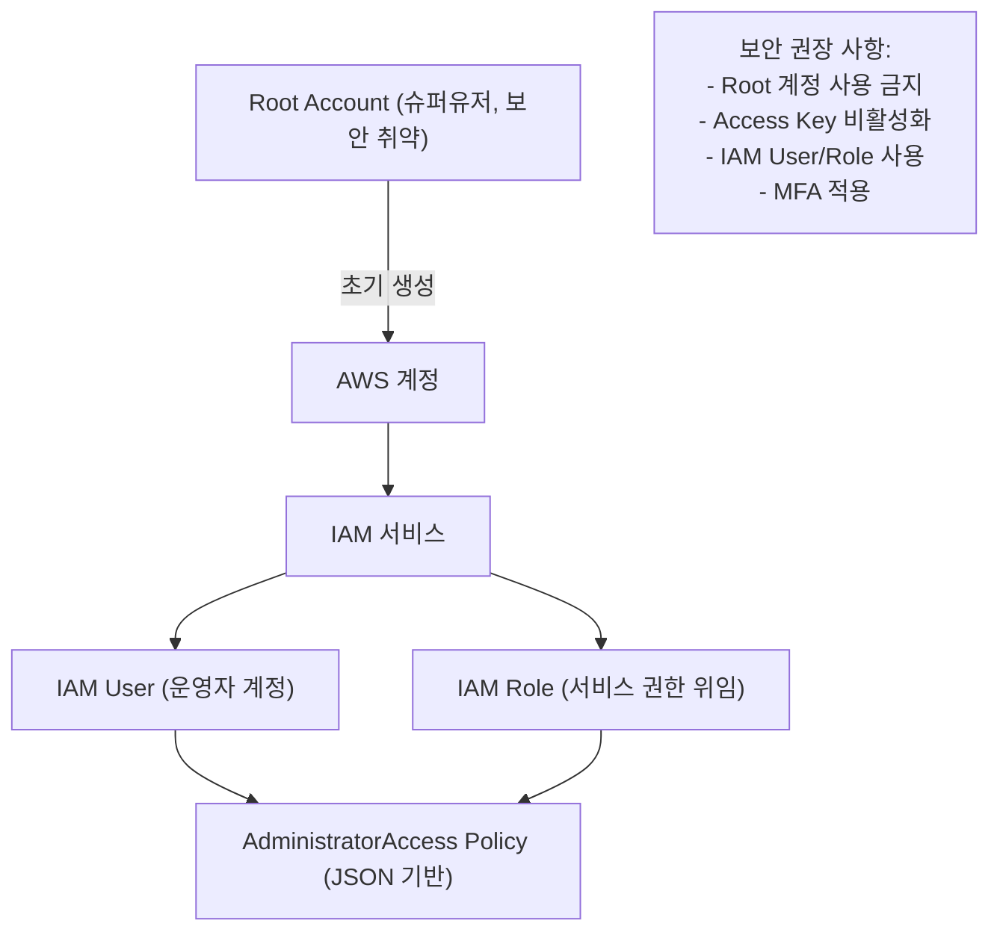
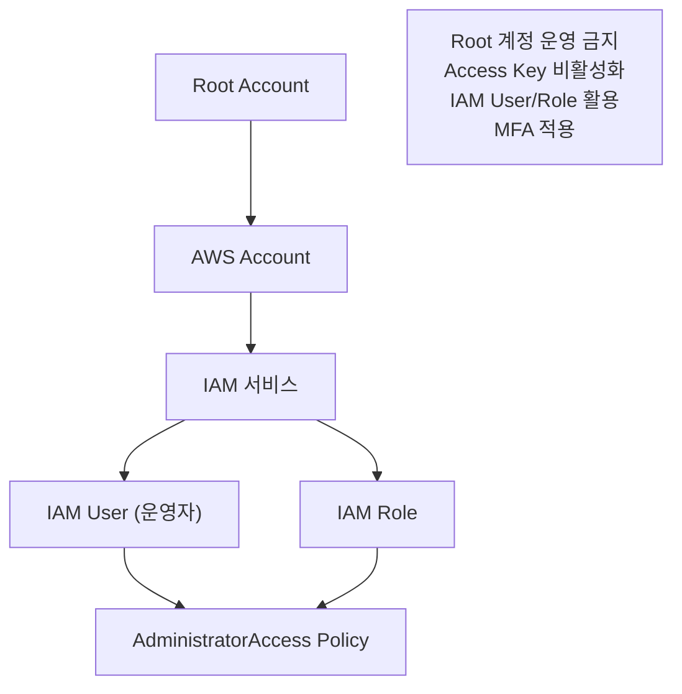

# 🔐 AWS IAM 사용자 생성 & Root 계정 보안 가이드

## 1️⃣-1️⃣ Root 계정의 특징과 문제점

- AWS 계정을 처음 생성하면 **Root 계정**(이메일 기반)이 만들어짐
    
- Root 계정은 **권한을 조정할 수 없는 슈퍼유저(Admin User)**
    
- 누구나 Root 계정 정보를 알면 모든 리소스에 접근 가능 → **보안에 매우 취약**
    
- 따라서 운영 환경에서는 Root 계정 사용을 **절대 권장하지 않음**

## 1️⃣-2️⃣ 왜 Root 계정을 쓰면 안 될까?

- AWS 계정 최초 생성 시 만들어지는 **Root 계정**은 권한을 제한할 수 없는 슈퍼유저
    
- Root 계정은 보안에 취약 → **실제 운영에서는 사용 금지**
    
- Access Key / Secret Key는 반드시 **비활성화(락)**
    
- Root 계정은 결제 관리, 계정 설정 등 **특수 작업에만 사용**
    

👉 Root 계정은 **최초 설정(결제, 서비스 가입 등)** 에만 사용하고,  
운영에서는 IAM User 또는 Role을 활용하는 것이 안전합니다.

---

## 2️⃣ Root 계정 보안 권장 사항

- Root 계정으로 로그인하지 말 것
    
- Root 계정의 **Access Key & Secret Key는 비활성화(락 걸기)**
    
- MFA(다중 인증) 필수 적용
    
- IAM User/Role을 만들어 권한 부여 후 운영
    

---

## 3️⃣-1️⃣ IAM User 생성 가이드

1. **IAM 콘솔 → 사용자 추가**
    
2. 사용자 이름 입력 (예: `admin-user`)
    
3. 권한 부여
    
    - `AdministratorAccess` 정책 연결 (JSON 기반 Policy)
        
    - 필요에 따라 최소 권한 원칙(Least Privilege) 적용
        
4. 암호 설정
    
    - "다음 로그인 시 새 암호 생성" 권장 (운영 환경에서는 반드시 활성화)
        

## 3️⃣-2️⃣ IAM User 생성 절차

1. **IAM 콘솔 접속 → 사용자 추가**
    
2. 사용자 이름 입력 (예: `admin-user`)
    
3. 인증 방식 선택
    
    - 암호 로그인(Password) → 콘솔 접근 가능
        
    - 액세스 키(Access Key) → 프로그래밍 접근 가능
        
4. 암호 정책
    
    - "다음 로그인 시 새 암호 생성" → 운영 환경에서는 반드시 활성화
        
5. 권한 부여
    
    - `AdministratorAccess` 정책 연결
        
    - 또는 역할(Role) 기반 권한 부여
        
6. 태그(Tag) 추가 (선택)
    
7. 생성 완료 후 자격 증명 저장


---


## 4️⃣ 권한 관리 (Policies)

- IAM 권한은 **JSON Policy**로 정의됨
    
- 예: EC2 전체 권한 부여
    
```
{   "Version": "2012-10-17",   "Statement": [     
{       "Effect": "Allow",          // 허용       
        "Action": "ec2:*",          // EC2 관련 모든 작업      
        "Resource": "*"             // 모든 EC2 리소스     }   
] }
```

## 4️⃣ 정책(Policy) 예시

```
{   "Version": "2012-10-17",   
     "Statement": [     {       
     "Effect": "Allow",                // 허용할지(Allow) 또는 거부할지(Deny)       
     "Action": "ec2:*",                // EC2 관련 모든 작업 허용       
     "Resource": "*"                   // 모든 EC2 리소스에 적용     }   
] }
```


## 5️⃣ Mermaid 시각화




---

## 5️⃣ 시각화 (Mermaid)




### 📝 한 줄씩 설명

- `"Version": "2012-10-17"` → IAM 정책 언어 버전 (항상 이 날짜 사용)
    
- `"Effect": "Allow"` → 권한 허용 (Deny는 차단)
    
- `"Action": "ec2:*"` → EC2 서비스의 모든 동작 가능 (`*` = 전체 권한)
    
- `"Resource": "*"` → 특정 리소스가 아닌 모든 EC2 인스턴스에 적용
    

---


## ✅ 보안 권장 사항

- Root 계정 사용 ❌ → IAM User/Role로 운영
    
- MFA 활성화 → 로그인 2차 보안 적용
    
- 최소 권한 원칙(Least Privilege) → 꼭 필요한 권한만 부여
    
- 액세스 키 주기적 교체 및 로그 감사(CloudTrail)

---

## ✅ 정리

- Root 계정은 **보안상 취약** → 운영 환경에서는 사용 ❌
    
- 대신 IAM User / IAM Role을 만들어 **필요한 권한만 부여**해서 사용
    
- 정책(Policy)은 JSON으로 정의되며,  
    보안 원칙은 **최소 권한 부여(Least Privilege)**

* 참고 블로그 : https://velog.io/@yjshin/2.-IAM-User-생성-Ver.2025
