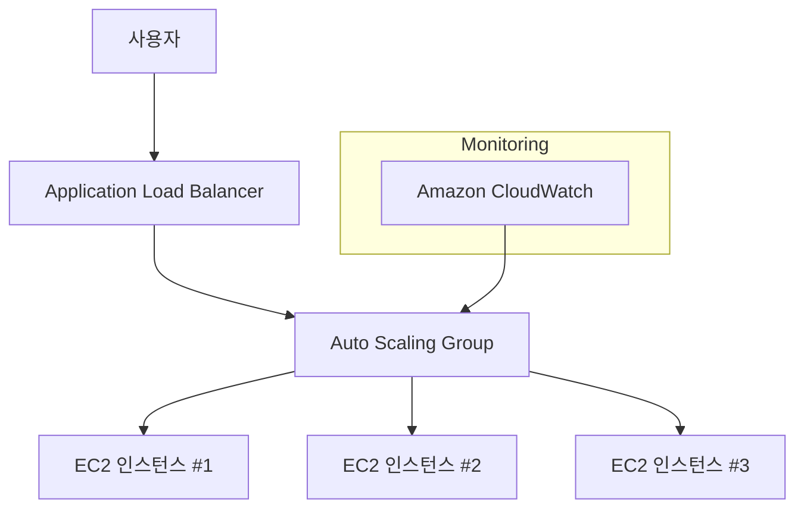

# ⚖️ AWS Auto Scaling 완벽 가이드

## 1️⃣ AWS Auto Scaling 이란?

AWS Auto Scaling은
트래픽이나 부하(Load)에 따라 EC2 인스턴스의 개수를 자동으로 늘리거나 줄이는 서비스입니다.

👉 쉽게 말해,
“손님이 많으면 서버를 자동으로 늘리고, 손님이 적으면 줄여서 비용을 절약하는 기능” 이에요.

## 2️⃣ Auto Scaling의 핵심 개념

Scaling Out 🚀 → 트래픽이 많아질 때 서버 개수 증가

Scaling In 📉 → 트래픽이 줄어들면 서버 개수 감소

Scaling Policy ⚙️ → 어떤 조건에서 서버를 늘리거나 줄일지 정의

Auto Scaling Group (ASG) 👥 → Auto Scaling이 관리하는 서버 그룹

## 3️⃣ Auto Scaling 아키텍처 개념도

## 📝 설명

사용자는 로드 밸런서(ALB) 를 통해 접속

로드 밸런서는 트래픽을 여러 EC2 인스턴스로 분산

Auto Scaling Group은 CloudWatch 모니터링 데이터를 기반으로

서버가 부족하면 새로운 EC2 자동 생성

서버가 과하면 불필요한 EC2 종료

## 4️⃣ Auto Scaling의 장점

📈 확장성 (Scalability) → 사용량에 맞춰 서버 자동 확장

💰 비용 효율성 (Cost Efficiency) → 필요할 때만 서버 사용, 비용 절감

🛡️ 가용성 (High Availability) → 장애 발생 시 새 인스턴스 자동 생성

⚡ 운영 자동화 (Automation) → 관리 부담 최소화

## 5️⃣ Auto Scaling 동작 흐름 (Step by Step)

CloudWatch가 CPU 사용률 80% 초과 감지

Auto Scaling Group이 새로운 EC2 인스턴스를 추가 생성 (Scaling Out)

트래픽이 줄어 CPU 사용률이 30% 이하로 내려감

Auto Scaling Group이 불필요한 EC2 인스턴스를 종료 (Scaling In)

## 6️⃣ Auto Scaling 실습 포인트

EC2 Launch Template 생성 (서버 설정값)

Auto Scaling Group 생성 (최소/최대/원하는 서버 개수 설정)

CloudWatch 알람 연결 (예: CPU 70% 이상 → 서버 추가)

로드 밸런서와 연결 (사용자 트래픽 자동 분산)

## ✅ 정리

AWS Auto Scaling은 서버 개수를 자동으로 늘리고 줄여주는 서비스입니다.

손님이 몰리면 서버 늘리고 🚀

한가하면 서버 줄여서 비용 절감 💰

장애가 나도 자동 복구 🛡️

* 참고 링크 : https://velog.io/@yjshin/AWS-Auto-Scaling

👉 스타트업부터 대기업까지 모든 규모의 웹 서비스 운영에 필수적인 기능입니다.
