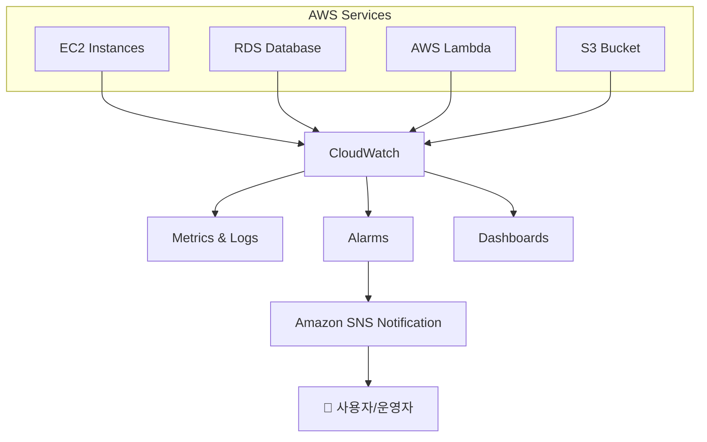

# 📊 AWS CloudWatch 정리

## 1️⃣ AWS CloudWatch란?

Amazon CloudWatch 는
AWS 리소스(EC2, RDS, Lambda 등)와 애플리케이션을 모니터링 및 로깅할 수 있는 서비스입니다.

### **👉 쉽게 말해, “AWS 서비스들의 건강 상태를 실시간으로 지켜보고, 문제가 생기면 알려주는 감시자” 입니다.**

## 2️⃣ CloudWatch의 주요 기능

### 📈 메트릭(Metrics)

CPU, 메모리, 네트워크, 디스크 사용량 등 지표 수집

### 📋 로그(Log) 수집 및 관리

애플리케이션 로그, 시스템 로그를 중앙에서 관리

### 🔔 알람(Alarms)

특정 조건 발생 시 알림 (예: CPU > 80% → Slack/Email로 알람)

### 📊 대시보드(Dashboards)

지표와 로그를 시각적으로 모니터링

### ⚡ 이벤트(Events)

AWS 리소스에서 발생하는 이벤트를 감지하고 자동으로 대응 (예: Auto Scaling 트리거)

## 3️⃣ CloudWatch 아키텍처 개념도

## 4️⃣ CloudWatch 사용 예시

EC2 CPU 사용률이 80% 초과 시 알람 전송

RDS 스토리지가 가득 차기 전 경고 발생

Lambda 함수 오류율이 일정 기준 이상일 때 Slack/이메일 알림

S3 버킷 접근 로그를 중앙 집중형 분석

Auto Scaling과 연동 → 트래픽 급증 시 서버 자동 확장

## 5️⃣ 현업에서의 활용

현업에서는 CloudWatch를 다음과 같이 적극적으로 활용합니다.

### 🛠 운영 모니터링

서버 상태, DB 성능, API 응답 시간 등을 실시간 모니터링

### 🔔 알림 자동화

CloudWatch Alarms + SNS → 장애 발생 시 Slack, Teams, PagerDuty로 알림 전송

### ⚡ 자동 대응

CloudWatch Events → 특정 조건 충족 시 Lambda 실행

예) CPU 90% 이상 → Auto Scaling Group에 새 EC2 추가

### 📑 비용 관리

사용량/비용 관련 메트릭 추적 → AWS Budgets와 함께 활용

### 🧑‍💻 DevOps / SRE 필수 도구

CI/CD 파이프라인 로그 수집

보안 모니터링(AWS GuardDuty, Config와 함께)

## ✅ 정리

AWS CloudWatch는

모니터링 (Metrics & Logs), 알림 (Alarms & SNS), 자동화 (Events & Lambda 연동)
등을 통해 운영 안정성과 가용성을 높여주는 핵심 서비스입니다.

### 👉 한마디로, “AWS의 CCTV + 알람 시스템” 이라고 이해하면 가장 쉽습니다.

* 참고 블로그 링크 : https://velog.io/@yjshin/AWS-AWS-CloudWatch-Amazon-CloudWatch
