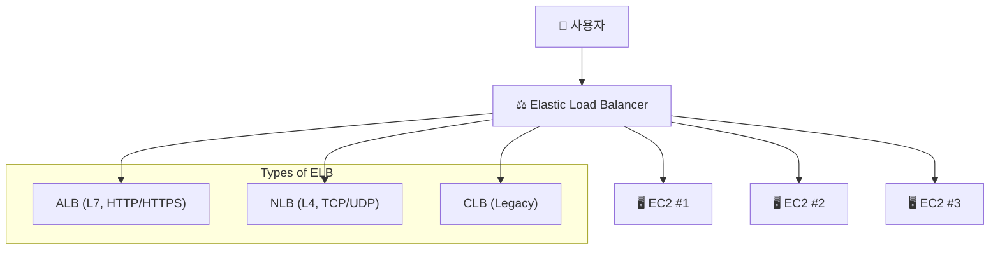

# ⚖️ AWS Elastic Load Balancing (ELB) 완벽 가이드

## 1️⃣ ELB란?

Elastic Load Balancing (ELB) 는
AWS에서 제공하는 트래픽 분산 서비스입니다.

👉 쉽게 말해,
“많은 손님이 한 가게로 몰렸을 때, 여러 점원에게 손님을 나눠주는 매니저” 같은 역할을 합니다.

사용자가 몰려도 서버가 버틸 수 있도록 요청을 분산

서버에 장애가 발생하면 정상 서버로만 트래픽 전달

EC2, 컨테이너(ECS/EKS), Lambda 등 다양한 서비스와 연동 가능

## 2️⃣ ELB의 종류
🟢 1. ALB (Application Load Balancer)

OSI 7계층 (Application Layer)

HTTP, HTTPS, WebSocket 지원

URL 경로나 호스트 기반 라우팅 가능 (예: /api → API 서버, /img → 이미지 서버)

웹 애플리케이션에 최적화

🔵 2. NLB (Network Load Balancer)

OSI 4계층 (Transport Layer)

TCP, UDP, TLS 지원

고성능, 초저지연 네트워크 트래픽 처리 가능

수백만 요청/초 처리 가능 → 금융, 게임, 실시간 서비스에 적합

🟠 3. CLB (Classic Load Balancer) 구형

OSI 4 & 7 계층 지원 (하이브리드)

이전 세대 로드밸런서 → 현재는 ALB/NLB 사용 권장

## 3️⃣ ELB 아키텍처 개념도

## 4️⃣ ELB의 장점

📈 확장성 → 사용량이 늘어나도 자동으로 서버 분산

🛡️ 고가용성 → 일부 서버 다운돼도 서비스 지속 가능

🌍 글로벌 서비스 지원 → 여러 리전/가용 영역(AZ)에서 트래픽 분산

⚡ 보안 통합 → AWS WAF, ACM(SSL 인증서) 등과 연동

## 5️⃣ 실제 활용 사례

🌐 웹 애플리케이션 → ALB로 /api, /static 경로 분리

🎮 게임 서버 → NLB로 TCP 기반 실시간 트래픽 분산

🏦 금융 거래 시스템 → NLB로 안정적인 네트워크 처리

🕰️ 레거시 애플리케이션 → CLB로 기존 시스템 운영

## ✅ 정리

AWS ELB는 트래픽을 자동으로 분산하여

서버 과부하 방지

고가용성 확보

보안 및 확장성 강화

👉 현재는 ALB (웹 애플리케이션), NLB (네트워크 고성능 트래픽) 를 주로 사용하고,
CLB는 점차 대체되는 추세입니다.

* 참고 링크 : https://velog.io/@yjshin/AWS-ELB-Elastic-Load-Balancing
