# 🔐 AWS IAM (Identity and Access Management) 이해하기

## 1️⃣ IAM이란?

> AWS IAM은
AWS 리소스(EC2, S3, RDS 등)에 접근할 수 있는 사용자(User), 그룹(Group), 권한(Policy) 을 관리하는 서비스입니다.

## 👉 쉽게 말해, “누가(AWS User) / 무엇을(서비스 리소스) / 어떻게(권한 Policy)” 사용할 수 있는지 제어하는 시스템입니다.

## 2️⃣ IAM의 주요 개념

사용자(User)

AWS에 접근하는 개별 계정 (개발자, 운영자 등)

그룹(Group)

여러 사용자에게 동일한 권한을 부여할 때 사용

역할(Role)

사용자나 서비스에 임시 권한을 위임할 때 사용 (예: EC2가 S3에 접근하도록 Role 부여)

정책(Policy)

JSON 형식으로 작성된 권한 정의서 (예: S3 읽기 전용, EC2 시작 권한 등)

## 3️⃣ IAM의 특징

🆓 무료 서비스 (사용자 관리 자체에는 비용 없음)

🌍 세분화된 접근 제어 (서비스, 리소스 단위까지 제어 가능)

🔒 MFA(다중 인증) 지원 → 보안 강화

📊 CloudTrail 연동 → 누가 언제 어떤 작업을 했는지 기록 가능

⏱️ 임시 보안 자격 증명(STS) → 짧은 기간만 권한을 위임 가능

## 4️⃣ IAM 아키텍처 개념도

```mermaid
graph TD
    Admin[👩‍💻 관리자] --> IAM[🔐 IAM 서비스]
    IAM --> User1[사용자 A]
    IAM --> User2[사용자 B]
    IAM --> Role[Role: EC2-S3-Access]
    
    User1 --> EC2[EC2 인스턴스]
    User2 --> S3[S3 버킷]
    Role --> EC2 --> S3
```

## 5️⃣ IAM 활용 사례

개발자 팀 → EC2, S3 관리 권한 부여

운영팀 → CloudWatch 로그 보기 권한만 부여

애플리케이션 서버(EC2) → IAM Role을 부여해 S3에 파일 업로드

외부 협력사 → 특정 S3 버킷에만 읽기 전용 접근 허용

## 6️⃣ IAM 보안 모범 사례

❌ Root 계정 직접 사용 금지 (최초 계정은 보관만)

✅ 개별 사용자 생성 후 권한 최소화(Principle of Least Privilege)

✅ MFA 활성화

✅ 정기적인 액세스 키 교체

✅ CloudTrail로 로그 모니터링

✅ 정리

> AWS IAM은
> 클라우드 보안의 핵심이자, 사용자와 서비스가 어떤 리소스에 어떤 방식으로 접근할 수 있는지 관리하는 서비스입니다.

## 👉 한마디로, AWS 보안의 관문(Gatekeeper) 역할을 합니다.

* 참고 링크
  https://velog.io/@yjshin/AWS-IAM-Identity-and-Access-Management
  https://docs.aws.amazon.com/ko_kr/iam/?icmpid=docs_homepage_security
  https://docs.aws.amazon.com/ko_kr/IAM/latest/UserGuide/introduction.html
