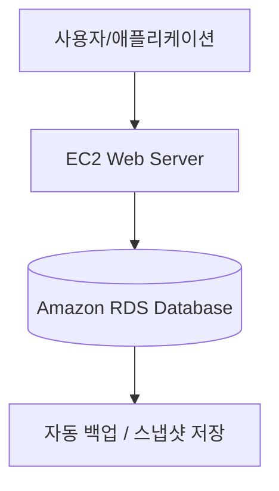

# 🗄️ Amazon RDS (Relational Database Service) 이해하기

## 1️⃣ RDS란?

Amazon RDS는 AWS에서 제공하는 관리형(Relational) 데이터베이스 서비스입니다.
즉, 직접 서버를 설치하고 DB를 운영할 필요 없이, 클릭 몇 번으로 데이터베이스를 생성하고 운영할 수 있습니다.

### 👉 쉽게 말해, “AWS가 대신 설치·백업·패치·운영까지 해주는 데이터베이스 서버” 라고 생각하면 됩니다.

## 2️⃣ 지원하는 데이터베이스 엔진

RDS는 다양한 오픈소스 및 상용 DB 엔진을 지원합니다.

MySQL

PostgreSQL

MariaDB

Oracle (상용 라이선스 필요)

Microsoft SQL Server

Amazon Aurora (AWS가 자체 개발한 고성능 DB, MySQL/PostgreSQL 호환)

## 3️⃣ RDS의 주요 특징

⚡ 자동화

백업, 스냅샷, 패치, 장애 복구를 자동 처리

🛡️ 보안

VPC 내부 배치, 보안 그룹/네트워크 ACL, KMS 암호화 지원

📈 확장성

읽기 전용 복제(Read Replica)로 트래픽 분산

스토리지와 인스턴스 크기 확장 가능

🔄 고가용성 (Multi-AZ)

장애 시 자동으로 대기 인스턴스로 Failover

💸 비용 효율성

사용한 만큼 과금 (On-Demand, Reserved Instances)

## 4️⃣ RDS 아키텍처 개념도

## 5️⃣ RDS 활용 사례

🛒 쇼핑몰/웹서비스의 트랜잭션 데이터 관리

📊 데이터 분석용 저장소 (BI, 리포팅)

🧪 테스트/개발 환경에서 빠르게 DB 생성

🌍 글로벌 서비스에서 읽기 전용 Replica 로 다중 리전 분산

## 6️⃣ RDS를 시작하려면?

RDS 콘솔 → DB 인스턴스 생성

엔진(MySQL, PostgreSQL 등) 선택

버전, 인스턴스 타입, 스토리지 설정

VPC/Subnet 그룹 선택

DB를 퍼블릭/프라이빗 서브넷 중 어디에 둘지 결정

보안 그룹 설정

EC2(Web/App 서버)에서만 접근 가능하도록 인바운드 규칙 설정

백업/고가용성 설정

자동 백업 주기, Multi-AZ 여부 선택

애플리케이션에서 연결

RDS 엔드포인트 주소 + 포트 + 계정 정보 사용

## ✅ 정리

Amazon RDS는 운영 부담을 최소화하면서,

안정적이고 확장 가능한 관계형 데이터베이스를 제공하는 서비스입니다.

### 👉 즉, 개발자는 DB 설치/운영에 신경 쓰지 않고 비즈니스 로직 개발에만 집중할 수 있습니다.

* 참고 링크 :
https://docs.aws.amazon.com/AmazonRDS/latest/UserGuide/Welcome.html
https://velog.io/@yjshin/AWS-RDS-Relational-Database-Service
