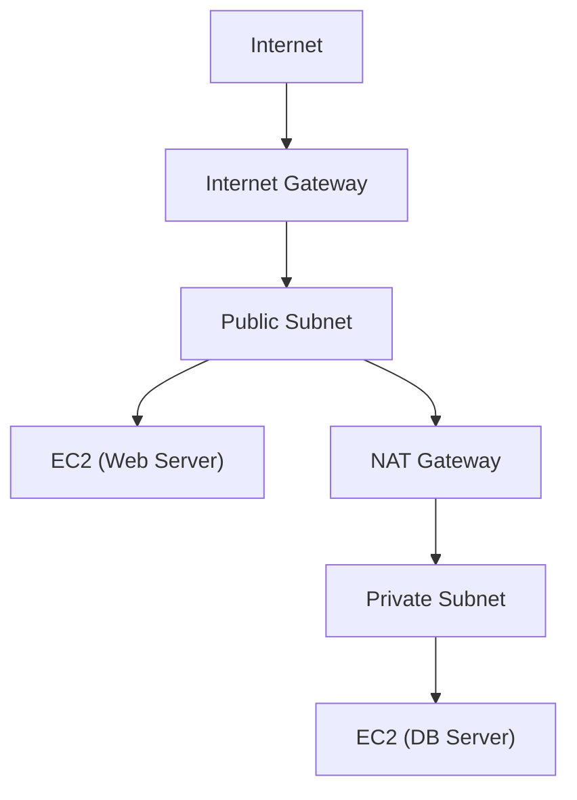
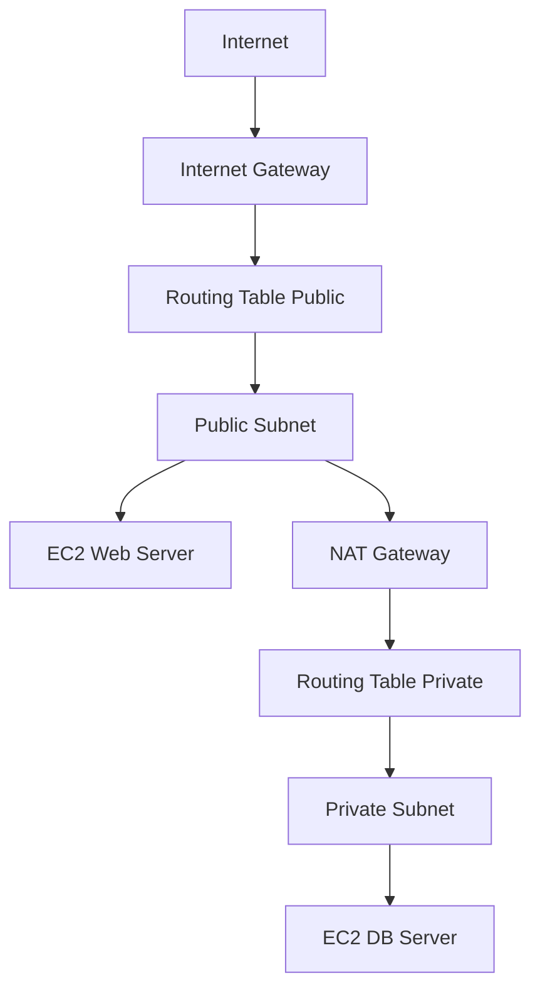

# 🌐 AWS VPC (Virtual Private Cloud) 이해하기

### 1. VPC란 무엇일까?

VPC (Virtual Private Cloud) 는
AWS 클라우드 안에서 내가 원하는 방식으로 네트워크 공간을 직접 설계할 수 있게 해주는 서비스입니다.

## 👉 쉽게 말해,
**“AWS 클라우드 안에 나만의 독립적인 데이터센터를 만드는 것”**이라고 이해하면 됩니다.

### 2. VPC의 주요 특징

🛡️ 격리된 네트워크 공간: 다른 고객과 분리된 안전한 네트워크 영역 제공

📡 IP 주소 범위 설정: 원하는 대역(CIDR 블록)으로 네트워크를 직접 구성 가능

🔄 서브넷(Subnet) 분리: 퍼블릭/프라이빗 서브넷을 나눠 보안성과 효율성 확보

🚪 게이트웨이 연결: 인터넷 게이트웨이(IGW), NAT 게이트웨이, VPN, Direct Connect 등 다양한 연결 지원

🔒 보안 제어: Security Group, Network ACL로 접근 제어 가능

### 3. VPC 구조 시각화

설명

Internet Gateway (IGW) : VPC를 인터넷과 연결

Public Subnet : 외부에서 접근 가능한 서버(예: 웹 서버) 배치

Private Subnet : 외부에서 직접 접근할 수 없는 내부 서버(예: DB) 배치

NAT Gateway : Private Subnet의 서버들이 인터넷에 나가는 트래픽만 허용

Security Group & NACL : 인스턴스/네트워크 단위에서 방화벽 역할

### 4. VPC 활용 사례

🏠 웹 서비스 기본 아키텍처: 웹 서버(퍼블릭) + DB 서버(프라이빗)

🏢 기업 내부 전용망 구축: VPN이나 Direct Connect로 사내 네트워크와 연결

🔒 보안 강화 환경: 내부 시스템은 프라이빗 서브넷에 두고, 외부 노출 최소화

🌍 멀티 리전/멀티 AZ 아키텍처: 재해 복구(Disaster Recovery) 대비

5. VPC를 시작하려면?

VPC 생성 (IP 범위 설정: 예. 10.0.0.0/16)

퍼블릭/프라이빗 서브넷 생성

라우팅 테이블 구성 (인터넷 게이트웨이, NAT GW 연결)

보안 그룹(Security Group), 네트워크 ACL 설정

EC2, RDS 등 리소스 배치

# 🖥️ EC2 + VPC 아키텍처

## ✨ 구조 설명

VPC : 나만의 네트워크 공간

Public Subnet : 외부에서 접근 가능한 EC2 (예: 웹 서버) 배치

Private Subnet : 외부에서는 직접 접근 불가, 내부용 EC2 (예: DB 서버) 배치

Internet Gateway (IGW) : VPC와 인터넷 연결

NAT Gateway : Private Subnet의 EC2가 인터넷에 나가는 통신만 가능하게 해줌

#### 👉 이렇게 하면 웹 서버(퍼블릭) ↔ DB 서버(프라이빗) 구조가 만들어져, 보안성과 확장성을 모두 확보할 수 있습니다.

VPC: AWS에서 만든 나만의 네트워크 공간

Public Subnet: 외부(인터넷)에서 접근 가능한 웹 서버 EC2 위치

Private Subnet: 외부에서 직접 접근할 수 없는 DB 서버 EC2 위치

Internet Gateway (IGW): VPC와 인터넷을 연결하는 통로

NAT Gateway: Private Subnet의 EC2가 인터넷에 나가는 트래픽만 허용

👉 즉, 사용자는 인터넷을 통해 Public Subnet의 웹 서버 EC2에 접속하고,
웹 서버는 내부적으로만 Private Subnet의 DB 서버 EC2와 통신하는 구조입니다.

# ✅ 정리

AWS VPC는 클라우드 환경에서 내 마음대로 설계하는 가상 네트워크 공간입니다.

온프레미스 데이터센터처럼, 퍼블릭/프라이빗 네트워크를 나누고 보안을 적용할 수 있어
EC2, RDS, ELB 같은 AWS 서비스의 기반 인프라 역할을 합니다.

* 참고 링크 :
https://docs.aws.amazon.com/ko_kr/vpc/latest/userguide/what-is-amazon-vpc.html
https://velog.io/@yjshin/AWS-VPC-Virtual-Private-Cloud
