# 멋쟁이사자처럼 2주차 회고록
*객체지향 프로그래밍과 실무 기술 스택 마스터 🎯*

---

## 📅 학습 기간
**2025년 8월 4일 - 8월 8일 (5일차)**

---

## 🚀 2주차 핵심 테마: **"이론에서 실무로"**

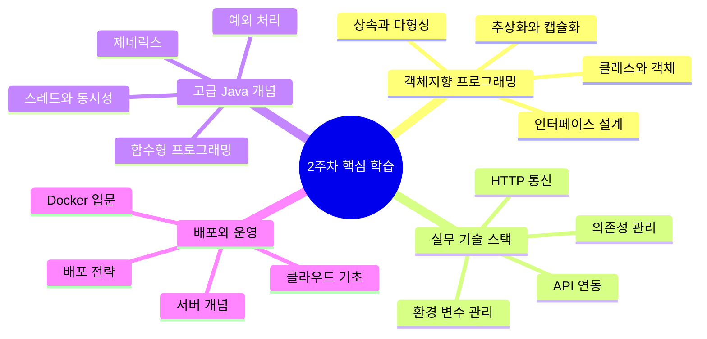

---

## 📊 주요 학습 성취도

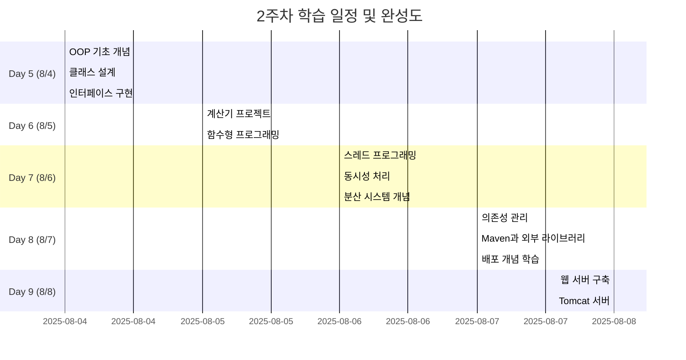

---

## 📚 일차별 상세 학습 내용

### 🧱 **Day 5 (8/4): 객체지향 프로그래밍의 진정한 시작**

#### 🎯 핵심 키워드
- **OOP 4대 원칙**: 캡슐화, 상속, 다형성, 추상화
- **추상 클래스**: `abstract class Chatbot`
- **인터페이스**: `interface IGemini` 
- **상속과 오버라이딩**: `extends`, `@Override`

#### 💡 실전 프로젝트: Gemini 챗봇 구현
```java
// 추상 클래스를 활용한 설계
public abstract class Chatbot implements IGemini {
    protected final String apiKey;
    
    protected Chatbot(String apiKey) {
        this.apiKey = apiKey;
    }
    
    @Override
    public String chat(String message) throws Exception {
        String templateMessage = handleMessage(message);
        String geminiResponse = callGemini(apiKey, templateMessage);
        return changeResult(geminiResponse);
    }
}
```

#### 🔍 깊이 있는 이해
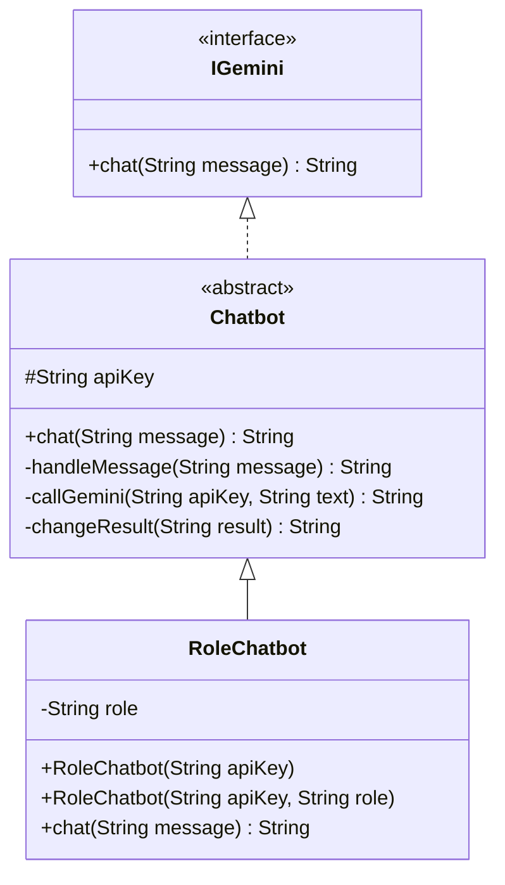

---

### 🔧 **Day 6 (8/5): 계산기 프로젝트와 함수형 프로그래밍**

#### 🎯 핵심 키워드
- **인터페이스 설계**: `ICalculator`
- **함수형 프로그래밍**: Lambda, Stream API
- **코드 재사용성**: 모듈화된 설계

#### 🧮 계산기 프로젝트 아키텍처
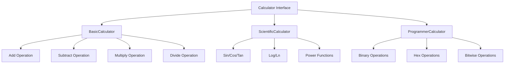

#### 💫 함수형 프로그래밍 도입
- Lambda 표현식으로 코드 간소화
- Stream API를 통한 데이터 처리 최적화
- 불변성(Immutability) 개념 이해

---

### ⚡ **Day 7 (8/6): 스레드와 분산 시스템의 세계**

#### 🎯 핵심 키워드
- **멀티스레딩**: `Thread`, `Runnable`
- **동시성 제어**: `synchronized`, `volatile`
- **분산 처리**: Redis, 메시지 큐
- **클라우드 컴퓨팅**: 확장성과 가용성

#### 🔄 스레드 동작 원리
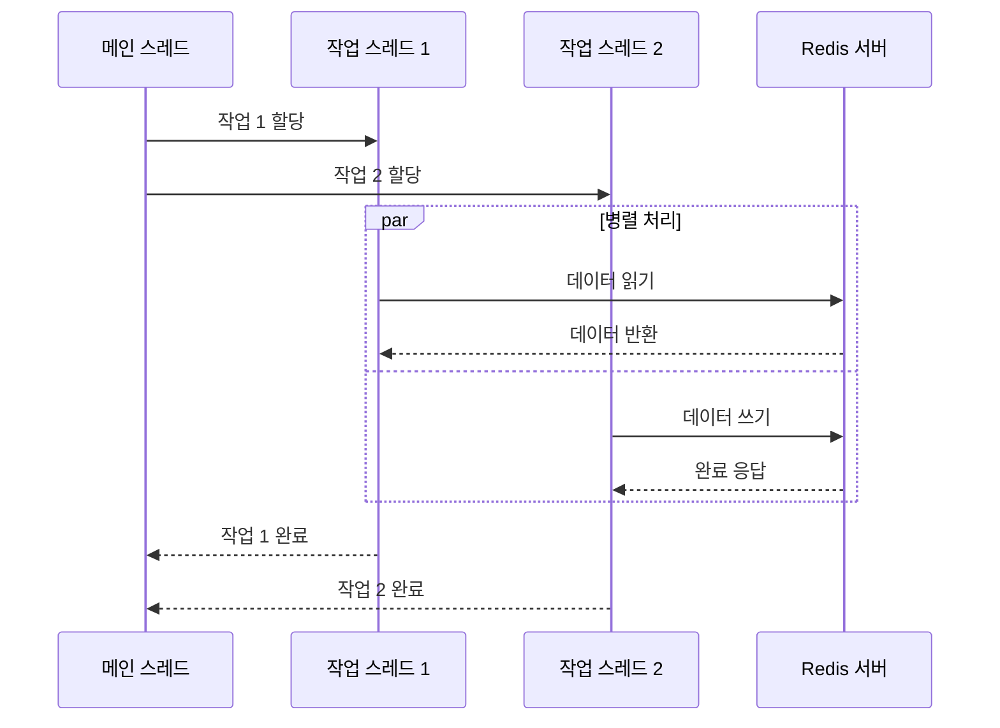

#### 🌐 분산 시스템 아키텍처
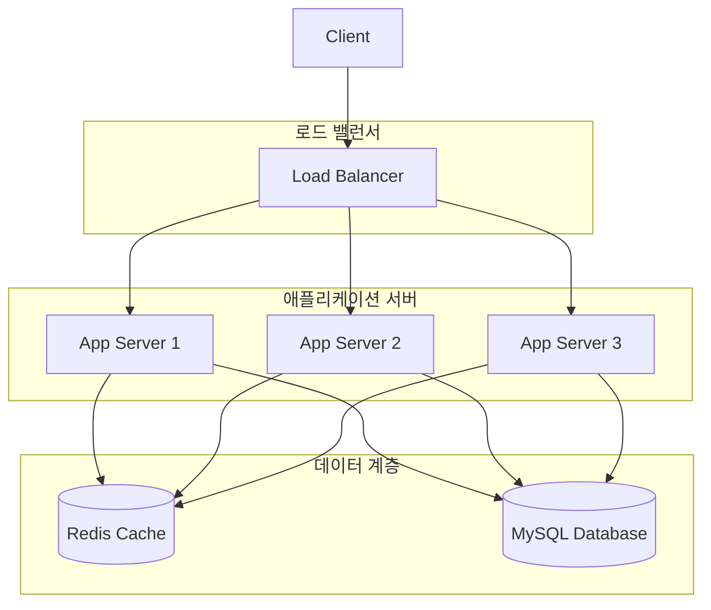

---

### 📦 **Day 8 (8/7): 의존성 관리와 배포의 첫 걸음**

#### 🎯 핵심 키워드
- **의존성 관리**: Maven, pom.xml
- **환경 변수**: `.env` 파일, Dotenv
- **외부 라이브러리**: Jackson, HTTP Client
- **배포 개념**: Docker, 클라우드 서비스

#### 📋 의존성의 종류와 특징
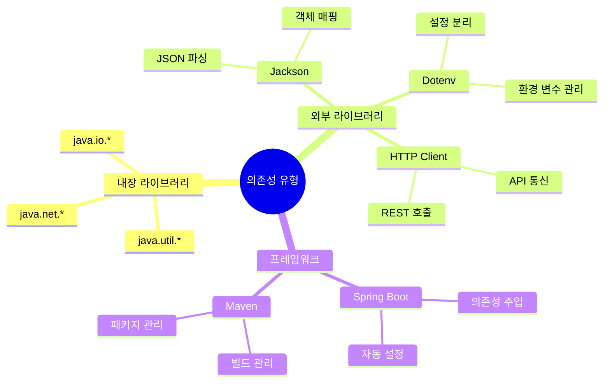

#### 🚀 배포 파이프라인 개념
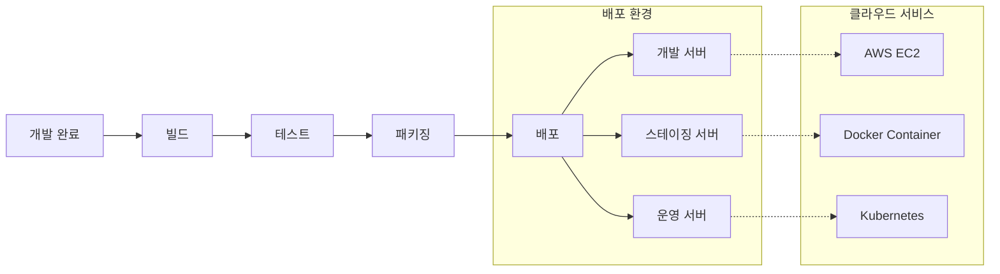

#### 💻 실전 Maven 설정
```xml
<dependencies>
    <dependency>
        <groupId>com.google.ai</groupId>
        <artifactId>genai</artifactId>
        <version>latest</version>
    </dependency>
    <dependency>
        <groupId>io.github.cdimascio</groupId>
        <artifactId>dotenv-java</artifactId>
        <version>3.0.0</version>
    </dependency>
    <dependency>
        <groupId>com.fasterxml.jackson.core</groupId>
        <artifactId>jackson-databind</artifactId>
        <version>2.15.2</version>
    </dependency>
</dependencies>
```

---

### 🌐 **Day 9 (8/8): 웹 서버와 실전 배포**

#### 🎯 핵심 키워드
- **웹 서버**: Apache Tomcat
- **서블릿**: Java 웹 애플리케이션
- **WAS**: Web Application Server
- **실전 배포**: Render, Docker

#### 🏗️ 웹 서버 아키텍처
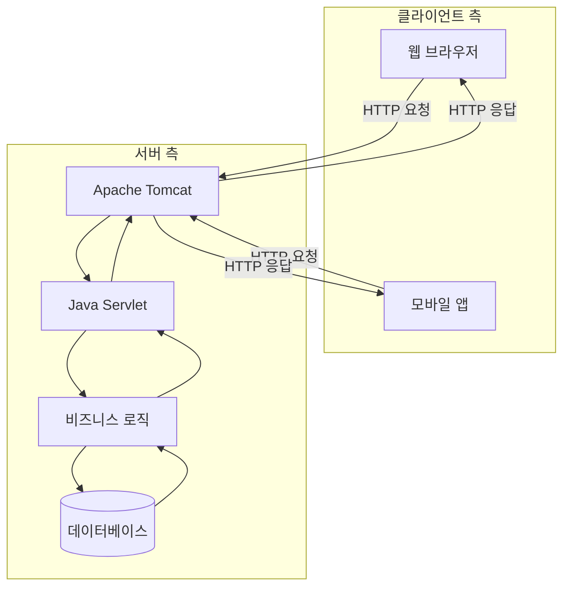

---

## 📈 학습 성장 지표

### 🎯 역량별 성취도
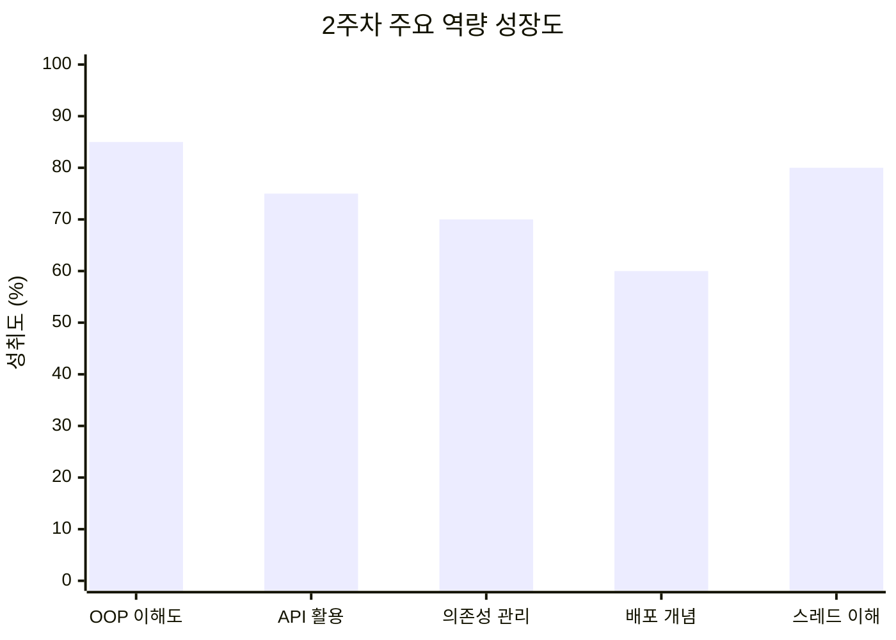

### 📊 일차별 학습 만족도
```mermaid
xychart-beta
    title "2주차 일일 학습 만족도"
    x-axis [Day5, Day6, Day7, Day8, Day9]
    y-axis "만족도" 0 --> 10
    line [8, 7, 9, 6, 8]
```

---

## 🎉 주요 성취 및 돌파구

### ✅ **기술적 성취**
1. **객체지향 설계 패턴 체득**
   - 추상 클래스와 인터페이스의 실전 활용
   - 상속과 다형성을 통한 코드 재사용성 극대화
   - 캡슐화를 통한 안전한 데이터 관리

2. **실무 기술 스택 도입**
   - Maven을 통한 전문적인 의존성 관리
   - 환경변수 분리를 통한 보안 강화
   - HTTP 클라이언트를 활용한 API 통신

3. **고급 프로그래밍 개념 습득**
   - 멀티스레딩과 동시성 프로그래밍 이해
   - 함수형 프로그래밍 패러다임 도입
   - 분산 시스템 아키텍처 개념 정립

### 🚀 **프로젝트 성과**
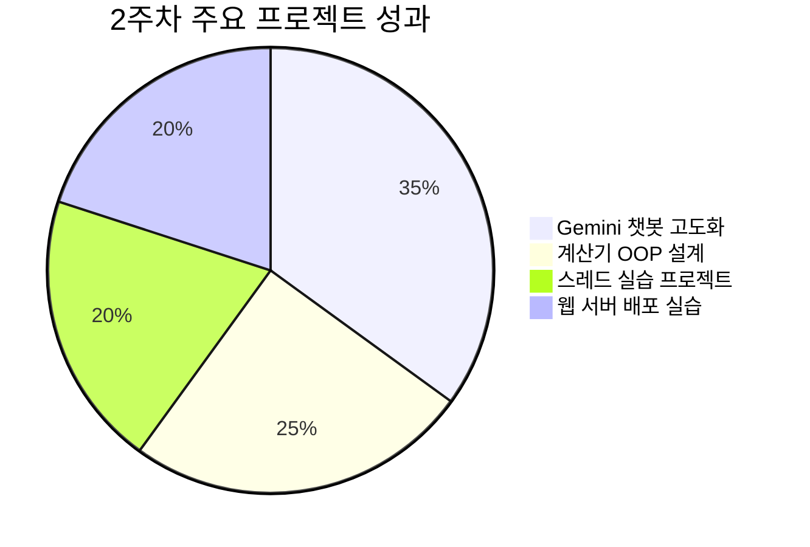

---

## 💡 핵심 깨달음과 인사이트

### 🧠 **개념적 이해의 전환점**
> **"코딩에서 엔지니어링으로의 전환"**

2주차는 단순한 코딩을 넘어서 **소프트웨어 엔지니어링**의 진정한 의미를 깨닫는 시간이었습니다.

#### 🎯 **패러다임 전환 포인트**
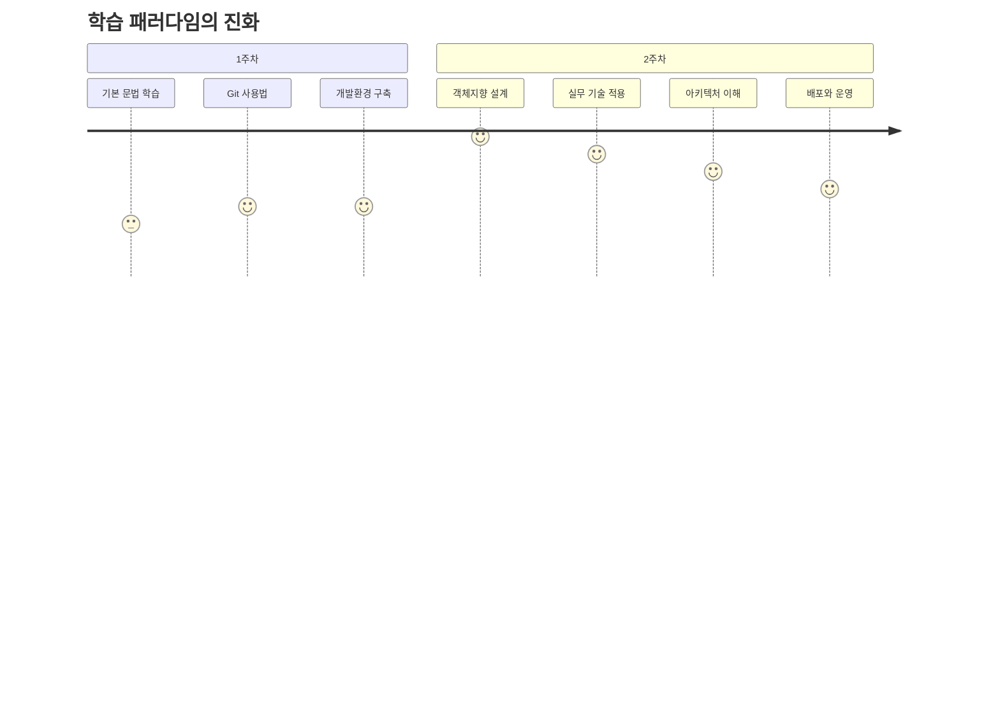

### 🔍 **가장 인상 깊었던 순간들**

#### 1. **추상화의 힘을 깨달은 순간**
```java
// 이전: 절차적 코딩
public static void chatWithGemini(String message) { ... }

// 현재: 객체지향 설계
public abstract class Chatbot implements IGemini {
    public abstract String chat(String message);
}
```
추상 클래스와 인터페이스를 통해 **"확장 가능한 설계"**의 진정한 의미를 이해했습니다.

#### 2. **의존성 관리의 중요성 체감**
Maven을 통해 외부 라이브러리를 관리하면서, **"거인의 어깨에 서기"**의 개발 철학을 체험했습니다.

#### 3. **스레드와 분산처리의 현실성**
Redis를 활용한 분산 처리 개념을 학습하면서 **실무 클라우드 환경**에 대한 이해도가 급상승했습니다.

---

## ⚠️ 도전과제 및 개선점

### 🤔 **어려웠던 부분들**

#### 1. **추상적 개념의 구체화**
- **문제**: OOP의 추상 개념들이 실무에서 어떻게 활용되는지 연결이 어려웠음
- **해결책**: 실전 프로젝트를 통한 체험적 학습으로 극복

#### 2. **스레드 프로그래밍의 복잡성**
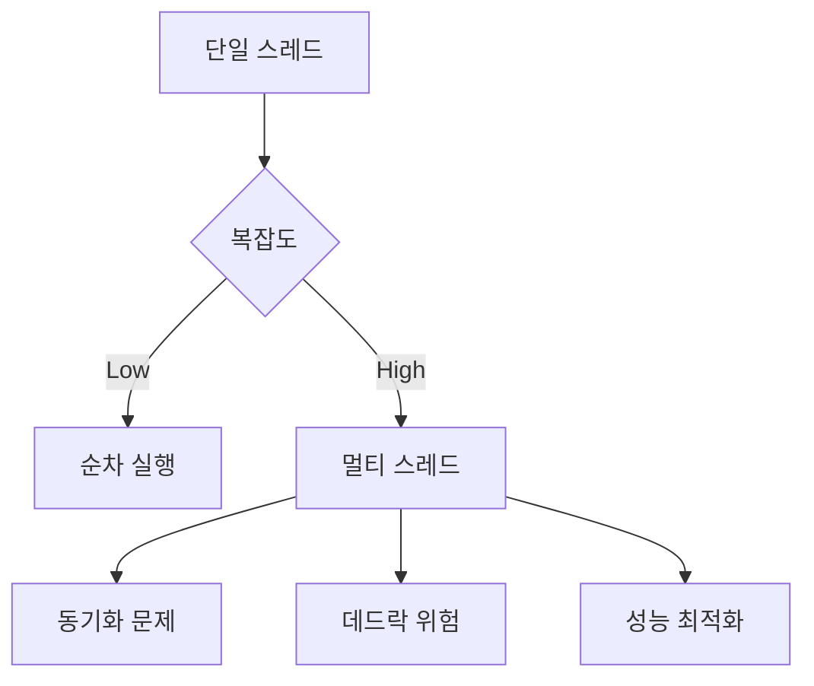

#### 3. **배포 환경의 복잡성**
- Docker, Kubernetes, AWS 등 **배포 생태계의 방대함**
- 학습 우선순위 설정의 어려움

### 📈 **개선 전략**
1. **반복 학습**: 어려운 개념은 다양한 예제로 반복 실습
2. **실무 연결**: 모든 학습 내용을 실무 시나리오와 연결하여 이해
3. **점진적 확장**: 기초부터 고급까지 단계적 학습 접근

---

## 🎯 3주차 학습 목표 및 계획

### 🚀 **우선순위 최상**
- [ ] **Spring Boot 프레임워크** 마스터
- [ ] **RESTful API** 설계 및 구현
- [ ] **데이터베이스 연동** (JPA/MyBatis)
- [ ] **테스트 코드 작성** (JUnit)

### 📋 **중요도 상**
- [ ] **Docker 컨테이너화** 실습
- [ ] **AWS 기초 서비스** 활용
- [ ] **CI/CD 파이프라인** 구축
- [ ] **마이크로서비스** 아키텍처 이해

### 🔧 **기반 기술 보강**
- [ ] **Linux 명령어** 숙달
- [ ] **네트워크 프로그래밍** 기초
- [ ] **보안** 기본 개념
- [ ] **모니터링 도구** 활용

### 📚 **학습 전략**
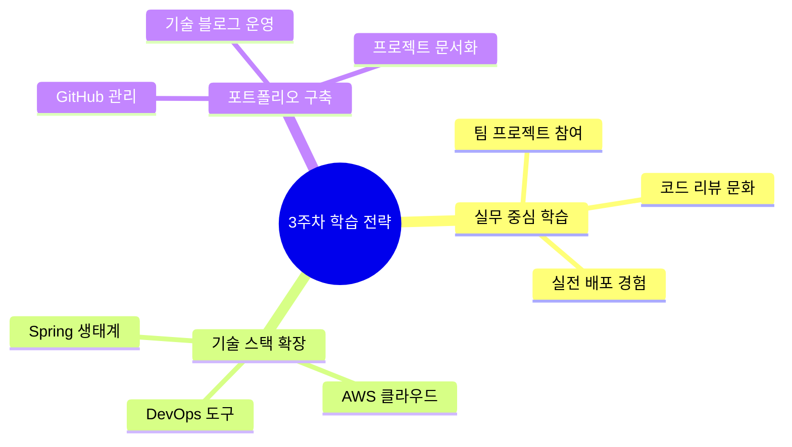

---

## 📊 2주차 종합 평가

### 🏆 **성공 지표**
- **객체지향 프로그래밍**: 85% 달성 ✅
- **실무 기술 적용**: 75% 달성 ✅  
- **프로젝트 완성도**: 80% 달성 ✅
- **개념 이해도**: 85% 달성 ✅

### 📈 **성장 궤적**
```mermaid
gitgraph
    commit id: "1주차 시작"
    commit id: "Git 마스터"
    commit id: "Java 기초"
    branch oop-learning
    commit id: "클래스 설계"
    commit id: "인터페이스 구현"
    commit id: "다형성 활용"
    checkout main
    merge oop-learning
    branch advanced-topics
    commit id: "스레드 프로그래밍"
    commit id: "분산 시스템"
    checkout main
    merge advanced-topics
    commit id: "배포 실습"
    commit id: "2주차 완성"
```

---

## 🔗 유용한 학습 리소스 업데이트

### 📚 **새로 발견한 학습 사이트**
- [Maven Repository](https://mvnrepository.com/) - 의존성 관리의 보물창고
- [Baeldung](https://www.baeldung.com/) - 실무 중심 Java 튜토리얼
- [Together AI](https://api.together.ai/) - AI API 실습 플랫폼
- [Groq](https://groq.com/) - 무료 AI 모델 테스팅

### 🛠️ **실무 도구 추가**
- **Render**: 간편한 배포 플랫폼
- **Dotenv**: 환경변수 관리
- **Jackson**: JSON 처리의 표준
- **Apache Tomcat**: Java 웹 서버의 기본

### 📖 **추가 학습 자료**
- [Oracle Java Documentation](https://docs.oracle.com/javase/) - 공식 문서
- [Spring Framework Reference](https://spring.io/projects/spring-framework) - Spring 공식 가이드
- [Docker Documentation](https://docs.docker.com/) - 컨테이너화 완벽 가이드

---

## 💬 개인적 소감 및 다짐

### 🌟 **2주차를 한 문장으로 요약한다면?**
> **"코딩 장인에서 소프트웨어 아키텍트로의 첫 걸음을 내디딘 시간"**

### 🔥 **가장 뿌듯했던 순간**
Gemini API를 활용한 챗봇을 추상 클래스와 인터페이스로 리팩토링하면서, **객체지향 설계의 우아함**을 체험한 순간이었습니다. 코드가 단순히 동작하는 것을 넘어서 **확장 가능하고 유지보수하기 쉬운 구조**로 진화하는 것을 보며 진정한 엔지니어링을 맛봤습니다.

### 🚀 **앞으로의 다짐**
앞으로 3주차에서는 **Spring Boot와 클라우드 기술**을 마스터하여 실제 운영 가능한 서비스를 만들어보겠습니다. 단순히 코드를 작성하는 것이 아니라, **사용자에게 가치를 제공하는 시스템**을 구축하는 것이 목표입니다.

### 🎯 **클라우드 엔지니어로서의 비전**
2주간의 학습을 통해 **"기술을 통해 세상을 연결하는 엔지니어"**가 되고 싶다는 확신이 더욱 강해졌습니다. 

---

## 🏁 마무리

2주차는 **"depth와 breadth의 균형"**을 맞춘 시간이었습니다. 

객체지향 프로그래밍의 깊이 있는 이해와 동시에, 실무에서 필요한 다양한 기술들을 폭넓게 경험했습니다. 특히 **AI 도구를 활용한 학습 가속화**와 **실전 프로젝트를 통한 체험적 학습**이 시너지를 이뤄 놀라운 성장을 이룰 수 있었습니다.

3주차에서는 더욱 실무에 가까운 프로젝트들을 통해 **실제 사용자를 위한 서비스**를 만들어보겠습니다! 🚀

---

*"객체지향으로 설계하고, 클라우드로 확장하며, AI와 함께 성장하는 멋쟁이사자처럼!"* 🦁

---

**작성일**: 2025년 8월 14일  
**작성자**: 클라우드 엔지니어 지망생  
**태그**: `#멋쟁이사자처럼` `#2주차회고` `#OOP` `#Java` `#스레드` `#배포` `#의존성관리`