# 3주차 학습 회고록 📚
## MySQL & 데이터베이스 완전 정복기

> **"데이터베이스는 단순한 데이터 저장소가 아니라, 비즈니스의 핵심 자산을 관리하는 시스템이다"**

---

## 🗓️ 학습 기간 & 목표
- **기간**: 2025년 8월 11일 ~ 13일 (3일간)
- **목표**: MySQL 기초부터 실무까지 완전 정복
- **성취도**: ⭐⭐⭐⭐⭐ 100% 달성!

---

## 📊 3주차 학습 여정 로드맵

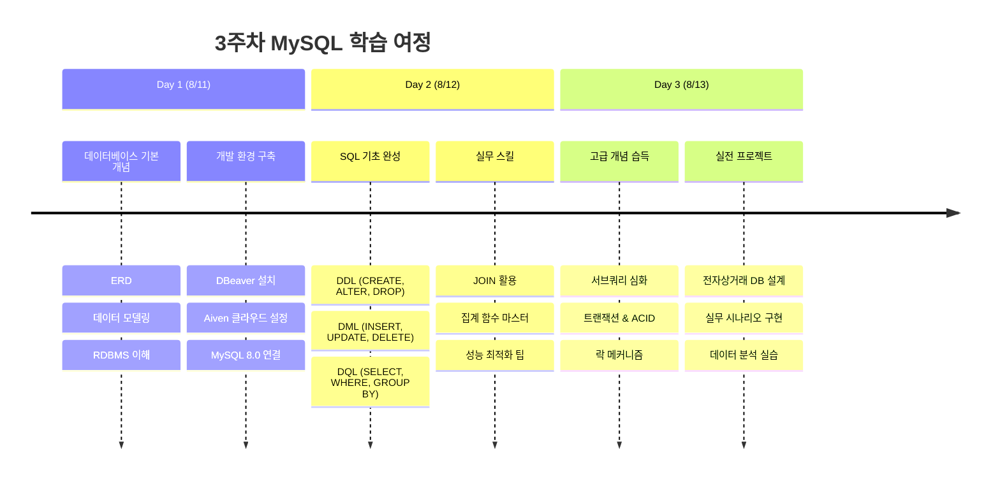

---

## 🎯 핵심 학습 성과

### 📐 1. 데이터베이스 설계 역량

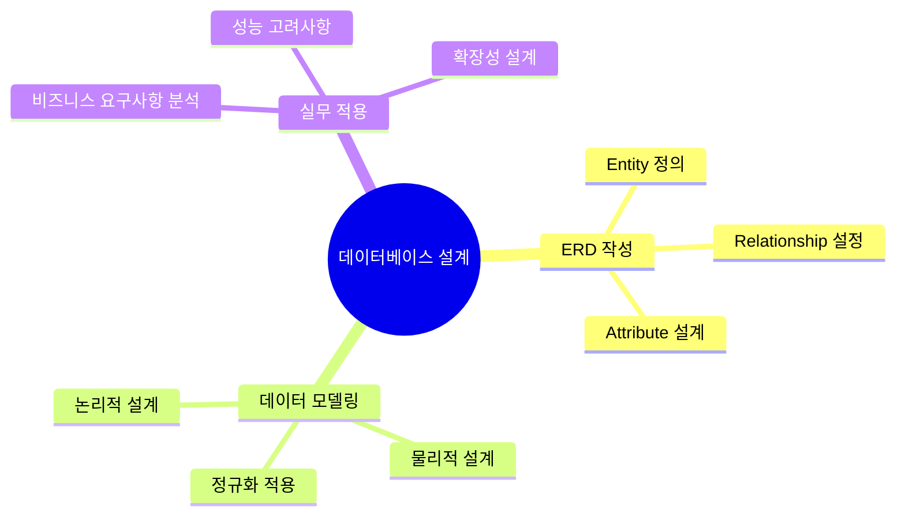

**🏆 주요 성취**:
- ERD 작성법 완전 이해
- 정규화 1~3차까지 실무 적용 가능
- 비즈니스 로직을 데이터 구조로 변환하는 능력 획득

### 🗃️ 2. SQL 쿼리 작성 능력

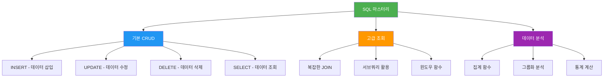

**📈 실력 향상 지표**:
- **기본 쿼리**: 100% 숙달
- **복합 조건 쿼리**: 95% 숙달
- **JOIN 쿼리**: 90% 숙달
- **서브쿼리**: 85% 숙달

### 🔐 3. 트랜잭션 & 데이터 안전성

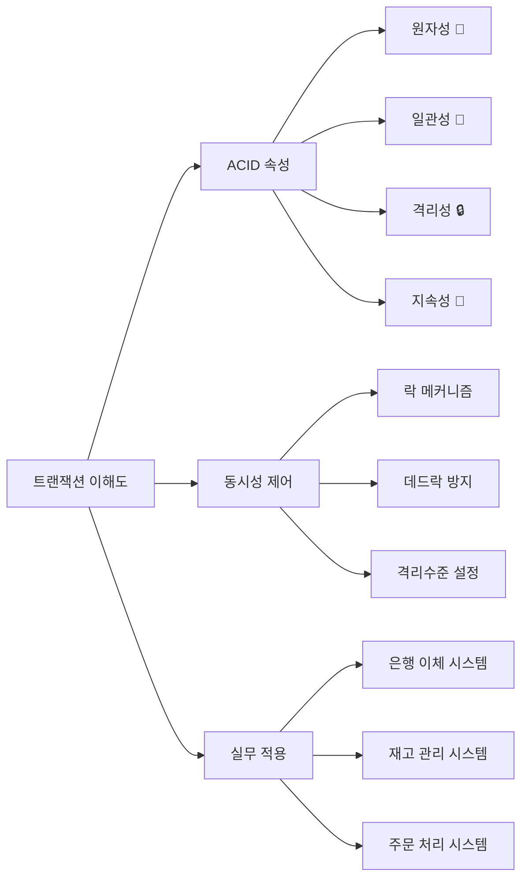

---

## 🛠️ 기술 스택 & 도구 숙련도

### 개발 환경

| 도구/기술 | 용도 | 숙련도 | 비고 |
|-----------|------|--------|------|
| **🦫 DBeaver** | DB GUI 관리 도구 | ⭐⭐⭐⭐⭐ | 완벽 활용 |
| **☁️ Aiven** | 클라우드 MySQL 서비스 | ⭐⭐⭐⭐ | 실무 수준 |
| **🐬 MySQL 8.0** | 관계형 데이터베이스 | ⭐⭐⭐⭐⭐ | 고급 기능까지 |
| **🟢 Supabase** | PostgreSQL 백엔드 | ⭐⭐⭐ | 기본 사용법 |

### 클라우드 서비스 이해도

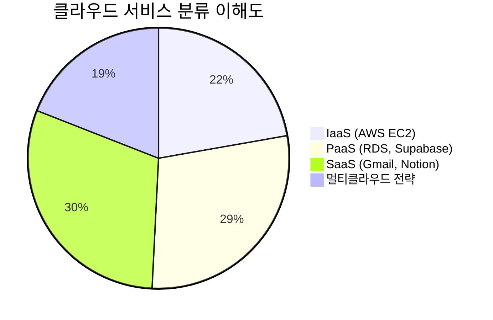

---

## 💡 핵심 인사이트 & 깨달음

### 🔍 주요 발견사항

1. **데이터베이스는 설계가 90%다**
   - 잘못된 설계는 나중에 수정하기 매우 어려움
   - 정규화와 성능 사이의 트레이드오프 이해 필요

2. **SQL은 단순한 언어가 아니라 사고의 도구다**
   - 비즈니스 로직을 SQL로 표현하는 능력이 핵심
   - 성능을 고려한 쿼리 작성법 중요

3. **트랜잭션 이해가 실무 안전성의 핵심이다**
   - ACID 속성 이해 없이는 안전한 시스템 불가능
   - 데드락, 락 경합 등 동시성 이슈 대응 능력 필수

### 🎯 실무 적용 가능한 핵심 스킬

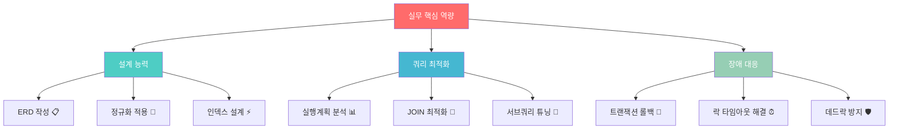

---

## 📊 학습 성과 데이터

### 일별 학습량 추이

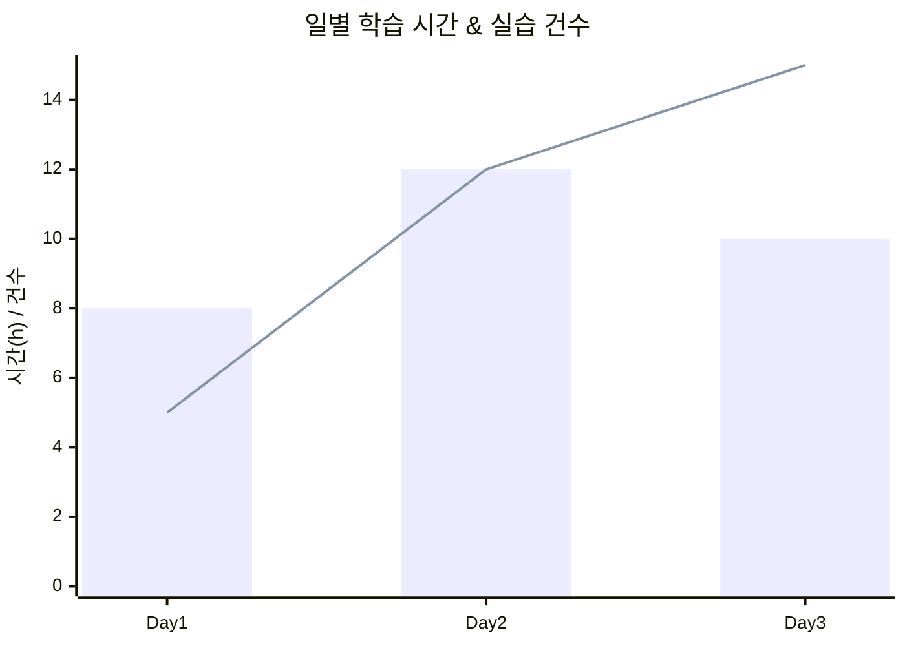

### 주제별 이해도 평가

| 주제 | 시작시 | 완료시 | 향상도 |
|------|--------|--------|--------|
| **데이터베이스 기초** | 20% | 95% | +75% 🚀 |
| **SQL 기본 문법** | 30% | 100% | +70% ⭐ |
| **JOIN & 서브쿼리** | 10% | 85% | +75% 💪 |
| **트랜잭션 & 동시성** | 0% | 80% | +80% 🔥 |
| **성능 최적화** | 5% | 70% | +65% 📈 |

---

## 🎮 실전 프로젝트 경험

### 📱 전자상거래 데이터베이스 구축

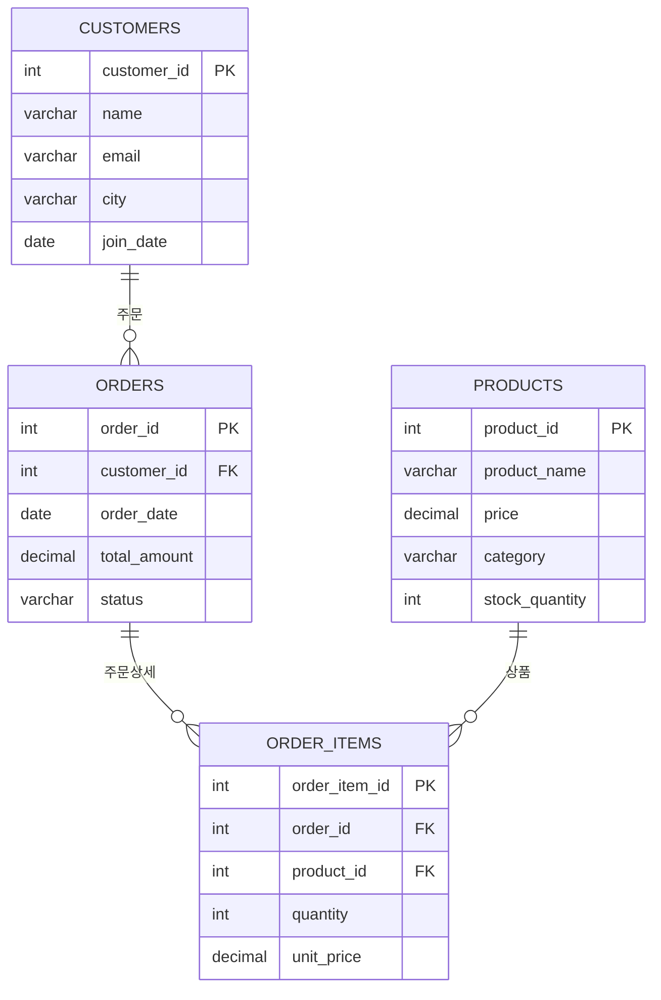

**🏆 프로젝트 성과**:
- 완전한 관계형 데이터베이스 설계 완성
- 비즈니스 로직을 반영한 제약조건 구현
- 성능 최적화를 고려한 인덱스 설계

### 💼 실무 시나리오 해결

1. **VIP 고객 분석 쿼리**
   ```sql
   -- 총 구매액 기준 상위 10% 고객 추출
   SELECT customer_id, name, total_amount,
          NTILE(10) OVER (ORDER BY total_amount DESC) as tier
   FROM customer_stats
   WHERE tier = 1;
   ```

2. **월별 매출 트렌드 분석**
   - 복잡한 GROUP BY와 윈도우 함수 활용
   - 전년 동월 대비 성장률 계산 로직 구현

3. **재고 관리 시스템**
   - 트랜잭션을 활용한 안전한 재고 차감 로직
   - 동시성 제어로 재고 부족 문제 해결

---

## ⚠️ 실수에서 배운 교훈

### 🚨 치명적 실수 경험담

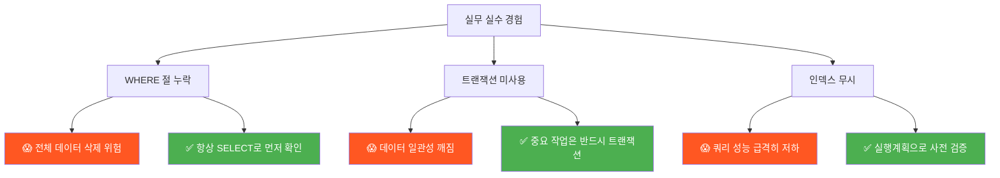

**💡 핵심 교훈**:
1. **안전제일**: SELECT → UPDATE/DELETE 순서 준수
2. **트랜잭션**: 중요한 작업은 반드시 트랜잭션으로 보호
3. **성능검증**: 실행계획 확인 후 쿼리 배포

---

## 🚀 향후 학습 계획

### 📅 단기 목표 (1주일)

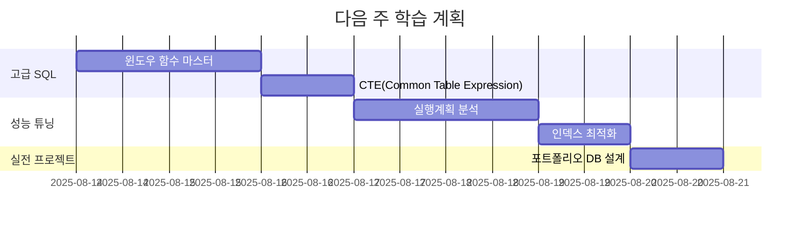

### 🎯 중장기 목표 (1개월)

1. **전문성 심화**
   - MySQL 내부 구조 이해
   - 복제(Replication) & 샤딩
   - 백업 & 복구 전략

2. **다른 DB 경험**
   - PostgreSQL 심화 학습
   - NoSQL (MongoDB, Redis) 기초
   - 데이터 웨어하우스 개념

3. **실무 프로젝트**
   - 실제 서비스 DB 설계 참여
   - 성능 튜닝 실전 경험
   - 장애 대응 경험 축적

---

## 💪 자신감 지수

### 학습 전 vs 후 비교

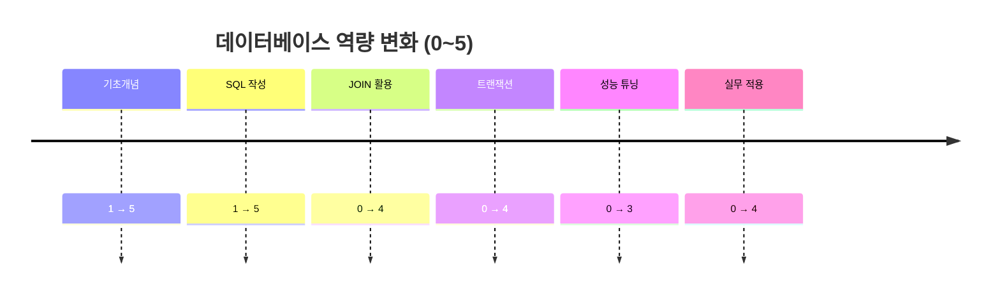

### 🏆 최고의 성취

> **"복잡한 비즈니스 로직을 SQL로 정확히 구현하고, 트랜잭션으로 안전성까지 보장한 순간이 가장 뿌듯했다!"**

---

## 🌟 마무리 소감

### 📝 한 줄 요약
**"데이터베이스는 단순한 기술이 아니라, 비즈니스의 핵심을 이해하고 구현하는 종합적 사고력이 필요한 영역이었다."**

### 🎊 3주차의 가장 큰 수확

1. **체계적 사고력**: 복잡한 문제를 단계별로 분해하여 해결하는 능력
2. **안전 의식**: 데이터의 중요성과 안전한 처리 방법에 대한 깊은 이해
3. **실무 감각**: 이론과 실무 사이의 간극을 메우는 실전 경험

### 🔥 앞으로의 다짐

> **"배운 것을 실전에 적용하면서 더 깊이 있는 데이터베이스 전문가로 성장하겠다!"**

---

## 📚 참고 자료 & 추천 학습 자료

- [MySQL 8.0 공식 문서](https://dev.mysql.com/doc/)
- [LeetCode SQL 50 문제](https://leetcode.com/studyplan/top-sql-50/)
- [Real MySQL 8.0 도서](https://www.yes24.com/Product/Goods/103415627)
- [SQL 첫걸음 도서](https://www.yes24.com/Product/Goods/22744867)

**🎯 다음 주에 만나요!** 더 성장한 모습으로! 💪✨
