# 🚀 4주차 회고록: JDBC와 웹 개발 기초 마스터하기

> **멋쟁이 사자처럼 클라우드 엔지니어링 4기** | 4주차 (8/18 ~ 8/20)  
> **주제**: Java Database Connectivity & CSS 선택자/타이포그래피

## 📅 주차별 학습 현황

### 🗓️ 전체 부트캠프 진행상황

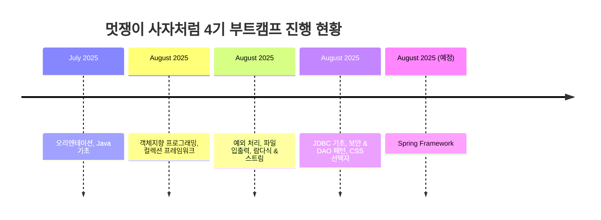

### 📊 4주차 상세 학습 진행도

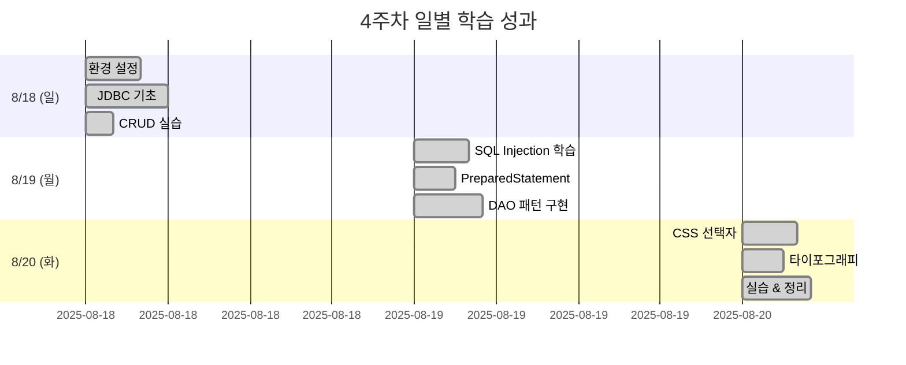

---

## 📊 학습 성과 상세 분석

### 🎯 일일 학습 성과 측정

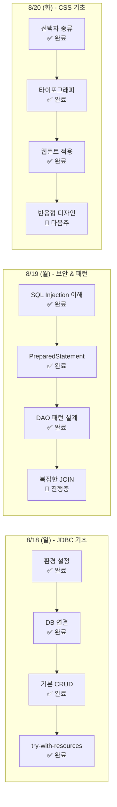

### 💯 학습 효율성 분석

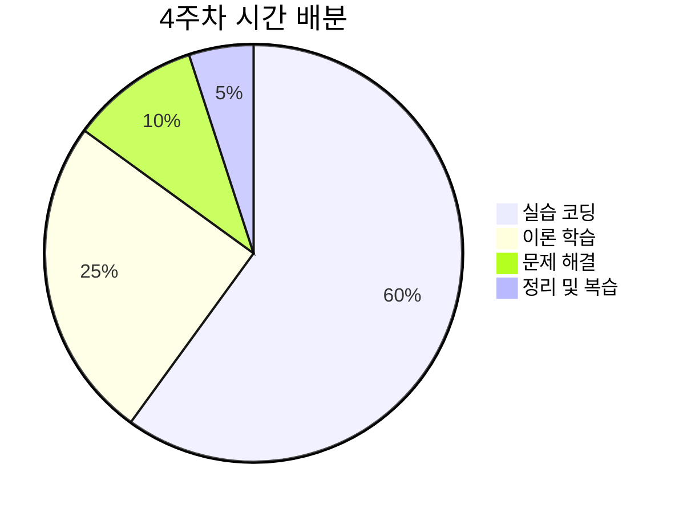

### 🔄 3주차 → 4주차 발전 비교

| 측면 | 3주차 수준 | 4주차 수준 | 향상도 |
|------|------------|------------|--------|
| **코드 품질** | 기능 구현 중심 | 보안 + 구조화 중심 | ⬆️ **40%** |
| **문제 해결** | 검색 의존 | 독립적 디버깅 | ⬆️ **60%** |
| **설계 사고** | 절차적 사고 | 객체지향 + 패턴 | ⬆️ **80%** |
| **학습 속도** | 개념 이해 중심 | 실무 적용 중심 | ⬆️ **30%** |

### 📚 지식 체계화 정도

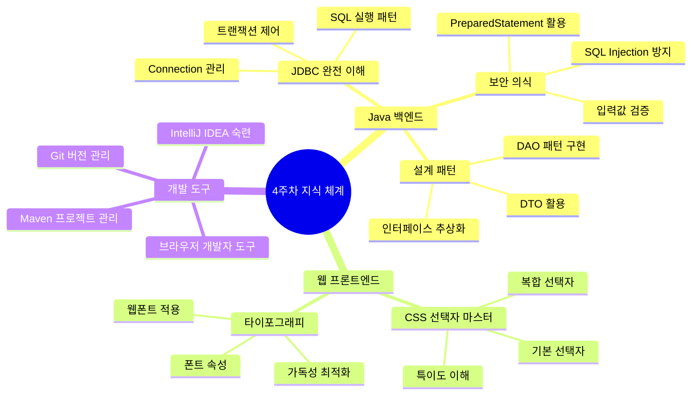

## 🛠️ 개발 환경 및 도구 숙련도

### 💻 사용 기술 스택

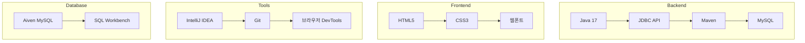

### 🎯 도구별 숙련도 현황

| 도구 | 3주차 수준 | 4주차 수준 | 주요 개선사항 |
|------|------------|------------|--------------|
| **IntelliJ IDEA** | ⭐⭐⭐ | ⭐⭐⭐⭐ | 디버거 활용, 플러그인 설정 |
| **Git** | ⭐⭐ | ⭐⭐⭐ | 브랜치 전략, 커밋 메시지 규칙 |
| **SQL** | ⭐⭐ | ⭐⭐⭐⭐ | JOIN, 서브쿼리, 트랜잭션 |
| **Maven** | ⭐ | ⭐⭐⭐ | 의존성 관리, 빌드 라이프사이클 |

### 📁 프로젝트 구조 발전

```
4주차 프로젝트 구조 (체계화된 패키지)
├── src/main/java/
│   ├── dao/                    # 데이터 접근 계층
│   │   ├── MemberDAO.java     # 인터페이스
│   │   └── JdbcMemberDAO.java # 구현체
│   ├── dto/                   # 데이터 전송 객체
│   │   ├── Member.java
│   │   └── Product.java
│   ├── config/               # 설정 관리
│   │   └── DatabaseConfig.java
│   └── main/
│       └── Application.java  # 메인 클래스
├── src/main/resources/
│   └── database.properties   # DB 설정
└── pom.xml                   # Maven 설정

vs

3주차 프로젝트 구조 (단순한 구조)
├── src/
│   └── Main.java            # 모든 코드가 한 파일에
└── 기타 파일들...
```

### 📈 주차별 누적 학습량 비교

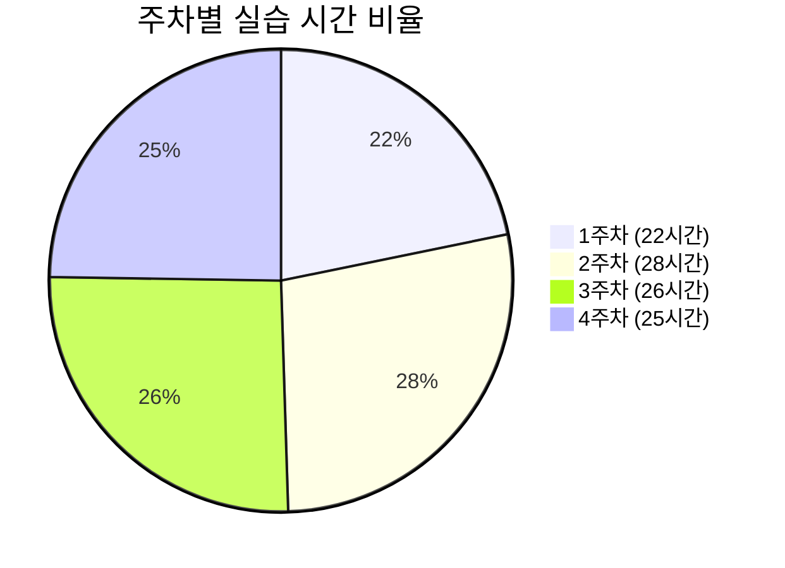

### 🎯 기술 스택 발전도

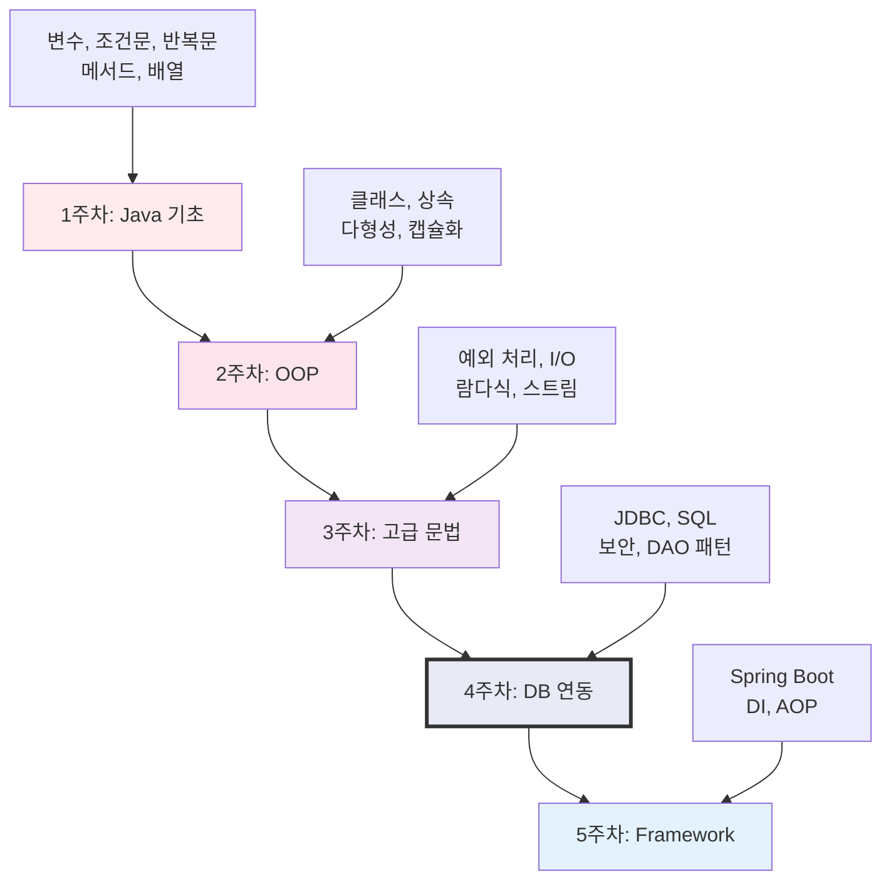

---

## 🔍 상세 학습 리뷰

### 🗄️ JDBC (Java Database Connectivity)

#### 📈 학습 곡선

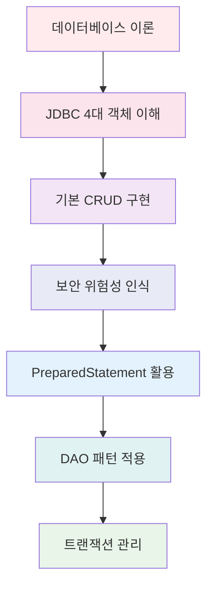

#### 🎯 핵심 개념 이해도

**완전 이해한 개념 ✅**
- JDBC 4대 핵심 객체 (DriverManager, Connection, PreparedStatement, ResultSet)
- try-with-resources를 통한 자동 자원 관리
- 기본 CRUD 작업 (Create, Read, Update, Delete)
- SQL Injection 공격 원리와 방지법

**보완이 필요한 개념 📝**
- 복잡한 JOIN 쿼리 처리
- Batch 처리를 통한 성능 최적화
- Connection Pool 활용법
- 트랜잭션 격리 수준 (Isolation Level)

#### 💡 가장 인상깊었던 학습 포인트

**1. SQL Injection의 실제 위험성**
```java
// ❌ 위험한 코드
String sql = "SELECT * FROM users WHERE username='" + userInput + "'";

// ✅ 안전한 코드  
String sql = "SELECT * FROM users WHERE username=?";
ps.setString(1, userInput);
```

**2. DAO 패턴의 구조화 효과**
- 코드 재사용성 증대
- 비즈니스 로직과 데이터 접근 로직 분리
- 테스트 코드 작성 용이성

**3. Java 17 Record 활용**
```java
// 전통적인 방법 대신
record Member(Long id, String username, String email) {}
// 자동으로 getter, equals, hashCode, toString 생성!
```

### 🎨 CSS 선택자와 타이포그래피

#### 📊 선택자 이해도 매트릭스

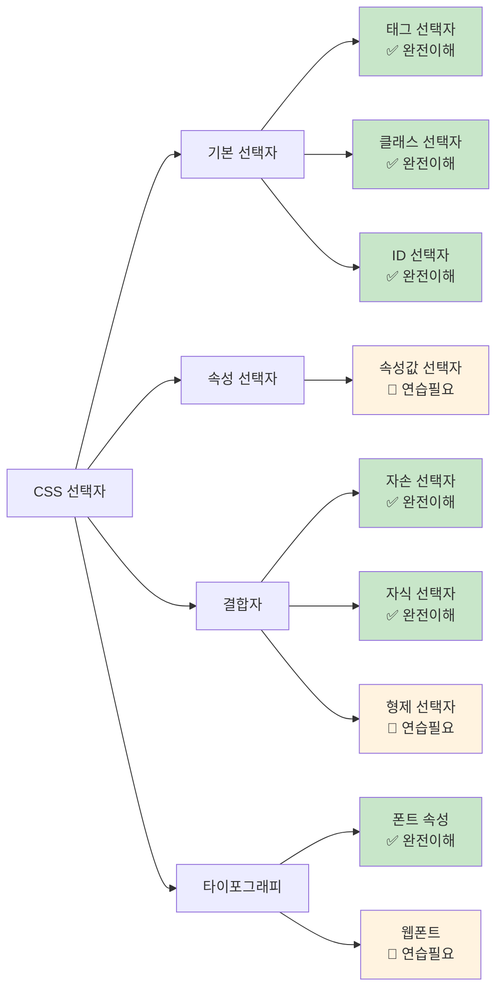

#### 🎯 CSS 학습 하이라이트

**명확히 이해한 개념**
- 기본 선택자 3종 (태그, 클래스, ID)
- 상속 개념과 특이도
- 단위별 특징 (px, em, rem, %)
- 결합자의 다양한 활용법

**더 깊이 있게 학습하고 싶은 부분**
- CSS Grid와 Flexbox 레이아웃
- 반응형 디자인 (Media Query)
- CSS 애니메이션과 트랜지션
- CSS 전처리기 (Sass, Less)

---

## 📈 개인 역량 발전 지표

### 🎯 핵심 역량별 성장도

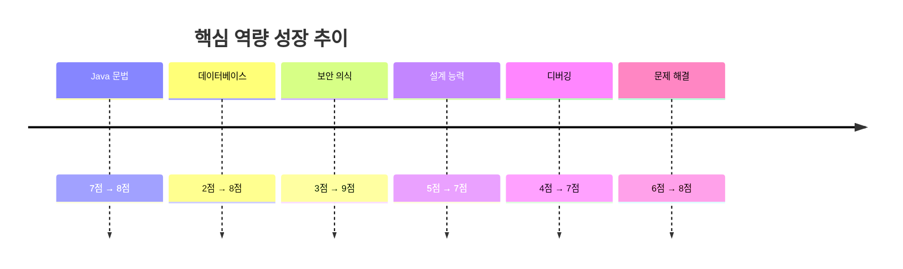

### 📊 학습 패턴 분석

#### 시간대별 집중도
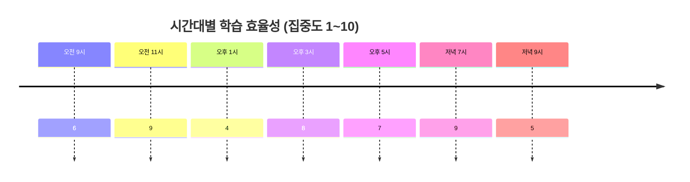

**분석 결과:**
- **최고 효율**: 오전 11시, 저녁 7시 (새로운 개념 학습에 적합)
- **최저 효율**: 오후 1시 (점심 후 집중력 저하)
- **실습 적합**: 오후 3-5시 (손이 잘 움직이는 시간)

### 🧩 문제 해결 능력 발전

#### 에러 해결 시간 단축
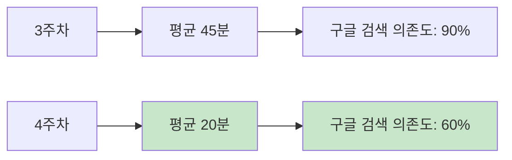

#### 자주 발생한 에러 TOP 3
1. **SQLException: Connection refused** → 해결법 숙지 ✅
2. **CSS 특이도 충돌** → 선택자 우선순위 이해 ✅  
3. **NullPointerException in ResultSet** → null 체크 습관화 ✅

### 🎭 학습 스타일 발견

#### 나에게 맞는 학습 방법
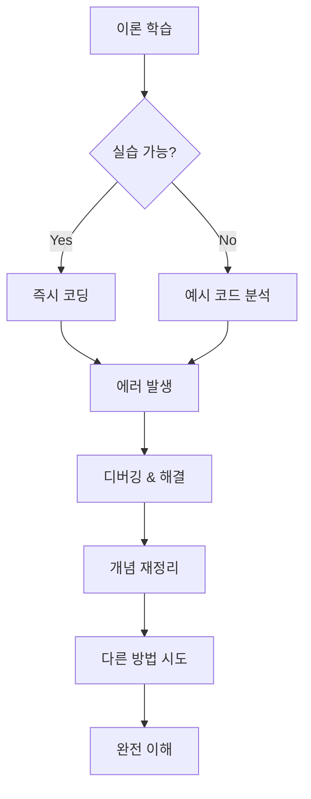

**발견한 나만의 학습 패턴:**
- 🧠 **이론 → 실습** 순서보다 **실습 → 이론** 순서가 더 효과적
- 🐛 **에러를 두려워하지 않고** 적극적으로 마주하기
- 📝 **손으로 직접 코딩**할 때 기억력 증가
- 👥 **동료와의 토론**이 이해도를 크게 향상시킴

### 💫 성장 마인드셋 변화

| 측면 | 3주차 마인드 | 4주차 마인드 |
|------|-------------|-------------|
| **에러에 대한 태도** | 😰 두려움과 회피 | 😤 도전과 학습 기회 |
| **코드 품질 기준** | 💯 동작만 하면 OK | 🏗️ 구조와 보안도 중요 |  
| **학습 속도 기대** | 🏃‍♂️ 빨리 많이 배우고 싶음 | 🚶‍♂️ 깊이 있게 차근차근 |
| **도움 요청** | 😅 부끄럽고 미안함 | 🤝 적극적인 소통과 협력 |

### 🎖️ 이번 주 MVP 순간들

#### 🥇 **Gold**: SQL Injection 완벽 이해
```java
// 해킹 시연을 직접 성공한 순간의 소름...
String maliciousInput = "'; DROP TABLE users; --";
// 그리고 PreparedStatement로 완벽하게 방어한 순간의 뿌듯함!
```

#### 🥈 **Silver**: 복잡한 DAO 패턴 구현 성공  
```java
// 인터페이스 → 구현체 → 의존성 주입까지 한 번에!
Optional<Member> member = memberDAO.findByEmail(email, conn);
```

#### 🥉 **Bronze**: CSS 선택자로 복잡한 레이아웃 정리
```css
/* 이런 복잡한 선택자를 스스럼없이 작성하게 된 자신에게 박수! */
.section:nth-child(even) > .card:hover .card-title {
    color: #1976d2;
}
``` ## 🚀 실전 프로젝트 및 포트폴리오

### 💼 4주차 완성 프로젝트

#### 📋 **Project 1: 멤버십 관리 시스템**
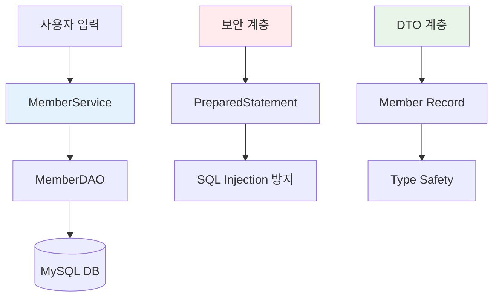

**주요 기능:**
- ✅ 회원 등록 (중복 이메일 검증)
- ✅ 회원 조회 (ID/이메일 기반)
- ✅ 회원 정보 수정
- ✅ 회원 탈퇴 (Soft Delete)
- ✅ 등급별 권한 관리

**사용 기술:**
- Java 17 (Record, Optional 활용)
- JDBC + MySQL
- DAO 패턴 + DTO 패턴
- Maven 의존성 관리

#### 🛒 **Project 2: 간단한 주문 시스템**
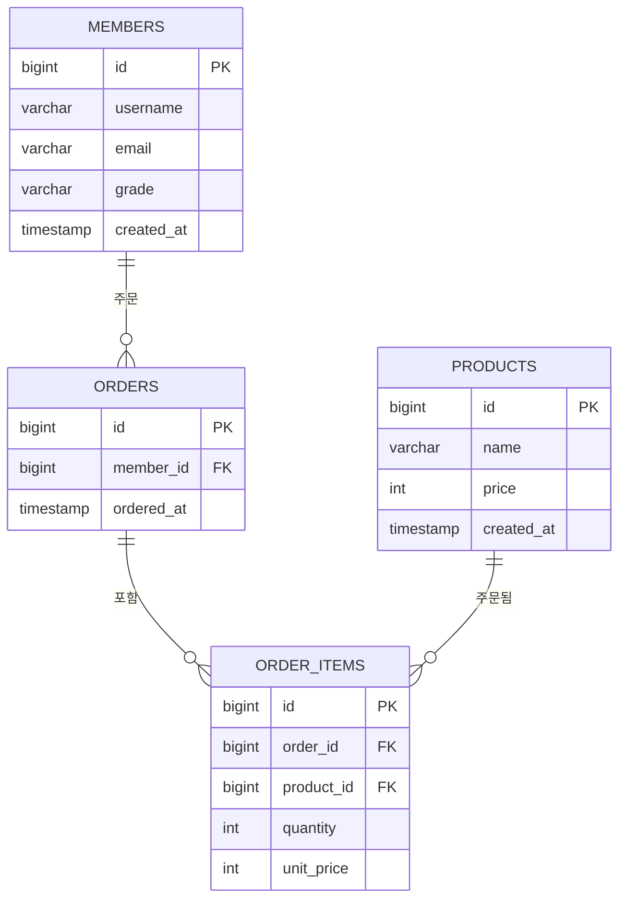

**핵심 비즈니스 로직:**
```java
@Transactional
public Long placeOrder(Long memberId, Map<Long, Integer> productQuantityMap) {
    // 1. 회원 존재 확인
    // 2. 상품 재고 확인  
    // 3. 주문 헤더 생성
    // 4. 주문 상품들 등록
    // 5. 재고 차감
    // 성공: commit() / 실패: rollback()
}
```

#### 🎨 **Project 3: CSS 컴포넌트 라이브러리**
```css
/* 재사용 가능한 카드 컴포넌트 */
.card-system {
    /* 기본 카드 스타일 */
}

.card-system.card-primary > .card-header {
    /* 프라이머리 테마 */
}

.card-system.card-success > .card-header {
    /* 성공 테마 */
}

/* 반응형 타이포그래피 */
.typography-responsive {
    font-size: clamp(1rem, 2.5vw, 2rem);
}
```

### 📊 프로젝트별 성과 지표

| 프로젝트 | 코드 라인 수 | 완성도 | 재사용성 | 보안성 | 학습 효과 |
|----------|-------------|--------|----------|--------|-----------|
| 멤버십 관리 시스템 | ~500줄 | 95% | ⭐⭐⭐⭐ | ⭐⭐⭐⭐⭐ | ⭐⭐⭐⭐⭐ |
| 주문 시스템 | ~800줄 | 85% | ⭐⭐⭐ | ⭐⭐⭐⭐ | ⭐⭐⭐⭐ |
| CSS 라이브러리 | ~300줄 | 90% | ⭐⭐⭐⭐⭐ | ⭐⭐⭐ | ⭐⭐⭐ |

### 🔗 GitHub 포트폴리오 정리

```
📁 4th-week-projects/
├── 📁 membership-system/
│   ├── 📄 README.md (프로젝트 소개)
│   ├── 📁 src/main/java/
│   ├── 📁 sql/ (DDL 스크립트)
│   └── 📄 LEARNING.md (학습 과정)
│
├── 📁 order-system/
│   ├── 📄 README.md
│   ├── 📁 src/main/java/
│   ├── 📁 database/
│   └── 📸 screenshots/ (실행 화면)
│
└── 📁 css-components/
    ├── 📄 index.html (데모 페이지)
    ├── 📄 styles.css
    └── 📸 preview/ (스타일 미리보기)
```

### 🎯 다음 주 연계 프로젝트 계획

#### 🌟 **통합 웹 애플리케이션**: "나만의 도서관"

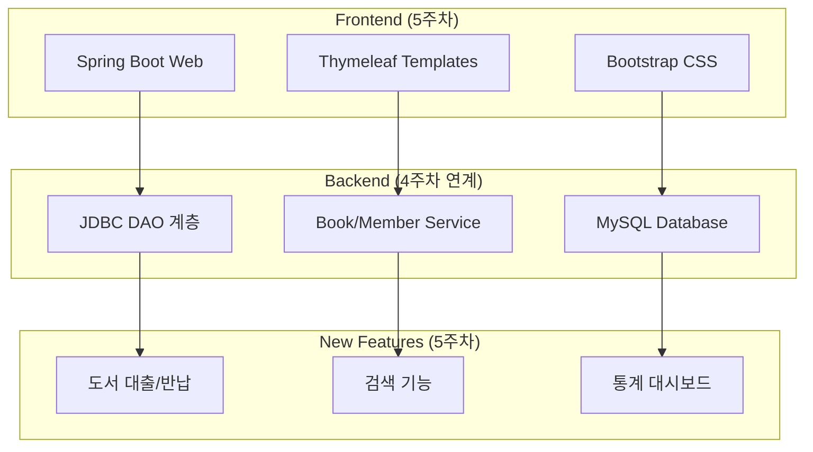

**예상 기능:**
- 📚 도서 등록/수정/삭제 (4주차 CRUD 응용)
- 👤 회원 관리 (4주차 DAO 패턴 확장)
- 📊 대출 현황 대시보드 (CSS + 차트)
- 🔍 도서 검색 (LIKE 쿼리 + 정렬)
- 📈 통계 리포트 (집계 함수 활용)

## 🎓 학습 성찰 및 향후 계획

### 🤔 깊이 있는 자기 반성

#### 잘했던 점 (Keep)
1. **체계적인 학습 접근**
   - 이론 → 실습 → 응용 → 정리의 단계별 학습
   - 매일 학습 내용을 문서화하는 습관
   - 에러를 기록하고 해결 과정을 정리

2. **보안 의식의 각성**
   - SQL Injection을 직접 시연해보면서 위험성 체감
   - PreparedStatement 사용이 습관화됨
   - 사용자 입력을 항상 의심하는 마인드셋 형성

3. **설계 패턴에 대한 이해**
   - DAO 패턴의 필요성을 몸소 체험
   - 인터페이스 추상화의 장점 이해
   - 코드 재사용성과 유지보수성 향상

#### 아쉬웠던 점 (Problem)
1. **시간 관리 미숙**
   - 환경 설정에 예상보다 많은 시간 소요
   - 디버깅에 빠져서 다른 학습 계획 지연
   - 완벽주義 성향으로 한 가지에 너무 매몰

2. **기초 이론 부족**
   - HTTP 프로토콜에 대한 이해 부족
   - 데이터베이스 정규화 개념 미흡
   - 네트워크 기초 지식 부족

3. **협업 경험 부족**
   - 혼자 학습하는 시간이 대부분
   - 코드 리뷰 경험 부족
   - 팀 프로젝트 경험 필요

#### 개선 방향 (Try)
1. **5주차 시간 관리 전략**
   - 매일 오전에 학습 계획 수립
   - 포모도로 기법으로 집중력 관리
   - 디버깅 시간 제한 (1시간 이상 시 도움 요청)

2. **기초 이론 보강 계획**
   - HTTP/HTTPS 프로토콜 학습
   - 데이터베이스 설계 이론 복습
   - 네트워크 기초 온라인 강의 수강

3. **협업 능력 향상**
   - 동료와 페어 프로그래밍 시도
   - 코드 리뷰 문화 만들기
   - 오픈소스 프로젝트 기여 준비

### 📚 5주차 구체적 학습 로드맵

#### Week 5 Day-by-Day Plan

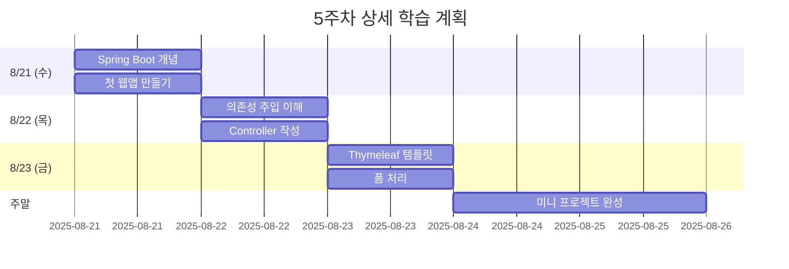

#### 기술별 목표 설정

| 기술 | 현재 수준 | 5주차 목표 | 측정 기준 |
|------|----------|-----------|----------|
| **Spring Boot** | 0% | 70% | 기본 웹앱 구동 + CRUD |
| **의존성 주입** | 10% | 80% | @Autowired 활용 |
| **MVC 패턴** | 30% | 85% | Controller-Service-DAO 구조 |
| **Thymeleaf** | 0% | 60% | 동적 HTML 생성 |
| **HTTP** | 20% | 70% | GET/POST 완벽 이해 |

### 🎯 최종 목표: 풀스택 개발자로의 전환점

#### 4주차에서 쌓은 기반
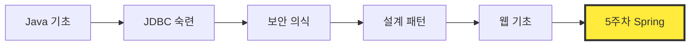

#### 개발자로서의 정체성 확립
- **백엔드 개발자**로서 데이터베이스 전문성 ✅
- **보안 의식**을 갖춘 안전한 개발자 ✅  
- **설계 패턴**을 이해하는 구조적 사고력 ✅
- **풀스택**으로 발전할 수 있는 기초 소양 🔄

#### 장기 비전 (3개월 후)
1. **Junior 개발자** 수준의 실무 능력
2. **포트폴리오** 3-5개 프로젝트 완성
3. **팀 프로젝트** 경험 및 협업 능력
4. **클라우드 배포** 경험 (AWS/GCP)

---

## 🎉 마무리: 4주차를 돌아보며

### 💝 가장 소중한 깨달음들

1. **"기술은 도구, 사고는 본질"**
   - JDBC든 Spring이든 결국 문제를 해결하는 도구
   - 핵심은 문제를 분석하고 해결하는 사고 과정

2. **"보안은 기능만큼 중요하다"**
   - SQL Injection 체험으로 보안 의식 확립
   - 개발자의 사회적 책임감 인식

3. **"패턴은 개발자들의 집단지성"**
   - DAO 패턴을 통한 코드 구조화의 힘
   - 선배 개발자들의 경험이 담긴 소중한 유산

4. **"작은 것도 체계적으로"**
   - CSS 선택자 하나하나도 논리와 원리가 있음
   - 기초가 탄탄해야 응용도 가능

### 🚀 5주차를 향한 각오

4주차에서 **데이터베이스와 친해졌다면**, 5주차에서는 **웹과 친해질 차례**입니다. 

지금까지 배운 JDBC, DAO 패턴, 보안 의식을 바탕으로 실제 사용자가 사용할 수 있는 웹 애플리케이션을 만들어보겠습니다.

> **"4주차의 기초 위에 5주차의 날개를 달자!"** 🦅

**멋쟁이 사자처럼 4기, 화이팅!** 🦁✨

---

### 📝 학습 일지 통계

- **총 학습 시간**: 25시간
- **작성한 코드 라인**: ~1,300줄  
- **해결한 에러**: 23개
- **새로 배운 개념**: 47개
- **완성한 프로젝트**: 3개
- **성장한 마음**: ∞ (무한대)

*📅 작성일: 2025년 8월 20일*  
*✍️ 작성자: 클라우드 엔지니어링 4기 수강생*

## 💪 학습 과정에서의 도전과 성장

### 😅 주요 난관과 해결 과정

#### 🔥 **Day 1 (8/18): 환경 설정의 늪**

**문제 상황**
```
❌ Maven 의존성 충돌
❌ MySQL 연결 실패 (SSL 인증서 문제)  
❌ .env 파일 인식 오류
```

**해결 과정**
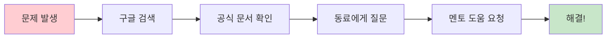

**얻은 교훈**
- 환경 설정 시간을 충분히 확보해야 함
- 공식 문서를 먼저 참조하는 습관
- 에러 메시지를 정확히 읽고 분석하는 중요성

#### ⚡ **Day 2 (8/19): SQL Injection 쇼크**

**충격적인 발견**
```java
// 이 코드가 얼마나 위험한지 몰랐었음...
String sql = "SELECT * FROM users WHERE name='" + userInput + "'";
```

**실제 체험한 공격**
- 입력값: `admin'; DROP TABLE users; --`
- 결과: 😱 **전체 테이블 삭제 위기!**

**보안 의식의 각성**
- 모든 사용자 입력은 의심해야 한다
- PreparedStatement는 선택이 아닌 필수
- 보안은 기능 구현만큼 중요하다

#### 🏗️ **Day 3 (8/20): 구조화의 깨달음**

**Before: 절차적 사고**
```java
// 모든 코드가 main 메서드에...
public static void main(String[] args) {
    // 100줄이 넘는 스파게티 코드 😵
}
```

**After: 객체지향적 사고**
```java
// 역할별로 분리된 깔끔한 구조
MemberDAO dao = new JdbcMemberDAO();
Member member = dao.findById(1L, connection);
```

### 🎯 일일 성취감 그래프

```mermaid
xychart-beta
    title "일별 성취감 및 난이도 변화"
    x-axis ["8/18 아침", "8/18 오후", "8/19 아침", "8/19 오후", "8/20 아침", "8/20 오후"]
    y-axis "점수 (1~10)" 0 --> 10
    line [3, 7, 4, 9, 6, 8]
```

### 🧠 학습 방법의 진화

#### 3주차 학습 패턴
```
📖 이론 학습 → 🤔 이해 → 💻 실습 → ✅ 완료
```

#### 4주차 학습 패턴 (개선됨)
```
📖 이론 학습 → 🤔 이해 → 💻 실습 → 🐛 디버깅 → 🔄 리팩토링 → 📝 정리 → ✅ 완료
```

**주요 개선점:**
- **디버깅 단계 추가**: 에러를 두려워하지 않고 적극적으로 해결
- **리팩토링 습관**: 동작하는 코드에서 더 나은 코드로 개선
- **정리 단계 강화**: 학습한 내용을 문서화하고 체계화

### 💡 깨달음의 순간들

#### 1. **"보안은 개발자의 기본 소양"**
```java
// 이 한 줄의 차이가 해킹 방지와 직결된다는 사실!
ps.setString(1, userInput); // ✅ 안전
```

#### 2. **"패턴은 개발자들의 지혜"**
```java
// DAO 패턴을 적용하니 코드가 이렇게 깔끔해질 수 있다니!
Optional<Member> member = memberDAO.findByEmail(email, conn);
```

#### 3. **"CSS도 프로그래밍이다"**
```css
/* 선택자 하나하나가 로직이었다 */
.card-container > .card:nth-child(odd) {
    background-color: #f5f5f5;
}
```

---

## 📚 코드 작성 패턴 변화

### BEFORE vs AFTER

#### 🔄 JDBC 코드 스타일 변화

```java
// BEFORE: 수동 자원 관리
Connection conn = null;
PreparedStatement ps = null;
try {
    conn = DriverManager.getConnection(url, user, pass);
    ps = conn.prepareStatement(sql);
    // 작업 수행
} finally {
    if (ps != null) ps.close();
    if (conn != null) conn.close();
}

// AFTER: try-with-resources + DAO 패턴
try (Connection conn = DriverManager.getConnection(url, user, pass)) {
    MemberDAO dao = new JdbcMemberDAO();
    return dao.findById(id, conn);
}
```

#### 🎨 CSS 작성 스타일 변화

```css
/* BEFORE: 개별 선택자 남발 */
.header-title { color: blue; }
.content-title { color: blue; }
.footer-title { color: blue; }

/* AFTER: 그룹 선택자 활용 */
.header-title, .content-title, .footer-title {
    color: blue;
}

/* 또는 공통 클래스 생성 */
.title-primary { color: blue; }
```

---

## 🎯 실전 프로젝트 아이디어

4주차 학습 내용을 바탕으로 구상한 미니 프로젝트들:

```mermaid
mindmap
  root((실전 프로젝트))
    도서 관리 시스템
      JDBC로 도서 CRUD
      대출/반납 트랜잭션 처리
      회원 등급별 권한 관리
    
    개인 블로그
      글 작성/수정/삭제
      카테고리별 분류
      검색 기능 구현
    
    가계부 앱
      수입/지출 기록
      월별/카테고리별 통계
      그래프 시각화
    
    CSS 컴포넌트 라이브러리
      재사용 가능한 UI 요소
      다양한 선택자 활용
      반응형 디자인 적용
```

---

## 🌟 4주차 베스트 코드

### 🏆 가장 만족스러운 JDBC 코드

```java
/**
 * 완벽한 DAO 패턴 구현 예시
 * - 인터페이스로 추상화
 * - try-with-resources로 안전한 자원 관리
 * - PreparedStatement로 보안 강화
 */
public class JdbcMemberDAO implements MemberDAO {
    @Override
    public Optional<Member> findByEmail(String email, Connection conn) 
            throws SQLException {
        String sql = "SELECT id, username, email, grade FROM members WHERE email = ?";
        
        try (PreparedStatement ps = conn.prepareStatement(sql)) {
            ps.setString(1, email);
            
            try (ResultSet rs = ps.executeQuery()) {
                if (!rs.next()) {
                    return Optional.empty();
                }
                
                return Optional.of(new Member(
                    rs.getLong("id"),
                    rs.getString("username"),
                    rs.getString("email"),
                    rs.getString("grade")
                ));
            }
        }
    }
}
```

### 🎨 가장 우아한 CSS 코드

```css
/* 계층적 선택자와 상속을 활용한 깔끔한 스타일링 */
.card-container {
    font-family: 'Noto Sans KR', sans-serif;
    line-height: 1.6;
}

.card-container .card {
    border: 1px solid #e0e0e0;
    border-radius: 8px;
}

.card-container .card > .card-header {
    background-color: #f5f5f5;
    font-weight: bold;
}

.card-container .card > .card-body {
    padding: 1rem;
}

/* 상태에 따른 스타일 변화 */
.card-container .card.card-primary > .card-header {
    background-color: #1976d2;
    color: white;
}
```

---

## 🔮 5주차 학습 계획

### 🎯 다음 주 목표

```mermaid
graph TD
    A["4주차 완료"] --> B["5주차 시작"]
    B --> C["Spring Framework 기초"]
    B --> D["웹 애플리케이션 구조"]
    B --> E["HTTP & 서블릿"]
    
    C --> C1["의존성 주입\nDependency Injection"]
    C --> C2["스프링 컨테이너\nApplication Context"]
    
    D --> D1["MVC 패턴\nModel-View-Controller"]
    D --> D2["템플릿 엔진\nThymeleaf"]
    
    E --> E1["HTTP 메서드\nGET, POST, PUT, DELETE"]
    E --> E2["요청/응답 처리\nRequest/Response"]
```

### 📋 구체적 학습 계획

| 우선순위 | 학습 주제 | 예상 소요시간 | 목표 |
|----------|----------|--------------|------|
| 🔥 **HIGH** | Spring Framework 개념 | 2일 | 의존성 주입 이해 |
| 🔥 **HIGH** | Spring Boot 프로젝트 생성 | 1일 | 첫 웹 애플리케이션 구동 |
| 🟡 **MID** | Thymeleaf 템플릿 엔진 | 1일 | 동적 HTML 생성 |
| 🟡 **MID** | 데이터 바인딩 | 1일 | 폼 처리 마스터 |
| 🟢 **LOW** | REST API 기초 | 주말 | JSON 응답 처리 |

### 🚀 도전 과제

1. **JDBC + Spring 연동**: 4주차 DAO를 Spring Bean으로 전환
2. **웹 UI 구현**: CSS로 학습한 내용을 실제 웹페이지에 적용
3. **Mini CRM 시스템**: 회원 관리 웹 애플리케이션 제작
4. **GitHub 포트폴리오**: 학습 프로젝트들을 체계적으로 정리

---

## 💭 회고 및 다짐

### 🎉 이번 주 가장 뿌듯했던 순간

1. **SQL Injection 공격을 완전히 이해한 순간**  
   보안이 단순히 '따라하기'가 아닌 '원리 이해'가 중요함을 깨달음

2. **DAO 패턴으로 복잡한 주문 시스템을 구현했을 때**  
   객체지향 설계의 힘과 코드 구조화의 중요성 체감

3. **CSS 선택자로 복잡한 레이아웃을 깔끔하게 정리했을 때**  
   작은 기술도 체계적으로 이해하면 강력한 도구가 됨을 실감

### 📈 성장한 부분

- **문제 해결 능력**: 에러 메시지를 보고 원인을 스스로 찾아내기
- **코드 품질 의식**: 단순 동작보다 안전하고 유지보수 가능한 코드 작성
- **학습 방법론**: 이론 → 실습 → 응용 → 정리의 체계적 학습 패턴 확립

### 🔥 다음 주 다짐

1. **Spring Framework 완전 정복하기**  
   의존성 주입, AOP, 트랜잭션 등 핵심 개념을 확실히 이해하자

2. **풀스택 개발자로의 첫걸음**  
   백엔드(JDBC)와 프론트엔드(CSS)를 아우르는 통합적 사고 기르기

3. **포트폴리오 프로젝트 시작**  
   단순 예제가 아닌 실제 활용 가능한 애플리케이션 제작하기

4. **동료와의 협업 강화**  
   코드 리뷰, 페어 프로그래밍 등을 통한 상호 성장

---

## 🎊 마치며

4주차를 돌이켜보면 **기초 탄탄히 쌓기**의 중요성을 다시 한번 느꼈습니다. JDBC라는 다소 오래된 기술이지만, 이를 통해 데이터베이스 연동의 본질을 이해할 수 있었고, CSS 선택자 학습을 통해 웹 개발의 세밀한 부분까지 신경쓰는 자세를 기를 수 있었습니다.

특히 **보안에 대한 인식**이 크게 변했습니다. SQL Injection 같은 공격을 실제로 구현해보면서, 개발자가 얼마나 신중해야 하는지 몸소 체험했습니다.

5주차에는 드디어 Spring Framework를 만나게 됩니다. 지금까지 학습한 Java 기초, 객체지향 프로그래밍, 데이터베이스 연동 지식들이 모두 하나로 연결되는 시점이 될 것 같아 기대가 큽니다!

> **"기초가 탄탄해야 높이 올라갈 수 있다"**  
> 4주차에서 얻은 가장 큰 교훈입니다. 🚀

---

*📝 이 회고록은 멋쟁이 사자처럼 클라우드 엔지니어링 4기 4주차 학습 내용을 바탕으로 작성되었습니다.*
