# Java 객체지향 프로그래밍 완전 정복 가이드 ☕

> 멋쟁이 사자처럼 5일차 강의 정리 (2025.08.04)  


## 🎯 객체지향 프로그래밍이란?

객체지향 프로그래밍(OOP)은 **현실 세계의 사물**을 프로그램에서 **객체**로 모델링하는 프로그래밍 패러다임입니다.

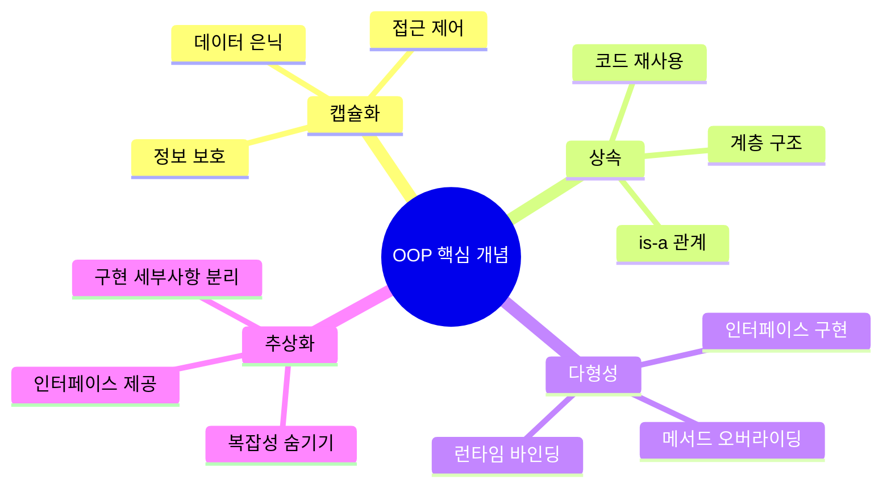

## 📊 Java OOP 클래스 계층 구조

### AI 챗봇 프로젝트를 통한 OOP 이해

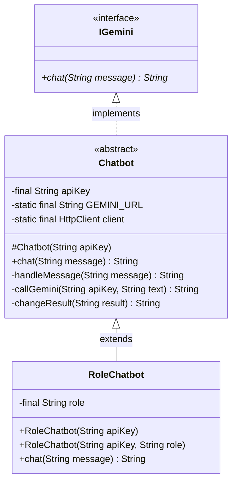

## 🏗 인터페이스 (Interface)

### IGemini 인터페이스 설계

```java
public interface IGemini {
    String chat(String message) throws Exception;
}
```

**인터페이스의 특징:**
- 모든 메서드는 기본적으로 `public abstract`
- 구현체에서 반드시 구현해야 함
- 다중 상속이 가능함
- **계약(Contract)** 역할을 함

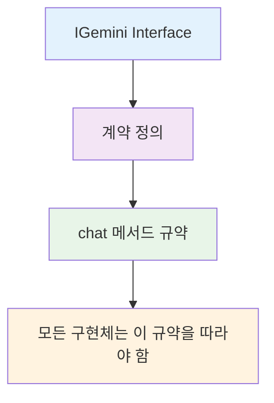

## 🎨 추상 클래스 (Abstract Class)

### Chatbot 추상 클래스 분석

```java
public abstract class Chatbot implements IGemini {
    // 공통 필드
    final String apiKey;
    
    // 생성자
    protected Chatbot(String apiKey) {
        this.apiKey = apiKey;
    }
    
    // 구현된 메서드 (템플릿 메서드 패턴)
    @Override
    public String chat(String message) throws Exception {
        String templateMessage = handleMessage(message);
        String geminiResponse = callGemini(apiKey, templateMessage);
        return changeResult(geminiResponse);
    }
    
    // private 메서드들...
}
```

**추상 클래스 vs 인터페이스:**

| 구분 | 추상 클래스 | 인터페이스 |
|------|-------------|-----------|
| 상속 | 단일 상속 | 다중 구현 |
| 메서드 | 구현된 메서드 + 추상 메서드 | 기본적으로 추상 메서드 |
| 필드 | 인스턴스 변수 가능 | static final만 가능 |
| 생성자 | 가능 | 불가능 |

## 🔄 템플릿 메서드 패턴

Chatbot 클래스의 `chat` 메서드는 **템플릿 메서드 패턴**을 사용합니다:

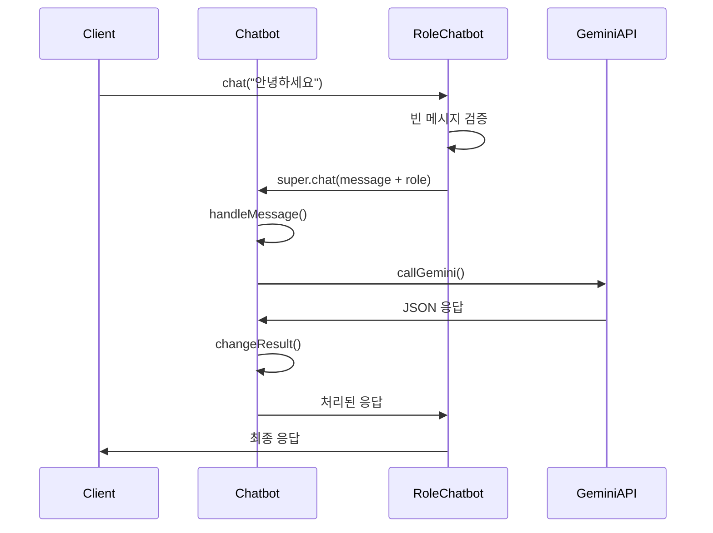

## 👶 구체 클래스 (Concrete Class)

### RoleChatbot 클래스 구현

```java
public class RoleChatbot extends Chatbot {
    private final String role;
    
    // 기본 생성자
    RoleChatbot(String apiKey) {
        super(apiKey);
        this.role = "너는 위로를 위한 챗봇이야. 200자 이내로 감정적 위로를 위한 내용으로 답변해줘.";
    }
    
    // 역할 지정 생성자
    RoleChatbot(String apiKey, String role) {
        super(apiKey);
        this.role = role;
    }
    
    @Override
    public String chat(String message) throws Exception {
        if (message.trim().isEmpty()) {
            throw new Exception("빈 질문은 안 됩니다!");
        }
        return super.chat("%s. %s".formatted(message, role));
    }
}
```

**핵심 OOP 개념들:**

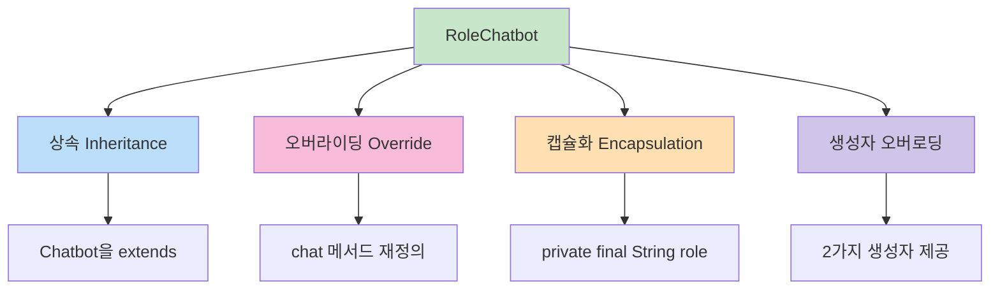

## 🌐 HTTP 통신과 API 연동

### Gemini API 연동 구조

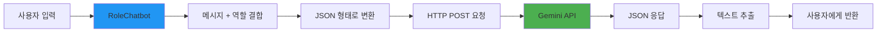

### HTTP 요청 처리 코드 분석

```java
// 1. 메시지를 JSON 형태로 변환
private String handleMessage(String message) {
    return """
        {
            "contents": [
              {
                "parts": [
                  {
                    "text": "%s"
                  }
                ]
              }
            ]
        }
        """.formatted(message);
}

// 2. HTTP 요청 전송
private String callGemini(String apiKey, String text) throws IOException, InterruptedException {
    HttpRequest request = HttpRequest.newBuilder()
            .uri(URI.create(GEMINI_URL))
            .headers("Content-Type", "application/json",
                    "X-goog-api-key", apiKey)
            .POST(HttpRequest.BodyPublishers.ofString(text))
            .build();
    
    HttpResponse<String> response = client.send(request, HttpResponse.BodyHandlers.ofString());
    return response.body();
}

// 3. 응답에서 텍스트 추출
private String changeResult(String result) {
    return result
            .split("\"text\": \"")[1]
            .split("}")[0]
            .replace("\\n", "")
            .replace("\"", "")
            .trim();
}
```

## 🎮 실제 사용 예제

### GeminiVer3 메인 클래스

```java
public class GeminiVer3 {
    public static void main(String[] args) {
        // 환경변수에서 API 키 가져오기
        String apiKey = System.getenv("GEMINI_API_KEY");
        
        Scanner sc = new Scanner(System.in);
        System.out.print("당신과 상담할 사람을 서술해보세요 : ");
        
        // 동적으로 역할 설정
        Chatbot chatbot = new RoleChatbot(apiKey, 
            sc.nextLine() + "라고 설명된 사람이 대답하는 듯이 해줘.");
        
        // 대화 루프
        while (true) {
            System.out.print("질문을 입력하세요 : ");
            String question = sc.nextLine();
            
            if (question.equals("종료")) {
                System.out.println("대화 종료");
                return;
            }
            
            try {
                String resp = chatbot.chat(question);
                System.out.println(resp);
            } catch (Exception e) {
                System.err.println(e.getMessage());
            }
        }
    }
}
```

## 🛠 개발 도구와 AI 활용

### 추천 AI 개발 도구들

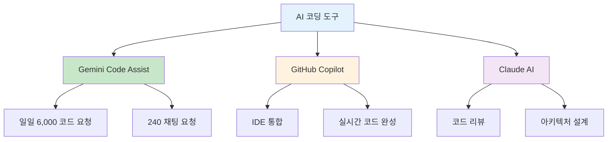

### 추가 API 서비스들
- **[Together AI](https://api.together.ai/)**: 다양한 오픈소스 모델
- **[Groq](https://groq.com/)**: 초고속 추론 서비스
- **[OpenRouter](https://openrouter.ai/models?q=free)**: 무료 모델 제공

## 🎓 OOP 설계 원칙 (SOLID)

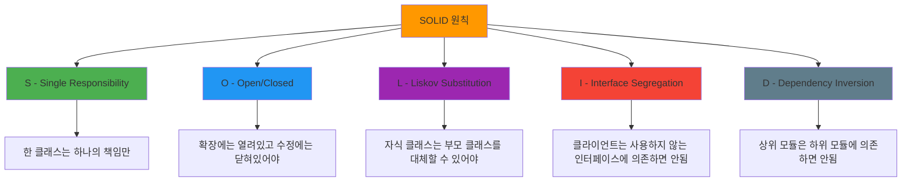

## 🔍 예외 처리와 에러 핸들링

### throws vs try-catch 패턴

```java
// 1. throws로 예외 전파
public String chat(String message) throws Exception {
    // 호출하는 쪽에서 예외 처리 책임
}

// 2. try-catch로 예외 처리
try {
    String resp = chatbot.chat(question);
    System.out.println(resp);
} catch (Exception e) {
    System.err.println(e.getMessage());
}
```

**예외 처리 전략:**

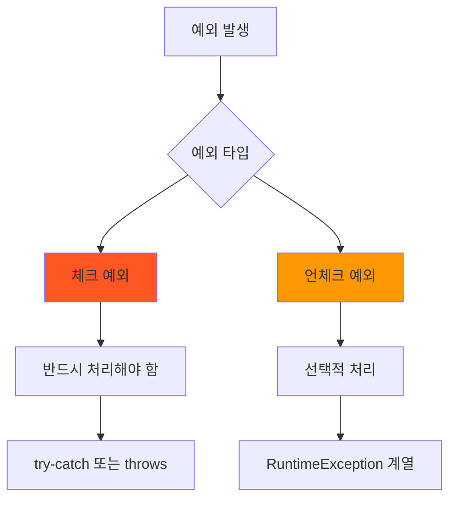

## 🚀 실습 프로젝트 확장 아이디어

### 1. 다양한 챗봇 타입 구현

```java
// 번역 전문 챗봇
public class TranslatorBot extends Chatbot {
    private final String targetLanguage;
    // 구현...
}

// 코딩 튜터 챗봇  
public class CodingTutorBot extends Chatbot {
    private final String programmingLanguage;
    // 구현...
}
```

### 2. 챗봇 팩토리 패턴

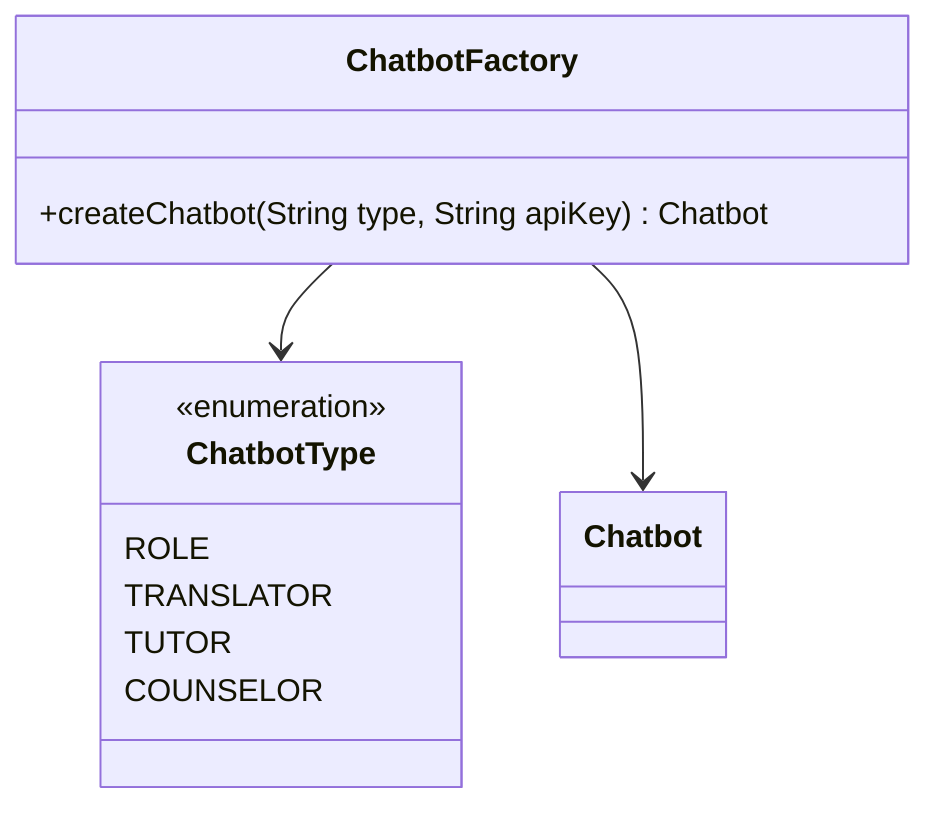

### 3. 대화 히스토리 관리

```java
public class ConversationManager {
    private List<Message> history;
    private Chatbot chatbot;
    
    public void addMessage(String user, String content) {
        history.add(new Message(user, content, LocalDateTime.now()));
    }
    
    public void saveToFile(String filename) throws IOException {
        // 대화 내역을 파일로 저장
    }
}
```

## 📚 학습 리소스 및 다음 단계

### 추천 학습 자료
- **[Java 공식 문서](https://docs.oracle.com/javase/)**: 기본 개념 정리
- **[Effective Java](https://www.oreilly.com/library/view/effective-java/9780134686097/)**: 고급 Java 기법
- **[Design Patterns](https://refactoring.guru/design-patterns)**: 디자인 패턴 학습

### 다음 학습 단계

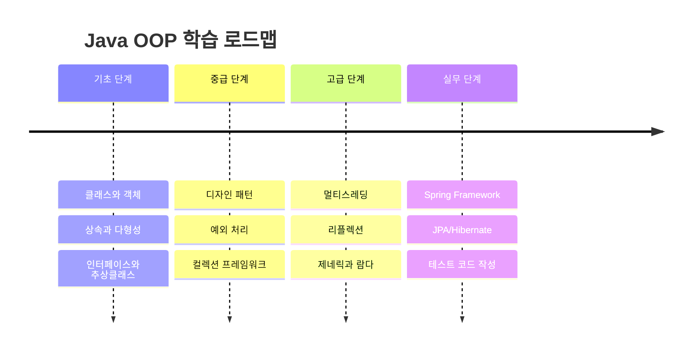

## 💡 핵심 포인트 요약

### OOP의 4대 원칙 실습 예제에서 확인

1. **📦 캡슐화**: `private` 필드와 `public` 메서드로 데이터 은닉
2. **🔗 상속**: `Chatbot` → `RoleChatbot` 계층 구조
3. **🎭 다형성**: 인터페이스를 통한 다양한 구현체 지원
4. **🎨 추상화**: 복잡한 API 통신을 간단한 `chat()` 메서드로 제공

### 실무에서 중요한 개념들

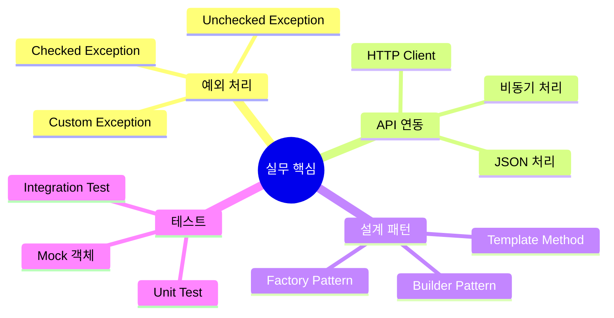

---

**Remember**: 객체지향 프로그래밍은 단순히 문법을 아는 것이 아니라, **현실 세계의 문제를 객체 간의 협력**으로 해결하는 사고방식입니다. 

*"좋은 설계는 변경에 유연하고, 확장 가능하며, 이해하기 쉬운 코드를 만듭니다!"* ✨
