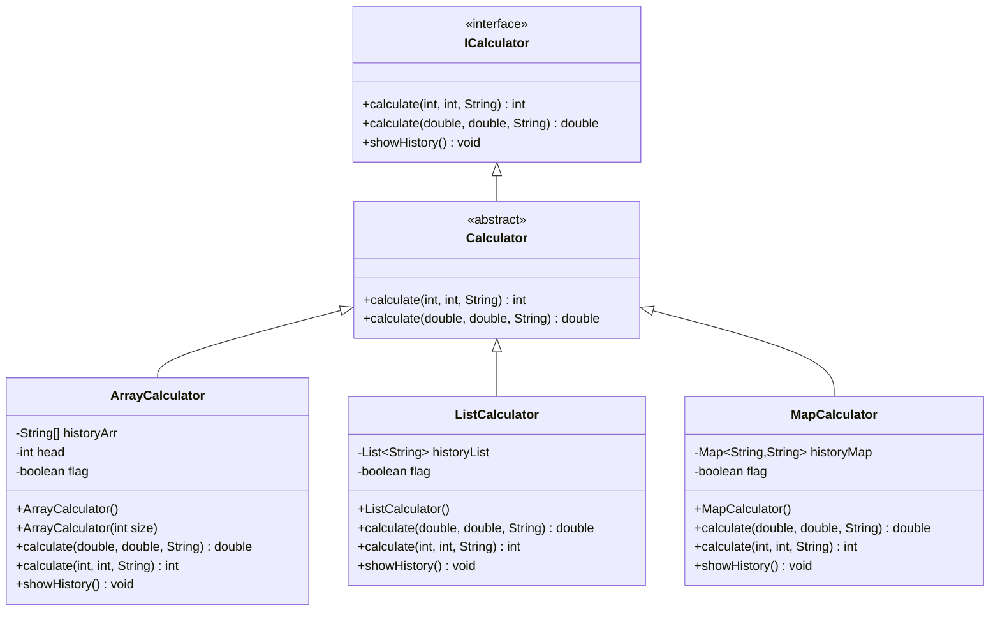
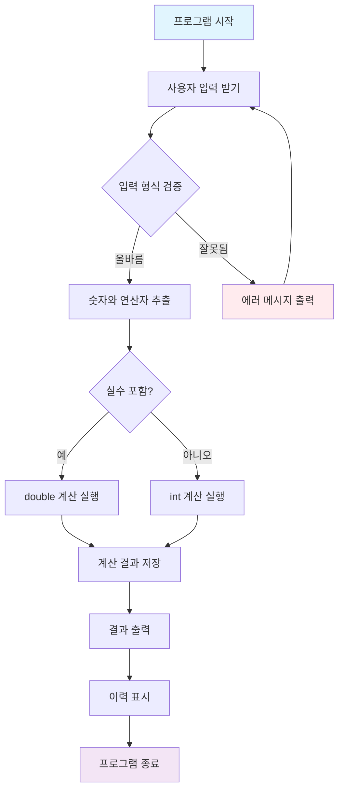
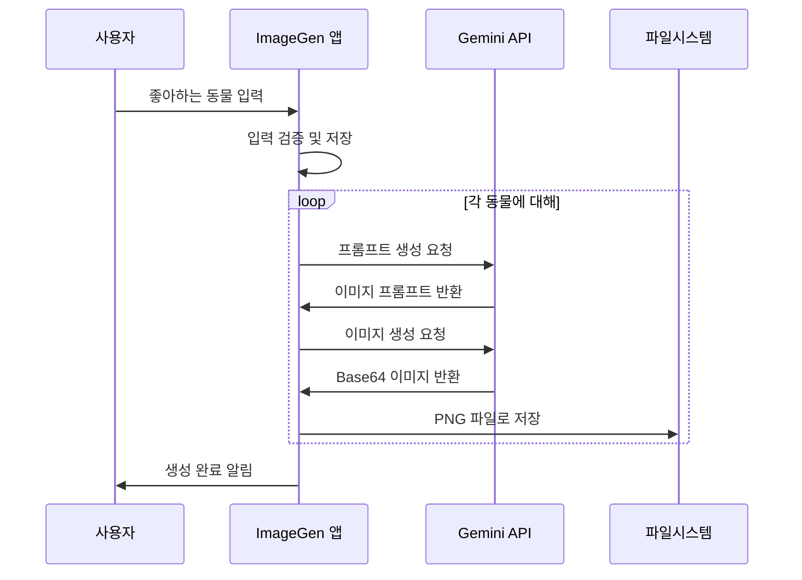
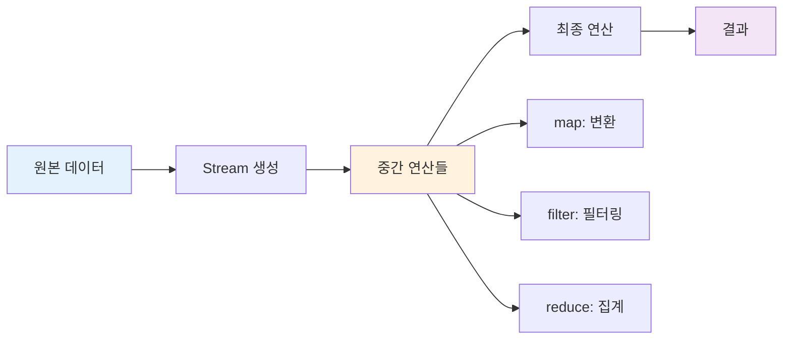
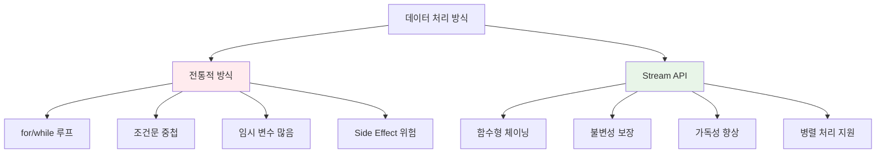
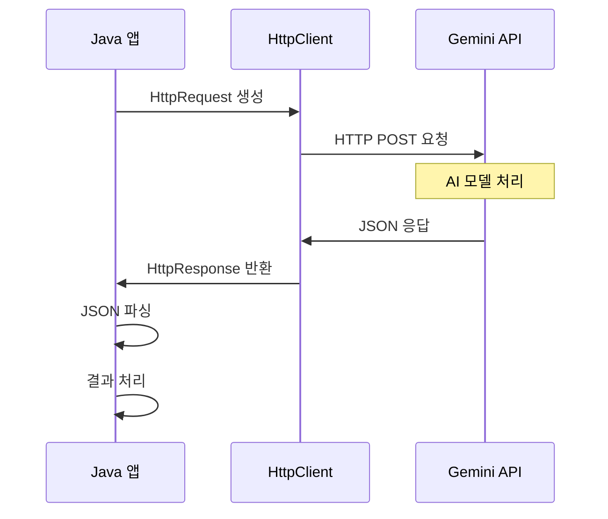
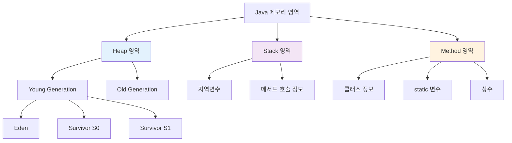

# Java Calculator & AI 이미지 생성기 완벽 가이드

## 📋 목차
1. [프로젝트 개요](#프로젝트-개요)
2. [계산기 시스템 아키텍처](#계산기-시스템-아키텍처)
3. [핵심 Java 개념 설명](#핵심-java-개념-설명)
4. [계산기 구현 코드](#계산기-구현-코드)
5. [AI 이미지 생성기](#ai-이미지-생성기)
6. [Stream API 활용](#stream-api-활용)
7. [참고자료](#참고자료)

---

## 프로젝트 개요

이 프로젝트는 **Java 객체지향 프로그래밍**을 배우기 위한 실습으로, 두 가지 주요 기능을 구현합니다:

1. **계산기**: 다양한 자료구조로 계산 이력을 저장하는 계산기
2. **AI 이미지 생성기**: Google Gemini API를 사용한 이미지 자동 생성 도구

### 학습 목표
- 인터페이스와 추상클래스 활용
- 다형성(Polymorphism) 이해
- 자료구조(Array, List, Map) 비교
- HTTP API 통신
- Stream API 함수형 프로그래밍

---

## 계산기 시스템 아키텍처



### 실행 흐름도



---

## 핵심 Java 개념 설명

### 1. 인터페이스 (Interface)

```java
// 인터페이스: 클래스가 구현해야 할 메서드들의 명세서
public interface ICalculator {
    // 정수 계산을 위한 메서드 (구현부 없음, 추상 메서드)
    int calculate(int num1, int num2, String operator) throws Exception;
    
    // 실수 계산을 위한 메서드 (메서드 오버로딩 - 같은 이름, 다른 매개변수)
    double calculate(double num1, double num2, String operator) throws Exception;
    
    // 계산 이력을 보여주는 메서드
    void showHistory();
}
```

**인터페이스의 특징:**
- `abstract` 키워드 없이도 모든 메서드가 추상 메서드
- 클래스는 인터페이스를 `implements`로 구현
- 다중 구현 가능 (한 클래스가 여러 인터페이스 구현 가능)

### 2. 추상클래스 (Abstract Class)

```java
// 추상클래스: 일부 구현을 제공하지만 인스턴스 생성 불가
public abstract class Calculator implements ICalculator {
    
    @Override  // 부모(인터페이스)의 메서드를 재정의한다는 표시
    public int calculate(int num1, int num2, String operator) throws Exception {
        // 캐스팅: int를 double로 변환 후 계산, 결과를 다시 int로 변환
        return (int) calculate((double) num1, (double) num2, operator);
    }

    @Override
    public double calculate(double num1, double num2, String operator) throws Exception {
        // switch문: 연산자에 따라 다른 계산 수행
        switch (operator) {
            case "+":
                return num1 + num2;  // return하면 break 불필요
            case "-":
                return num1 - num2;
            case "*":
                return num1 * num2;
            case "/":
                return num1 / num2;
            default:
                // 지원하지 않는 연산자일 때 예외 발생
                throw new Exception("지원하지 않는 연산자입니다!");
        }
    }
    
    // showHistory()는 각 자식 클래스에서 구현해야 함 (추상 메서드)
}
```

**추상클래스 vs 인터페이스:**
- 추상클래스: 일부 구현 제공 가능, 단일 상속
- 인터페이스: 구현 없음(명세만), 다중 구현 가능

### 3. 메서드 오버로딩 (Method Overloading)

```java
// 같은 메서드 이름, 다른 매개변수 타입
public int calculate(int num1, int num2, String operator)     // 정수용
public double calculate(double num1, double num2, String operator)  // 실수용
```

**오버로딩 조건:**
- 메서드 이름 동일
- 매개변수 타입, 개수, 순서 중 하나라도 달라야 함
- 반환 타입만 다른 것은 오버로딩 불가

---

## 계산기 구현 코드

### 1. 메인 애플리케이션

```java
import calculator.ArrayCalculator;  // 패키지에서 클래스 가져오기
import java.util.Scanner;           // 사용자 입력을 위한 클래스

public class Application {
    // main 메서드: 프로그램의 진입점 (시작점)
    public static void main(String[] args) {
        // public: 어디서든 접근 가능
        // static: 객체 생성 없이 호출 가능 (메모리에 미리 로딩)
        // void: 반환값 없음 (결과를 돌려주지 않음)
        // String[] args: 명령행 인수를 받는 배열
        
        System.out.println("계산기가 실행되었습니다");
        
        // 다형성: Calculator 타입으로 ArrayCalculator 객체 참조
        // 업캐스팅: 자식 클래스 → 부모 클래스 타입으로 변환
        Calculator cal = new ArrayCalculator();
        
        // Scanner: 키보드 입력을 받기 위한 객체
        // System.in: 표준 입력(키보드)을 의미
        Scanner sc = new Scanner(System.in);
        
        System.out.print("계산할 식을 입력해주세요 ex) 1 + 1 : ");
        String input = sc.nextLine();  // 한 줄 전체 입력받기
        
        try {  // 예외가 발생할 수 있는 코드 블록
            // split(" "): 공백으로 문자열을 나누어 배열로 변환
            // "1 + 1" → ["1", "+", "1"]
            String[] inputArr = input.split(" ");
            
            if (inputArr.length != 3) {  // 배열 길이가 3이 아니면
                throw new Exception("잘못된 입력");  // 예외 발생시키기
            }
            
            // 배열 인덱싱: 0부터 시작
            String numStr1 = inputArr[0];  // 첫 번째 숫자 문자열
            String numStr2 = inputArr[2];  // 두 번째 숫자 문자열  
            String operator = inputArr[1]; // 연산자
            
            // contains("."): 문자열에 소수점이 포함되어 있는지 확인
            if (numStr1.contains(".") || numStr2.contains(".")) {
                // 둘 중 하나라도 실수면 double로 계산
                
                // parseDouble: 문자열을 double로 변환
                double num1 = Double.parseDouble(numStr1);
                double num2 = Double.parseDouble(numStr2);
                
                double result = cal.calculate(num1, num2, operator);
                System.out.println(result);
            } else {
                // 둘 다 정수면 int로 계산
                
                // parseInt: 문자열을 int로 변환
                // Integer는 int의 Wrapper 클래스 (객체 버전)
                int num1 = Integer.parseInt(numStr1);
                int num2 = Integer.parseInt(numStr2);
                
                int result = cal.calculate(num1, num2, operator);
                System.out.println(result);
            }
            
        } catch (Exception e) {  // 예외가 발생했을 때 실행되는 블록
            // System.err: 표준 에러 출력 (빨간색으로 표시됨)
            System.err.println(e.getMessage());  // 에러 메시지만 출력
        }
    }
}
```

### 2. 배열 기반 계산기

```java
package calculator;  // 이 클래스가 속한 패키지 선언

public class ArrayCalculator extends Calculator {
    // final: 한 번 초기화되면 변경할 수 없는 상수
    // private: 이 클래스 내부에서만 접근 가능
    final private String[] historyArr;  // 계산 이력을 저장할 배열
    private int head = 0;               // 현재 저장 위치를 가리키는 포인터
    private boolean flag = false;       // 중복 저장 방지용 플래그
    
    // 기본 생성자: 매개변수 없이 객체 생성
    public ArrayCalculator() {
        this.historyArr = new String[20];  // 크기 20인 배열 생성
        // 배열 초기값은 모두 null
    }
    
    // 매개변수가 있는 생성자: 배열 크기를 사용자가 지정
    public ArrayCalculator(int size) {
        this.historyArr = new String[size];  // 사용자 지정 크기로 배열 생성
    }
    
    @Override  // 부모 클래스의 메서드를 재정의
    public double calculate(double num1, double num2, String operator) throws Exception {
        System.out.println("ArrayCalculator Double");  // 디버깅용 출력
        
        // super: 부모 클래스를 가리키는 키워드
        // 부모의 calculate 메서드 호출하여 실제 계산 수행
        double result = super.calculate(num1, num2, operator);
        
        if (!flag) {  // flag가 false일 때만 저장 (중복 방지)
            // 배열 인덱스 초과 체크
            if (historyArr.length <= head) {
                throw new Exception("이력 배열 길이보다 지금까지의 히스토리가 깁니다");
            }
            
            // formatted(): 문자열 템플릿에 값을 삽입
            // %f: 실수 표시자, %s: 문자열 표시자
            historyArr[head++] = "%f %s %f = %f".formatted(num1, operator, num2, result);
            // head++: 현재 head 값 사용 후 1 증가 (후위 증감 연산자)
        }
        
        return result;
    }
    
    @Override
    public int calculate(int num1, int num2, String operator) throws Exception {
        System.out.println("ArrayCalculator INT");
        
        flag = true;  // 플래그 켜기 (double 메서드 호출 시 중복 저장 방지)
        
        // int 계산은 내부적으로 double 계산을 호출
        int result = super.calculate(num1, num2, operator);
        
        if (historyArr.length <= head) {
            throw new Exception("이력 배열 길이보다 지금까지의 히스토리가 깁니다");
        }
        
        // %d: 정수 표시자
        historyArr[head++] = "%d %s %d = %d".formatted(num1, operator, num2, result);
        flag = false;  // 플래그 끄기
        
        return result;
    }
    
    @Override
    public void showHistory() {
        System.out.println("[🥹 지금까지의 계산 결과]");
        
        // 향상된 for문 (for-each): 배열의 모든 요소를 순회
        for (String s : historyArr) {
            if (s == null) {  // null이면 더 이상 저장된 데이터가 없음
                return;  // 메서드 종료 (break와 동일한 효과)
            }
            System.out.println(s);
        }
    }
}
```

### 3. 리스트 기반 계산기

```java
package calculator;

import java.util.ArrayList;  // 동적 배열 클래스
import java.util.List;       // 리스트 인터페이스

public class ListCalculator extends Calculator {
    // List: 인터페이스, ArrayList: 구현 클래스
    // 제네릭 <String>: 이 리스트는 String 타입만 저장 가능
    final private List<String> historyList;
    private boolean flag = false;
    
    public ListCalculator() {
        // 다이아몬드 연산자 <> : 타입 추론 (컴파일러가 자동으로 String 인식)
        this.historyList = new ArrayList<>();  // 크기 제한 없는 동적 배열
    }
    
    @Override
    public double calculate(double num1, double num2, String operator) throws Exception {
        System.out.println("ListCalculator Double");
        double result = super.calculate(num1, num2, operator);
        
        if (!flag) {
            String history = "%f %s %f = %f".formatted(num1, operator, num2, result);
            // add(): 리스트 끝에 요소 추가 (크기 자동 증가)
            historyList.add(history);
        }
        
        return result;
    }
    
    @Override
    public int calculate(int num1, int num2, String operator) throws Exception {
        System.out.println("ListCalculator INT");
        flag = true;
        int result = super.calculate(num1, num2, operator);
        
        historyList.add("%d %s %d = %d".formatted(num1, operator, num2, result));
        flag = false;
        
        return result;
    }
    
    @Override
    public void showHistory() {
        System.out.println("[🥹 지금까지의 계산 결과]");
        
        // 리스트는 null 체크 없이 순회 가능 (실제 데이터만 저장됨)
        for (String s : historyList) {
            System.out.println(s);
        }
        
        // 전통적인 for문으로도 가능:
        // for (int i = 0; i < historyList.size(); i++) {
        //     System.out.println(historyList.get(i));  // get(): 인덱스로 요소 조회
        // }
    }
}
```

### 4. 맵 기반 계산기 (캐시 기능 포함)

```java
package calculator;

import java.util.HashMap;  // 해시 맵 구현체
import java.util.Map;      // 맵 인터페이스

public class MapCalculator extends Calculator {
    // Map<Key타입, Value타입>: 키-값 쌍으로 데이터 저장
    final private Map<String, String> historyMap;
    private boolean flag = false;
    
    public MapCalculator() {
        this.historyMap = new HashMap<>();  // 해시 테이블 기반 맵
        // TreeMap도 사용 가능 (정렬된 순서로 저장)
    }
    
    @Override
    public double calculate(double num1, double num2, String operator) throws Exception {
        // 계산식을 키로 사용 (캐시 검색용)
        String key = "%f %s %f".formatted(num1, operator, num2);
        
        // containsKey(): 맵에 해당 키가 있는지 확인
        if (historyMap.containsKey(key)) {
            System.out.println("이미 계산한 결과가 있습니다");
            // get(): 키에 해당하는 값 반환
            // parseDouble(): 문자열을 double로 변환
            return Double.parseDouble(historyMap.get(key));
        }
        
        double result = super.calculate(num1, num2, operator);
        
        if (!flag) {
            String value = "%f".formatted(result);
            // put(): 키-값 쌍 저장
            historyMap.put(key, value);
        }
        
        return result;
    }
    
    @Override
    public int calculate(int num1, int num2, String operator) throws Exception {
        String key = "%d %s %d".formatted(num1, operator, num2);
        
        if (historyMap.containsKey(key)) {
            System.out.println("이미 계산한 결과가 있습니다");
            return Integer.parseInt(historyMap.get(key));
        }
        
        flag = true;
        int result = super.calculate(num1, num2, operator);
        
        String value = "%d".formatted(result);
        historyMap.put(key, value);
        flag = false;
        
        return result;
    }
    
    @Override
    public void showHistory() {
        System.out.println("[🥹 지금까지의 계산 결과]");
        
        // entrySet(): 맵의 모든 키-값 쌍을 Set으로 반환
        // Map.Entry: 키-값 쌍을 나타내는 내부 인터페이스
        for (Map.Entry<String, String> entry : historyMap.entrySet()) {
            // getKey(): 키 반환, getValue(): 값 반환
            System.out.println(entry.getKey() + " = " + entry.getValue());
        }
    }
}
```

---

## AI 이미지 생성기

### 시스템 구조도



### 1. 기본 이미지 생성기 클래스

```java
package step2;

import java.net.URI;                    // 웹 주소를 다루는 클래스
import java.net.http.HttpClient;        // HTTP 통신을 위한 클라이언트
import java.net.http.HttpRequest;       // HTTP 요청을 만드는 클래스
import java.net.http.HttpResponse;      // HTTP 응답을 받는 클래스
import java.util.ArrayList;             // 동적 배열
import java.util.List;                  // 리스트 인터페이스
import java.util.Scanner;               // 사용자 입력
import java.util.Base64;                // Base64 인코딩/디코딩
import java.nio.file.Files;             // 파일 조작 유틸리티
import java.nio.file.Path;              // 파일 경로 클래스
import java.nio.file.Paths;             // 파일 경로 생성 유틸리티

public class ImageGen {
    // final 필드: 객체 생성 후 변경 불가
    final private List<String> favoriteList = new ArrayList<>();  // 좋아하는 동물 리스트
    final private Scanner scanner = new Scanner(System.in);        // 입력 스캐너
    final private int size;                                        // 입력받을 동물 개수
    final private HttpClient httpClient = HttpClient.newHttpClient(); // HTTP 클라이언트
    final private String GEMINI_API_KEY = System.getenv("GEMINI_API_KEY"); // 환경변수에서 API 키 가져오기
    
    private final List<String> imagePromptList = new ArrayList<>(); // 생성된 이미지 프롬프트 리스트
    
    // 생성자: 입력받을 동물 개수 설정
    public ImageGen(int size) {
        this.size = size;
    }
    
    // 메인 메서드: 프로그램 실행 순서
    public static void main(String[] args) {
        ImageGen gen = new ImageGen(2);  // 2개 동물 입력받을 객체 생성
        gen.inputData();                 // 데이터 입력
        gen.makeImagePrompt();           // 이미지 프롬프트 생성
        gen.generateImage();             // 이미지 생성
    }
    
    // 사용자로부터 좋아하는 동물 입력받기
    void inputData() {
        for (int i = 0; i < size; i++) {
            System.out.print("좋아하는 동물을 입력해주세요 : ");
            String input = scanner.nextLine();
            
            // trim(): 문자열 앞뒤 공백/줄바꿈 제거
            // isEmpty(): 빈 문자열인지 확인
            if (input.trim().isEmpty()) {
                System.out.println("제대로 입력해주세요!");
                i--;        // 카운터 감소 (다시 입력받기)
                continue;   // 반복문 처음으로 돌아가기
            }
            
            favoriteList.add(input);  // 리스트에 추가
        }
        System.out.println(favoriteList);  // 입력된 리스트 출력
    }
    
    // HTTP API 호출을 위한 공통 메서드
    private String callAPI(String url, String body) {
        // 환경변수 확인
        if (GEMINI_API_KEY == null) {
            throw new RuntimeException("GEMINI_API_KEY가 없습니다!");
        }
        
        // HTTP 요청 빌더 패턴으로 생성
        HttpRequest httpRequest = HttpRequest.newBuilder()
                .uri(URI.create(url))                    // 요청 URL 설정
                .headers("Content-Type", "application/json",  // 헤더 설정
                        "X-goog-api-key", GEMINI_API_KEY)     // API 키 헤더
                .POST(                                   // POST 방식으로 요청
                    HttpRequest.BodyPublishers.ofString(body)  // 요청 본문 설정
                )
                .build();                                // 요청 객체 완성
        
        try {
            // HTTP 요청 전송 및 응답 받기
            HttpResponse<String> httpResponse = httpClient.send(
                httpRequest,                                    // 요청 객체
                HttpResponse.BodyHandlers.ofString()           // 응답을 String으로 받기
            );
            return httpResponse.body();  // 응답 본문 반환
        } catch (Exception e) {
            System.err.println(e.getMessage());  // 에러 메시지 출력
            throw new RuntimeException(e);       // 런타임 예외로 변환
        }
    }
    
    // AI를 이용해 이미지 생성 프롬프트 만들기
    void makeImagePrompt() {
        // Gemini API 엔드포인트
        String url = "https://generativelanguage.googleapis.com/v1beta/models/gemini-2.0-flash:generateContent";
        
        // 입력받은 각 동물에 대해 프롬프트 생성
        for (String animal : favoriteList) {
            // JSON 형태의 요청 본문 (텍스트 블록 사용)
            String result = callAPI(url, """
                {
                    "contents": [
                      {
                        "parts": [
                          {
                            "text": "%s(을)를 이미지로 나타내기 위한 200자 이내의 상세한 프롬프트를 작성해줘. 결과만 작성해줘."
                          }
                        ]
                      }
                    ]
                  }
                """.formatted(animal));  // %s에 동물 이름 삽입
            
            // JSON 응답에서 텍스트 부분만 추출
            String prompt = result
                    .split("\"text\": \"")[1]  // "text": " 뒤의 내용
                    .split("}")[0]              // 첫 번째 } 앞까지
                    .replace("\\n", "")         // 줄바꿈 문자 제거
                    .replace("\"", "")          // 따옴표 제거
                    .trim();                    // 앞뒤 공백 제거
            
            imagePromptList.add(prompt);  // 프롬프트 리스트에 추가
        }
        
        // 생성된 프롬프트들 출력
        for (String s : imagePromptList) {
            System.out.println(s);
        }
    }
    
    // 실제 이미지 생성하기
    void generateImage() {
        // 이미지 생성 전용 모델
        String model = "gemini-2.0-flash-preview-image-generation";
        String url = "https://generativelanguage.googleapis.com/v1beta/models/%s:generateContent"
                     .formatted(model);
        
        // 각 프롬프트에 대해 이미지 생성
        for (String prompt : imagePromptList) {
            String result = callAPI(url, """
                {
                    "contents": [
                      {
                        "role": "user",
                        "parts": [
                          {
                            "text": "%s"
                          }
                        ]
                      }
                    ],
                    "generationConfig": {
                      "responseModalities": ["IMAGE", "TEXT"]
                    }
                }
                """.formatted(prompt));
            
            // JSON 응답에서 Base64 이미지 데이터 추출
            String image64 = result
                    .split("\"data\": \"")[1]   // Base64 데이터 시작점 찾기
                    .split("}")[0]               // 첫 번째 } 앞까지
                    .replace("\\n", "")          // 줄바꿈 문자 제거
                    .replace("\"", "")           // 따옴표 제거
                    .trim();                     // 앞뒤 공백 제거
            
            // Base64 디코딩하여 바이트 배열로 변환
            byte[] imageBytes = Base64.getDecoder().decode(image64);
            
            // 현재 시간을 파일명으로 사용 (중복 방지)
            String outputPath = "%s.png".formatted(System.currentTimeMillis());
            Path filePath = Paths.get(outputPath);  // 파일 경로 객체 생성
            
            try {
                // 바이트 배열을 PNG 파일로 저장
                Files.write(filePath, imageBytes);
                System.out.println("이미지가 저장되었습니다: " + outputPath);
            } catch (Exception e) {
                System.err.println("파일 저장 실패: " + e.getMessage());
            }
        }
    }
}
```

---

## Stream API 활용

### Stream API 개념



### 1. 기본 List 조작

```java
package step1;

import java.util.*;  // java.util 패키지의 모든 클래스 가져오기 (*)

public class Solution01 {
    public static void main(String[] args) {
        // List<타입>: 제네릭을 사용한 타입 안전성 보장
        List<String> stringList = new ArrayList<>();
        
        // ArrayList의 특징:
        // - Array처럼 내부에 순서가 있고, 인덱스가 부여됨
        // - 타입이 모두 동일하고, 길이 제한이 명시적으로 없어 자동으로 늘어남
        
        Scanner scanner = new Scanner(System.in);
        while (true) {  // 무한 루프
            System.out.print("입력해주세요 : ");
            String input = scanner.nextLine();  // 한 줄 입력받기
            
            if (input.equals("종료")) {  // 문자열 비교는 equals() 사용
                break;  // 루프 탈출
            }
            
            stringList.add(input);  // 리스트 끝에 요소 추가
        }
        
        System.out.println("입력된 데이터: " + stringList);
    }
}
```

### 2. 랜덤 데이터 생성 및 변환

```java
package step1;

import java.util.ArrayList;
import java.util.List;
import java.util.Random;

public class Solution02 {
    public static void main(String[] args) {
        List<Integer> numberList = new ArrayList<>();
        
        // Random 클래스: 난수 생성을 위한 클래스
        Random rd = new Random();
        
        // 10~20개 사이의 랜덤한 개수만큼 반복
        for (int i = 0; i < rd.nextInt(11) + 10; i++) {
            // nextInt(11): 0~10 사이 숫자 + 10 = 10~20
            // nextInt(101): 0~100 사이 랜덤 숫자
            numberList.add(rd.nextInt(101));
        }
        
        System.out.println("원본 리스트: " + numberList);
        
        // 방법 1: 기존 방식 - 원본을 직접 수정 (Side Effect 발생)
        for (int i = 0; i < numberList.size(); i++) {
            // set(index, value): 해당 인덱스의 값을 변경
            // get(index): 해당 인덱스의 값을 가져오기
            numberList.set(i, numberList.get(i) * 10);
        }
        System.out.println("10배 후 (원본 수정): " + numberList);
        
        // 방법 2: 새로운 리스트 생성 - 원본 보존
        List<Integer> numberList2 = new ArrayList<>();
        for (int v : numberList) {  // 향상된 for문 (for-each)
            // v는 int이지만 ArrayList<Integer>에 자동으로 Boxing됨
            // Boxing: 기본 타입 → Wrapper 클래스로 자동 변환
            // Unboxing: Wrapper 클래스 → 기본 타입으로 자동 변환
            numberList2.add(v * 10);
        }
        System.out.println("새 리스트 (원본 보존): " + numberList2);
        System.out.println("원본 확인: " + numberList);
        
        // 방법 3: Stream API - 함수형 프로그래밍 방식
        // 사상: mapping (데이터를 하나하나 변환처리)
        List<Integer> numberList3 = numberList
                .stream()                           // 스트림 생성
                .map(Solution02::multiplyTen)       // 각 요소에 함수 적용
                .toList();                          // 결과를 새 리스트로 변환
        
        // 메서드 레퍼런스 (::): x -> multiplyTen(x)와 동일한 의미
        System.out.println("Stream API 결과: " + numberList3);
    }
    
    // static 메서드: 객체 생성 없이 클래스명으로 직접 호출 가능
    static int multiplyTen(int x) {
        return x * 10;
    }
}
```

### 3. Stream의 reduce 연산

```java
package step1;

import java.util.List;

public class Solution06 {
    public static void main(String[] args) {
        // List.of(): 불변 리스트 생성 (수정 불가)
        List<Integer> numbers = List.of(1, 5, 4, 3, 7);
        
        // reduce: 여러 개의 값을 하나의 값으로 압축
        // map: 모든 요소를 변환 (a -> a', b -> b'...)
        // reduce: 누적 계산 (cur: 현재값, acc: 누적값)
        
        // 전통적인 방식으로 합계 계산
        int sum = 0;
        for (Integer i : numbers) {
            sum += i;  // 누적 합계
        }
        System.out.println("전통적 방식 합계: " + sum);
        
        // Stream reduce로 합계 계산
        System.out.println("Stream reduce 합계: " + 
            numbers.stream().reduce(
                0,                    // 초기값
                (cur, acc) -> cur + acc  // 람다식: 현재값과 누적값을 더함
            ));
        
        // reduce로 곱셈 계산
        System.out.println("Stream reduce 곱셈: " + 
            numbers.stream().reduce(
                1,                    // 곱셈의 초기값은 1
                (cur, acc) -> cur * acc  // 현재값과 누적값을 곱함
            ));
        
        // 람다식 설명:
        // (cur, acc) -> cur + acc
        // 매개변수    반환값
        // cur: 스트림의 각 요소
        // acc: 지금까지 계산된 누적값
    }
}
```

### 4. 완전한 함수형 프로그래밍 이미지 생성기

```java
package step2;

import java.net.URI;
import java.net.http.HttpClient;
import java.net.http.HttpRequest;
import java.net.http.HttpResponse;
import java.nio.file.Files;
import java.nio.file.Path;
import java.nio.file.Paths;
import java.util.Base64;
import java.util.Scanner;
import java.util.stream.IntStream;  // 정수 스트림

public class ImageGenStreamClean {
    public static void main(String[] args) {
        Scanner sc = new Scanner(System.in);
        int size = 3;  // 입력받을 개수
        
        // HTTP 클라이언트와 템플릿들
        HttpClient httpClient = HttpClient.newHttpClient();
        String urlTemplate = "https://generativelanguage.googleapis.com/v1beta/models/%s:generateContent";
        
        // 프롬프트 생성용 JSON 템플릿
        String promptTemplate = """
        {
            "contents": [
              {
                "parts": [
                  {
                    "text": "%s(을)를 이미지로 나타내기 위한 200자 이내의 상세한 프롬프트를 작성해줘. 결과만 작성해줘."
                  }
                ]
              }
            ]
          }
        """;
        
        // 이미지 생성용 JSON 템플릿
        String imageTemplate = """
        {
            "contents": [
              {
                "role": "user",
                "parts": [
                  {
                    "text": "%s"
                  }
                ]
              }
            ],
            "generationConfig": {
              "responseModalities": ["IMAGE", "TEXT"]
            }
        }
        """;
        
        // Stream API를 이용한 함수형 프로그래밍 체인
        IntStream
            .range(0, size)  // 0부터 size-1까지의 정수 스트림 생성
            .boxed()         // int → Integer로 Boxing (객체 스트림으로 변환)
            .map(x -> {      // 각 인덱스를 사용자 입력으로 변환
                System.out.print("좋아하는 캐릭터는? : ");
                return sc.nextLine();
            })
            .map(x -> {      // 각 입력을 프롬프트로 변환
                try {
                    HttpResponse<String> response = httpClient.send(
                        HttpRequest.newBuilder()
                            .uri(URI.create(urlTemplate.formatted("gemini-2.0-flash")))
                            .headers("Content-Type", "application/json",
                                   "X-goog-api-key", System.getenv("GEMINI_API_KEY"))
                            .POST(HttpRequest.BodyPublishers.ofString(
                                promptTemplate.formatted(x)))
                            .build(),
                        HttpResponse.BodyHandlers.ofString());
                    return response.body();
                } catch (Exception ex) {
                    System.err.println(ex.getMessage());
                    return null;
                }
            })
            .filter(x -> x != null)  // null 값 제거 (에러 발생한 경우 제외)
            .map(x -> x.split("\"text\": \"")[1]  // JSON에서 텍스트 추출
                      .split("}")[0]
                      .replace("\\n", "")
                      .replace("\"", "")
                      .trim())
            .map(x -> {      // 프롬프트를 이미지로 변환
                try {
                    HttpResponse<String> response = httpClient.send(
                        HttpRequest.newBuilder()
                            .uri(URI.create(urlTemplate.formatted(
                                "gemini-2.0-flash-preview-image-generation")))
                            .headers("Content-Type", "application/json",
                                   "X-goog-api-key", System.getenv("GEMINI_API_KEY"))
                            .POST(HttpRequest.BodyPublishers.ofString(
                                imageTemplate.formatted(x)))
                            .build(),
                        HttpResponse.BodyHandlers.ofString());
                    return response.body();
                } catch (Exception ex) {
                    System.err.println(ex.getMessage());
                    return null;
                }
            })
            .filter(x -> x != null)  // null 값 제거
            .map(x -> x.split("\"data\": \"")[1]  // Base64 이미지 데이터 추출
                      .split("}")[0]
                      .replace("\\n", "")
                      .replace("\"", "")
                      .trim())
            .forEach(ImageGenStreamClean::handleImage);  // 각 이미지 저장
        
        System.out.println("모든 이미지 생성이 완료되었습니다!");
    }
    
    // Base64 이미지 데이터를 파일로 저장하는 메서드
    static void handleImage(String base64) {
        try {
            // Base64 디코딩
            byte[] imageBytes = Base64.getDecoder().decode(base64);
            
            // 현재 시간을 밀리초로 사용하여 고유한 파일명 생성
            String outputPath = "%s.png".formatted(System.currentTimeMillis());
            Path filePath = Paths.get(outputPath);
            
            // 바이트 배열을 파일로 저장
            Files.write(filePath, imageBytes);
            System.out.println("이미지 저장 완료: " + outputPath);
        } catch (Exception e) {
            System.err.println("이미지 저장 실패: " + e.getMessage());
        }
    }
}
```

## 자료구조 비교표

| 특징 | Array | ArrayList | HashMap |
|------|-------|-----------|---------|
| **크기** | 고정 | 동적 | 동적 |
| **타입 안전성** | 제네릭 불가 | 제네릭 가능 | 제네릭 가능 |
| **접근 방식** | 인덱스 | 인덱스 | 키-값 |
| **검색 속도** | O(n) | O(n) | O(1) 평균 |
| **메모리 사용량** | 최소 | 중간 | 많음 |
| **캐시 친화적** | 높음 | 높음 | 낮음 |

## Stream API vs 전통적 방식



### 전통적 방식의 특징
- **장점**: 직관적이고 이해하기 쉬움, 디버깅 용이
- **단점**: 코드가 길어짐, Side Effect 발생 가능, 실수하기 쉬움

### Stream API의 특징  
- **장점**: 간결한 코드, 함수형 프로그래밍, 병렬 처리 가능
- **단점**: 학습 곡선, 디버깅 어려움, 단순한 작업에는 오버헤드

---

## 프로그래밍 패러다임 비교

### 1. 명령형 프로그래밍 (Imperative)
```java
// "어떻게(How)" 할지를 단계별로 명시
List<Integer> result = new ArrayList<>();
for (int i = 0; i < numbers.size(); i++) {
    int value = numbers.get(i);
    if (value > 5) {
        result.add(value * 2);
    }
}
```

### 2. 함수형 프로그래밍 (Functional)
```java
// "무엇을(What)" 할지를 선언적으로 명시
List<Integer> result = numbers.stream()
    .filter(x -> x > 5)      // 5보다 큰 값만
    .map(x -> x * 2)         // 각각 2배로
    .toList();               // 리스트로 변환
```

---

## HTTP API 통신 흐름



### API 통신의 핵심 개념

1. **HTTP 메서드**
   - GET: 데이터 조회
   - POST: 데이터 생성/전송
   - PUT: 데이터 수정
   - DELETE: 데이터 삭제

2. **요청 구성 요소**
   - URL: 요청 주소
   - Headers: 메타데이터 (Content-Type, 인증 등)
   - Body: 실제 전송 데이터

3. **응답 처리**
   - Status Code: 요청 처리 결과 (200=성공, 404=없음, 500=서버오류)
   - Response Body: 실제 데이터
   - Headers: 응답 메타데이터

---

## 예외 처리 (Exception Handling)

### try-catch-finally 구조

```java
try {
    // 예외가 발생할 수 있는 코드
    int result = 10 / 0;  // ArithmeticException 발생
} catch (ArithmeticException e) {
    // 특정 예외 처리
    System.err.println("0으로 나눌 수 없습니다: " + e.getMessage());
} catch (Exception e) {
    // 모든 예외 처리 (상위 클래스)
    System.err.println("예상치 못한 오류: " + e.getMessage());
} finally {
    // 예외 발생 여부와 관계없이 항상 실행
    System.out.println("정리 작업 수행");
}
```

### throws vs throw

```java
// throws: 메서드가 던질 수 있는 예외를 선언
public void methodA() throws IOException {
    // IOException을 던질 수 있음을 선언
}

// throw: 실제로 예외를 발생시킴
public void methodB() {
    throw new IllegalArgumentException("잘못된 인자입니다");
}
```

---

## 메모리 관리와 가비지 컬렉션



### 가비지 컬렉션 과정
1. **Eden 영역**에 새 객체 생성
2. Eden 가득 찰 때 **Minor GC** 발생
3. 살아남은 객체는 **Survivor** 영역으로 이동
4. 여러 번 살아남은 객체는 **Old Generation**으로 승격
5. Old 영역 가득 찰 때 **Major GC** 발생

---

## 참고자료

### 📚 Java 학습 리소스
- [Programiz Java Tutorial](https://www.programiz.com/java-programming)
- [GeeksforGeeks Java](https://www.geeksforgeeks.org/java/)
- [Baeldung Java Series](https://www.baeldung.com/get-started-with-java-series)
- [Codecademy Java](https://www.codecademy.com/catalog/language/java)

### 🔧 개발 도구
- [DeepL 번역기](https://www.deepl.com/ko/translator)
- [Emojipedia](https://emojipedia.org/)
- [Google AI Studio](https://aistudio.google.com/)

### 🌐 API 문서
- [Google Generative AI](https://github.com/googleapis/java-genai)
- [Maven Repository](https://mvnrepository.com/artifact/com.google.genai/google-genai)

### 📁 프로젝트 저장소
- [Calculator Project](https://github.com/notlikelion/250805_calculator)
- [Functional Programming Examples](https://github.com/notlikelion/250805_fp)

---

## 핵심 포인트 요약

### 🎯 객체지향 프로그래밍
- **캡슐화**: 데이터와 메서드를 하나로 묶기
- **상속**: 기존 클래스의 특성을 물려받기  
- **다형성**: 같은 메서드 다른 구현
- **추상화**: 복잡한 내용 숨기고 핵심만 표현

### 🚀 함수형 프로그래밍
- **불변성**: 데이터 변경 대신 새로운 데이터 생성
- **순수 함수**: Side Effect 없는 함수
- **고차 함수**: 함수를 매개변수나 반환값으로 사용
- **체이닝**: 여러 연산을 연결하여 처리

### 💡 실무 팁
- 적절한 자료구조 선택이 성능에 큰 영향
- 예외 처리로 안정적인 프로그램 작성
- API 통신 시 에러 처리 필수
- 함수형과 명령형을 상황에 맞게 선택

---

**🦁 멋쟁이사자처럼과 함께 Java 마스터가 되어보세요!**
