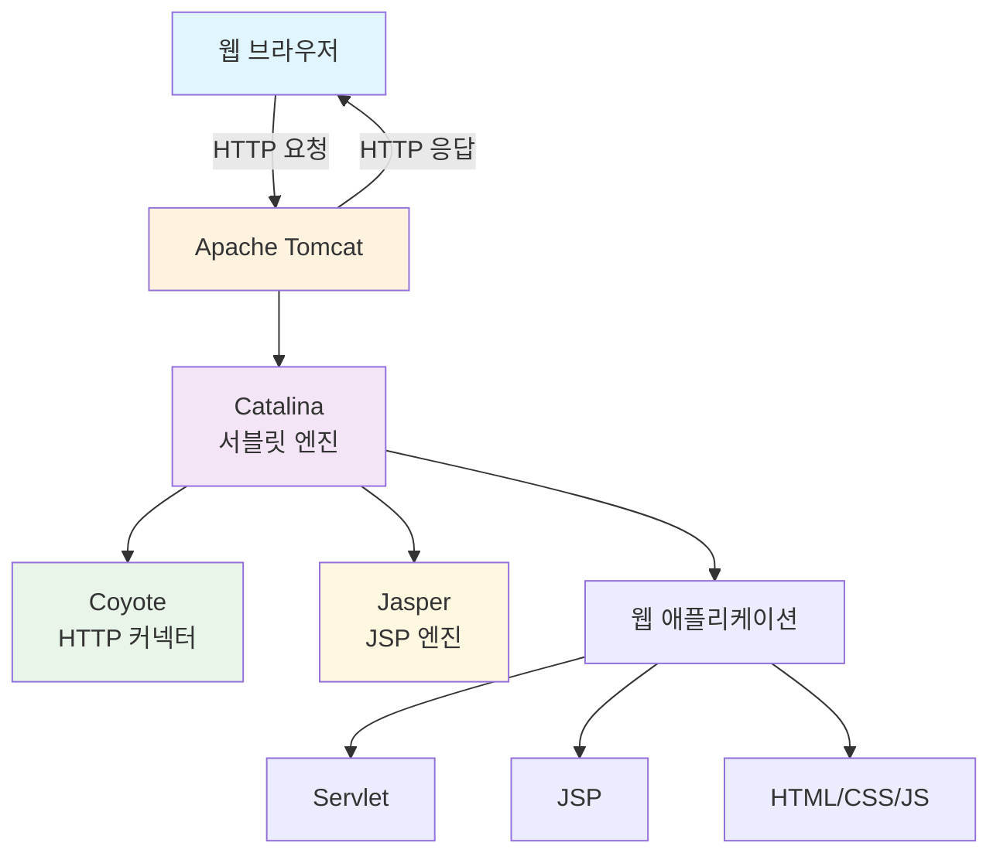
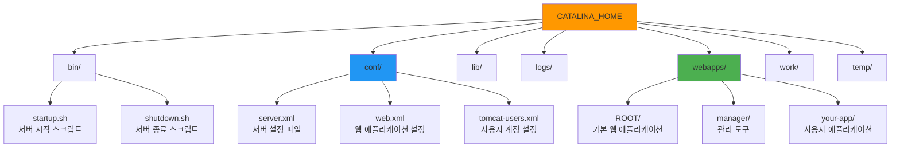
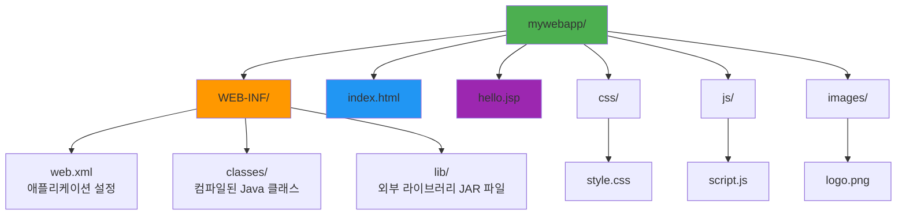

# Apache Tomcat 완벽 가이드 🚀

## 📋 목차
1. [Apache Tomcat이란?](#apache-tomcat이란)
2. [주요 특징](#주요-특징)
3. [시스템 아키텍처](#시스템-아키텍처)
4. [설치 및 설정](#설치-및-설정)
5. [기본 구성 요소](#기본-구성-요소)
6. [실습 예제](#실습-예제)
7. [트러블슈팅](#트러블슈팅)

---

## Apache Tomcat이란? 🤔

Apache Tomcat은 **웹 서버**와 **서블릿 컨테이너**의 역할을 하는 오픈소스 소프트웨어입니다.

### 쉬운 비유로 이해하기
- **식당**으로 비유하면, Tomcat은 **주방장**입니다
- **손님(브라우저)**이 **주문(HTTP 요청)**을 하면
- **주방장(Tomcat)**이 **요리(Java 웹 애플리케이션)**를 만들어
- **서빙(HTTP 응답)**해주는 역할을 합니다

---

## 주요 특징 ✨

| 특징 | 설명 |
|------|------|
| **경량성** | 가볍고 빠른 성능 |
| **표준 준수** | Java EE 표준을 완벽 지원 |
| **무료** | 완전한 오픈소스 |
| **안정성** | 전 세계에서 검증된 안정성 |
| **확장성** | 다양한 플러그인과 확장 가능 |

---

## 시스템 아키텍처 🏗️



### 핵심 구성 요소 설명

1. **Catalina** 🐱
   - Tomcat의 핵심 서블릿 엔진
   - Java 코드를 실행하는 "두뇌" 역할

2. **Coyote** 🐺  
   - HTTP 요청을 받고 응답을 보내는 "문지기" 역할
   - 다양한 프로토콜 지원 (HTTP/1.1, HTTP/2, AJP)

3. **Jasper** 🌸
   - JSP 파일을 Java 코드로 변환하는 "번역가" 역할

---

## 설치 및 설정 ⚙️

### 1. 다운로드
```bash
# 공식 사이트에서 다운로드
# https://tomcat.apache.org/download-10.cgi
wget https://downloads.apache.org/tomcat/tomcat-10/v10.1.x/bin/apache-tomcat-10.1.x.tar.gz
```

### 2. 압축 해제 및 설치
```bash
# 압축 파일 해제 (파일을 풀어내는 작업)
tar -xzf apache-tomcat-10.1.x.tar.gz

# 적절한 위치로 이동 (프로그램을 원하는 폴더에 배치)
sudo mv apache-tomcat-10.1.x /opt/tomcat

# 실행 권한 부여 (프로그램이 실행될 수 있도록 허가)
sudo chmod +x /opt/tomcat/bin/*.sh
```

### 3. 환경변수 설정
```bash
# ~/.bashrc 파일에 추가
export CATALINA_HOME=/opt/tomcat    # Tomcat 설치 경로를 시스템에 알려줌
export JAVA_HOME=/usr/lib/jvm/java-11-openjdk    # Java 위치를 시스템에 알려줌
export PATH=$PATH:$CATALINA_HOME/bin    # Tomcat 명령어를 어디서든 사용 가능하게 함
```

### 4. 서비스 시작
```bash
# Tomcat 서버 시작 (식당 문을 여는 것)
$CATALINA_HOME/bin/startup.sh

# 또는 직접 실행
$CATALINA_HOME/bin/catalina.sh run
```

---

## 기본 구성 요소 🔧

### 폴더 구조


### 주요 설정 파일

#### server.xml (서버의 기본 설정)
```xml
<!-- 포트 8080에서 HTTP 요청을 받겠다는 설정 -->
<Connector port="8080" 
           protocol="HTTP/1.1" 
           connectionTimeout="20000" 
           redirectPort="8443" />

<!-- 가상 호스트 설정 (도메인별로 다른 애플리케이션 실행) -->
<Host name="localhost" 
      appBase="webapps"
      unpackWARs="true" 
      autoDeploy="true">
</Host>
```

#### web.xml (웹 애플리케이션의 공통 설정)
```xml
<!-- 모든 JSP 파일을 JSP 서블릿으로 처리하겠다는 설정 -->
<servlet-mapping>
    <servlet-name>jsp</servlet-name>
    <url-pattern>*.jsp</url-pattern>
</servlet-mapping>

<!-- 기본 페이지 설정 (주소창에 파일명 없이 접속했을 때 보여줄 페이지) -->
<welcome-file-list>
    <welcome-file>index.html</welcome-file>
    <welcome-file>index.jsp</welcome-file>
</welcome-file-list>
```

---

## 실습 예제 💻

### 1. 간단한 서블릿 만들기

```java
// HelloServlet.java
import javax.servlet.*;           // 서블릿 관련 기본 클래스들을 사용하기 위해 import
import javax.servlet.http.*;      // HTTP 관련 서블릿 클래스들을 사용하기 위해 import
import java.io.*;                 // 입출력 관련 클래스들을 사용하기 위해 import

// @WebServlet: 이 클래스가 서블릿이며, "/hello" 주소로 접근 가능하다고 알려줌
@WebServlet("/hello")
public class HelloServlet extends HttpServlet {
    
    // doGet: GET 방식으로 요청이 왔을 때 실행되는 메서드
    protected void doGet(HttpServletRequest request, HttpServletResponse response) 
            throws ServletException, IOException {
        
        // 응답의 콘텐츠 타입을 HTML로 설정하고, 한글 깨짐 방지를 위해 UTF-8 인코딩 설정
        response.setContentType("text/html;charset=UTF-8");
        
        // 웹 페이지에 글을 쓸 수 있는 도구(PrintWriter) 가져오기
        PrintWriter out = response.getWriter();
        
        // HTML 페이지 작성 시작
        out.println("<html>");
        out.println("<head><title>Hello Servlet</title></head>");
        out.println("<body>");
        out.println("<h1>안녕하세요! 첫 번째 서블릿입니다.</h1>");
        out.println("<p>현재 시간: " + new java.util.Date() + "</p>");
        out.println("</body>");
        out.println("</html>");
    }
}
```

### 2. JSP 페이지 만들기

```jsp
<!-- hello.jsp -->
<%-- JSP 페이지의 기본 설정: 한글 사용, HTML 형태로 출력 --%>
<%@ page contentType="text/html;charset=UTF-8" language="java" %>

<!DOCTYPE html>
<html>
<head>
    <title>Hello JSP</title>
</head>
<body>
    <h1>JSP로 만든 첫 번째 페이지</h1>
    
    <%-- Java 코드를 JSP 안에서 실행하기 (스크립틀릿) --%>
    <% 
        String name = "멋쟁이사자처럼";  // 변수 선언
        int count = 10;                  // 숫자 변수 선언
    %>
    
    <%-- 변수 값을 HTML에 출력하기 (표현식) --%>
    <p>안녕하세요, <%= name %>!</p>
    <p>방문자 수: <%= count %></p>
    
    <%-- 조건문 사용하기 --%>
    <% if(count > 5) { %>
        <p style="color: blue;">많은 방문자가 있네요!</p>
    <% } else { %>
        <p style="color: red;">방문자가 적습니다.</p>
    <% } %>
    
    <%-- 반복문으로 목록 만들기 --%>
    <h3>숫자 목록:</h3>
    <ul>
        <% for(int i = 1; i <= 5; i++) { %>
            <li>번호 <%= i %></li>
        <% } %>
    </ul>
</body>
</html>
```

### 3. 웹 애플리케이션 구조



---

## 트러블슈팅 🔍

### 자주 발생하는 문제와 해결책

#### 1. 포트 충돌 문제
```bash
# 문제: Address already in use: bind 에러
# 해결: 사용 중인 포트 확인 및 종료

# 8080 포트를 사용하는 프로세스 찾기
netstat -tulpn | grep 8080

# 해당 프로세스 종료
sudo kill -9 [프로세스ID]

# 또는 Tomcat 설정에서 다른 포트 사용
# server.xml에서 Connector port="8090"으로 변경
```

#### 2. 메모리 부족 문제
```bash
# catalina.sh 파일에 JVM 옵션 추가
export JAVA_OPTS="-Xms512m -Xmx1024m -XX:PermSize=256m -XX:MaxPermSize=512m"

# -Xms: 시작 메모리 크기
# -Xmx: 최대 메모리 크기  
# -XX:PermSize: 영구 저장소 초기 크기
# -XX:MaxPermSize: 영구 저장소 최대 크기
```

#### 3. 한글 깨짐 문제
```xml
<!-- server.xml의 Connector에 URIEncoding 추가 -->
<Connector port="8080" 
           protocol="HTTP/1.1"
           URIEncoding="UTF-8"
           connectionTimeout="20000" 
           redirectPort="8443" />
```

### 로그 확인하기
```bash
# Tomcat 로그 실시간 확인
tail -f $CATALINA_HOME/logs/catalina.out

# 특정 날짜의 로그 확인
cat $CATALINA_HOME/logs/catalina.2024-01-15.log
```

---

## 성능 최적화 팁 ⚡

### 1. 커넥터 튜닝
```xml
<Connector port="8080" 
           protocol="HTTP/1.1"
           maxConnections="200"     <!-- 최대 동시 연결 수 -->
           maxThreads="100"         <!-- 최대 처리 스레드 수 -->
           minSpareThreads="10"     <!-- 최소 대기 스레드 수 -->
           acceptCount="50"         <!-- 대기 큐 크기 -->
           connectionTimeout="20000" />
```

### 2. JVM 튜닝
```bash
export JAVA_OPTS="-server -Xms2g -Xmx4g -XX:NewRatio=3 -XX:+UseG1GC"

# -server: 서버 모드로 실행 (최적화 우선)
# -Xms2g: 시작 힙 메모리 2GB
# -Xmx4g: 최대 힙 메모리 4GB  
# -XX:NewRatio=3: Young:Old 영역 비율 1:3
# -XX:+UseG1GC: G1 가비지 컬렉터 사용
```

---

## 보안 설정 🔒

### 1. 관리자 계정 설정
```xml
<!-- tomcat-users.xml -->
<tomcat-users>
  <!-- 관리자 역할 정의 -->
  <role rolename="admin-gui"/>
  <role rolename="manager-gui"/>
  
  <!-- 관리자 사용자 생성 (강력한 비밀번호 사용 필수!) -->
  <user username="admin" 
        password="강력한비밀번호123!" 
        roles="admin-gui,manager-gui"/>
</tomcat-users>
```

### 2. 불필요한 기본 앱 제거
```bash
# 보안을 위해 기본 예제 애플리케이션 삭제
rm -rf $CATALINA_HOME/webapps/docs
rm -rf $CATALINA_HOME/webapps/examples
rm -rf $CATALINA_HOME/webapps/host-manager
```

---

## 마무리 🎯

Apache Tomcat은 Java 웹 개발의 핵심 도구입니다. 이 가이드를 통해 기본적인 설치부터 실제 웹 애플리케이션 개발까지의 전 과정을 이해하실 수 있을 것입니다.

### 다음 단계 학습 로드맵
1. **Spring Framework** 학습
2. **데이터베이스 연동** (JDBC, JPA)
3. **RESTful API** 개발
4. **Docker**를 이용한 배포
5. **클라우드 서비스** 연동

### 유용한 참고 자료
- [Apache Tomcat 공식 문서](https://tomcat.apache.org/tomcat-10.0-doc/)
- [Oracle Java 튜토리얼](https://docs.oracle.com/javase/tutorial/)
- [Spring 공식 가이드](https://spring.io/guides)

---

**🚀 Happy Coding! 멋쟁이사자처럼과 함께 성장해요!**
