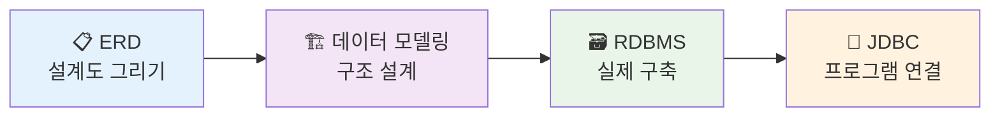
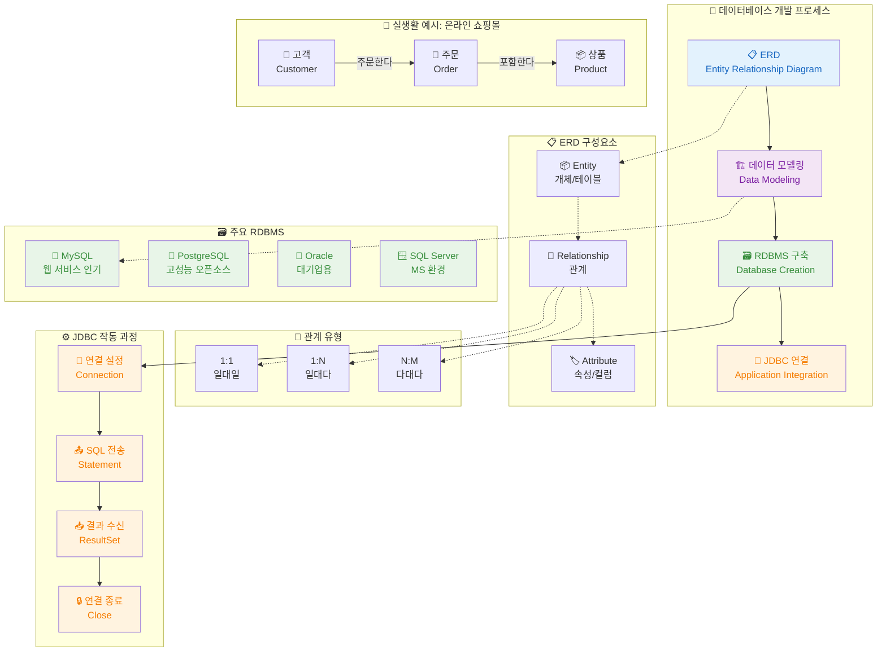

# DB 관리 도구 및 클라우드 서비스 가이드

# 📊 데이터베이스 핵심 개념 가이드

## 🏗️ 데이터 모델링 (Data Modeling)

> **"집을 짓기 전에 설계도를 그리는 것처럼, 데이터베이스를 만들기 전에 데이터의 구조를 설계하는 과정"**

### 📝 쉬운 비유
- **설계도면**: 집을 짓기 전 건축사가 그리는 도면
- **요리 레시피**: 요리하기 전 재료와 순서를 정리하는 것
- **조직도**: 회사의 부서와 직급 구조를 정리하는 것

### 🎯 데이터 모델링이 하는 일
1. **데이터 정리**: 어떤 정보들이 필요한지 파악
2. **관계 설정**: 데이터들 간의 연결고리 찾기
3. **구조 설계**: 효율적으로 저장할 방법 계획
4. **규칙 정하기**: 데이터 입력/수정 시 지켜야 할 규칙

### 💡 실생활 예시: 온라인 쇼핑몰
```
고객 정보: 이름, 전화번호, 주소, 이메일
상품 정보: 상품명, 가격, 재고, 카테고리
주문 정보: 주문일, 수량, 배송지
→ 이들 간의 관계: 누가(고객) 무엇을(상품) 언제(주문일) 샀는가?
```

---

## 🗃️ RDBMS (Relational Database Management System)

> **"관계형 데이터베이스 관리 시스템" - 데이터를 표(테이블) 형태로 저장하고 관리하는 소프트웨어**

### 📊 쉬운 비유
- **엑셀의 고급 버전**: 여러 개의 엑셀 시트가 서로 연결되어 있는 형태
- **도서관 시스템**: 책들이 카테고리별로 정리되고, 대출 기록이 연결되어 관리
- **은행 시스템**: 계좌, 고객, 거래내역이 모두 연결되어 관리

### 🏢 주요 특징
- **표 형태**: 행(Row)과 열(Column)으로 데이터 저장
- **관계 연결**: 여러 표들이 서로 연결되어 정보 공유
- **SQL 언어**: 데이터를 다루는 전용 언어 사용
- **ACID 원칙**: 안전하고 정확한 데이터 처리 보장

### 🛠️ 대표적인 RDBMS
| 제품 | 특징 | 주요 사용처 |
|------|------|-------------|
| **MySQL** | 무료, 웹 서비스에 인기 | 쇼핑몰, 블로그, 중소기업 |
| **PostgreSQL** | 고성능, 다양한 기능 | 스타트업, 분석 시스템 |
| **Oracle** | 대기업용, 안정성 최고 | 은행, 대기업, 정부기관 |
| **SQL Server** | 마이크로소프트 제품 | 윈도우 환경, 기업 시스템 |

---

## 🌉 JDBC (Java Database Connectivity)

> **"자바 프로그램과 데이터베이스를 연결하는 다리" - 자바에서 DB에 접근할 수 있게 해주는 기술**

### 🔌 쉬운 비유
- **USB 케이블**: 컴퓨터와 휴대폰을 연결하는 케이블
- **번역기**: 자바어를 데이터베이스어로 번역해주는 통역사
- **전화선**: 자바 프로그램이 데이터베이스에 전화를 걸 수 있게 해주는 선

### ⚙️ JDBC의 역할
1. **연결 설정**: 자바 프로그램 ↔ 데이터베이스 연결
2. **명령 전달**: SQL 명령어를 데이터베이스에 전송
3. **결과 받기**: 데이터베이스의 응답을 자바로 가져오기
4. **연결 관리**: 안전하게 연결을 열고 닫기

### 💻 간단한 작동 원리
```
1. 자바 프로그램: "고객 정보 좀 보여줘"
2. JDBC: SQL로 번역 → "SELECT * FROM customers"
3. 데이터베이스: 고객 정보 찾아서 전달
4. JDBC: 자바가 이해할 수 있는 형태로 변환
5. 자바 프로그램: 받은 정보로 화면에 표시
```

---

## 📋 ERD (Entity Relationship Diagram)

> **"개체 관계 다이어그램" - 데이터베이스의 구조를 그림으로 나타낸 설계도**

### 🎨 쉬운 비유
- **지하철 노선도**: 역(테이블)들이 어떻게 연결되어 있는지 보여주는 그림
- **가계도**: 가족 구성원들과 그들 간의 관계를 표시한 도표
- **회사 조직도**: 부서와 직급 간의 관계를 나타낸 차트

### 🧩 ERD의 구성 요소

#### 📦 Entity (개체)
- **의미**: 데이터베이스에 저장할 대상
- **표현**: 사각형으로 표시
- **예시**: 고객, 상품, 주문, 직원

#### 🔗 Relationship (관계)
- **의미**: 개체들 간의 연결 관계
- **표현**: 마름모로 표시
- **예시**: 고객이 상품을 '주문한다', 직원이 부서에 '소속된다'

#### 🏷️ Attribute (속성)
- **의미**: 개체가 가진 특성이나 정보
- **표현**: 타원형으로 표시
- **예시**: 고객의 이름/전화번호, 상품의 가격/재고

### 📊 관계의 종류
| 관계 | 설명 | 실생활 예시 |
|------|------|-------------|
| **1:1** | 일대일 관계 | 사람 ↔ 주민등록번호 |
| **1:N** | 일대다 관계 | 부모 ↔ 자녀들 |
| **N:M** | 다대다 관계 | 학생들 ↔ 수업들 |

---

## 🔄 전체 연결 관계



## 🎯 실무에서의 활용 순서

1. **📋 ERD 작성**: "어떤 데이터를 어떻게 연결할까?" 그림으로 계획
2. **🏗️ 데이터 모델링**: "실제로 어떻게 구현할까?" 구체적인 설계
3. **🗃️ RDBMS 구축**: "MySQL? PostgreSQL?" 실제 데이터베이스 생성
4. **🌉 JDBC 연결**: "자바 프로그램에서 어떻게 사용할까?" 코드 작성

---

## 💡 핵심 요약

| 개념 | 한 줄 요약 | 비유 |
|------|------------|------|
| **데이터 모델링** | 데이터 구조를 설계하는 과정 | 🏗️ 집 설계도 그리기 |
| **RDBMS** | 관계형 데이터베이스 관리 소프트웨어 | 📚 고급 도서관 시스템 |
| **JDBC** | 자바와 DB를 연결하는 기술 | 🔌 컴퓨터-휴대폰 연결 케이블 |
| **ERD** | 데이터베이스 구조를 그림으로 표현 | 🚇 지하철 노선도 |

**기억하세요**: 이 모든 것들은 **"데이터를 체계적이고 효율적으로 관리하자!"** 라는 하나의 목표를 위한 도구들입니다! 🎯


## 📊 DB 관리 도구

### DBeaver
> **"DB계의 엑셀"** - 여러 DB를 하나의 GUI로 통합 관리

**특징**
- 🎯 **시각적 관리**: SQL 없이도 클릭만으로 데이터 조작
- 🔗 **통합 툴**: MySQL, PostgreSQL 등 다양한 DB 엔진 지원
- 💰 **오픈소스**: 무료 사용 가능
- 🛠️ **기능**: 데이터 읽기, 쓰기, 수정을 GUI로 간편하게

### Supabase
> **"PostgreSQL 기반 백엔드 서비스 플랫폼"**

**특징**
- 🌐 **웹 기반**: 브라우저에서 DB 관리
- ⚡ **즉시 사용**: 별도 서버 설정 없이 API 제공
- 🐘 **PostgreSQL 최적화**: PostgreSQL에 특화된 관리 도구
- 🔄 **DBeaver 연동**: DBeaver로 Supabase DB 접근 가능
- 💡 **라이선스**: 오픈소스이지만 웹 서비스 이용 시 유료

---

## ☁️ 클라우드 서비스 분류

### IaaS (Infrastructure as a Service)
> **"디지털 땅을 임대받는 개념"**

**특징**
- 🏗️ **직접 구성**: 서버 인프라를 사용자가 직접 설치/구성
- 🔧 **높은 자유도**: 모든 것을 커스터마이징 가능
- 😰 **높은 난이도**: 설정과 관리가 복잡
- 📍 **대표 서비스**: AWS EC2

### PaaS (Platform as a Service)
> **"미리 준비된 부품을 조립하는 개념"**

**특징**
- 🎁 **미리 세팅**: 특정 프로그램이 이미 구성된 상태
- 🚀 **즉시 사용**: 바로 활용 가능한 템플릿 제공
- 🛍️ **부분 제품**: 최종 완성품이 아닌 구성 요소
- 📍 **대표 서비스**: AWS RDS, ElasticCache, OpenSearch

#### 1. 개념 정리

| 구분       | 풀네임                         | 정의                                  | 제공 범위                 | 사용자 역할                       |
| -------- | --------------------------- | ----------------------------------- | --------------------- | ---------------------------- |
| **IaaS** | Infrastructure as a Service | 서버·스토리지·네트워크 등 **인프라**를 빌려주는 서비스    | 하드웨어 + 가상화 환경         | OS 설치, 앱 배포, 보안 설정 등 직접 해야 함 |
| **PaaS** | Platform as a Service       | 앱 개발에 필요한 \*\*플랫폼(환경)\*\*을 빌려주는 서비스 | 인프라 + OS + 런타임 + 미들웨어 | 코드 작성과 앱 개발에만 집중 가능          |
| **SaaS** | Software as a Service       | 완성된 **소프트웨어**를 빌려 쓰는 서비스            | 인프라 + 플랫폼 + 애플리케이션    | 그냥 로그인해서 사용                  |

#### 2. 비유로 이해하기

| 구분       | 비유                  | 설명                           |
| -------- | ------------------- | ---------------------------- |
| **IaaS** | 🏗 **빈 땅 + 건축 자재**  | 땅과 자재는 제공하지만 집은 직접 지어야 함     |
| **PaaS** | 🏢 **인테리어까지 끝난 건물** | 건물 구조와 인테리어는 완성, 가구 배치만 하면 됨 |
| **SaaS** | 🏠 **풀옵션 원룸**       | 가방만 들고 바로 입주 가능              |

#### 3. 서비스 예시

| 구분       | 대표 예시                                        |
| -------- | -------------------------------------------- |
| **IaaS** | AWS EC2, Google Compute Engine, Azure VM     |
| **PaaS** | AWS RDS, Google App Engine, Heroku, Supabase |
| **SaaS** | Gmail, Slack, Notion, Zoom                   |


#### 4. 한 줄 요약

IaaS → “서버 직접 만들 사람”

PaaS → “개발만 하고 싶은 사람”

SaaS → “그냥 써야 하는 사람”


---

## 🏪 클라우드 서비스 플랫폼 비교

| 플랫폼 | 컨셉 | 특화 분야 | 대표 서비스 | 가격 모델 |
|--------|------|-----------|-------------|-----------|
| **🔶 AWS** | 🏪 종합 철물점 | 모든 분야 | EC2, RDS, Lambda 등 | Pay-as-you-go |
| **🟢 Supabase** | 🚀 백엔드 올인원 | 풀스택 개발 | PostgreSQL, Auth, API | Free tier + 유료 |
| **🔷 Aiven** | 🗄️ 데이터 전문점 | 데이터 처리 | MySQL, PostgreSQL, ElasticSearch | 관리형 서비스 |
| **🟣 Render** | 🌐 웹 서비스 다이소 | 웹 애플리케이션 | Docker 배포, PostgreSQL | 단순 가격제 |

### 플랫폼별 상세 특징

#### 🔶 AWS (Amazon Web Services)
- **장점**: 가장 다양한 서비스 제공, 높은 안정성, 글로벌 인프라
- **단점**: 선택지가 많아 복잡함, 러닝 커브 가파름, 비용 예측 어려움
- **적합한 경우**: 대규모 엔터프라이즈, 복잡한 인프라 요구사항
- **특징**: 업계 표준, 모든 것이 가능하지만 전문 지식 필요

#### 🟢 Supabase
- **장점**: Firebase 대안, 실시간 기능, 쉬운 시작, SQL 지원
- **단점**: PostgreSQL에만 의존, 상대적으로 신생 서비스
- **적합한 경우**: 빠른 프로토타이핑, 개인/스타트업 프로젝트, React/Next.js 프로젝트
- **특징**: 개발자 친화적, 백엔드 개발 시간 대폭 단축

#### 🔷 Aiven
- **장점**: 데이터 관련 서비스에 최적화, 멀티 클라우드 지원, 전문성
- **단점**: 웹 서비스 기능은 제한적, 상대적으로 높은 비용
- **적합한 경우**: 데이터 중심 애플리케이션, 분석 워크로드, 검색 엔진
- **특징**: 관리형 오픈소스 데이터베이스 전문

#### 🟣 Render
- **장점**: 웹 애플리케이션 배포가 간단, 직관적 UI, 합리적 가격
- **단점**: 서비스 범위가 상대적으로 제한적, 고급 기능 부족
- **적합한 경우**: 간단한 웹 서비스, 프로토타입, 개인 프로젝트
- **특징**: Heroku의 대안, 개발자 경험 중시

---

## 🔗 연결 관계 및 선택 가이드

```
🦫 DBeaver (GUI 도구)
    ↓ 접근
🟢 Supabase PostgreSQL (PaaS)
    ↓ 호스팅
클라우드 인프라 (🔶AWS/🔷Aiven/🟣Render 등)
```

### 🎯 프로젝트별 추천 조합

| 프로젝트 유형 | 추천 조합 | 이유 |
|--------------|-----------|------|
| **🚀 스타트업 MVP** | Supabase + DBeaver | 빠른 개발, 무료 시작 가능 |
| **💼 엔터프라이즈** | AWS RDS + DBeaver | 확장성, 보안, 다양한 옵션 |
| **📊 데이터 분석** | Aiven + DBeaver | 데이터 처리 최적화 |
| **🌐 간단한 웹앱** | Render + DBeaver | 쉬운 배포, 합리적 가격 |

**핵심 포인트**: 각 도구와 서비스는 프로젝트의 성격, 예산, 팀의 기술 수준에 맞게 선택하는 것이 중요합니다!

```mermaid

graph TD
    A[Database Engines] --> B[MySQL]
    A --> C[PostgreSQL]
    A --> D[기타 DB]
    
    E[🦫 DBeaver<br/>GUI 관리 도구] --> A
    E --> F[시각적 데이터 조작]
    E --> G[SQL 없이 클릭으로 관리]
    
    H[🟢 Supabase] --> C
    H --> I[웹 기반 DB 관리]
    H --> J[API 자동 제공]
    H --> K[오픈소스 + 유료 서비스]
    
    E -.->|접근 가능| H
    
    L[클라우드 서비스 분류]
    
    M[IaaS<br/>Infrastructure as a Service] --> L
    M --> N[🔶 AWS EC2]
    M --> O[직접 서버 구성]
    M --> P[높은 자유도 + 복잡성]
    
    Q[PaaS<br/>Platform as a Service] --> L
    Q --> R[🔶 AWS RDS]
    Q --> S[ElasticCache]
    Q --> T[OpenSearch]
    Q --> U[미리 세팅된 구성요소]
    Q --> H
    
    V[클라우드 플랫폼 특화]
    
    W[🔶 AWS<br/>종합 철물점] --> V
    W --> X[모든 서비스 제공]
    W --> Y[선택의 복잡성]
    
    Z[🔷 Aiven<br/>데이터 전문점] --> V
    Z --> AA[MySQL, PostgreSQL]
    Z --> AB[ElasticSearch 특화]
    
    AC[🟣 Render<br/>웹 서비스 다이소] --> V
    AC --> AD[Docker 기반 배포]
    AC --> AE[웹 애플리케이션 특화]
    AC --> AF[PostgreSQL PaaS 제공]
    
    AG[🟢 Supabase<br/>백엔드 올인원] --> V
    AG --> AH[Firebase 대안]
    AG --> AI[실시간 기능]
    AG --> AJ[Auth + API + DB]
    
    style E fill:#e1f5fe
    style H fill:#4ade80,color:#fff
    style M fill:#fff3e0
    style Q fill:#e8f5e8
    style W fill:#ff9800,color:#fff
    style Z fill:#1976d2,color:#fff
    style AC fill:#8e24aa,color:#fff
    style AG fill:#4ade80,color:#fff

```    






