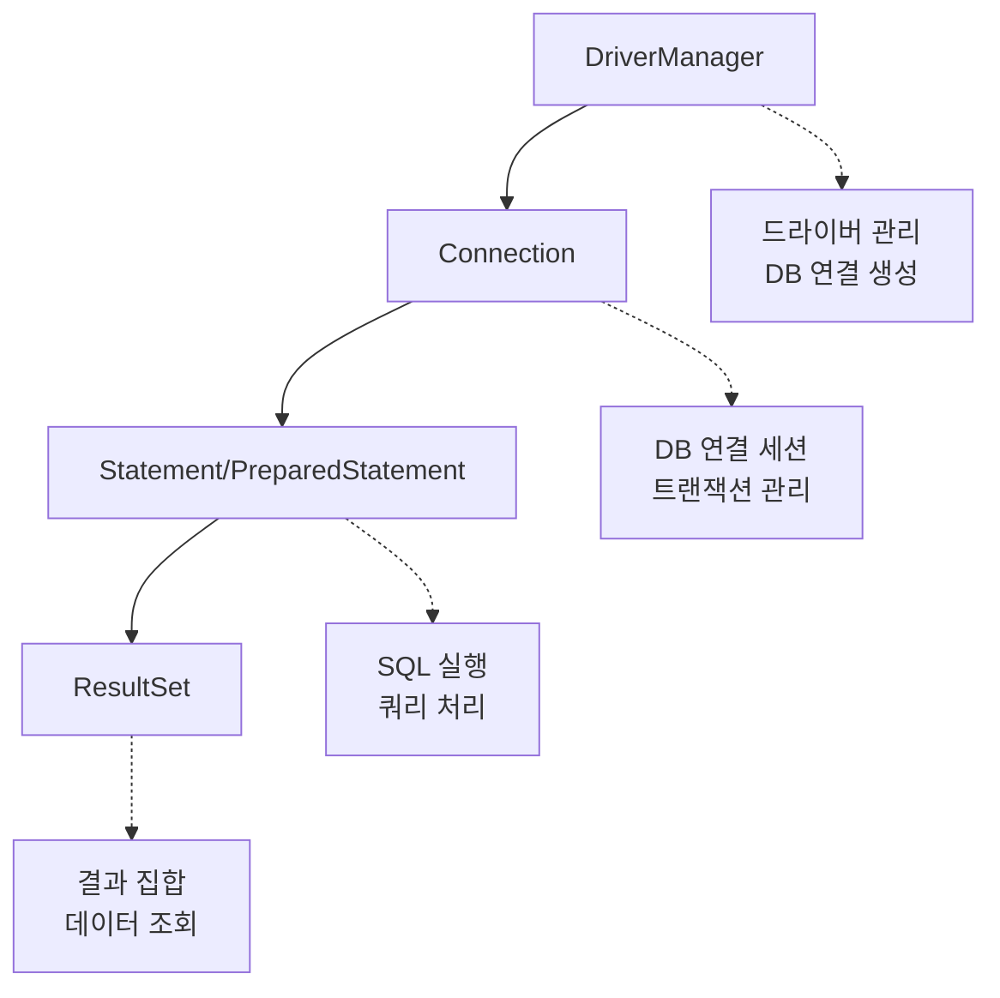
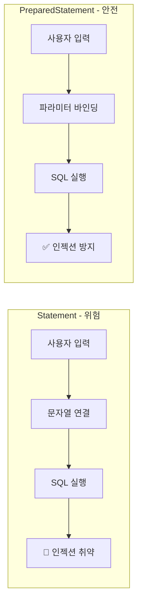
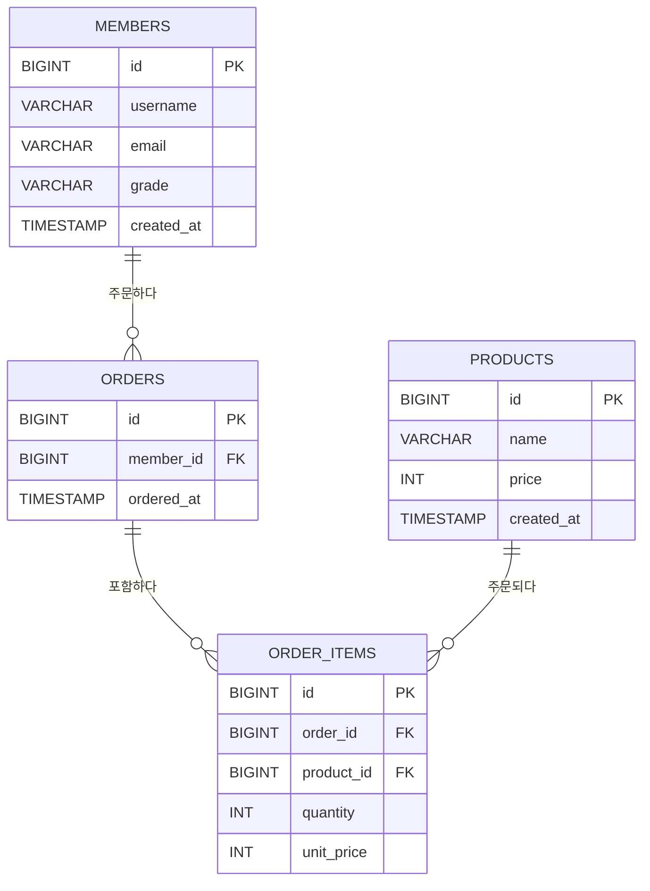
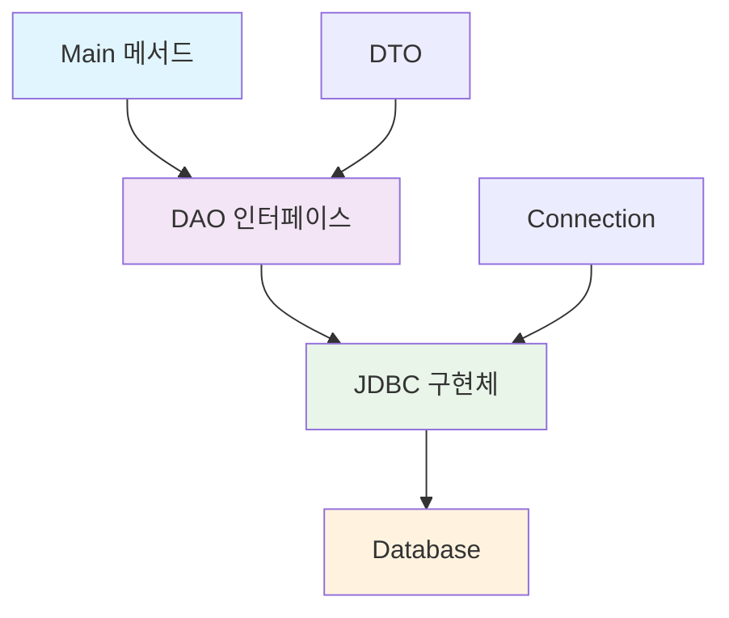
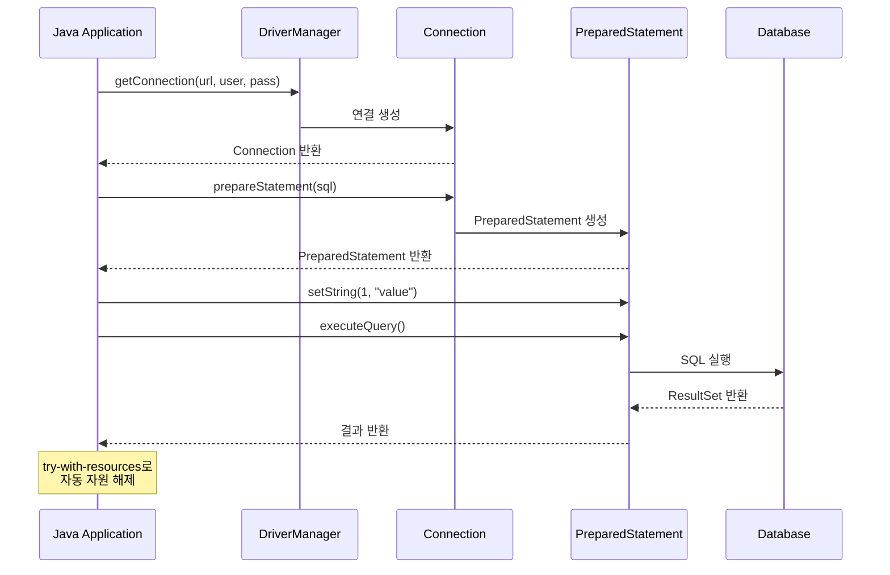
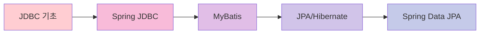

# 🎯 JDBC 학습 가이드 - 8월 18일 실습

> **멋쟁이 사자처럼 14일차** | Java Database Connectivity 완전 정복

## 📚 목차
1. [JDBC란 무엇인가?](#jdbc란-무엇인가)
2. [개발 환경 설정](#개발-환경-설정)
3. [핵심 개념 이해](#핵심-개념-이해)
4. [실습 1: 기본 CRUD 작업](#실습-1-기본-crud-작업)
5. [실습 2: SQL Injection 보안](#실습-2-sql-injection-보안)
6. [실습 3: DAO 패턴 적용](#실습-3-dao-패턴-적용)
7. [실습 4: 복잡한 주문 시스템](#실습-4-복잡한-주문-시스템)
8. [마무리](#마무리)

---

## 🤔 JDBC란 무엇인가?

**JDBC (Java Database Connectivity)**는 자바 프로그램에서 데이터베이스에 연결하고 SQL을 실행할 수 있게 해주는 표준 API입니다.

### 🎯 왜 JDBC를 배워야 할까?

- **데이터베이스 연동**: 자바 애플리케이션이 MySQL, Oracle 등의 DB와 소통
- **SQL 실행**: SELECT, INSERT, UPDATE, DELETE 등 SQL 명령어 실행
- **표준화**: 어떤 데이터베이스를 사용하든 비슷한 방법으로 접근 가능

---

## ⚙️ 개발 환경 설정

### 필요한 도구들
- **Java 17**: 최신 LTS 버전
- **Maven**: 프로젝트 관리 도구
- **MySQL**: 데이터베이스 (Aiven 클라우드 DB 사용)
- **IntelliJ IDEA**: 개발 환경

### Maven 설정 (pom.xml)

```xml
<project xmlns="http://maven.apache.org/POM/4.0.0" 
         xmlns:xsi="http://www.w3.org/2001/XMLSchema-instance"
         xsi:schemaLocation="http://maven.apache.org/POM/4.0.0 
         http://maven.apache.org/xsd/maven-4.0.0.xsd">
    <modelVersion>4.0.0</modelVersion>
    
    <groupId>dev.example</groupId>
    <artifactId>jdbc-demo</artifactId>
    <version>1.0.0</version>
    
    <properties>
        <maven.compiler.source>17</maven.compiler.source>
        <maven.compiler.target>17</maven.compiler.target>
        <project.build.sourceEncoding>UTF-8</project.build.sourceEncoding>
    </properties>
    
    <dependencies>
        <!-- MySQL 드라이버 -->
        <dependency>
            <groupId>com.mysql</groupId>
            <artifactId>mysql-connector-j</artifactId>
            <version>9.4.0</version>
        </dependency>
        
        <!-- 환경변수 관리 -->
        <dependency>
            <groupId>io.github.cdimascio</groupId>
            <artifactId>dotenv-java</artifactId>
            <version>3.2.0</version>
        </dependency>
    </dependencies>
</project>
```

### 환경변수 설정 (.env 파일)

```bash
# Aiven에서 제공한 DB 접속 정보로 교체하세요
DB_URL=jdbc:mysql://<aiven-host>:<port>/<db-name>?allowPublicKeyRetrieval=true
DB_USER=<aiven-user>
DB_PASSWORD=<aiven-password>
```

---

## 🧠 핵심 개념 이해

### JDBC 4대 핵심 객체



### 📝 객체별 역할

| 객체 | 역할 | 주요 메서드 |
|------|------|-------------|
| **DriverManager** | JDBC 드라이버 관리, DB 연결 생성 | `getConnection()` |
| **Connection** | DB 세션 관리, 트랜잭션 제어 | `setAutoCommit()`, `commit()`, `rollback()` |
| **Statement** | SQL 문자열 직접 실행 | `executeUpdate()`, `executeQuery()` |
| **PreparedStatement** | 매개변수 바인딩으로 안전한 SQL 실행 | `setString()`, `setInt()`, `executeQuery()` |
| **ResultSet** | SELECT 결과 집합 순회 | `next()`, `getString()`, `getInt()` |

---

## 🚀 실습 1: 기본 CRUD 작업

### 1단계: 데이터베이스 연결하기

```java
// 필요한 라이브러리들을 불러옵니다
import io.github.cdimascio.dotenv.Dotenv;  // .env 파일을 읽기 위한 라이브러리
import java.sql.*;                         // JDBC 관련 모든 클래스들

public class BasicJDBCDemo {
    public static void main(String[] args) {
        
        // 1️⃣ 환경변수(.env 파일)에서 데이터베이스 접속 정보를 가져옵니다
        // 왜 환경변수를 사용할까? 
        // → 코드에 직접 비밀번호를 적으면 보안에 위험하기 때문입니다!
        Dotenv dotenv = Dotenv.configure()    // Dotenv 설정을 시작
                              .ignoreIfMissing()  // .env 파일이 없어도 에러가 나지 않도록 설정
                              .load();            // .env 파일을 실제로 읽어들임
        
        // .env 파일에서 각각의 값들을 가져와서 변수에 저장
        String url = dotenv.get("DB_URL");      // 데이터베이스 주소 (어디에 연결할지)
        String user = dotenv.get("DB_USER");    // 사용자 이름 (누구로 로그인할지)
        String pass = dotenv.get("DB_PASSWORD"); // 비밀번호 (어떤 비밀번호로 로그인할지)
        
        // 2️⃣ try-with-resources 구문으로 데이터베이스에 연결합니다
        // 이 구문을 사용하면 블록이 끝날 때 자동으로 연결을 끊어줍니다 (매우 중요!)
        try (Connection conn = DriverManager.getConnection(url, user, pass)) {
            /*
             * DriverManager.getConnection()의 역할:
             * - MySQL 드라이버를 찾아서 로드
             * - 주어진 URL, 사용자명, 비밀번호로 데이터베이스에 연결
             * - 성공하면 Connection 객체를 반환
             */
            
            System.out.println("✅ 데이터베이스 연결 성공!");
            
            // 여기서 실제 SQL 작업들을 수행합니다
            // (테이블 생성, 데이터 삽입, 조회 등)
            
        } catch (SQLException e) {
            // 데이터베이스 연결이나 SQL 실행 중 문제가 발생했을 때 실행됩니다
            System.err.println("❌ 연결 실패: " + e.getMessage());
            e.printStackTrace(); // 자세한 에러 정보를 출력
        }
        
        // try-with-resources 덕분에 여기서 자동으로 conn.close()가 호출됩니다!
    }
}
```

### 2단계: 테이블 생성 (DDL)

```java
// 3️⃣ 트랜잭션을 수동으로 관리하기 위해 자동 커밋을 끕니다
// autoCommit이 true이면 SQL 하나 실행할 때마다 바로 저장됩니다
// false로 설정하면 우리가 직접 commit()을 호출해야 저장됩니다
conn.setAutoCommit(false);

// 4️⃣ DDL(Data Definition Language): 테이블의 구조를 정의하는 SQL
// CREATE, DROP, ALTER 등이 DDL에 속합니다
try (Statement st = conn.createStatement()) {
    /*
     * Statement 객체는 SQL 문자열을 그대로 실행하는 도구입니다
     * - DDL처럼 고정된 SQL을 실행할 때 주로 사용
     * - 사용자 입력이 들어가는 곳에는 사용하면 안됩니다 (보안 위험!)
     */
    
    // 기존에 같은 이름의 테이블이 있다면 삭제합니다
    // IF EXISTS를 붙이면 테이블이 없어도 에러가 나지 않습니다
    st.executeUpdate("DROP TABLE IF EXISTS members");
    
    // 새로운 members 테이블을 생성합니다
    st.executeUpdate("""
        CREATE TABLE members (
            id BIGINT PRIMARY KEY AUTO_INCREMENT,        -- 자동 증가하는 고유 번호 (기본키)
            name VARCHAR(100) NOT NULL,                  -- 이름 (최대 100글자, 필수)
            email VARCHAR(200) NOT NULL UNIQUE,          -- 이메일 (최대 200글자, 필수, 중복 불가)
            created_at TIMESTAMP DEFAULT CURRENT_TIMESTAMP  -- 생성 시간 (자동으로 현재 시간 입력)
        )
    """);
    
    /*
     * executeUpdate() 메서드:
     * - INSERT, UPDATE, DELETE, CREATE, DROP 등에 사용
     * - 영향받은 행의 수를 int로 반환 (CREATE, DROP은 0 반환)
     * - SELECT에는 사용할 수 없음 (SELECT는 executeQuery() 사용)
     */
    
    System.out.println("✅ 테이블 생성 완료!");
}
```

### 3단계: 데이터 삽입 (DML)

```java
// 5️⃣ DML(Data Manipulation Language): 데이터를 조작하는 SQL
// INSERT, UPDATE, DELETE가 DML에 속합니다
try (Statement st = conn.createStatement()) {
    /*
     * INSERT 문 설명:
     * - INTO members(컬럼명들): 어떤 테이블의 어떤 컬럼에 넣을지 지정
     * - VALUES (값들): 실제로 넣을 데이터들
     * - id는 AUTO_INCREMENT라서 자동으로 1, 2, 3... 이렇게 들어갑니다
     * - created_at은 DEFAULT CURRENT_TIMESTAMP라서 현재 시간이 자동으로 들어갑니다
     */
    
    // 첫 번째 회원 정보 삽입
    st.executeUpdate("INSERT INTO members(name, email) VALUES ('Alice','alice@example.com')");
    
    // 두 번째 회원 정보 삽입  
    st.executeUpdate("INSERT INTO members(name, email) VALUES ('Bob','bob@example.com')");
    
    // 세 번째 회원 정보 삽입
    st.executeUpdate("INSERT INTO members(name, email) VALUES ('Charlie','charlie@example.com')");
    
    /*
     * 왜 여러 번 executeUpdate()를 호출했을까?
     * - 간단한 예시이기 때문입니다
     * - 실무에서는 PreparedStatement의 batch 기능을 사용해서 한 번에 처리합니다
     * - 또는 반복문을 사용해서 더 효율적으로 처리합니다
     */
    
    System.out.println("✅ 데이터 삽입 완료!");
}
```

### 4단계: 데이터 조회 (SELECT)

```java
// 6️⃣ SELECT: 데이터베이스에서 데이터를 조회하는 SQL
// try-with-resources에 Statement와 ResultSet을 모두 선언합니다
try (Statement st = conn.createStatement();
     ResultSet rs = st.executeQuery("SELECT id, name, email, created_at FROM members ORDER BY id")) {
     
    /*
     * executeQuery() vs executeUpdate() 차이점:
     * - executeQuery(): SELECT문에 사용, ResultSet을 반환 (데이터를 가져올 때)
     * - executeUpdate(): INSERT, UPDATE, DELETE, CREATE, DROP에 사용, int를 반환 (데이터를 변경할 때)
     */
    
    System.out.println("\n📋 회원 목록:");
    
    // 7️⃣ ResultSet으로 조회 결과를 하나씩 읽어옵니다
    while (rs.next()) {
        /*
         * rs.next()의 동작 방식:
         * - 처음에는 첫 번째 행 이전을 가리키고 있습니다
         * - next()를 호출하면 다음 행으로 이동합니다
         * - 더 이상 행이 없으면 false를 반환해서 while 루프가 종료됩니다
         * 
         * 데이터 타입별 메서드:
         * - rs.getLong(): BIGINT 컬럼값을 long으로 가져옴
         * - rs.getString(): VARCHAR, TEXT 컬럼값을 String으로 가져옴  
         * - rs.getInt(): INT 컬럼값을 int로 가져옴
         * - rs.getTimestamp(): TIMESTAMP 컬럼값을 Timestamp로 가져옴
         */
        
        // 컬럼 이름으로 데이터를 가져와서 출력합니다
        System.out.printf("ID: %d | 이름: %s | 이메일: %s | 가입일: %s%n",
            rs.getLong("id"),           // id 컬럼의 값을 long으로 가져옴
            rs.getString("name"),       // name 컬럼의 값을 String으로 가져옴
            rs.getString("email"),      // email 컬럼의 값을 String으로 가져옴
            rs.getTimestamp("created_at")); // created_at 컬럼의 값을 Timestamp로 가져옴
        
        /*
         * printf()의 %d, %s, %n 의미:
         * - %d: 정수(decimal) 출력
         * - %s: 문자열(string) 출력  
         * - %n: 줄바꿈 (운영체제에 맞는 줄바꿈 문자)
         */
    }
}

// 8️⃣ 모든 변경사항을 데이터베이스에 실제로 저장합니다
conn.commit();

/*
 * 트랜잭션이란?
 * - 여러 개의 SQL을 하나의 단위로 묶어서 처리하는 것
 * - 모든 SQL이 성공하면 commit()으로 저장
 * - 하나라도 실패하면 rollback()으로 모든 변경사항 취소
 * - 은행 송금을 생각해보세요: 출금과 입금이 모두 성공해야 완료!
 */
```

### 💡 try-with-resources가 뭔가요?

```java
// ❌ 전통적인 방법: 수동으로 자원 해제 (번거롭고 실수하기 쉬움)
Connection conn = null;
try {
    // 데이터베이스 연결
    conn = DriverManager.getConnection(url, user, pass);
    
    // 실제 작업 수행
    // ...
    
} catch (SQLException e) {
    // 에러 처리
    e.printStackTrace();
} finally {
    // 반드시 연결을 끊어야 합니다 (메모리 누수 방지)
    if (conn != null) {
        try {
            conn.close(); // 수동으로 연결 해제
        } catch (SQLException e) {
            e.printStackTrace();
        }
    }
}

// ✅ try-with-resources 방법: 자동으로 자원 해제 (안전하고 간편함)
try (Connection conn = DriverManager.getConnection(url, user, pass)) {
    /*
     * try-with-resources의 장점:
     * 1. 자동 해제: 블록이 끝나면 자동으로 close() 호출
     * 2. 예외 안전성: 에러가 나도 반드시 자원이 해제됨
     * 3. 코드 간소화: finally 블록이 필요 없음
     * 
     * 조건: AutoCloseable 인터페이스를 구현한 객체만 사용 가능
     * → Connection, Statement, ResultSet 모두 이 조건을 만족합니다
     */
    
    // 실제 작업 수행
    // ...
    
} // 여기서 자동으로 conn.close() 호출됨!
// 에러가 발생해도 반드시 close()가 호출되므로 안전합니다
```

---

## 🛡️ 실습 2: SQL Injection 보안

### ⚠️ 위험한 코드: Statement 사용

```java
// 🚨 절대 이렇게 하면 안 되는 위험한 코드입니다!

// 사용자가 입력한 값들 (웹 폼, 콘솔 입력 등에서 온 값)
String username = "admin' OR '1'='1";  // 악의적인 입력!
String password = "anything";

// 위험한 방법: 사용자 입력을 직접 문자열에 붙여서 SQL 만들기
String sql = "SELECT * FROM users WHERE username='" + username + "' AND password='" + password + "'";

/*
 * 실제로 만들어지는 SQL:
 * SELECT * FROM users WHERE username='admin' OR '1'='1' AND password='anything'
 * 
 * 문제점 분석:
 * 1. username='admin' → admin 사용자를 찾거나
 * 2. '1'='1' → 이 조건은 항상 참이므로
 * 3. 결국 모든 사용자 정보가 조회됩니다!
 * 
 * 이것이 바로 SQL Injection 공격입니다!
 * 해커가 로그인 없이도 모든 데이터에 접근할 수 있게 됩니다.
 */

// 위험한 SQL 실행 (실제로는 하면 안 됩니다!)
try (Statement st = conn.createStatement();
     ResultSet rs = st.executeQuery(sql)) {
     
    if (rs.next()) {
        System.out.println("❌ 해킹 성공! 로그인 우회됨: " + rs.getString("username"));
        // 해커가 아무 비밀번호나 입력해도 로그인됩니다!
    }
}
```

### ✅ 안전한 코드: PreparedStatement 사용

```java
// ✅ 이렇게 해야 안전합니다!

// 같은 악의적인 입력
String username = "admin' OR '1'='1";
String password = "anything";

// 안전한 방법: ? 자리표시자(placeholder)를 사용한 SQL
String sql = "SELECT * FROM users WHERE username=? AND password=?";

try (PreparedStatement ps = conn.prepareStatement(sql)) {
    /*
     * PreparedStatement의 동작 원리:
     * 1. SQL 구조를 미리 분석하고 컴파일 (prepare)
     * 2. ? 자리에 들어갈 값들을 별도로 바인딩
     * 3. 데이터베이스가 값을 '데이터'로만 처리, 'SQL 코드'로 인식하지 않음
     */
    
    // 첫 번째 ?에 username 값을 안전하게 바인딩
    ps.setString(1, username);  // 1번째 ? 자리에 username 넣기
    
    // 두 번째 ?에 password 값을 안전하게 바인딩  
    ps.setString(2, password);  // 2번째 ? 자리에 password 넣기
    
    /*
     * setString()이 하는 일:
     * - 문자열 안의 특수문자들을 자동으로 이스케이프 처리
     * - 'admin' OR '1'='1' → 'admin\' OR \'1\'=\'1\' 
     * - 결국 username으로 "admin' OR '1'='1" 라는 이상한 이름을 찾게 됨
     * - 그런 사용자는 없으므로 로그인 실패!
     */
    
    System.out.println("🔒 실행될 SQL: " + sql);
    System.out.println("🔒 파라미터: [" + username + ", ******]");
    
    try (ResultSet rs = ps.executeQuery()) {
        if (rs.next()) {
            System.out.println("✅ 정상 로그인: " + rs.getString("username"));
        } else {
            System.out.println("❌ 로그인 실패 - 해킹 시도가 차단되었습니다!");
        }
    }
}
```

### 🔄 Statement vs PreparedStatement 비교



---

## 🏗️ 실습 3: DAO 패턴 적용

### DAO 패턴이란?
**DAO (Data Access Object)**는 데이터베이스 접근 로직을 별도 클래스로 분리하는 디자인 패턴입니다.

### 📊 데이터베이스 설계



### 1단계: DTO (Data Transfer Object) 정의

```java
// 📦 DTO란 데이터를 담아서 전달하는 상자 같은 객체입니다

/*
 * Java 17의 record 문법:
 * - 예전에는 class를 만들고 getter, setter, equals, hashCode 등을 직접 작성해야 했음
 * - record는 이 모든 것을 자동으로 만들어줍니다!
 * - 불변(immutable) 객체: 한 번 만들어지면 값을 바꿀 수 없어서 안전함
 */

// 회원 정보를 담는 DTO
record Member(Long id, String username, String email, String grade) {
    /*
     * 이 한 줄이 다음과 같은 코드를 자동 생성합니다:
     * - private final Long id; (필드들)
     * - public Long id() { return id; } (getter 메서드들)
     * - public boolean equals(Object o) (동등성 비교)
     * - public int hashCode() (해시코드)
     * - public String toString() (문자열 변환)
     * - 생성자: new Member(1L, "alice", "alice@example.com", "BASIC")
     */
}

// 상품 정보를 담는 DTO  
record Product(Long id, String name, int price) {} // price는 원화 기준 정수

// 주문 헤더 정보를 담는 DTO
record OrderHeader(Long id, Long memberId, Timestamp orderedAt) {}

// 주문 상품 정보를 담는 DTO
record OrderItem(Long id, Long orderId, Long productId, int quantity, int unitPrice) {}

// 주문 요약 정보를 담는 DTO (여러 테이블을 JOIN한 결과)
record OrderSummary(Long orderId, String memberName, int itemCount, int totalAmount, Timestamp orderedAt) {
    /*
     * 이 DTO는 실제 테이블과 1:1 대응되지 않습니다
     * 여러 테이블을 JOIN해서 나온 결과를 담기 위한 용도입니다
     * 예: orders + members + order_items 테이블을 합쳐서 주문 요약 정보 생성
     */
}
```

### 2단계: DAO 인터페이스 정의


```java
// 🏗️ DAO (Data Access Object) 패턴이란?
// 데이터베이스 접근 로직을 별도 클래스로 분리하는 설계 패턴입니다

/*
 * 왜 인터페이스를 먼저 정의할까?
 * 1. 추상화: 구체적인 구현 방법을 숨기고, 무엇을 할 수 있는지만 정의
 * 2. 확장성: 나중에 JDBC → JPA로 바꿔도 인터페이스는 그대로 사용 가능
 * 3. 테스트: 가짜 구현체를 만들어서 테스트하기 쉬움
 */

// 회원 데이터 접근을 담당하는 DAO 인터페이스
interface MemberDAO {
    /*
     * save(): 새로운 회원을 데이터베이스에 저장
     * - Member 객체를 받아서 INSERT 실행
     * - 자동 생성된 ID를 Long으로 반환
     * - Connection을 매개변수로 받는 이유: 트랜잭션 관리를 호출자가 담당
     */
    Long save(Member member, Connection conn) throws SQLException;
    
    /*
     * findById(): ID로 특정 회원 한 명을 찾기
     * - Optional<Member>를 반환하는 이유: 해당 ID의 회원이 없을 수도 있으니까
     * - Optional.empty(): 회원이 없을 때
     * - Optional.of(member): 회원이 있을 때
     */
    Optional<Member> findById(Long id, Connection conn) throws SQLException;
    
    /*
     * findAll(): 모든 회원 목록 가져오기
     * - List<Member>로 반환: 여러 명의 회원을 담은 리스트
     * - 빈 리스트가 반환될 수 있음 (회원이 아무도 없을 때)
     */
    List<Member> findAll(Connection conn) throws SQLException;
}

// 상품 데이터 접근을 담당하는 DAO 인터페이스 (회원 DAO와 구조가 비슷함)
interface ProductDAO {
    Long save(Product product, Connection conn) throws SQLException;
    Optional<Product> findById(Long id, Connection conn) throws SQLException;
    List<Product> findAll(Connection conn) throws SQLException;
}

// 주문 데이터 접근을 담당하는 DAO 인터페이스
interface OrderDAO {
    /*
     * placeOrder(): 주문하기 (복잡한 비즈니스 로직)
     * - memberId: 누가 주문하는지
     * - productIdToQty: 어떤 상품을 몇 개씩 주문하는지 (Map으로 표현)
     *   예: {1L: 2, 3L: 1} → 상품1번을 2개, 상품3번을 1개
     * - 여러 테이블에 데이터를 삽입해야 하므로 트랜잭션 필수!
     */
    Long placeOrder(Long memberId, Map<Long, Integer> productIdToQty, Connection conn) throws SQLException;
    
    /*
     * findOrderSummaries(): 주문 요약 목록 조회 (복잡한 JOIN 쿼리)
     * - 여러 테이블을 JOIN해서 사람이 보기 좋은 형태로 데이터 조합
     * - 주문번호, 주문자명, 주문 상품 개수, 총 금액 등을 한 번에 조회
     */
    List<OrderSummary> findOrderSummaries(Connection conn) throws SQLException;
}
```

### 3단계: DAO 구현체 작성

```java
// 🔧 실제로 JDBC를 사용해서 데이터베이스 작업을 수행하는 구현체

class JdbcMemberDAO implements MemberDAO {
    
    @Override
    public Long save(Member m, Connection conn) throws SQLException {
        // INSERT 후 자동 생성된 ID를 가져오는 SQL
        String sql = "INSERT INTO members(username, email, grade) VALUES(?, ?, ?)";
        
        /*
         * prepareStatement()에 두 번째 매개변수 설명:
         * - Statement.RETURN_GENERATED_KEYS: 자동 증가된 ID 값을 반환하도록 설정
         * - 이 설정이 없으면 INSERT 후에 생성된 ID를 알 수 없습니다
         */
        try (PreparedStatement ps = conn.prepareStatement(sql, Statement.RETURN_GENERATED_KEYS)) {
            
            // ? 자리표시자에 실제 값들을 바인딩 (순서대로 1, 2, 3...)
            ps.setString(1, m.username());  // 첫 번째 ? 자리에 사용자명
            ps.setString(2, m.email());     // 두 번째 ? 자리에 이메일
            ps.setString(3, m.grade());     // 세 번째 ? 자리에 등급
            
            /*
             * executeUpdate() 실행:
             * - INSERT, UPDATE, DELETE에 사용하는 메서드
             * - 영향받은 행의 개수를 int로 반환 (여기서는 1이 반환됨)
             * - SELECT에는 executeQuery()를 사용해야 함!
             */
            ps.executeUpdate();
            
            // 자동 생성된 ID 값을 가져오기
            try (ResultSet rs = ps.getGeneratedKeys()) {
                /*
                 * getGeneratedKeys(): 
                 * - AUTO_INCREMENT로 자동 생성된 키 값들을 ResultSet으로 반환
                 * - 보통 ID 하나만 생성되므로 rs.next() 한 번만 호출
                 * - rs.getLong(1): 첫 번째 컬럼(생성된 ID)을 long으로 가져옴
                 */
                rs.next();
                return rs.getLong(1);  // 생성된 ID 반환
            }
        }
    }
    
    @Override
    public Optional<Member> findById(Long id, Connection conn) throws SQLException {
        // 특정 ID로 회원 한 명을 찾는 SQL
        String sql = "SELECT id, username, email, grade FROM members WHERE id = ?";
        
        try (PreparedStatement ps = conn.prepareStatement(sql)) {
            ps.setLong(1, id);  // ? 자리에 찾고자 하는 ID 값 바인딩
            
            try (ResultSet rs = ps.executeQuery()) {
                /*
                 * 조회 결과 처리:
                 * - rs.next()가 false면 해당 ID의 회원이 없음 → Optional.empty() 반환
                 * - rs.next()가 true면 회원이 존재 → Member 객체로 만들어서 Optional.of()로 감싸서 반환
                 */
                if (!rs.next()) {
                    return Optional.empty();  // 회원이 없을 때
                }
                
                // 회원이 있을 때: ResultSet에서 데이터를 꺼내서 Member 객체 생성
                return Optional.of(new Member(
                    rs.getLong("id"),           // id 컬럼값
                    rs.getString("username"),   // username 컬럼값
                    rs.getString("email"),      // email 컬럼값
                    rs.getString("grade")       // grade 컬럼값
                ));
            }
        }
    }
    
    @Override
    public List<Member> findAll(Connection conn) throws SQLException {
        // 모든 회원을 ID 순으로 정렬해서 가져오는 SQL
        String sql = "SELECT id, username, email, grade FROM members ORDER BY id";
        
        try (PreparedStatement ps = conn.prepareStatement(sql);
             ResultSet rs = ps.executeQuery()) {
             
            /*
             * 여러 행의 결과를 처리하는 방법:
             * 1. 빈 ArrayList 생성
             * 2. while (rs.next()) 루프로 모든 행을 순회
             * 3. 각 행마다 Member 객체를 만들어서 리스트에 추가
             * 4. 완성된 리스트 반환
             */
             
            List<Member> members = new ArrayList<>();  // 회원들을 담을 빈 리스트
            
            while (rs.next()) {  // 다음 행이 있는 동안 반복
                // 현재 행의 데이터로 Member 객체 생성
                Member member = new Member(
                    rs.getLong("id"),
                    rs.getString("username"),
                    rs.getString("email"),
                    rs.getString("grade")
                );
                
                members.add(member);  // 리스트에 추가
            }
            
            return members;  // 모든 회원이 담긴 리스트 반환
        }
    }
}
```


---

## 🎯 실습별 학습 포인트

### 📋 실습 1: 기본 CRUD
**목표**: JDBC 기본 사용법 익히기

**핵심 개념**:
- Database 연결 방법
- try-with-resources로 자원 관리
- DDL, DML, SELECT 기본 실행

**체크포인트**:
- [ ] 데이터베이스 연결 성공
- [ ] 테이블 생성 확인
- [ ] 데이터 삽입/조회 확인

### 🔒 실습 2: SQL Injection 보안
**목표**: 보안 취약점 이해하고 방지하기

**위험한 입력 예시**:
```
username: admin' OR '1'='1
password: anything
```

**학습 포인트**:
- Statement의 보안 위험성
- PreparedStatement의 안전성
- 파라미터 바인딩의 중요성

### 🏛️ 실습 3: DAO 패턴
**목표**: 코드 구조화와 재사용성 향상

**아키텍처 흐름**:



**장점**:
- 코드 재사용성 증가
- 비즈니스 로직과 DB 로직 분리
- 테스트 용이성 향상
- JPA 전환 시 구현체만 교체하면 됨

---

## 🔄 JDBC 실행 흐름



---

## 💡 초보자를 위한 팁

### 🎯 기억해야 할 핵심 3가지

1. **try-with-resources 사용**: 자원 해제를 자동화
2. **PreparedStatement 선택**: 보안과 성능을 위해
3. **트랜잭션 관리**: `setAutoCommit(false)`, `commit()`, `rollback()`

## 💡 초보자를 위한 팁

### 🎯 기억해야 할 핵심 5가지

1. **try-with-resources 사용**: 자원 해제를 자동화
   ```java
   // ✅ 좋은 예시
   try (Connection conn = DriverManager.getConnection(url, user, pass)) {
       // 작업 수행
   } // 자동으로 연결 해제
   ```

2. **PreparedStatement 선택**: 보안과 성능을 위해
   ```java
   // ❌ 위험: Statement + 문자열 연결
   String sql = "SELECT * FROM users WHERE name='" + userName + "'";
   
   // ✅ 안전: PreparedStatement + 파라미터 바인딩
   String sql = "SELECT * FROM users WHERE name=?";
   ps.setString(1, userName);
   ```

3. **트랜잭션 관리**: 데이터 일관성 보장
   ```java
   conn.setAutoCommit(false);  // 수동 트랜잭션 시작
   try {
       // 여러 SQL 작업 수행
       conn.commit();  // 모든 작업 성공 시 저장
   } catch (SQLException e) {
       conn.rollback();  // 실패 시 모든 변경사항 취소
   }
   ```

4. **예외 처리**: SQLException 반드시 처리
   ```java
   // 모든 JDBC 메서드는 SQLException을 던질 수 있음
   try {
       // JDBC 작업
   } catch (SQLException e) {
       e.printStackTrace();  // 에러 정보 출력
       // 필요시 적절한 에러 처리 로직 추가
   }
   ```

5. **올바른 데이터 타입 매칭**:
   ```java
   // 데이터베이스 타입 → Java 타입 매칭
   rs.getLong("id");           // BIGINT → long
   rs.getString("name");       // VARCHAR → String  
   rs.getInt("price");         // INT → int
   rs.getTimestamp("date");    // TIMESTAMP → Timestamp
   ```

### 🚨 자주 하는 실수들과 해결책

| ❌ 실수 | ✅ 해결책 | 📝 설명 |
|---------|-----------|---------|
| Connection을 수동으로 close() | try-with-resources 사용 | 자동으로 자원 해제됨 |
| Statement로 사용자 입력 처리 | PreparedStatement 사용 | SQL Injection 방지 |
| ResultSet에서 next() 없이 접근 | while(rs.next()) 또는 if(rs.next()) | 첫 번째 행으로 이동 후 데이터 접근 |
| executeQuery()와 executeUpdate() 혼동 | SELECT는 Query, 나머지는 Update | Query는 데이터 조회, Update는 데이터 변경 |
| 트랜잭션 관리 누락 | setAutoCommit(false) + commit/rollback | 데이터 일관성 보장 |

### ✅ 좋은 코딩 습관

**1. 의미있는 변수명 사용**
```java
// ❌ 나쁜 예시
String s = "SELECT * FROM m WHERE i = ?";
PreparedStatement p = conn.prepareStatement(s);

// ✅ 좋은 예시  
String findMemberSql = "SELECT * FROM members WHERE id = ?";
PreparedStatement findMemberStmt = conn.prepareStatement(findMemberSql);
```

**2. 주석으로 SQL의 의도 설명**
```java
// 회원 등급별 주문 통계를 조회하는 복잡한 쿼리
String sql = """
    SELECT 
        m.grade,                           -- 회원 등급
        COUNT(DISTINCT o.id) AS order_count,  -- 주문 건수
        SUM(oi.quantity * oi.unit_price) AS total_sales  -- 총 매출액
    FROM members m
        LEFT JOIN orders o ON m.id = o.member_id
        LEFT JOIN order_items oi ON o.id = oi.order_id
    GROUP BY m.grade
    ORDER BY total_sales DESC
""";
```

**3. 에러 상황에 대한 명확한 메시지**
```java
try {
    // JDBC 작업
} catch (SQLException e) {
    // 구체적인 에러 메시지와 함께 로깅
    System.err.println("회원 정보 저장 중 오류 발생: " + e.getMessage());
    System.err.println("SQL State: " + e.getSQLState());
    System.err.println("Error Code: " + e.getErrorCode());
    e.printStackTrace();
}
```

### 🎓 학습 단계별 체크리스트

**🥉 초급 (현재 단계)**
- [ ] 데이터베이스 연결 성공
- [ ] 기본 CRUD 작업 (CREATE, READ, UPDATE, DELETE)
- [ ] try-with-resources 사용법 이해
- [ ] PreparedStatement vs Statement 차이점 이해
- [ ] ResultSet으로 조회 결과 처리

**🥈 중급 (다음 목표)**  
- [ ] 트랜잭션 관리 (commit/rollback)
- [ ] DAO 패턴 구현
- [ ] JOIN 쿼리 작성 및 처리
- [ ] Batch 처리로 성능 최적화
- [ ] 예외 처리 및 로깅

**🥇 고급 (최종 목표)**
- [ ] Connection Pool 사용
- [ ] Spring JDBC Template 활용  
- [ ] JPA/Hibernate 전환
- [ ] 성능 튜닝 및 모니터링
- [ ] 실제 웹 애플리케이션 연동

---

## 🎓 마무리

### 다음 단계로 가기 위한 로드맵



### 🔗 학습 자료 링크

- **프로젝트**: [GitHub Repository](https://github.com/yjshin-cloud/250818_jbbc)

### 📝 오늘 배운 내용 최종 요약

**🎯 핵심 학습 내용**

1. **JDBC 기초**: 자바에서 데이터베이스에 연결하고 SQL을 실행하는 표준 방법
   - DriverManager로 연결 생성
   - Connection으로 세션 관리  
   - Statement/PreparedStatement로 SQL 실행
   - ResultSet으로 결과 처리

2. **보안**: SQL Injection 공격 방지
   - Statement의 위험성: 문자열 연결로 인한 코드 삽입 가능
   - PreparedStatement의 안전성: 파라미터 바인딩으로 안전한 처리
   - 실무에서는 반드시 PreparedStatement 사용!

3. **아키텍처**: DAO 패턴으로 코드 구조화
   - DTO: 데이터 전달 전용 객체 (Java 17 record 활용)
   - DAO Interface: 데이터 접근 메서드 정의
   - DAO Implementation: 실제 JDBC 구현체
   - 장점: 코드 재사용성, 유지보수성, 테스트 용이성

4. **실무 적용**: 트랜잭션과 예외 처리
   - setAutoCommit(false)로 수동 트랜잭션
   - commit()으로 저장, rollback()으로 취소
   - try-with-resources로 자동 자원 해제
   - SQLException 적절한 처리

**🚀 실무에서 이렇게 활용됩니다**

```java
// 전형적인 실무 코드 패턴
@Service  // Spring Framework에서
public class MemberService {
    
    private final MemberDAO memberDAO;
    
    @Transactional  // 선언적 트랜잭션 (Spring)
    public Long registerMember(String username, String email) {
        // 비즈니스 로직: 중복 검사, 유효성 검증 등
        if (memberDAO.findByEmail(email).isPresent()) {
            throw new IllegalArgumentException("이미 존재하는 이메일입니다");
        }
        
        // DAO를 통한 데이터 저장
        Member newMember = new Member(null, username, email, "BASIC");
        return memberDAO.save(newMember);
    }
}
```

**🔄 다음 학습 단계**

1. **Spring JDBC**: 더 간편한 JDBC 사용법
2. **MyBatis**: SQL 매퍼 프레임워크
3. **JPA/Hibernate**: 객체 관계 매핑 (ORM)
4. **Spring Data JPA**: 코드 없이 데이터 접근

---

> 💪 **학습 완료!** 이제 자바로 데이터베이스를 다루는 기초를 마스터했습니다. 다음 단계는 Spring Framework와 함께 더 효율적인 개발 방법을 익혀보세요!
