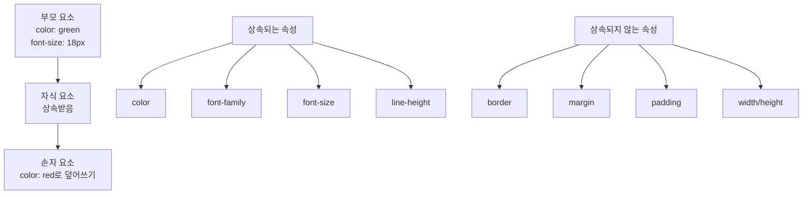
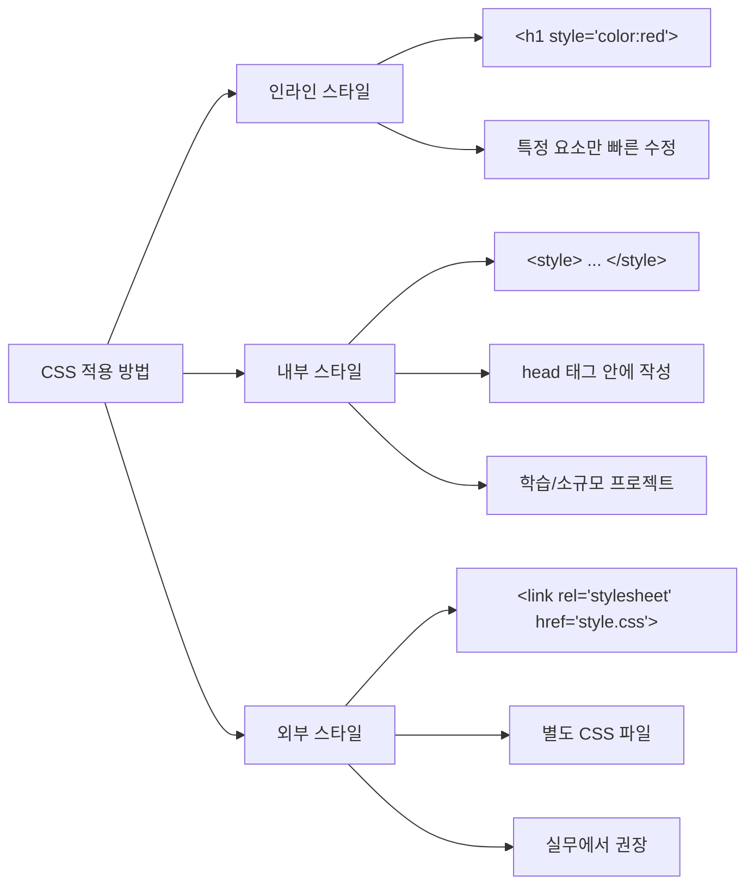

# CSS 선택자와 타이포그래피 완벽 가이드

## 📋 목차
1. [CSS 선택자 기초](#css-선택자-기초)
2. [CSS 선택자 종류](#css-선택자-종류)
3. [CSS 타이포그래피](#css-타이포그래피)
4. [실습 코드 분석](#실습-코드-분석)

---

## CSS 선택자 기초

### 🎯 선택자란?
CSS 선택자(Selector)는 **어떤 HTML 요소에 어떤 스타일을 줄지 지목하는 표현식**입니다.

```css
/* 선택자 문법 */
선택자 {
    속성: 값;
    속성: 값;
}
```

### 📊 CSS 선택자 관계도

```mermaid
graph TD
    A[CSS 선택자] --> B[기본 선택자]
    A --> C[속성 선택자]
    A --> D[결합자]
    A --> E[그룹 선택자]
    
    B --> B1[태그 선택자<br/>h1, p, div]
    B --> B2[클래스 선택자<br/>.className]
    B --> B3[아이디 선택자<br/>#idName]
    
    C --> C1[속성값 선택자<br/>input[type='password']]
    C --> C2[링크 타겟 선택자<br/>a[target='_blank']]
    
    D --> D1[자손 선택자<br/>.parent .child]
    D --> D2[자식 선택자<br/>.parent > .child]
    D --> D3[인접 형제<br/>h3 + p]
    D --> D4[일반 형제<br/>h3 ~ p]
    
    E --> E1[다중 선택자<br/>h3, .lead]
```

---

## CSS 선택자 종류

### 1️⃣ 기본 선택자

#### 태그 선택자
```css
/* HTML 태그 이름을 그대로 사용 */
h1 {
    color: blue;           /* 글자색을 파란색으로 */
    font-weight: bold;     /* 글자 두께를 굵게 */
}

p {
    color: black;          /* 모든 p 태그의 글자색을 검은색으로 */
}
```

#### 클래스 선택자 (.)
```css
/* 마침표(.) + class 속성값 */
.alert {
    color: red;            /* .alert 클래스를 가진 요소의 글자색을 빨간색으로 */
}

.lead {
    color: green;          /* .lead 클래스를 가진 요소의 글자색을 초록색으로 */
    font-size: 18px;       /* 글자 크기를 18px로 */
}
```

#### 아이디 선택자 (#)
```css
/* 샵(#) + id 속성값 */
#brand {
    color: blue;           /* id가 brand인 요소의 글자색을 파란색으로 */
    font-weight: bold;     /* 글자 두께를 굵게 */
}
```

### 🔍 id vs class 차이점

| 구분 | id | class |
|------|-------|--------|
| 문서 내 사용 | 고유 (한 번만) | 재사용 가능 |
| 선택자 | `#idName` | `.className` |
| 특이도 | 높음 (유지보수 시 주의) | 낮음 (권장) |
| 실무 활용 | JavaScript 식별용 | 스타일링 기본 단위 |

### 2️⃣ 속성 선택자

```css
/* 특정 속성을 기준으로 선택 */
input[type="password"] {
    background-color: lightgray;  /* 비밀번호 입력칸의 배경색을 연한 회색으로 */
}

a[target="_blank"] {
    text-decoration: underline;   /* 새 창으로 열리는 링크에 밑줄 추가 */
    color: purple;                /* 글자색을 보라색으로 */
}
```

### 3️⃣ 그룹 선택자

```css
/* 쉼표(,)로 여러 선택자를 동시에 적용 */
h3, .lead {
    color: green;          /* h3 태그와 .lead 클래스 모두에게 초록색 적용 */
}
```

### 4️⃣ 결합자 (Combinator)

#### 자손 선택자 (공백)
```css
/* .section 안의 모든 .note (깊이 상관없음) */
.section .note {
    color: gray;           /* .section 내부의 모든 .note 클래스 요소를 회색으로 */
}
```

#### 자식 선택자 (>)
```css
/* .section의 바로 아래 자식인 .note만 */
.section > .note {
    background-color: lightyellow;  /* .section의 직계 자식 .note만 연한 노란 배경 */
}
```

#### 인접 형제 선택자 (+)
```css
/* h3 바로 다음에 오는 첫 번째 p */
h3 + p {
    font-style: italic;    /* h3 바로 다음 p를 기울임체로 */
}
```

#### 일반 형제 선택자 (~)
```css
/* h3 뒤에 오는 모든 p */
h3 ~ p {
    border-top: 1px dashed black;  /* h3 뒤의 모든 p 위쪽에 점선 테두리 */
}
```

---

## CSS 타이포그래피

### 🔄 상속 (Inheritance)



#### 상속 예시
```css
.ancestor {
    color: green;          /* 자식들에게 상속됨 */
    font-size: 18px;       /* 자식들에게 상속됨 */
}

.grandchild {
    color: red;            /* 조상에게서 받은 green을 red로 덮어쓰기 */
}

.ancestor-box {
    border: 2px solid orange;  /* 자식들에게 상속되지 않음 */
    padding: 10px;             /* 자식들에게 상속되지 않음 */
}
```

### 📏 사이즈 단위

#### 단위별 특징

| 단위 | 설명 | 특징 | 예시 |
|------|------|------|------|
| px | 픽셀 (절대 단위) | 화면 크기와 무관한 고정값 | `font-size: 24px;` |
| em | 부모 기준 배수 | 부모 크기에 따라 변동됨 | `font-size: 2em;` |
| rem | html 기준 배수 | root 크기 기준으로 안정적 | `font-size: 1.5rem;` |
| % | 부모 대비 비율 | 반응형 디자인에 유용 | `font-size: 120%;` |

#### em vs rem 비교
```css
html { 
    font-size: 16px;       /* rem의 기준값 */
}

.parent { 
    font-size: 20px;       /* em의 기준값 (이 요소의 자식들에게) */
}

.child-em { 
    font-size: 2em;        /* 부모(20px) × 2 = 40px */
}

.child-rem { 
    font-size: 2rem;       /* html(16px) × 2 = 32px */
}
```

### 🔤 글꼴 속성

```css
/* 글꼴 계열 지정 */
.font-family-serif { 
    font-family: Georgia, "Times New Roman", serif;  /* 세리프체 (장식 있음) */
}

.font-family-sans { 
    font-family: Arial, Helvetica, sans-serif;       /* 산세리프체 (깔끔함) */
}

/* 글자 두께 */
.weight-normal { font-weight: normal; }              /* 보통 두께 (400) */
.weight-bold { font-weight: bold; }                  /* 굵은 두께 (700) */
.weight-900 { font-weight: 900; }                    /* 가장 굵은 두께 */

/* 기타 속성 */
.italic { font-style: italic; }                      /* 기울임체 */
.lineheight { line-height: 2; }                      /* 줄 간격 2배 */
.spacing { letter-spacing: 4px; }                    /* 글자 간격 4px */
```

### 🌐 웹폰트 (Web Font)

#### @font-face로 웹폰트 선언
```css
@font-face {
    font-family: 'PartialSansKR-Regular';              /* 폰트 이름 정의 */
    src: url('폰트파일경로.woff2') format('woff2');      /* 폰트 파일 경로와 형식 */
    font-weight: normal;                                /* 폰트 두께 */
    font-style: normal;                                 /* 폰트 스타일 */
}
```

#### 웹폰트 적용
```css
body.webfont { 
    font-family: 'PartialSansKR-Regular', sans-serif;  /* 웹폰트 적용, 없으면 sans-serif */
}

/* form 요소들은 별도 지정 필요 */
input, textarea, button { 
    font-family: 'PartialSansKR-Regular', sans-serif;  /* 폼 요소에도 웹폰트 적용 */
}
```

---

## 스타일시트 적용 방법



### 적용 방법별 특징

1. **인라인 스타일**: 요소 안 `style` 속성 (특정 요소만 빠르게 수정할 때)
2. **내부 스타일**: `<head>` 안 `<style>` 태그 (학습이나 소규모 프로젝트에 적합)
3. **외부 스타일**: 별도 `.css` 파일을 `link`로 연결 (실무에서 가장 권장)

---

## 실습 코드 분석

### HTML 구조 분석
```html
<!DOCTYPE html>
<html lang="ko">
<head>
    <meta charset="UTF-8">                          <!-- 한글 지원을 위한 UTF-8 인코딩 -->
    <title>CSS 선택자 실습</title>                  <!-- 브라우저 탭에 표시될 제목 -->
    <style>
        /* 여기에 CSS 코드가 들어감 */
    </style>
</head>
<body>
    <h1 id="brand">CSS 선택자 실습</h1>             <!-- id 선택자 대상 -->
    <p class="lead">클래스 기반으로...</p>           <!-- class 선택자 대상 -->
    <p class="alert">이건 경고 문구입니다.</p>       <!-- class 선택자 대상 -->
</body>
</html>
```

### CSS 코드 상세 분석
```css
/* STEP 1. 기본 선택자 */
#brand { 
    color: blue;           /* id가 brand인 요소의 글자색을 파란색으로 */
    font-weight: bold;     /* 글자 두께를 굵게 만들기 */
}

.alert { 
    color: red;            /* alert 클래스 요소의 글자색을 빨간색으로 */
}

h3, .lead { 
    color: green;          /* h3 태그와 lead 클래스 모두 초록색으로 */
}

/* STEP 2. 속성 선택자 */
input[type="password"] { 
    background-color: lightgray;  /* 비밀번호 입력 필드의 배경을 연한 회색으로 */
}

a[target="_blank"] { 
    text-decoration: underline;   /* 새 창 링크에 밑줄 표시 */
    color: purple;                /* 글자색을 보라색으로 */
}

/* STEP 3. 결합자 */
.section .note { 
    color: gray;           /* section 클래스 안의 모든 note 클래스를 회색으로 */
}

.section > .note { 
    background-color: lightyellow;  /* section의 직계 자식 note만 연한 노란 배경 */
}

h3 + p { 
    font-style: italic;    /* h3 바로 다음 p 태그를 기울임체로 */
}

h3 ~ p { 
    border-top: 1px dashed black;  /* h3 뒤의 모든 p 태그 위에 점선 테두리 */
}
```

---

## 💡 학습 팁

### 선택자 우선순위 (특이도)
1. **인라인 스타일** (1000점)
2. **ID 선택자** (100점)
3. **클래스 선택자** (10점)
4. **태그 선택자** (1점)

### 실무 권장사항
- **클래스 선택자**를 주로 사용 (재사용성 ↑, 유지보수성 ↑)
- **ID 선택자**는 JavaScript 식별용으로 활용
- **외부 CSS 파일** 사용으로 HTML과 CSS 분리
- **의미있는 클래스명** 사용 (예: `.alert`, `.button-primary`)

### 디버깅 도구
- 브라우저 개발자 도구 (F12)에서 요소 검사
- CSS 선택자 연습 게임: [CSS Diner](https://flukeout.github.io/)

---

## 🎯 실습 과제

1. **기본 선택자** 연습하기
2. **결합자**로 복잡한 구조 선택하기
3. **웹폰트** 적용해보기
4. **반응형** 폰트 크기 만들어보기
