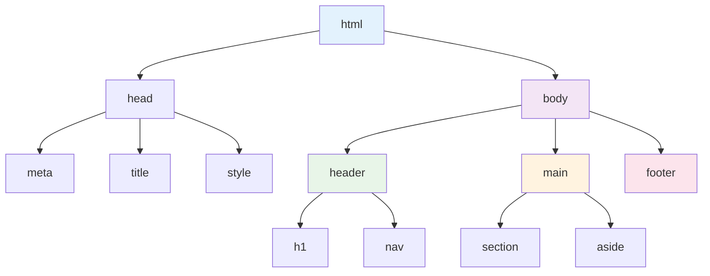
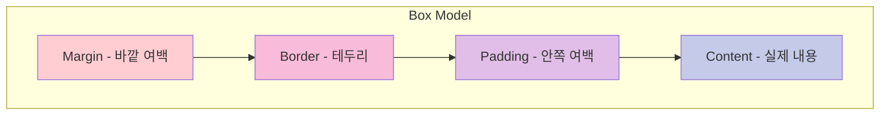
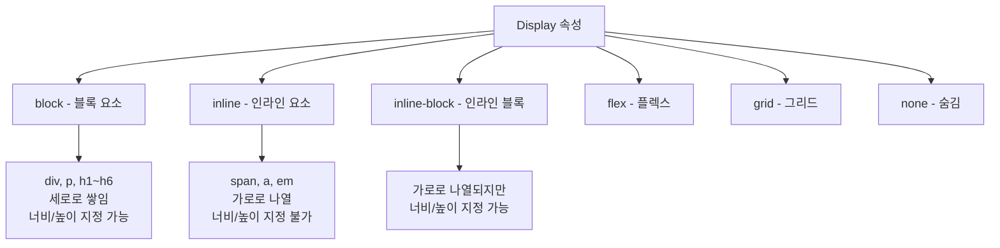
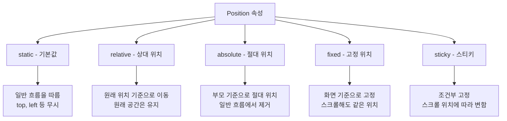
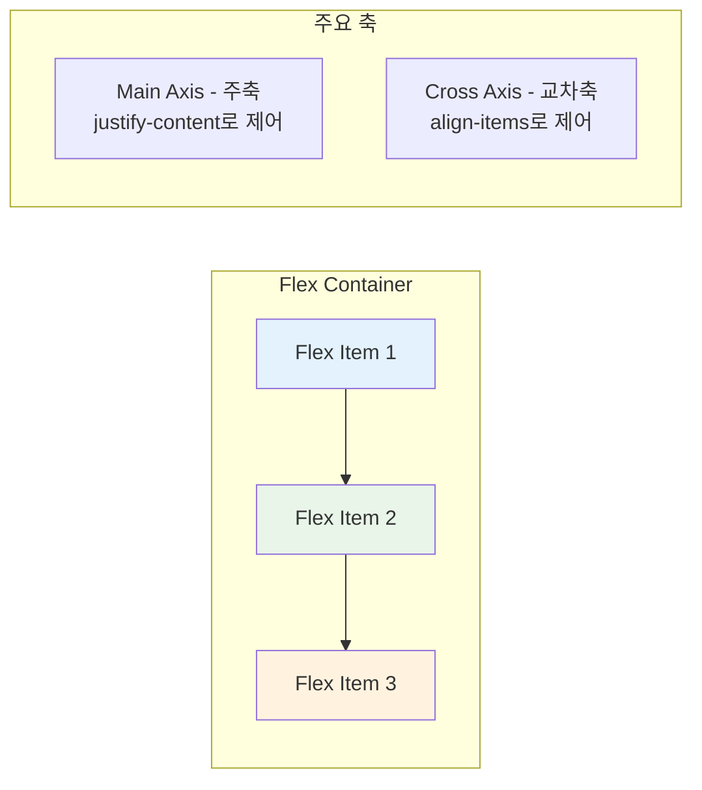
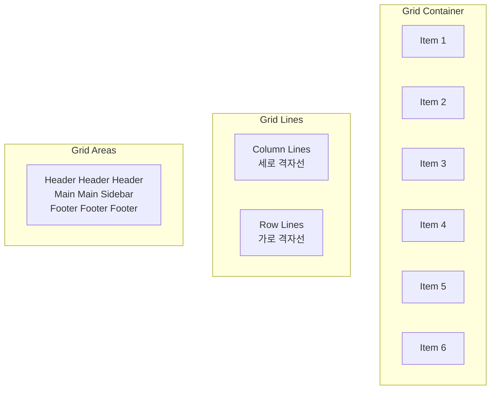

# CSS Layout 실습 가이드 📐
> 2024.08.21 웹 개발 스터디 자료

## 📚 목차
1. [HTML 기본 구조](#html-기본-구조)
2. [CSS Box Model](#css-box-model)
3. [Display 속성](#display-속성)
4. [Position 속성](#position-속성)
5. [Float와 Clear](#float와-clear)
6. [Flexbox](#flexbox)
7. [CSS Grid](#css-grid)
8. [실습 예제](#실습-예제)
9. [반응형 레이아웃](#반응형-레이아웃)

---

## HTML 기본 구조

### 기본 HTML 템플릿
```html
<!DOCTYPE html>
<html lang="ko">
<head>
    <meta charset="UTF-8">                          <!-- 문자 인코딩 설정 -->
    <meta name="viewport" content="width=device-width, initial-scale=1.0"> <!-- 반응형 설정 -->
    <title>CSS Layout 실습</title>                   <!-- 페이지 제목 -->
    <style>
        /* CSS 코드가 여기에 들어갑니다 */
    </style>
</head>
<body>
    <!-- HTML 콘텐츠가 여기에 들어갑니다 -->
</body>
</html>
```

### 의미론적 HTML 구조
```html
<body>
    <header>                    <!-- 페이지 상단 헤더 -->
        <h1>사이트 제목</h1>
        <nav>                   <!-- 네비게이션 메뉴 -->
            <ul>
                <li><a href="#home">홈</a></li>
                <li><a href="#about">소개</a></li>
                <li><a href="#contact">연락처</a></li>
            </ul>
        </nav>
    </header>
    
    <main>                      <!-- 메인 콘텐츠 영역 -->
        <section>               <!-- 섹션 단위로 구분 -->
            <h2>메인 콘텐츠</h2>
            <p>내용이 들어갑니다.</p>
        </section>
        
        <aside>                 <!-- 부가 정보 (사이드바 등) -->
            <h3>관련 링크</h3>
            <ul>
                <li><a href="#">링크 1</a></li>
                <li><a href="#">링크 2</a></li>
            </ul>
        </aside>
    </main>
    
    <footer>                    <!-- 페이지 하단 푸터 -->
        <p>&copy; 2024 CSS Layout 실습</p>
    </footer>
</body>
```



---

## CSS Box Model

모든 HTML 요소는 박스 모델로 구성됩니다.



### Box Model 실습
```css
/* 기본 박스 모델 설정 */
* {
    margin: 0;                  /* 모든 요소의 마진을 0으로 초기화 */
    padding: 0;                 /* 모든 요소의 패딩을 0으로 초기화 */
    box-sizing: border-box;     /* 패딩과 보더를 너비에 포함 */
}

.box-example {
    width: 300px;               /* 박스의 너비 */
    height: 200px;              /* 박스의 높이 */
    padding: 20px;              /* 안쪽 여백 (상하좌우 모두 20px) */
    border: 5px solid #333;     /* 테두리 (두께 5px, 실선, 색상) */
    margin: 30px;               /* 바깥 여백 (상하좌우 모두 30px) */
    background-color: #f0f0f0;  /* 배경색 */
}

/* 개별 방향 지정 */
.box-detailed {
    padding-top: 10px;          /* 위쪽 패딩만 */
    padding-right: 15px;        /* 오른쪽 패딩만 */
    padding-bottom: 20px;       /* 아래쪽 패딩만 */
    padding-left: 25px;         /* 왼쪽 패딩만 */
    
    /* 축약형: padding: 위 오른쪽 아래 왼쪽 (시계방향) */
    padding: 10px 15px 20px 25px;
    
    /* 축약형: padding: 위아래 좌우 */
    padding: 20px 30px;
    
    margin: 10px auto;          /* 위아래 10px, 좌우는 자동(가운데 정렬) */
}
```

---

## Display 속성

HTML 요소가 어떻게 표시될지 결정하는 가장 중요한 속성입니다.



### Display 실습
```css
/* 블록 요소 (기본값: div, p, h1 등) */
.block-element {
    display: block;             /* 블록 요소로 설정 */
    width: 100%;                /* 부모 너비만큼 차지 */
    height: 50px;               /* 높이 지정 가능 */
    background: #ff6b6b;        /* 배경색으로 구분 */
    margin-bottom: 10px;        /* 아래 마진 */
}

/* 인라인 요소 (기본값: span, a, em 등) */
.inline-element {
    display: inline;            /* 인라인 요소로 설정 */
    background: #4ecdc4;        /* 배경색 */
    padding: 5px 10px;          /* 패딩은 적용됨 */
    /* width: 200px; */          /* 너비는 적용되지 않음! */
    /* height: 50px; */          /* 높이는 적용되지 않음! */
}

/* 인라인-블록 요소 */
.inline-block-element {
    display: inline-block;      /* 인라인-블록으로 설정 */
    width: 150px;               /* 너비 지정 가능 */
    height: 50px;               /* 높이 지정 가능 */
    background: #45b7d1;        /* 배경색 */
    margin: 5px;                /* 마진 적용 */
    text-align: center;         /* 텍스트 가운데 정렬 */
    line-height: 50px;          /* 세로 가운데 정렬을 위한 라인높이 */
}

/* 요소 숨기기 */
.hidden-element {
    display: none;              /* 완전히 숨김 (공간도 차지하지 않음) */
}

.invisible-element {
    visibility: hidden;         /* 투명하게 숨김 (공간은 차지함) */
}
```

---

## Position 속성

요소의 위치를 정확하게 제어하는 방법입니다.



### Position 실습
```css
/* 컨테이너 설정 */
.position-container {
    position: relative;         /* 자식의 absolute 기준점 역할 */
    width: 400px;               /* 컨테이너 너비 */
    height: 300px;              /* 컨테이너 높이 */
    background: #f8f9fa;        /* 연한 배경색 */
    border: 2px solid #dee2e6;  /* 테두리 */
    margin: 20px auto;          /* 가운데 정렬 */
}

/* static: 기본값 */
.static-box {
    position: static;           /* 기본값 (생략 가능) */
    background: #e9ecef;        /* 배경색 */
    padding: 10px;              /* 패딩 */
    margin: 10px;               /* 마진 */
    /* top: 50px; */            /* static에서는 무시됨 */
}

/* relative: 상대 위치 */
.relative-box {
    position: relative;         /* 상대 위치 설정 */
    top: 20px;                  /* 원래 위치에서 아래로 20px 이동 */
    left: 30px;                 /* 원래 위치에서 오른쪽으로 30px 이동 */
    background: #ffc107;        /* 노란색 배경 */
    padding: 10px;              /* 패딩 */
    z-index: 1;                 /* 다른 요소보다 위에 표시 */
}

/* absolute: 절대 위치 */
.absolute-box {
    position: absolute;         /* 절대 위치 설정 */
    top: 50px;                  /* 부모의 위에서 50px */
    right: 20px;                /* 부모의 오른쪽에서 20px */
    width: 100px;               /* 너비 */
    height: 80px;               /* 높이 */
    background: #dc3545;        /* 빨간색 배경 */
    color: white;               /* 흰색 텍스트 */
    text-align: center;         /* 텍스트 가운데 정렬 */
    line-height: 80px;          /* 세로 가운데 정렬 */
}

/* fixed: 화면 고정 */
.fixed-box {
    position: fixed;            /* 화면에 고정 */
    bottom: 20px;               /* 화면 아래에서 20px */
    right: 20px;                /* 화면 오른쪽에서 20px */
    width: 80px;                /* 너비 */
    height: 80px;               /* 높이 */
    background: #28a745;        /* 초록색 배경 */
    border-radius: 50%;         /* 원형으로 만들기 */
    color: white;               /* 흰색 텍스트 */
    text-align: center;         /* 텍스트 가운데 정렬 */
    line-height: 80px;          /* 세로 가운데 정렬 */
    cursor: pointer;            /* 마우스 포인터 */
    z-index: 1000;              /* 가장 위에 표시 */
}

/* sticky: 조건부 고정 */
.sticky-header {
    position: sticky;           /* 스티키 설정 */
    top: 0;                     /* 화면 맨 위에 고정 */
    background: #007bff;        /* 파란색 배경 */
    color: white;               /* 흰색 텍스트 */
    padding: 15px;              /* 패딩 */
    text-align: center;         /* 텍스트 가운데 정렬 */
    z-index: 100;               /* 다른 요소보다 위에 */
}
```

---

## Float와 Clear

예전에 레이아웃을 만들 때 사용했던 방법입니다. (현재는 Flexbox, Grid 권장)

### Float 실습
```css
/* 이미지 텍스트 감싸기 */
.float-image {
    float: left;                /* 왼쪽으로 띄우기 */
    width: 200px;               /* 너비 */
    height: 150px;              /* 높이 */
    background: #6c757d;        /* 배경색 */
    margin: 0 20px 20px 0;      /* 오른쪽과 아래 마진 */
    border-radius: 8px;         /* 둥근 모서리 */
}

.text-content {
    /* 텍스트가 이미지 주변을 감쌈 */
    text-align: justify;        /* 양쪽 정렬 */
    line-height: 1.6;           /* 줄 간격 */
}

/* Float 해제 */
.clearfix::after {
    content: "";                /* 빈 내용 */
    display: table;             /* 테이블로 표시 */
    clear: both;                /* 양쪽 float 해제 */
}

/* 3단 컬럼 레이아웃 (Float 방식) */
.column {
    float: left;                /* 왼쪽으로 띄우기 */
    width: 33.333%;             /* 3등분 너비 */
    padding: 20px;              /* 패딩 */
    box-sizing: border-box;     /* 패딩을 너비에 포함 */
    background: #f8f9fa;        /* 배경색 */
    min-height: 300px;          /* 최소 높이 */
}

.column:nth-child(2) {
    background: #e9ecef;        /* 두 번째 컬럼 배경색 */
}

.column:nth-child(3) {
    background: #dee2e6;        /* 세 번째 컬럼 배경색 */
}
```

---

## Flexbox

1차원 레이아웃을 위한 현대적인 방법입니다.



### Flexbox 기본 설정
```css
/* Flex 컨테이너 (부모 요소) */
.flex-container {
    display: flex;              /* flexbox 활성화 */
    
    /* 주축 방향 설정 */
    flex-direction: row;        /* 기본값: 가로 (→) */
    /* flex-direction: column; */   /* 세로 (↓) */
    /* flex-direction: row-reverse; */ /* 가로 역순 (←) */
    /* flex-direction: column-reverse; */ /* 세로 역순 (↑) */
    
    /* 줄바꿈 설정 */
    flex-wrap: nowrap;          /* 기본값: 줄바꿈 없음 */
    /* flex-wrap: wrap; */         /* 줄바꿈 허용 */
    /* flex-wrap: wrap-reverse; */   /* 역순 줄바꿈 */
    
    /* 축약형 */
    /* flex-flow: row wrap; */     /* direction과 wrap을 한번에 */
    
    /* 주축에서 정렬 (가로축에서 좌우 정렬) */
    justify-content: flex-start; /* 기본값: 시작점 정렬 */
    /* justify-content: flex-end; */    /* 끝점 정렬 */
    /* justify-content: center; */      /* 가운데 정렬 */
    /* justify-content: space-between; */ /* 양끝 정렬, 사이 균등 분배 */
    /* justify-content: space-around; */  /* 모든 아이템 주위 균등 분배 */
    /* justify-content: space-evenly; */  /* 모든 간격 균등 분배 */
    
    /* 교차축에서 정렬 (세로축에서 상하 정렬) */
    align-items: stretch;       /* 기본값: 늘려서 채움 */
    /* align-items: flex-start; */  /* 시작점 정렬 */
    /* align-items: flex-end; */    /* 끝점 정렬 */
    /* align-items: center; */      /* 가운데 정렬 */
    /* align-items: baseline; */    /* 텍스트 기준선 정렬 */
    
    /* 여러 줄일 때 줄 간 정렬 */
    align-content: stretch;     /* 기본값 */
    /* align-content: flex-start; */ /* 시작점 정렬 */
    /* align-content: center; */     /* 가운데 정렬 */
    /* align-content: space-between; */ /* 양끝 정렬 */
    
    /* 기본 스타일 */
    min-height: 300px;          /* 최소 높이 */
    background: #f8f9fa;        /* 배경색 */
    border: 2px solid #dee2e6;  /* 테두리 */
    gap: 10px;                  /* 아이템 간 간격 */
}

/* Flex 아이템 (자식 요소) */
.flex-item {
    background: #007bff;        /* 배경색 */
    color: white;               /* 텍스트 색 */
    padding: 20px;              /* 패딩 */
    text-align: center;         /* 텍스트 가운데 정렬 */
    border-radius: 4px;         /* 둥근 모서리 */
    
    /* flex 속성 */
    flex-grow: 0;               /* 늘어나는 비율 (기본값: 0) */
    flex-shrink: 1;             /* 줄어드는 비율 (기본값: 1) */
    flex-basis: auto;           /* 기본 크기 (기본값: auto) */
    
    /* 축약형 */
    /* flex: 1; */               /* grow: 1, shrink: 1, basis: 0 */
    /* flex: 0 1 auto; */        /* 기본값과 동일 */
    
    /* 개별 정렬 (컨테이너의 align-items 무시) */
    /* align-self: center; */    /* 이 아이템만 가운데 정렬 */
}

/* 특정 아이템만 다르게 설정 */
.flex-item:nth-child(1) {
    flex-grow: 1;               /* 첫 번째 아이템만 늘어남 */
    background: #28a745;        /* 초록색 */
}

.flex-item:nth-child(2) {
    flex: 2;                    /* 두 번째 아이템이 더 많이 늘어남 */
    background: #ffc107;        /* 노란색 */
    color: #333;                /* 어두운 텍스트 */
}

.flex-item:nth-child(3) {
    align-self: flex-end;       /* 이 아이템만 아래쪽 정렬 */
    background: #dc3545;        /* 빨간색 */
}
```

### Flexbox 실전 예제
```css
/* 네비게이션 바 */
.navbar {
    display: flex;              /* flexbox 활성화 */
    justify-content: space-between; /* 양끝 정렬 */
    align-items: center;        /* 세로 가운데 정렬 */
    padding: 1rem 2rem;         /* 패딩 */
    background: #343a40;        /* 어두운 배경 */
    color: white;               /* 흰색 텍스트 */
}

.logo {
    font-size: 1.5rem;          /* 로고 크기 */
    font-weight: bold;          /* 굵게 */
}

.nav-menu {
    display: flex;              /* 메뉴도 flex */
    list-style: none;           /* 불릿 제거 */
    gap: 2rem;                  /* 메뉴 간 간격 */
}

.nav-menu a {
    color: white;               /* 링크 색상 */
    text-decoration: none;      /* 밑줄 제거 */
    padding: 0.5rem 1rem;       /* 클릭 영역 확대 */
    border-radius: 4px;         /* 둥근 모서리 */
    transition: background 0.3s; /* 호버 애니메이션 */
}

.nav-menu a:hover {
    background: rgba(255,255,255,0.1); /* 호버시 반투명 배경 */
}

/* 카드 레이아웃 */
.card-container {
    display: flex;              /* flexbox 활성화 */
    flex-wrap: wrap;            /* 줄바꿈 허용 */
    gap: 2rem;                  /* 카드 간 간격 */
    padding: 2rem;              /* 컨테이너 패딩 */
}

.card {
    flex: 1 1 300px;            /* 기본 300px, 늘어날 수 있음 */
    min-width: 0;               /* 최소 너비 제한 해제 */
    background: white;          /* 배경색 */
    border-radius: 8px;         /* 둥근 모서리 */
    box-shadow: 0 2px 10px rgba(0,0,0,0.1); /* 그림자 */
    overflow: hidden;           /* 넘치는 부분 숨김 */
    transition: transform 0.3s; /* 호버 애니메이션 */
}

.card:hover {
    transform: translateY(-5px); /* 위로 살짝 이동 */
}

.card-content {
    padding: 1.5rem;            /* 카드 내부 패딩 */
}

/* 푸터 */
.footer {
    display: flex;              /* flexbox 활성화 */
    flex-direction: column;     /* 세로 방향 */
    align-items: center;        /* 가운데 정렬 */
    padding: 2rem;              /* 패딩 */
    background: #212529;        /* 어두운 배경 */
    color: white;               /* 흰색 텍스트 */
    text-align: center;         /* 텍스트 가운데 정렬 */
}
```

---

## CSS Grid

2차원 레이아웃을 위한 가장 강력한 도구입니다.



### Grid 기본 설정
```css
/* Grid 컨테이너 */
.grid-container {
    display: grid;              /* grid 활성화 */
    
    /* 열(column) 정의 */
    grid-template-columns: 200px 1fr 150px; /* 고정-유동-고정 */
    /* grid-template-columns: repeat(3, 1fr); */ /* 3개 균등 분할 */
    /* grid-template-columns: 1fr 2fr 1fr; */   /* 1:2:1 비율 */
    /* grid-template-columns: minmax(200px, 1fr) 300px; */ /* 최소최대값 */
    
    /* 행(row) 정의 */
    grid-template-rows: 80px 1fr 60px; /* 헤더-본문-푸터 */
    /* grid-template-rows: repeat(3, 100px); */ /* 3개 행, 각 100px */
    
    /* 간격 설정 */
    gap: 20px;                  /* 행과 열 간격 모두 20px */
    /* column-gap: 20px; */        /* 열 간격만 */
    /* row-gap: 10px; */           /* 행 간격만 */
    /* grid-gap: 20px 10px; */     /* 행 20px, 열 10px (구버전) */
    
    /* 기본 스타일 */
    min-height: 100vh;          /* 전체 화면 높이 */
    background: #f8f9fa;        /* 배경색 */
}

/* Grid 아이템 기본 스타일 */
.grid-item {
    background: #007bff;        /* 배경색 */
    color: white;               /* 텍스트 색 */
    padding: 1rem;              /* 패딩 */
    text-align: center;         /* 텍스트 가운데 정렬 */
    display: flex;              /* 내부도 flex로 */
    align-items: center;        /* 세로 가운데 정렬 */
    justify-content: center;    /* 가로 가운데 정렬 */
    border-radius: 4px;         /* 둥근 모서리 */
}

/* 개별 아이템 위치 지정 */
.item1 {
    grid-column: 1 / 4;         /* 1번 열부터 4번 열까지 (3개 열 모두) */
    grid-row: 1;                /* 1번 행에 배치 */
    background: #28a745;        /* 초록색 */
}

.item2 {
    grid-column: 1 / 3;         /* 1~2번 열 */
    grid-row: 2;                /* 2번 행에 배치 */
    background: #ffc107;        /* 노란색 */
    color: #333;                /* 어두운 텍스트 */
}

.item3 {
    grid-column: 3;             /* 3번 열에만 */
    grid-row: 2;                /* 2번 행에 배치 */
    background: #dc3545;        /* 빨간색 */
}

.item4 {
    grid-column: 1 / -1;        /* 첫 번째 열부터 마지막 열까지 */
    grid-row: 3;                /* 3번 행에 배치 */
    background: #6c757d;        /* 회색 */
}

/* 아이템 이름으로 배치 (더 직관적) */
.grid-area-container {
    display: grid;
    grid-template-areas:
        "header  header  header"    /* 첫 번째 행 */
        "sidebar content aside"     /* 두 번째 행 */
        "footer  footer  footer";   /* 세 번째 행 */
    grid-template-columns: 200px 1fr 200px;
    grid-template-rows: 80px 1fr 60px;
    gap: 1rem;
    min-height: 100vh;
}

.header { 
    grid-area: header;          /* header 영역에 배치 */
    background: #007bff;
    color: white;
    display: flex;
    align-items: center;        /* 세로 가운데 정렬 */
    justify-content: center;    /* 가로 가운데 정렬 */
}

.sidebar { 
    grid-area: sidebar;         /* sidebar 영역에 배치 */
    background: #28a745;
    color: white;
    padding: 1rem;
}

.content { 
    grid-area: content;         /* content 영역에 배치 */
    background: white;
    padding: 2rem;
    overflow-y: auto;           /* 세로 스크롤 허용 */
}

.aside { 
    grid-area: aside;           /* aside 영역에 배치 */
    background: #ffc107;
    padding: 1rem;
}

.footer { 
    grid-area: footer;          /* footer 영역에 배치 */
    background: #6c757d;
    color: white;
    display: flex;
    align-items: center;
    justify-content: center;
}
```

### Grid 고급 기법
```css
/* 자동 크기 조절 그리드 */
.auto-grid {
    display: grid;
    /* 최소 250px, 자동으로 열 개수 결정 */
    grid-template-columns: repeat(auto-fit, minmax(250px, 1fr));
    gap: 2rem;
    padding: 2rem;
}

/* 복잡한 그리드 레이아웃 */
.magazine-layout {
    display: grid;
    grid-template-columns: repeat(12, 1fr); /* 12컬럼 시스템 */
    grid-template-rows: repeat(6, 100px);   /* 6행, 각 100px */
    gap: 1rem;
    padding: 2rem;
}

.featured-article {
    grid-column: 1 / 7;         /* 1~6번 열 (6개 열) */
    grid-row: 1 / 4;            /* 1~3번 행 (3개 행) */
    background: #e3f2fd;
    padding: 2rem;
    border-radius: 8px;
}

.side-article {
    grid-column: 7 / 13;        /* 7~12번 열 (6개 열) */
    grid-row: 1 / 3;            /* 1~2번 행 (2개 행) */
    background: #f3e5f5;
    padding: 1rem;
    border-radius: 8px;
}

.small-article {
    grid-column: 7 / 10;        /* 7~9번 열 (3개 열) */
    grid-row: 3 / 4;            /* 3번 행 (1개 행) */
    background: #e8f5e8;
    padding: 1rem;
    border-radius: 8px;
}
```

---

## 실습 예제

### 완전한 반응형 웹사이트
```html
<!DOCTYPE html>
<html lang="ko">
<head>
    <meta charset="UTF-8">
    <meta name="viewport" content="width=device-width, initial-scale=1.0">
    <title>Modern Layout Practice</title>
    <style>
        /* ===== 전역 스타일 초기화 ===== */
        * {
            margin: 0;              /* 브라우저 기본 마진 제거 */
            padding: 0;             /* 브라우저 기본 패딩 제거 */
            box-sizing: border-box; /* 패딩, 보더를 너비에 포함 */
        }
        
        body {
            font-family: 'Segoe UI', Tahoma, Geneva, Verdana, sans-serif;
            line-height: 1.6;       /* 읽기 좋은 줄 간격 */
            color: #333;            /* 기본 텍스트 색상 */
            background: #f8f9fa;    /* 연한 배경색 */
        }
        
        /* ===== 메인 그리드 레이아웃 ===== */
        .page-container {
            display: grid;          /* 그리드 레이아웃 활성화 */
            grid-template-areas:
                "header"            /* 모바일: 세로 1열 배치 */
                "nav"
                "hero"
                "main"
                "sidebar"
                "footer";
            min-height: 100vh;      /* 최소 화면 전체 높이 */
            max-width: 1200px;      /* 최대 너비 제한 */
            margin: 0 auto;         /* 가운데 정렬 */
            background: white;      /* 배경색 */
            box-shadow: 0 0 20px rgba(0,0,0,0.1); /* 전체 그림자 */
        }
        
        /* ===== 헤더 영역 ===== */
        .header {
            grid-area: header;      /* header 영역에 배치 */
            background: linear-gradient(135deg, #667eea 0%, #764ba2 100%);
            color: white;
            padding: 1.5rem 2rem;
            display: flex;          /* 헤더 내부도 flex */
            justify-content: space-between; /* 양끝 정렬 */
            align-items: center;    /* 세로 가운데 정렬 */
        }
        
        .logo {
            font-size: 1.8rem;      /* 로고 크기 */
            font-weight: bold;       /* 굵게 */
            text-decoration: none;   /* 링크 밑줄 제거 */
            color: white;            /* 흰색 텍스트 */
        }
        
        .user-menu {
            display: flex;           /* 사용자 메뉴 flex */
            gap: 1rem;               /* 메뉴 간 간격 */
            align-items: center;     /* 세로 가운데 정렬 */
        }
        
        .user-menu button {
            background: rgba(255,255,255,0.2); /* 반투명 배경 */
            color: white;            /* 흰색 텍스트 */
            border: none;            /* 테두리 제거 */
            padding: 0.5rem 1rem;    /* 패딩 */
            border-radius: 20px;     /* 둥근 버튼 */
            cursor: pointer;         /* 마우스 포인터 */
            transition: background 0.3s; /* 호버 애니메이션 */
        }
        
        .user-menu button:hover {
            background: rgba(255,255,255,0.3); /* 호버시 더 밝게 */
        }
        
        /* ===== 네비게이션 영역 ===== */
        .nav {
            grid-area: nav;          /* nav 영역에 배치 */
            background: #343a40;     /* 어두운 배경 */
        }
        
        .nav-list {
            display: flex;           /* 가로 배치 */
            list-style: none;        /* 불릿 제거 */
            justify-content: center; /* 가운데 정렬 */
            flex-wrap: wrap;         /* 줄바꿈 허용 */
            padding: 0;              /* 패딩 제거 */
        }
        
        .nav-item {
            /* 개별 네비게이션 아이템 스타일 */
        }
        
        .nav-link {
            display: block;          /* 블록 요소로 (클릭 영역 확대) */
            color: #rgba(255,255,255,0.8); /* 연한 흰색 */
            text-decoration: none;   /* 밑줄 제거 */
            padding: 1rem 1.5rem;    /* 상하 1rem, 좌우 1.5rem */
            transition: all 0.3s ease; /* 부드러운 전환 효과 */
            border-bottom: 3px solid transparent; /* 투명한 하단 보더 */
        }
        
        .nav-link:hover {
            background: #495057;    /* 호버시 배경색 변경 */
            color: white;           /* 완전한 흰색 */
            border-bottom-color: #007bff; /* 하단 보더 색상 */
        }
        
        .nav-link.active {
            background: #007bff;    /* 활성 메뉴 배경 */
            color: white;           /* 흰색 텍스트 */
        }
        
        /* ===== 히어로 섹션 ===== */
        .hero {
            grid-area: hero;         /* hero 영역에 배치 */
            background: linear-gradient(45deg, #ff6b6b, #4ecdc4);
            color: white;
            padding: 4rem 2rem;
            text-align: center;
            display: flex;
            flex-direction: column;  /* 세로 방향 배치 */
            justify-content: center; /* 세로 가운데 정렬 */
            align-items: center;     /* 가로 가운데 정렬 */
            min-height: 300px;       /* 최소 높이 */
        }
        
        .hero h1 {
            font-size: 3rem;        /* 큰 제목 크기 */
            margin-bottom: 1rem;     /* 아래 마진 */
            animation: fadeInUp 1s ease-out; /* 애니메이션 적용 */
        }
        
        .hero p {
            font-size: 1.2rem;      /* 부제목 크기 */
            margin-bottom: 2rem;     /* 아래 마진 */
            max-width: 600px;        /* 최대 너비 제한 */
            animation: fadeInUp 1s ease-out 0.3s both; /* 지연 애니메이션 */
        }
        
        .cta-button {
            background: white;       /* 흰색 배경 */
            color: #333;             /* 어두운 텍스트 */
            padding: 1rem 2rem;      /* 패딩 */
            text-decoration: none;   /* 밑줄 제거 */
            border-radius: 30px;     /* 둥근 버튼 */
            font-weight: bold;       /* 굵은 글씨 */
            transition: all 0.3s ease; /* 부드러운 전환 */
            animation: fadeInUp 1s ease-out 0.6s both; /* 더 늦은 애니메이션 */
        }
        
        .cta-button:hover {
            transform: translateY(-3px); /* 위로 살짝 이동 */
            box-shadow: 0 10px 20px rgba(0,0,0,0.2); /* 그림자 */
        }
        
        /* ===== 메인 콘텐츠 영역 ===== */
        .main {
            grid-area: main;         /* main 영역에 배치 */
            padding: 3rem 2rem;      /* 패딩 */
            background: white;       /* 흰색 배경 */
        }
        
        .section-title {
            font-size: 2rem;        /* 섹션 제목 크기 */
            margin-bottom: 2rem;     /* 아래 마진 */
            text-align: center;      /* 가운데 정렬 */
            color: #333;             /* 어두운 색상 */
            position: relative;      /* 상대 위치 (데코레이션용) */
        }
        
        .section-title::after {
            content: '';            /* 빈 내용 */
            position: absolute;     /* 절대 위치 */
            bottom: -10px;          /* 제목 아래 10px */
            left: 50%;              /* 가로 가운데 */
            transform: translateX(-50%); /* 정확한 가운데 정렬 */
            width: 80px;            /* 선의 너비 */
            height: 3px;            /* 선의 높이 */
            background: #007bff;    /* 파란색 */
            border-radius: 2px;     /* 둥근 모서리 */
        }
        
        /* 카드 그리드 */
        .cards-grid {
            display: grid;          /* 그리드 활성화 */
            grid-template-columns: repeat(auto-fit, minmax(280px, 1fr)); /* 반응형 카드 */
            gap: 2rem;              /* 카드 간 간격 */
            margin-top: 3rem;       /* 위 마진 */
        }
        
        .card {
            background: white;       /* 흰색 배경 */
            border-radius: 12px;     /* 둥근 모서리 */
            padding: 2rem;           /* 패딩 */
            box-shadow: 0 4px 6px rgba(0, 0, 0, 0.1); /* 그림자 */
            transition: all 0.3s ease; /* 부드러운 전환 */
            border: 1px solid #e9ecef; /* 연한 테두리 */
        }
        
        .card:hover {
            transform: translateY(-8px); /* 위로 이동 */
            box-shadow: 0 12px 25px rgba(0, 0, 0, 0.15); /* 진한 그림자 */
            border-color: #007bff;   /* 테두리 색상 변경 */
        }
        
        .card-icon {
            font-size: 3rem;        /* 아이콘 크기 */
            margin-bottom: 1rem;     /* 아래 마진 */
            text-align: center;      /* 가운데 정렬 */
        }
        
        .card h3 {
            font-size: 1.5rem;      /* 카드 제목 크기 */
            margin-bottom: 1rem;     /* 아래 마진 */
            color: #333;             /* 어두운 색상 */
            text-align: center;      /* 가운데 정렬 */
        }
        
        .card p {
            color: #666;             /* 회색 텍스트 */
            text-align: center;      /* 가운데 정렬 */
            line-height: 1.6;        /* 줄 간격 */
        }
        
        /* ===== 사이드바 영역 ===== */
        .sidebar {
            grid-area: sidebar;      /* sidebar 영역에 배치 */
            background: #f8f9fa;     /* 연한 배경 */
            padding: 2rem;           /* 패딩 */
        }
        
        .widget {
            background: white;       /* 흰색 배경 */
            border-radius: 8px;      /* 둥근 모서리 */
            padding: 1.5rem;         /* 패딩 */
            margin-bottom: 2rem;     /* 아래 마진 */
            box-shadow: 0 2px 4px rgba(0,0,0,0.1); /* 그림자 */
        }
        
        .widget h3 {
            font-size: 1.2rem;      /* 위젯 제목 크기 */
            margin-bottom: 1rem;     /* 아래 마진 */
            color: #333;             /* 어두운 색상 */
            border-bottom: 2px solid #e9ecef; /* 하단 구분선 */
            padding-bottom: 0.5rem;  /* 구분선과 텍스트 간격 */
        }
        
        .widget ul {
            list-style: none;        /* 불릿 제거 */
            padding: 0;              /* 패딩 제거 */
        }
        
        .widget li {
            padding: 0.5rem 0;       /* 상하 패딩 */
            border-bottom: 1px solid #f1f3f4; /* 구분선 */
        }
        
        .widget li:last-child {
            border-bottom: none;     /* 마지막 항목은 구분선 제거 */
        }
        
        .widget a {
            color: #007bff;          /* 링크 색상 */
            text-decoration: none;   /* 밑줄 제거 */
            transition: color 0.3s;  /* 색상 전환 애니메이션 */
        }
        
        .widget a:hover {
            color: #0056b3;          /* 호버시 어두운 파란색 */
            text-decoration: underline; /* 호버시 밑줄 */
        }
        
        /* ===== 푸터 영역 ===== */
        .footer {
            grid-area: footer;       /* footer 영역에 배치 */
            background: #212529;     /* 어두운 배경 */
            color: white;            /* 흰색 텍스트 */
            padding: 3rem 2rem;      /* 패딩 */
            text-align: center;      /* 가운데 정렬 */
        }
        
        .footer-content {
            display: flex;           /* flexbox 활성화 */
            flex-direction: column;  /* 세로 방향 */
            align-items: center;     /* 가운데 정렬 */
            gap: 1rem;               /* 요소 간 간격 */
        }
        
        .social-links {
            display: flex;           /* 소셜 링크 flex */
            gap: 2rem;               /* 링크 간 간격 */
            margin-top: 1rem;        /* 위 마진 */
        }
        
        .social-links a {
            color: #adb5bd;          /* 연한 회색 */
            font-size: 1.5rem;       /* 아이콘 크기 */
            transition: color 0.3s;  /* 색상 전환 */
        }
        
        .social-links a:hover {
            color: #007bff;          /* 호버시 파란색 */
        }
        
        /* ===== 애니메이션 정의 ===== */
        @keyframes fadeInUp {
            from {
                opacity: 0;          /* 투명에서 시작 */
                transform: translateY(30px); /* 아래에서 시작 */
            }
            to {
                opacity: 1;          /* 불투명하게 */
                transform: translateY(0); /* 원래 위치로 */
            }
        }
        
        @keyframes pulse {
            0%, 100% {
                transform: scale(1); /* 원래 크기 */
            }
            50% {
                transform: scale(1.05); /* 5% 확대 */
            }
        }
        
        /* ===== 태블릿 레이아웃 (768px 이상) ===== */
        @media (min-width: 768px) {
            .page-container {
                grid-template-areas:
                    "header header"      /* 2열 레이아웃 */
                    "nav nav"
                    "hero hero"
                    "main sidebar"       /* 메인과 사이드바 나란히 */
                    "footer footer";
                grid-template-columns: 2fr 1fr; /* 메인:사이드바 = 2:1 */
                gap: 2rem;           /* 영역 간 간격 */
                padding: 2rem;       /* 컨테이너 패딩 */
            }
            
            .nav-list {
                justify-content: flex-start; /* 왼쪽 정렬 */
                padding-left: 1rem;   /* 왼쪽 패딩 */
            }
            
            .hero h1 {
                font-size: 4rem;     /* 더 큰 제목 */
            }
            
            .cards-grid {
                grid-template-columns: repeat(2, 1fr); /* 2열 카드 */
            }
        }
        
        /* ===== 데스크톱 레이아웃 (1024px 이상) ===== */
        @media (min-width: 1024px) {
            .page-container {
                grid-template-areas:
                    "header header header"   /* 3열 레이아웃 */
                    "nav nav nav"
                    "hero hero hero"
                    "sidebar main main"      /* 사이드바가 왼쪽으로 */
                    "footer footer footer";
                grid-template-columns: 1fr 2fr 1fr; /* 1:2:1 비율 */
            }
            
            .cards-grid {
                grid-template-columns: repeat(3, 1fr); /* 3열 카드 */
            }
            
            .hero h1 {
                font-size: 5rem;     /* 가장 큰 제목 */
            }
        }
        
        /* ===== 다크 모드 지원 ===== */
        @media (prefers-color-scheme: dark) {
            body {
                background: #121212;  /* 어두운 배경 */
                color: #e0e0e0;       /* 밝은 텍스트 */
            }
            
            .page-container {
                background: #1e1e1e;  /* 어두운 컨테이너 */
            }
            
            .main {
                background: #2d2d2d;  /* 어두운 메인 배경 */
                color: #e0e0e0;       /* 밝은 텍스트 */
            }
            
            .card {
                background: #3d3d3d;  /* 어두운 카드 배경 */
                color: #e0e0e0;       /* 밝은 텍스트 */
                border-color: #555;   /* 어두운 테두리 */
            }
            
            .widget {
                background: #3d3d3d;  /* 어두운 위젯 배경 */
                color: #e0e0e0;       /* 밝은 텍스트 */
            }
        }
        
        /* ===== 유틸리티 클래스 ===== */
        .text-center { text-align: center; }      /* 텍스트 가운데 정렬 */
        .text-left { text-align: left; }          /* 텍스트 왼쪽 정렬 */
        .text-right { text-align: right; }        /* 텍스트 오른쪽 정렬 */
        
        .hidden { display: none; }                /* 요소 숨김 */
        .visible { display: block; }              /* 요소 표시 */
        
        .mt-1 { margin-top: 0.5rem; }             /* 위 마진 작게 */
        .mt-2 { margin-top: 1rem; }               /* 위 마진 보통 */
        .mt-3 { margin-top: 2rem; }               /* 위 마진 크게 */
        
        .p-1 { padding: 0.5rem; }                 /* 패딩 작게 */
        .p-2 { padding: 1rem; }                   /* 패딩 보통 */
        .p-3 { padding: 2rem; }                   /* 패딩 크게 */
        
        /* ===== 인터랙티브 요소 ===== */
        .button {
            background: #007bff;     /* 파란색 배경 */
            color: white;            /* 흰색 텍스트 */
            border: none;            /* 테두리 제거 */
            padding: 0.75rem 1.5rem; /* 패딩 */
            border-radius: 6px;      /* 둥근 모서리 */
            cursor: pointer;         /* 마우스 포인터 */
            font-size: 1rem;         /* 글자 크기 */
            transition: all 0.3s ease; /* 부드러운 전환 */
            text-decoration: none;   /* 링크일 때 밑줄 제거 */
            display: inline-block;   /* 인라인 블록 */
        }
        
        .button:hover {
            background: #0056b3;     /* 호버시 어두운 파란색 */
            transform: translateY(-2px); /* 살짝 위로 이동 */
            box-shadow: 0 4px 8px rgba(0,123,255,0.3); /* 파란색 그림자 */
        }
        
        .button:active {
            transform: translateY(0); /* 클릭시 원래 위치 */
        }
        
        /* 버튼 변형 */
        .button-secondary {
            background: #6c757d;     /* 회색 배경 */
        }
        
        .button-secondary:hover {
            background: #545b62;     /* 호버시 어두운 회색 */
        }
        
        .button-success {
            background: #28a745;     /* 초록색 배경 */
        }
        
        .button-success:hover {
            background: #1e7e34;     /* 호버시 어두운 초록색 */
        }
    </style>
</head>
<body>
    <!-- ===== 페이지 컨테이너 ===== -->
    <div class="page-container">
        <!-- 헤더 -->
        <header class="header">
            <a href="#" class="logo">💻 WebDev</a>
            <div class="user-menu">
                <button>🔔 알림</button>
                <button>👤 프로필</button>
            </div>
        </header>
        
        <!-- 네비게이션 -->
        <nav class="nav">
            <ul class="nav-list">
                <li class="nav-item">
                    <a href="#home" class="nav-link active">🏠 홈</a>
                </li>
                <li class="nav-item">
                    <a href="#about" class="nav-link">📖 소개</a>
                </li>
                <li class="nav-item">
                    <a href="#services" class="nav-link">⚙️ 서비스</a>
                </li>
                <li class="nav-item">
                    <a href="#portfolio" class="nav-link">🎨 포트폴리오</a>
                </li>
                <li class="nav-item">
                    <a href="#contact" class="nav-link">📞 연락처</a>
                </li>
            </ul>
        </nav>
        
        <!-- 히어로 섹션 -->
        <section class="hero">
            <h1>Modern Web Layout</h1>
            <p>CSS Grid와 Flexbox를 활용한 반응형 웹 디자인을 배워보세요. 
               모든 디바이스에서 완벽하게 작동하는 웹사이트를 만들 수 있습니다.</p>
            <a href="#main" class="cta-button">시작하기 →</a>
        </section>
        
        <!-- 메인 콘텐츠 -->
        <main class="main" id="main">
            <h2 class="section-title">주요 기능</h2>
            
            <div class="cards-grid">
                <div class="card">
                    <div class="card-icon">🎨</div>
                    <h3>반응형 디자인</h3>
                    <p>모든 화면 크기에서 
