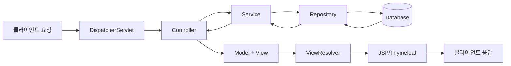
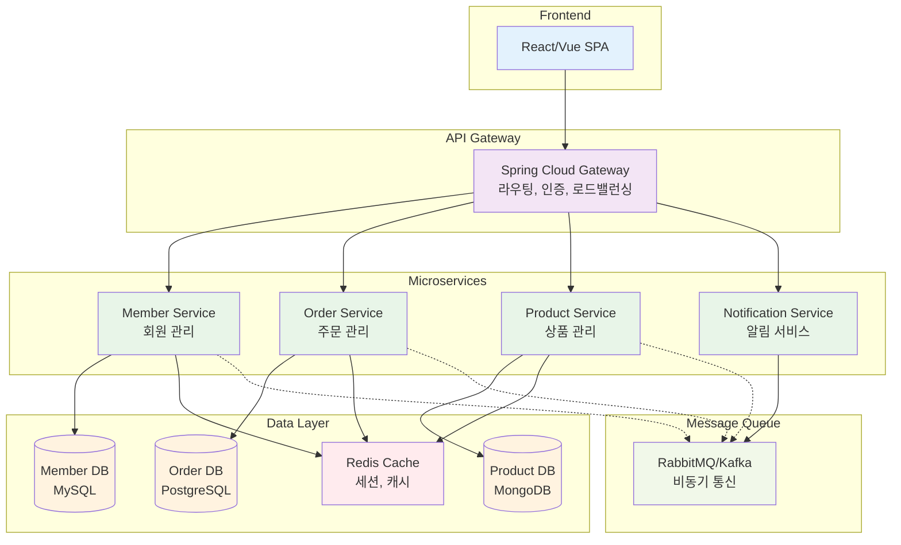
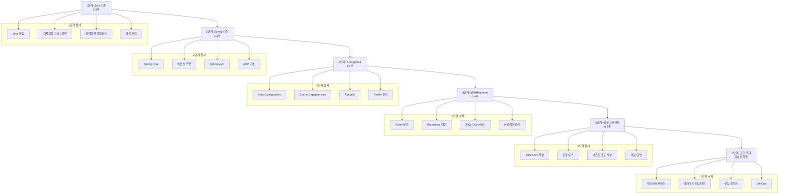
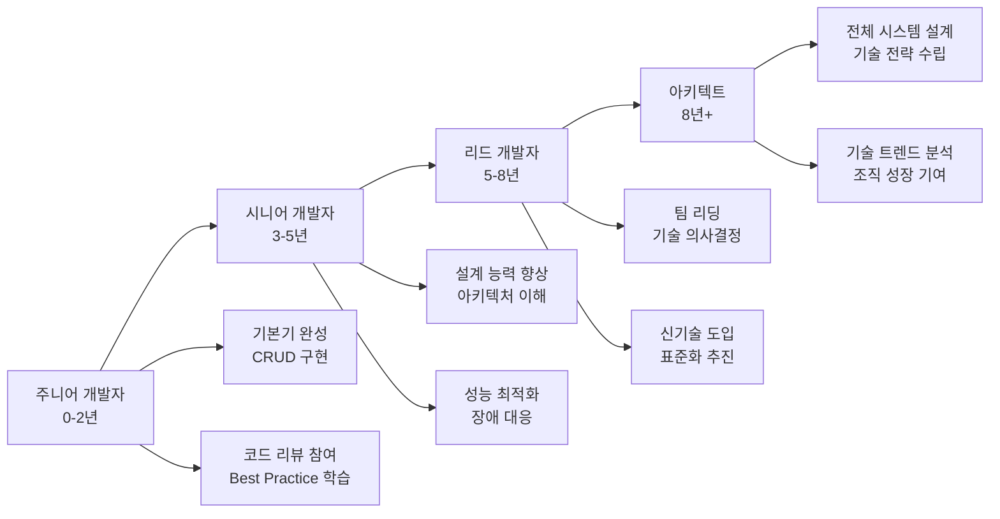
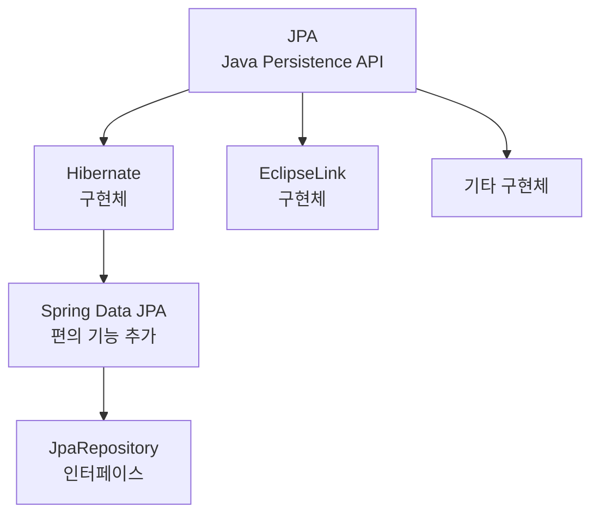
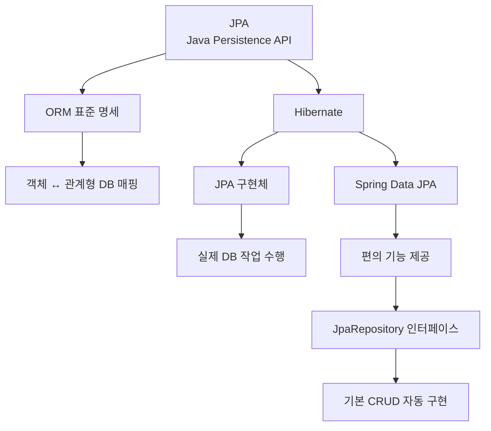
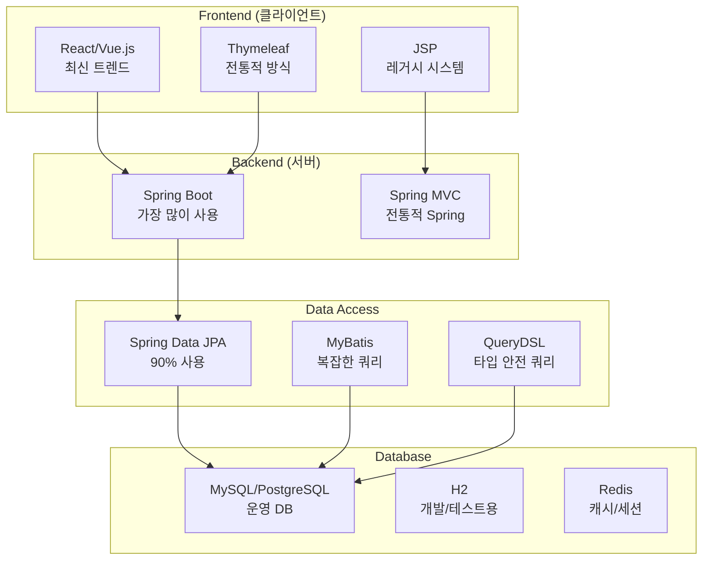

# JSP & Spring Web 학습 가이드 📚

## 목차
1. [JSP 기초](#jsp-기초)
2. [Spring Web 개념](#spring-web-개념)
3. [JPA와 Spring Data JPA](#jpa와-spring-data-jpa)
4. [레이어드 아키텍처](#레이어드-아키텍처)
5. [의존성 주입 (DI)](#의존성-주입-di)
6. [Lombok 활용](#lombok-활용)
7. [실습 예제](#실습-예제)
8. [현업 적용 가이드](#현업-적용-가이드)
9. [배포 설정](#배포-설정)

---

## JSP 기초

### JSP란?
**JSP (Java Server Pages)**는 HTML 안에 Java 코드를 삽입할 수 있게 해주는 서버 사이드 스크립트 기술입니다.

```jsp
<%@ page contentType="text/html;charset=UTF-8" language="java" %>
<!-- JSP 페이지 지시자: 이 페이지가 HTML 형태로 출력되고, Java 언어를 사용함을 선언 -->

<!DOCTYPE html>
<html>
<head>
    <title>JSP 기초 예제</title>
</head>
<body>
    <!-- Java 변수 선언과 초기화 -->
    <%
        String userName = "홍길동";  // 서버에서 실행되는 Java 코드
        int visitCount = 5;
    %>
    
    <!-- 변수 값을 HTML에 출력 -->
    <h1>안녕하세요, <%= userName %>님!</h1>  <!-- expression 태그: 변수 값 출력 -->
    <p>총 <%= visitCount %>번 방문하셨습니다.</p>
</body>
</html>
```

### 💡 현업에서는?
- **JSP 단독 사용**: 거의 없음 (유지보수가 어려움)
- **Spring MVC + Thymeleaf**: 가장 많이 사용
- **React/Vue + REST API**: 최신 트렌드

---

## Spring Web 개념

### Spring MVC 패턴
Spring Web은 **Model-View-Controller** 패턴을 기반으로 합니다.



### 기본 Controller 예제

```java
package com.example.demo.controller;

import org.springframework.stereotype.Controller;  // 스프링 컨트롤러임을 명시
import org.springframework.ui.Model;              // 뷰에 데이터 전달용 객체
import org.springframework.web.bind.annotation.GetMapping;  // GET 요청 매핑
import org.springframework.web.bind.annotation.RequestParam;  // 요청 파라미터 받기

@Controller  // 이 클래스가 웹 요청을 처리하는 컨트롤러임을 스프링에게 알림
public class HelloController {
    
    @GetMapping("/hello")  // GET 방식으로 "/hello" 경로 요청이 들어오면 이 메서드 실행
    public String hello(
        @RequestParam(name = "name", defaultValue = "World") String name,  
        // URL의 ?name=값 파라미터를 받음. 없으면 기본값 "World" 사용
        Model model  // 뷰(HTML)에 데이터를 전달하기 위한 객체
    ) {
        model.addAttribute("greeting", "안녕하세요, " + name + "님!");  
        // "greeting"이라는 이름으로 데이터를 뷰에 전달
        
        return "hello";  // "hello.html" 템플릿을 찾아서 렌더링하라고 지시
    }
}
```

### 🔍 QueryDSL을 활용한 동적 쿼리

```java
// QueryDSL 설정 (build.gradle)
dependencies {
    implementation 'com.querydsl:querydsl-jpa:5.0.0'
    annotationProcessor 'com.querydsl:querydsl-apt:5.0.0'
}

// 커스텀 Repository 구현
@Repository
@RequiredArgsConstructor
public class MemberRepositoryCustomImpl implements MemberRepositoryCustom {
    
    private final JPAQueryFactory queryFactory;  // QueryDSL 쿼리 팩토리
    
    /**
     * 동적 검색 쿼리 - 조건에 따라 WHERE 절이 달라짐
     */
    @Override
    public Page<Member> searchMembers(MemberSearchCondition condition, Pageable pageable) {
        QMember member = QMember.member;  // QueryDSL Q클래스
        
        List<Member> content = queryFactory
            .selectFrom(member)
            .where(
                nameContains(condition.getName()),     // 이름 포함 검색
                emailContains(condition.getEmail()),   // 이메일 포함 검색
                createdBetween(condition.getStartDate(), condition.getEndDate())  // 기간 검색
            )
            .orderBy(member.createdAt.desc())
            .offset(pageable.getOffset())  // 페이징 시작점
            .limit(pageable.getPageSize()) // 페이징 크기
            .fetch();  // 실행
        
        // 전체 개수 조회 (페이징 정보를 위해)
        Long total = queryFactory
            .select(member.count())
            .from(member)
            .where(
                nameContains(condition.getName()),
                emailContains(condition.getEmail()),
                createdBetween(condition.getStartDate(), condition.getEndDate())
            )
            .fetchOne();
        
        return new PageImpl<>(content, pageable, total);
    }
    
    // 동적 조건 메서드들 - null이면 조건에서 제외
    private BooleanExpression nameContains(String name) {
        return hasText(name) ? QMember.member.name.containsIgnoreCase(name) : null;
    }
    
    private BooleanExpression emailContains(String email) {
        return hasText(email) ? QMember.member.email.containsIgnoreCase(email) : null;
    }
    
    private BooleanExpression createdBetween(LocalDate startDate, LocalDate endDate) {
        if (startDate != null && endDate != null) {
            return QMember.member.createdAt.between(
                startDate.atStartOfDay(), 
                endDate.atTime(23, 59, 59)
            );
        }
        return null;
    }
}
```

### 📈 모니터링과 로깅

```java
// Application 이벤트를 통한 로깅
@Component
@RequiredArgsConstructor
@Slf4j  // Lombok의 로거 자동 생성
public class MemberEventListener {
    
    @EventListener  // Spring 이벤트 리스너
    @Async          // 비동기 처리로 성능 영향 최소화
    public void handleMemberCreated(MemberCreatedEvent event) {
        log.info("새 회원 가입: ID={}, 이메일={}, 가입시간={}", 
            event.getMemberId(), 
            event.getEmail(), 
            event.getCreatedAt());
        
        // 추가 작업 (이메일 발송, 통계 업데이트 등)
        sendWelcomeEmail(event.getEmail());
        updateMemberStatistics();
    }
    
    private void sendWelcomeEmail(String email) {
        // 이메일 발송 로직
        log.debug("환영 이메일 발송: {}", email);
    }
    
    private void updateMemberStatistics() {
        // 통계 정보 업데이트
        log.debug("회원 가입 통계 업데이트");
    }
}

// Custom 메트릭스 (Spring Boot Actuator)
@Component
@RequiredArgsConstructor
public class MemberMetrics {
    
    private final MemberRepository memberRepository;
    private final MeterRegistry meterRegistry;  // 메트릭 등록용
    
    @PostConstruct
    public void init() {
        // 사용자 정의 메트릭 등록
        Gauge.builder("members.total.count")
            .description("전체 회원 수")
            .register(meterRegistry, this, MemberMetrics::getTotalMemberCount);
    }
    
    private double getTotalMemberCount(MemberMetrics metrics) {
        return memberRepository.count();
    }
}
```

### 🏗️ 마이크로서비스 아키텍처 준비



---

## 🎯 학습 로드맵과 실무 전환 가이드

### 단계별 학습 계획



### 💡 실무 면접 대비 핵심 질문

#### 기술 면접 단골 질문들

1. **Spring과 Spring Boot의 차이점**
   ```
   답변 예시:
   - Spring: 설정이 복잡, XML 또는 Java Config 필요
   - Spring Boot: Auto Configuration으로 간단한 설정
   - Starter Dependencies로 의존성 관리 간소화
   - 내장 서버(Tomcat) 포함으로 별도 WAS 불필요
   ```

2. **JPA N+1 문제와 해결방안**
   ```
   답변 예시:
   - 문제: 연관된 엔티티를 조회할 때 추가 쿼리가 N번 실행
   - 해결책: Fetch Join, @EntityGraph, Batch Size 설정
   - 지연로딩(LAZY)과 즉시로딩(EAGER) 적절한 선택
   ```

3. **@Transactional의 동작원리**
   ```
   답변 예시:
   - AOP Proxy를 통한 트랜잭션 관리
   - 메서드 시작 시 트랜잭션 시작, 종료 시 커밋/롤백
   - 예외 발생 시 자동 롤백 (RuntimeException 계열)
   - readOnly 속성으로 성능 최적화 가능
   ```

### 📚 추천 학습 자료

#### 필수 도서
- **Spring Boot 완전 정복** - 실무에 바로 적용 가능한 예제 중심
- **자바 ORM 표준 JPA 프로그래밍** - JPA의 바이블
- **토비의 스프링** - Spring의 원리와 철학 이해

#### 온라인 강의
- **인프런**: 실무 중심의 한국어 강의 다수
- **Spring 공식 가이드**: 최신 정보와 베스트 프랙티스
- **Baeldung**: 영어로 된 고품질 Spring 튜토리얼

#### 실습 프로젝트 아이디어
1. **게시판 시스템** - CRUD의 기본
2. **쇼핑몰** - 실제 비즈니스 로직 경험
3. **채팅 애플리케이션** - WebSocket, 실시간 통신
4. **마이크로서비스** - 현대적인 아키텍처 경험

---

## 🏁 마무리: 현업 개발자가 되기 위한 체크리스트

### ✅ 기본기 체크리스트

- [ ] **Java 기초**: 객체지향 프로그래밍 완전 이해
- [ ] **Spring Core**: DI, AOP 개념과 활용
- [ ] **Spring Boot**: 프로젝트 생성부터 배포까지
- [ ] **JPA**: Entity 설계, Repository 패턴, 쿼리 최적화
- [ ] **데이터베이스**: SQL 작성, 인덱스 이해
- [ ] **REST API**: 설계 원칙과 구현
- [ ] **테스트**: 단위 테스트, 통합 테스트 작성
- [ ] **Git**: 버전 관리, 협업 워크플로우

### 🎯 실무 준비 체크리스트

- [ ] **포트폴리오**: GitHub에 3개 이상의 완성된 프로젝트
- [ ] **코드 품질**: Clean Code 원칙 적용
- [ ] **문서화**: README, API 문서 작성 습관
- [ ] **성능**: 쿼리 최적화, 캐싱 전략 이해
- [ ] **보안**: 인증/인가, HTTPS, SQL Injection 방어
- [ ] **모니터링**: 로깅, 메트릭 수집 경험
- [ ] **배포**: CI/CD 파이프라인 구축 경험

### 🚀 지속적 성장을 위한 가이드



---

## 💻 최종 실습: 완전한 게시판 시스템

이 가이드의 모든 내용을 종합한 실제 동작하는 게시판 시스템을 만들어보겠습니다.

```java
// 최종 실습: Post Entity
@Entity
@Table(name = "posts")
@Getter @Setter
@NoArgsConstructor
@AllArgsConstructor
@Builder
public class Post {
    @Id
    @GeneratedValue(strategy = GenerationType.IDENTITY)
    private Long id;
    
    @Column(nullable = false, length = 200)
    private String title;
    
    @Column(nullable = false, columnDefinition = "TEXT")
    private String content;
    
    @Column(nullable = false, length = 50)
    private String author;
    
    private int viewCount = 0;
    
    @CreationTimestamp  // Hibernate의 자동 생성 시간
    @Column(name = "created_at")
    private LocalDateTime createdAt;
    
    @UpdateTimestamp    // Hibernate의 자동 수정 시간
    @Column(name = "updated_at")
    private LocalDateTime updatedAt;
    
    // 조회수 증가 메서드
    public void increaseViewCount() {
        this.viewCount++;
    }
}
```

이제 여러분도 JSP부터 시작해서 최신 Spring Boot까지, 그리고 현업에서 실제로 사용하는 모든 기술들을 이해하고 활용할 수 있게 되었습니다! 🎉

**기억하세요**: 
- 📖 꾸준한 학습이 가장 중요합니다
- 💪 실습을 통해서만 실력이 늡니다  
- 🤝 커뮤니티에 참여해서 지식을 나누세요
- 🎯 현업 트렌드를 지속적으로 팔로업하세요

Happy Coding! 🚀

---

## JPA와 Spring Data JPA

### JPA 개념 이해



### Entity 클래스 예제

```java
package com.example.demo.entity;

import lombok.Data;                    // Getter, Setter, toString 등 자동 생성
import lombok.NoArgsConstructor;       // 기본 생성자 자동 생성
import lombok.AllArgsConstructor;      // 모든 필드 생성자 자동 생성

import javax.persistence.*;            // JPA 어노테이션들
import java.time.LocalDateTime;        // 날짜/시간 처리용

@Entity  // 이 클래스가 데이터베이스 테이블과 매핑되는 JPA 엔티티임을 선언
@Table(name = "members")  // 실제 데이터베이스에서 사용할 테이블 이름 지정
@Data  // Lombok: Getter, Setter, toString, equals, hashCode 메서드 자동 생성
@NoArgsConstructor  // Lombok: 매개변수 없는 기본 생성자 자동 생성 (JPA 필수)
@AllArgsConstructor  // Lombok: 모든 필드를 매개변수로 받는 생성자 자동 생성
public class Member {
    
    @Id  // 이 필드가 테이블의 기본 키(Primary Key)임을 선언
    @GeneratedValue(strategy = GenerationType.IDENTITY)  
    // 기본 키 값을 데이터베이스가 자동으로 생성하도록 설정 (AUTO_INCREMENT)
    private Long id;
    
    @Column(nullable = false, length = 50)  
    // 데이터베이스 컬럼 제약조건: NOT NULL, 최대 길이 50자
    private String name;
    
    @Column(unique = true, nullable = false)  
    // 이메일은 중복 불가능하고 필수 입력
    private String email;
    
    @Column(name = "created_at")  
    // Java 필드명과 다른 데이터베이스 컬럼명 지정
    private LocalDateTime createdAt;
    
    @PrePersist  // 엔티티가 처음 저장되기 전에 자동으로 실행되는 메서드
    protected void onCreate() {
        createdAt = LocalDateTime.now();  // 현재 시각으로 생성일시 자동 설정
    }
}
```

### Repository 인터페이스

```java
package com.example.demo.repository;

import com.example.demo.entity.Member;
import org.springframework.data.jpa.repository.JpaRepository;  // Spring Data JPA
import org.springframework.data.jpa.repository.Query;          // 커스텀 쿼리용
import org.springframework.stereotype.Repository;

import java.util.List;
import java.util.Optional;

@Repository  // 스프링이 이 인터페이스를 빈으로 관리하도록 지시
public interface MemberRepository extends JpaRepository<Member, Long> {
    // JpaRepository<엔티티타입, 기본키타입> 상속으로 기본 CRUD 메서드들이 자동 제공됨
    // - save(entity): 저장
    // - findById(id): ID로 조회
    // - findAll(): 전체 조회
    // - deleteById(id): ID로 삭제
    // - count(): 전체 개수
    
    // 메서드 이름으로 쿼리 자동 생성 (Query Method)
    Optional<Member> findByEmail(String email);  
    // SELECT * FROM members WHERE email = ? 쿼리 자동 생성
    
    List<Member> findByNameContaining(String name);  
    // SELECT * FROM members WHERE name LIKE %?% 쿼리 자동 생성
    
    // 커스텀 JPQL 쿼리 작성
    @Query("SELECT m FROM Member m WHERE m.createdAt >= :startDate ORDER BY m.createdAt DESC")
    // JPQL: 테이블이 아닌 엔티티 클래스를 대상으로 하는 객체지향 쿼리 언어
    List<Member> findRecentMembers(@Param("startDate") LocalDateTime startDate);
}
```

---

## 레이어드 아키텍처

### 아키텍처 다이어그램

```mermaid
graph TD
    subgraph "Presentation Layer"
        A[Controller<br/>@Controller]
        A1[REST Controller<br/>@RestController]
    end
    
    subgraph "Business Layer"
        B[Service<br/>@Service]
        B1[Business Logic<br/>트랜잭션 관리]
    end
    
    subgraph "Persistence Layer"
        C[Repository<br/>@Repository]
        C1[JpaRepository<br/>데이터 접근]
    end
    
    subgraph "Database"
        D[(H2/MySQL<br/>실제 데이터 저장)]
    end
    
    A --> B
    A1 --> B
    B --> C
    C --> D
    
    style A fill:#e1f5fe
    style B fill:#f3e5f5
    style C fill:#e8f5e8
    style D fill:#fff3e0
```

### Service 계층 예제

```java
package com.example.demo.service;

import com.example.demo.entity.Member;
import com.example.demo.repository.MemberRepository;
import lombok.RequiredArgsConstructor;  // final 필드에 대한 생성자 자동 생성
import org.springframework.stereotype.Service;
import org.springframework.transaction.annotation.Transactional;  // 트랜잭션 관리

import java.util.List;
import java.util.Optional;

@Service  // 이 클래스가 비즈니스 로직을 담당하는 서비스 계층임을 스프링에게 알림
@RequiredArgsConstructor  // final 필드들을 매개변수로 받는 생성자를 자동 생성
@Transactional(readOnly = true)  // 기본적으로 읽기 전용 트랜잭션 (성능 최적화)
public class MemberService {
    
    private final MemberRepository memberRepository;  
    // final로 선언하여 불변성 보장, 생성자 주입으로 의존성 주입받음
    
    /**
     * 전체 회원 목록 조회
     * @return 모든 회원 리스트
     */
    public List<Member> getAllMembers() {
        return memberRepository.findAll();  // JpaRepository의 기본 메서드 활용
    }
    
    /**
     * 이메일로 회원 찾기
     * @param email 찾을 회원의 이메일
     * @return 해당 회원 정보 (Optional로 null 안전성 보장)
     */
    public Optional<Member> findByEmail(String email) {
        return memberRepository.findByEmail(email);  // 커스텀 메서드 활용
    }
    
    /**
     * 회원 정보 저장 (생성 및 수정)
     * @param member 저장할 회원 객체
     * @return 저장된 회원 객체
     */
    @Transactional  // 쓰기 작업이므로 읽기 전용이 아닌 일반 트랜잭션
    public Member saveMember(Member member) {
        // 비즈니스 로직: 이메일 중복 체크
        if (memberRepository.findByEmail(member.getEmail()).isPresent()) {
            throw new IllegalArgumentException("이미 존재하는 이메일입니다: " + member.getEmail());
        }
        
        return memberRepository.save(member);  // 실제 저장 수행
    }
    
    /**
     * 회원 삭제
     * @param id 삭제할 회원의 ID
     */
    @Transactional  // 쓰기 작업이므로 트랜잭션 필요
    public void deleteMember(Long id) {
        // 존재 여부 확인 후 삭제
        if (!memberRepository.existsById(id)) {
            throw new IllegalArgumentException("존재하지 않는 회원 ID: " + id);
        }
        
        memberRepository.deleteById(id);
    }
}
```

### Controller 계층 예제

```java
package com.example.demo.controller;

import com.example.demo.entity.Member;
import com.example.demo.service.MemberService;
import lombok.RequiredArgsConstructor;
import org.springframework.stereotype.Controller;
import org.springframework.ui.Model;
import org.springframework.web.bind.annotation.*;

import java.util.List;

@Controller  // 웹 요청을 처리하는 컨트롤러임을 선언
@RequestMapping("/members")  // 이 컨트롤러의 모든 메서드는 "/members"로 시작하는 URL 처리
@RequiredArgsConstructor  // final 필드 생성자 주입
public class MemberController {
    
    private final MemberService memberService;  // 서비스 계층 의존성 주입
    
    /**
     * 회원 목록 페이지 표시
     * GET /members 요청 처리
     */
    @GetMapping  // GET /members 요청을 이 메서드가 처리
    public String listMembers(Model model) {  // Model: 뷰에 데이터 전달용 객체
        List<Member> members = memberService.getAllMembers();  // 서비스에서 회원 목록 조회
        model.addAttribute("members", members);  // "members"라는 이름으로 뷰에 데이터 전달
        return "member/list";  // templates/member/list.html 파일을 렌더링
    }
    
    /**
     * 회원 등록 폼 페이지 표시
     * GET /members/new 요청 처리
     */
    @GetMapping("/new")
    public String showAddForm(Model model) {
        model.addAttribute("member", new Member());  // 빈 Member 객체를 폼에 바인딩
        return "member/addForm";  // templates/member/addForm.html 렌더링
    }
    
    /**
     * 회원 등록 처리
     * POST /members 요청 처리
     */
    @PostMapping  // POST /members 요청을 이 메서드가 처리
    public String addMember(@ModelAttribute Member member) {  
        // @ModelAttribute: HTML 폼 데이터를 Member 객체로 자동 바인딩
        try {
            memberService.saveMember(member);  // 서비스 계층에 저장 로직 위임
            return "redirect:/members";  // 성공시 회원 목록 페이지로 리다이렉트
        } catch (IllegalArgumentException e) {
            // 에러 발생시 다시 입력 폼으로 (실제로는 에러 메시지도 함께 전달해야 함)
            return "member/addForm";
        }
    }
    
    /**
     * 회원 삭제 처리
     * DELETE /members/{id} 요청 처리
     */
    @DeleteMapping("/{id}")
    public String deleteMember(@PathVariable Long id) {  
        // @PathVariable: URL 경로의 {id} 부분을 매개변수로 받음
        memberService.deleteMember(id);
        return "redirect:/members";  // 삭제 후 목록 페이지로 리다이렉트
    }
}
```

---

## JPA와 Spring Data JPA

### 핵심 개념



### 실무에서 자주 쓰는 Repository 패턴

```java
package com.example.demo.repository;

import com.example.demo.entity.Post;
import org.springframework.data.domain.Page;      // 페이징 처리용
import org.springframework.data.domain.Pageable;  // 페이징 조건용
import org.springframework.data.jpa.repository.JpaRepository;
import org.springframework.data.jpa.repository.Query;
import org.springframework.data.repository.query.Param;

import java.time.LocalDateTime;
import java.util.List;
import java.util.UUID;

public interface PostRepository extends JpaRepository<Post, UUID> {
    
    // 1. Query Method: 메서드 이름으로 쿼리 자동 생성
    List<Post> findByTitleContaining(String keyword);  
    // 제목에 특정 키워드가 포함된 게시글 찾기
    
    Page<Post> findByAuthorOrderByCreatedAtDesc(String author, Pageable pageable);  
    // 특정 작성자의 게시글을 최신순으로 페이징해서 가져오기
    
    long countByStatus(String status);  
    // 특정 상태의 게시글 개수 세기
    
    // 2. JPQL: 객체 지향 쿼리 언어
    @Query("SELECT p FROM Post p WHERE p.createdAt >= :startDate ORDER BY p.createdAt DESC")
    List<Post> findRecentPosts(@Param("startDate") LocalDateTime startDate);
    // 특정 날짜 이후에 작성된 게시글을 최신순으로 조회
    
    // 3. Native Query: 직접 SQL 작성 (복잡한 쿼리에 사용)
    @Query(value = "SELECT * FROM posts WHERE MATCH(title, content) AGAINST(?1)", 
           nativeQuery = true)
    List<Post> searchByFullText(String searchTerm);
    // MySQL의 전문 검색 기능 활용
}
```

---

## 의존성 주입 (DI)

### DI가 필요한 이유

```java
// ❌ 나쁜 예: 직접 의존성 생성
public class MemberController {
    private MemberService memberService = new MemberService();  // 강한 결합
    // 문제점: 테스트 어려움, 설정 변경 어려움, 재사용성 떨어짐
}

// ✅ 좋은 예: 스프링이 의존성 주입
@Controller
@RequiredArgsConstructor  // 생성자 주입 자동 생성
public class MemberController {
    private final MemberService memberService;  // final로 불변성 보장
    
    // @RequiredArgsConstructor가 아래 생성자를 자동 생성해줌
    // public MemberController(MemberService memberService) {
    //     this.memberService = memberService;
    // }
}
```

### 주입 방식 비교

```java
@Service
public class MemberService {
    
    // 1. 필드 주입 (❌ 권장하지 않음)
    @Autowired
    private MemberRepository memberRepository;
    // 문제점: 테스트 어려움, 순환참조 런타임에 발견, 불변성 보장 안됨
    
    // 2. Setter 주입 (△ 선택적 의존성에만 사용)
    private MemberRepository memberRepository;
    
    @Autowired
    public void setMemberRepository(MemberRepository memberRepository) {
        this.memberRepository = memberRepository;
    }
    
    // 3. 생성자 주입 (✅ 가장 권장)
    private final MemberRepository memberRepository;  // final로 불변성 보장
    
    // Spring Boot 2.6+ 에서는 생성자가 하나면 @Autowired 생략 가능
    public MemberService(MemberRepository memberRepository) {
        this.memberRepository = memberRepository;
    }
}
```

---

## Lombok 활용

### 주요 어노테이션 정리

```java
// 1. @Data: 종합 패키지 (DTO에 주로 사용)
@Data
public class MemberDto {
    private String name;
    private String email;
    // 자동 생성: getter, setter, toString, equals, hashCode, RequiredArgsConstructor
}

// 2. Entity에서는 선택적 사용 (안전성 고려)
@Entity
@Getter  // getter만 생성
@Setter  // setter만 생성 (필요한 경우에만)
@ToString(exclude = {"password"})  // toString에서 password 필드 제외
@EqualsAndHashCode(onlyExplicitlyIncluded = true)  // 명시적으로 지정한 필드만 포함
@NoArgsConstructor  // 기본 생성자 (JPA 필수)
@AllArgsConstructor  // 모든 필드 생성자
public class Member {
    
    @Id
    @GeneratedValue(strategy = GenerationType.IDENTITY)
    @EqualsAndHashCode.Include  // equals/hashCode에 id만 포함
    private Long id;
    
    private String name;
    private String email;
    private String password;
}

// 3. Builder 패턴 활용
@Builder
@NoArgsConstructor
@AllArgsConstructor
@Getter
public class CreateMemberRequest {
    private String name;
    private String email;
    private String password;
}

// 사용 예시
CreateMemberRequest request = CreateMemberRequest.builder()
    .name("홍길동")             // 가독성이 좋고
    .email("hong@example.com")  // 순서를 바꿔도 되며
    .password("password123")    // 필요한 필드만 설정 가능
    .build();
```

---

## 실습 예제

### 완전한 회원 관리 시스템

```java
// 1. Entity 정의
@Entity
@Table(name = "members")
@Getter @Setter
@NoArgsConstructor
@AllArgsConstructor
public class Member {
    @Id
    @GeneratedValue(strategy = GenerationType.IDENTITY)
    private Long id;
    
    @Column(nullable = false, length = 50)
    private String name;
    
    @Column(unique = true, nullable = false)
    private String email;
    
    @Column(name = "created_at")
    private LocalDateTime createdAt;
    
    @PrePersist
    protected void onCreate() {
        createdAt = LocalDateTime.now();
    }
}

// 2. Repository 인터페이스
@Repository
public interface MemberRepository extends JpaRepository<Member, Long> {
    Optional<Member> findByEmail(String email);
    
    @Query("SELECT m FROM Member m ORDER BY m.createdAt DESC")
    List<Member> findAllByCreatedAtDesc();
}

// 3. Service 비즈니스 로직
@Service
@RequiredArgsConstructor
@Transactional(readOnly = true)
public class MemberService {
    
    private final MemberRepository memberRepository;
    
    public List<Member> getAllMembers() {
        return memberRepository.findAllByCreatedAtDesc();  // 최신 가입순으로
    }
    
    @Transactional  // 쓰기 작업
    public Member saveMember(Member member) {
        // 중복 이메일 체크
        if (memberRepository.findByEmail(member.getEmail()).isPresent()) {
            throw new IllegalArgumentException("이미 존재하는 이메일입니다.");
        }
        return memberRepository.save(member);
    }
    
    public Optional<Member> findById(Long id) {
        return memberRepository.findById(id);
    }
    
    @Transactional
    public void deleteMember(Long id) {
        memberRepository.deleteById(id);
    }
}

// 4. Controller 웹 요청 처리
@Controller
@RequestMapping("/members")
@RequiredArgsConstructor
public class MemberController {
    
    private final MemberService memberService;
    
    // 회원 목록 페이지
    @GetMapping
    public String listMembers(Model model) {
        model.addAttribute("members", memberService.getAllMembers());
        return "member/list";  // templates/member/list.html
    }
    
    // 회원 등록 폼
    @GetMapping("/new")
    public String showAddForm(Model model) {
        model.addAttribute("member", new Member());
        return "member/addForm";  // templates/member/addForm.html
    }
    
    // 회원 등록 처리
    @PostMapping
    public String addMember(@ModelAttribute Member member, Model model) {
        try {
            memberService.saveMember(member);
            return "redirect:/members";  // 성공시 목록으로 리다이렉트
        } catch (IllegalArgumentException e) {
            model.addAttribute("errorMessage", e.getMessage());
            model.addAttribute("member", member);
            return "member/addForm";  // 실패시 다시 폼으로
        }
    }
    
    // 회원 삭제
    @PostMapping("/{id}/delete")
    public String deleteMember(@PathVariable Long id) {
        memberService.deleteMember(id);
        return "redirect:/members";
    }
}
```

### Thymeleaf 템플릿 예제

```html
<!-- templates/member/list.html -->
<!DOCTYPE html>
<html xmlns:th="http://www.thymeleaf.org">
<!-- Thymeleaf 네임스페이스 선언: th: 속성들을 사용할 수 있게 됨 -->
<head>
    <meta charset="UTF-8">
    <title>회원 관리 시스템</title>
    <!-- Bootstrap CSS로 깔끔한 UI -->
    <link href="https://cdn.jsdelivr.net/npm/bootstrap@5.1.3/dist/css/bootstrap.min.css" 
          rel="stylesheet">
</head>
<body>
    <div class="container mt-5">
        <h1>회원 목록</h1>
        
        <!-- 회원 등록 버튼 -->
        <div class="mb-3">
            <a th:href="@{/members/new}" class="btn btn-primary">새 회원 등록</a>
            <!-- th:href="@{/members/new}": Thymeleaf URL 표현식, /members/new로 링크 생성 -->
        </div>
        
        <!-- 회원 목록 테이블 -->
        <table class="table table-striped">
            <thead>
                <tr>
                    <th>ID</th>
                    <th>이름</th>
                    <th>이메일</th>
                    <th>가입일</th>
                    <th>작업</th>
                </tr>
            </thead>
            <tbody>
                <!-- th:each: 리스트 반복문, members 컬렉션의 각 항목을 member 변수로 반복 -->
                <tr th:each="member : ${members}">
                    <!-- ${member.id}: 각 회원 객체의 id 필드 출력 -->
                    <td th:text="${member.id}"></td>
                    <!-- th:text: 태그 안의 텍스트를 동적으로 설정 -->
                    <td th:text="${member.name}"></td>
                    <td th:text="${member.email}"></td>
                    <!-- #temporals.format: Thymeleaf의 날짜 포맷팅 유틸리티 -->
                    <td th:text="${#temporals.format(member.createdAt, 'yyyy-MM-dd HH:mm')}"></td>
                    <td>
                        <!-- 삭제 폼 (POST 방식으로 DELETE 흉내) -->
                        <form th:action="@{/members/{id}/delete(id=${member.id})}" 
                              method="post" style="display: inline;">
                            <!-- th:action에서 {id} 경로 변수에 실제 member.id 값 바인딩 -->
                            <button type="submit" class="btn btn-sm btn-danger"
                                    onclick="return confirm('정말 삭제하시겠습니까?')">삭제</button>
                        </form>
                    </td>
                </tr>
                
                <!-- 회원이 없을 때 표시할 메시지 -->
                <tr th:if="${#lists.isEmpty(members)}">
                    <!-- #lists.isEmpty(): Thymeleaf의 리스트 유틸리티, 비어있는지 체크 -->
                    <td colspan="5" class="text-center">등록된 회원이 없습니다.</td>
                </tr>
            </tbody>
        </table>
    </div>
</body>
</html>
```

```html
<!-- templates/member/addForm.html -->
<!DOCTYPE html>
<html xmlns:th="http://www.thymeleaf.org">
<head>
    <meta charset="UTF-8">
    <title>회원 등록</title>
    <link href="https://cdn.jsdelivr.net/npm/bootstrap@5.1.3/dist/css/bootstrap.min.css" 
          rel="stylesheet">
</head>
<body>
    <div class="container mt-5">
        <h1>새 회원 등록</h1>
        
        <!-- 에러 메시지 표시 -->
        <div th:if="${errorMessage}" class="alert alert-danger">
            <!-- th:if: 조건이 true일 때만 해당 요소 렌더링 -->
            <span th:text="${errorMessage}"></span>
        </div>
        
        <!-- 회원 등록 폼 -->
        <form th:action="@{/members}" th:object="${member}" method="post">
            <!-- th:object: 폼과 객체 바인딩, 하위 필드들이 member 객체의 속성과 연결됨 -->
            
            <div class="mb-3">
                <label for="name" class="form-label">이름</label>
                <!-- th:field: 양방향 바인딩, member.name과 input 필드 연결 -->
                <input type="text" class="form-control" th:field="*{name}" required>
                <!-- *{name}: th:object로 지정된 객체의 name 속성 참조 -->
            </div>
            
            <div class="mb-3">
                <label for="email" class="form-label">이메일</label>
                <input type="email" class="form-control" th:field="*{email}" required>
                <!-- type="email": HTML5 이메일 검증 -->
            </div>
            
            <div class="mb-3">
                <button type="submit" class="btn btn-primary">등록</button>
                <a th:href="@{/members}" class="btn btn-secondary">취소</a>
            </div>
        </form>
    </div>
</body>
</html>
```

---

## 현업 적용 가이드

### 🏢 현업에서 주로 사용하는 기술 스택



### 실무 우선순위

| 기술 | 현업 사용도 | 학습 우선순위 | 비고 |
|------|------------|---------------|------|
| **Spring Boot** | ⭐⭐⭐⭐⭐ | 1순위 | 필수, 모든 회사에서 사용 |
| **Spring Data JPA** | ⭐⭐⭐⭐⭐ | 1순위 | CRUD 작업의 90% |
| **Thymeleaf** | ⭐⭐⭐⭐ | 2순위 | 서버사이드 렌더링 |
| **React/Vue** | ⭐⭐⭐⭐⭐ | 1순위 | 프론트엔드 분리 트렌드 |
| **JSP** | ⭐⭐ | 3순위 | 레거시 유지보수용 |
| **MyBatis** | ⭐⭐⭐ | 2순위 | 복잡한 쿼리, 금융권 선호 |
| **QueryDSL** | ⭐⭐⭐⭐ | 2순위 | 타입 안전한 동적 쿼리 |

### 💼 현업 개발 팁

```java
// 1. 예외 처리 전략
@Service
@RequiredArgsConstructor
@Transactional(readOnly = true)
public class MemberService {
    
    private final MemberRepository memberRepository;
    
    @Transactional
    public Member createMember(CreateMemberRequest request) {
        // 1. 비즈니스 규칙 검증
        validateMemberRequest(request);
        
        // 2. 중복 체크
        if (memberRepository.findByEmail(request.getEmail()).isPresent()) {
            throw new DuplicateEmailException("이미 존재하는 이메일입니다: " + request.getEmail());
            // 커스텀 예외로 명확한 에러 의미 전달
        }
        
        // 3. Entity 변환 및 저장
        Member member = convertToEntity(request);
        return memberRepository.save(member);
    }
    
    private void validateMemberRequest(CreateMemberRequest request) {
        if (request.getName() == null || request.getName().trim().isEmpty()) {
            throw new InvalidInputException("이름은 필수 입력 항목입니다.");
        }
        if (request.getEmail() == null || !isValidEmail(request.getEmail())) {
            throw new InvalidInputException("올바른 이메일 형식이 아닙니다.");
        }
    }
    
    private boolean isValidEmail(String email) {
        // 간단한 이메일 검증 로직 (실무에서는 정규표현식 또는 라이브러리 사용)
        return email.contains("@") && email.contains(".");
    }
}

// 2. 글로벌 예외 처리
@ControllerAdvice  // 모든 컨트롤러에서 발생하는 예외를 한 곳에서 처리
public class GlobalExceptionHandler {
    
    @ExceptionHandler(DuplicateEmailException.class)
    public String handleDuplicateEmail(DuplicateEmailException e, Model model) {
        model.addAttribute("errorMessage", e.getMessage());
        model.addAttribute("member", new Member());
        return "member/addForm";  // 에러와 함께 다시 폼으로
    }
    
    @ExceptionHandler(Exception.class)  // 예상치 못한 모든 예외 처리
    public String handleGeneral(Exception e, Model model) {
        model.addAttribute("errorMessage", "시스템 오류가 발생했습니다.");
        return "error/500";  // 에러 페이지로
    }
}
```

### 📊 성능 최적화 팁

```java
// 1. 페이징 처리 (대량 데이터 대응)
@Service
@RequiredArgsConstructor
@Transactional(readOnly = true)
public class MemberService {
    
    public Page<Member> getMembers(int page, int size) {
        Pageable pageable = PageRequest.of(page, size, Sort.by("createdAt").descending());
        // page: 0부터 시작, size: 한 페이지당 개수, Sort: 정렬 조건
        return memberRepository.findAll(pageable);
    }
}

// 2. N+1 쿼리 문제 해결
@Entity
public class Post {
    @Id @GeneratedValue
    private Long id;
    
    private String title;
    
    @ManyToOne(fetch = FetchType.LAZY)  // 지연 로딩으로 성능 최적화
    @JoinColumn(name = "author_id")
    private Member author;  // 작성자 정보
}

@Repository
public interface PostRepository extends JpaRepository<Post, Long> {
    
    // Fetch Join으로 N+1 문제 해결
    @Query("SELECT p FROM Post p JOIN FETCH p.author ORDER BY p.createdAt DESC")
    List<Post> findAllWithAuthor();
    // 한 번의 쿼리로 Post와 Author 정보를 함께 조회
}

// 3. 캐싱 적용
@Service
@RequiredArgsConstructor
@Transactional(readOnly = true)
public class MemberService {
    
    @Cacheable(value = "members", key = "#id")  // 결과를 캐시에 저장
    public Member findById(Long id) {
        return memberRepository.findById(id)
            .orElseThrow(() -> new MemberNotFoundException("회원을 찾을 수 없습니다."));
    }
    
    @CacheEvict(value = "members", key = "#member.id")  // 캐시에서 제거
    @Transactional
    public Member updateMember(Member member) {
        return memberRepository.save(member);
    }
}
```

---

## 배포 설정

### application.yml 프로필 관리

```yaml
# src/main/resources/application.yml (기본 설정)
spring:
  profiles:
    active: dev  # 기본적으로 개발 환경 활성화
    
  # 모든 프로필에 공통 적용되는 JPA 설정
  jpa:
    show-sql: true        # 실행되는 SQL 쿼리를 콘솔에 출력
    properties:
      hibernate:
        format_sql: true  # SQL을 보기 좋게 포맷팅
        use_sql_comments: true  # JPQL이 어떤 SQL로 변환되는지 주석으로 표시
    
  # Thymeleaf 설정
  thymeleaf:
    cache: false  # 개발 중에는 캐시 비활성화 (수정사항 즉시 반영)
```

```yaml
# src/main/resources/application-dev.yml (개발 환경)
# 이 파일은 .gitignore에 추가해서 Git에 올리지 않음
spring:
  datasource:
    url: jdbc:h2:mem:testdb        # 메모리 기반 H2 데이터베이스
    driver-class-name: org.h2.Driver
    username: sa                   # H2 기본 사용자명
    password:                      # H2는 기본적으로 비밀번호 없음
    
  h2:
    console:
      enabled: true                # H2 웹 콘솔 활성화
      path: /h2-console           # 브라우저에서 /h2-console로 DB 접속 가능
      
  jpa:
    hibernate:
      ddl-auto: create-drop       # 애플리케이션 시작시 테이블 생성, 종료시 삭제
    defer-datasource-initialization: true  # 데이터 초기화 지연
    
logging:
  level:
    org.hibernate.SQL: DEBUG      # SQL 쿼리 로그 상세히 출력
    org.hibernate.type: TRACE     # 쿼리 파라미터 값까지 출력
```

```yaml
# src/main/resources/application-prod.yml (운영 환경)
spring:
  datasource:
    url: ${DB_URL:jdbc:mysql://localhost:3306/myapp}  
    # 환경변수 DB_URL이 있으면 사용, 없으면 기본값 사용
    username: ${DB_USERNAME:root}
    password: ${DB_PASSWORD}
    driver-class-name: com.mysql.cj.jdbc.Driver
    
    # 커넥션 풀 설정 (성능 최적화)
    hikari:
      maximum-pool-size: 20       # 최대 연결 개수
      minimum-idle: 5             # 최소 유지 연결 개수
      connection-timeout: 30000   # 연결 대기 시간 (30초)
      
  jpa:
    hibernate:
      ddl-auto: validate          # 운영에서는 스키마 변경 금지, 검증만
    show-sql: false              # 운영에서는 SQL 로그 비활성화
    
logging:
  level:
    com.example.demo: INFO        # 애플리케이션 로그 레벨
    org.hibernate: WARN           # Hibernate 로그는 경고 이상만
  file:
    name: logs/application.log    # 로그 파일 경로
```

### build.gradle 의존성 설정

```gradle
// build.gradle
plugins {
    id 'org.springframework.boot' version '2.7.0'  // Spring Boot 플러그인
    id 'io.spring.dependency-management' version '1.0.11.RELEASE'  // 의존성 관리
    id 'java'  // Java 프로젝트임을 선언
}

group = 'com.example'     // 프로젝트 그룹 ID
version = '0.0.1-SNAPSHOT'  // 프로젝트 버전
sourceCompatibility = '11'  // Java 11 사용

// Lombok 설정
configurations {
    compileOnly {
        extendsFrom annotationProcessor  // Lombok이 컴파일 시점에 코드 생성할 수 있도록
    }
}

repositories {
    mavenCentral()  // Maven 중앙 저장소에서 라이브러리 다운로드
}

dependencies {
    // Spring Boot 기본 스타터들
    implementation 'org.springframework.boot:spring-boot-starter-web'
    // 웹 애플리케이션 개발에 필요한 모든 것 (Tomcat, Spring MVC, Jackson 등)
    
    implementation 'org.springframework.boot:spring-boot-starter-thymeleaf'
    // Thymeleaf 템플릿 엔진과 Spring 통합
    
    implementation 'org.springframework.boot:spring-boot-starter-data-jpa'
    // JPA, Hibernate, Spring Data JPA 포함
    
    implementation 'org.springframework.boot:spring-boot-starter-validation'
    // Bean Validation (입력값 검증)
    
    // 데이터베이스 드라이버들
    runtimeOnly 'com.h2database:h2'           // 개발용 인메모리 DB
    runtimeOnly 'com.mysql:mysql-connector-j' // 운영용 MySQL
    
    // Lombok (코드 생성)
    compileOnly 'org.projectlombok:lombok'
    annotationProcessor 'org.projectlombok:lombok'
    
    // 테스트용
    testImplementation 'org.springframework.boot:spring-boot-starter-test'
    // JUnit 5, Mockito, AssertJ 등 테스트 도구들 포함
}

tasks.named('test') {
    useJUnitPlatform()  // JUnit 5 사용 설정
}
```

### 🚀 배포 스크립트 예제

```bash
#!/bin/bash
# deploy.sh - 간단한 배포 스크립트

echo "🚀 배포 시작..."

# 1. Git에서 최신 코드 가져오기
git pull origin main

# 2. 프로젝트 빌드 (운영 프로필로)
./gradlew clean build -Pspring.profiles.active=prod

# 3. 기존 애플리케이션 중지
echo "기존 애플리케이션 중지 중..."
pkill -f "java -jar.*myapp"  # myapp이라는 이름이 포함된 Java 프로세스 종료

# 4. 새 버전 실행
echo "새 애플리케이션 시작 중..."
nohup java -jar -Dspring.profiles.active=prod \
  -DDB_URL=${DATABASE_URL} \
  -DDB_USERNAME=${DATABASE_USERNAME} \
  -DDB_PASSWORD=${DATABASE_PASSWORD} \
  build/libs/myapp-0.0.1-SNAPSHOT.jar > app.log 2>&1 &
# nohup: 터미널 종료되어도 계속 실행
# &: 백그라운드 실행
# > app.log 2>&1: 모든 출력을 app.log 파일로 리다이렉션

echo "✅ 배포 완료!"
echo "📋 로그 확인: tail -f app.log"
```

---

## 고급 주제와 실무 가이드

### 🔐 보안 설정 (Spring Security)

```java
// 실무에서 필수인 Spring Security 설정
@Configuration
@EnableWebSecurity  // Spring Security 활성화
public class SecurityConfig {
    
    @Bean
    public PasswordEncoder passwordEncoder() {
        return new BCryptPasswordEncoder();  // 비밀번호 암호화
    }
    
    @Bean
    public SecurityFilterChain filterChain(HttpSecurity http) throws Exception {
        http
            .authorizeHttpRequests(auth -> auth
                .requestMatchers("/", "/login", "/register").permitAll()  // 인증 불필요
                .requestMatchers("/admin/**").hasRole("ADMIN")            // 관리자만
                .anyRequest().authenticated()                             // 나머지는 인증 필요
            )
            .formLogin(form -> form
                .loginPage("/login")           // 커스텀 로그인 페이지
                .defaultSuccessUrl("/members") // 로그인 성공 후 이동 페이지
                .permitAll()
            )
            .logout(logout -> logout
                .logoutSuccessUrl("/")         // 로그아웃 후 이동 페이지
                .permitAll()
            );
        
        return http.build();
    }
}
```

### 📊 테스트 코드 작성

```java
// 통합 테스트 예제
@SpringBootTest  // 스프링 애플리케이션 컨텍스트 로드해서 테스트
@AutoConfigureTestDatabase(replace = AutoConfigureTestDatabase.Replace.NONE)
// 실제 DB 대신 테스트용 DB 사용
class MemberServiceTest {
    
    @Autowired
    private MemberService memberService;  // 실제 빈 주입받아서 테스트
    
    @Autowired
    private TestEntityManager testEntityManager;  // 테스트용 EntityManager
    
    @Test
    @Transactional  // 테스트 후 롤백되어 DB 상태 원복
    @DisplayName("중복 이메일로 회원 가입시 예외 발생")  // 테스트 설명
    void duplicateEmailThrowsException() {
        // Given (준비)
        Member existingMember = new Member();
        existingMember.setName("기존회원");
        existingMember.setEmail("test@example.com");
        testEntityManager.persistAndFlush(existingMember);  // DB에 저장
        
        CreateMemberRequest newRequest = CreateMemberRequest.builder()
            .name("새회원")
            .email("test@example.com")  // 같은 이메일
            .build();
        
        // When & Then (실행 및 검증)
        assertThrows(DuplicateEmailException.class, () -> {
            memberService.createMember(newRequest);  // 예외가 발생해야 함
        });
    }
}

// 단위 테스트 예제 (Mock 사용)
@ExtendWith(MockitoExtension.class)  // Mockito 확장 활성화
class MemberServiceUnitTest {
    
    @Mock
    private MemberRepository memberRepository;  // 가짜 Repository 객체 생성
    
    @InjectMocks
    private MemberService memberService;  // Mock 객체들이 주입된 실제 Service 객체
    
    @Test
    @DisplayName("존재하지 않는 이메일로 회원 조회시 빈 결과 반환")
    void findByNonExistentEmail() {
        // Given
        String email = "nonexistent@example.com";
        when(memberRepository.findByEmail(email)).thenReturn(Optional.empty());
        // Mock 객체의 동작 정의: 특정 이메일 조회시 빈 Optional 반환
        
        // When
        Optional<Member> result = memberService.findByEmail(email);
        
        // Then
        assertThat(result).isEmpty();  // 결과가 비어있어야 함
        verify(memberRepository).findByEmail(email);  // Repository 메서드가 호출되었는지 검증
    }
}
```

### 🌐 REST API 컨트롤러

```java
// 현대적인 REST API 방식
@RestController  // @Controller + @ResponseBody, JSON으로 응답
@RequestMapping("/api/v1/members")  // API 버전 관리
@RequiredArgsConstructor
@Validated  // 입력값 검증 활성화
public class MemberApiController {
    
    private final MemberService memberService;
    
    /**
     * 회원 목록 조회 (페이징)
     * GET /api/v1/members?page=0&size=10&sort=createdAt,desc
     */
    @GetMapping
    public ResponseEntity<Page<MemberResponse>> getMembers(
        @PageableDefault(size = 10, sort = "createdAt", direction = Sort.Direction.DESC) 
        Pageable pageable) {
        // @PageableDefault: 기본 페이징 설정
        
        Page<Member> members = memberService.getMembers(pageable);
        Page<MemberResponse> response = members.map(this::convertToResponse);
        // Entity를 직접 노출하지 않고 DTO로 변환
        
        return ResponseEntity.ok(response);  // HTTP 200 OK와 함께 데이터 반환
    }
    
    /**
     * 회원 등록
     * POST /api/v1/members
     */
    @PostMapping
    public ResponseEntity<MemberResponse> createMember(
        @Valid @RequestBody CreateMemberRequest request) {
        // @Valid: Bean Validation 검증 수행
        // @RequestBody: HTTP 요청 본문의 JSON을 객체로 변환
        
        Member member = memberService.createMember(request);
        MemberResponse response = convertToResponse(member);
        
        return ResponseEntity.status(HttpStatus.CREATED)  // HTTP 201 Created
            .header("Location", "/api/v1/members/" + member.getId())  // 생성된 리소스 위치
            .body(response);
    }
    
    /**
     * 회원 상세 조회
     * GET /api/v1/members/{id}
     */
    @GetMapping("/{id}")
    public ResponseEntity<MemberResponse> getMember(@PathVariable Long id) {
        Member member = memberService.findById(id)
            .orElseThrow(() -> new MemberNotFoundException("회원을 찾을 수 없습니다: " + id));
        
        return ResponseEntity.ok(convertToResponse(member));
    }
    
    /**
     * 회원 정보 수정
     * PUT /api/v1/members/{id}
     */
    @PutMapping("/{id}")
    public ResponseEntity<MemberResponse> updateMember(
        @PathVariable Long id,
        @Valid @RequestBody UpdateMemberRequest request) {
        
        Member updatedMember = memberService.updateMember(id, request);
        return ResponseEntity.ok(convertToResponse(updatedMember));
    }
    
    /**
     * 회원 삭제
     * DELETE /api/v1/members/{id}
     */
    @DeleteMapping("/{id}")
    public ResponseEntity<Void> deleteMember(@PathVariable Long id) {
        memberService.deleteMember(id);
        return ResponseEntity.noContent().build();  // HTTP 204 No Content
    }
    
    // Entity -> DTO 변환 메서드
    private MemberResponse convertToResponse(Member member) {
        return MemberResponse.builder()
            .id(member.getId())
            .name(member.getName())
            .email(member.getEmail())
            .createdAt(member.getCreatedAt())
            .build();
    }
}
```

### 📝 DTO 설계 패턴

```java
// 요청용 DTO
@Getter @Setter
@NoArgsConstructor
@AllArgsConstructor
@Builder
public class CreateMemberRequest {
    
    @NotBlank(message = "이름은 필수 입력 항목입니다.")
    @Size(max = 50, message = "이름은 50자를 초과할 수 없습니다.")
    private String name;
    
    @NotBlank(message = "이메일은 필수 입력 항목입니다.")
    @Email(message = "올바른 이메일 형식이 아닙니다.")
    private String email;
    
    @NotBlank(message = "비밀번호는 필수 입력 항목입니다.")
    @Size(min = 8, max = 20, message = "비밀번호는 8~20자 사이여야 합니다.")
    @Pattern(regexp = "^(?=.*[a-z])(?=.*[A-Z])(?=.*\\d).*$", 
             message = "비밀번호는 대소문자와 숫자를 포함해야 합니다.")
    private String password;
    
    // Entity 변환 메서드
    public Member toEntity(PasswordEncoder passwordEncoder) {
        return Member.builder()
            .name(this.name)
            .email(this.email)
            .password(passwordEncoder.encode(this.password))  // 암호화된 비밀번호
            .build();
    }
}

// 응답용 DTO: 클라이언트에게 반환되는 데이터
@Getter
@Builder
@AllArgsConstructor
@NoArgsConstructor
public class MemberResponse {
    
    private Long id;
    private String name;
    private String email;
    
    @JsonFormat(pattern = "yyyy-MM-dd HH:mm:ss") // 날짜 포맷 지정
    private LocalDateTime createdAt;
}
```


### 💡 DTO 설계 Best Practice

- **요청(Request) DTO**: 사용자의 입력을 담음 → Entity 변환 책임 포함
    
- **응답(Response) DTO**: 외부로 나가는 데이터만 노출 (비밀번호, 내부 ID 제외)
    
- **Entity와 분리**: API 스펙이 바뀌어도 DB 구조에 영향 없음
    
- **Validation 어노테이션**: 입력 검증을 DTO 레벨에서 처리
