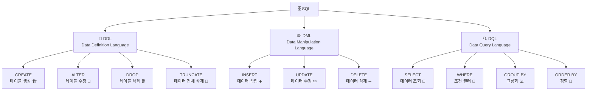
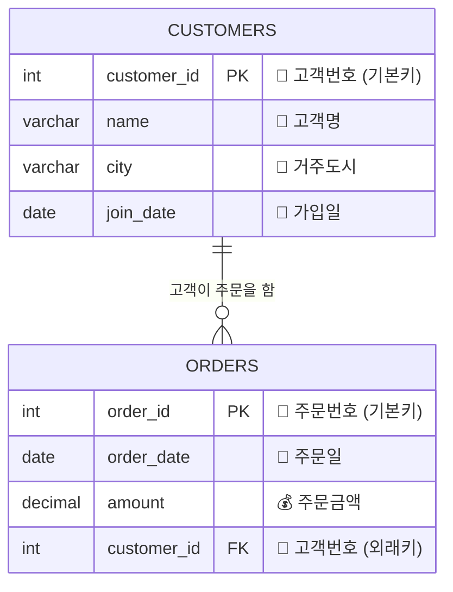
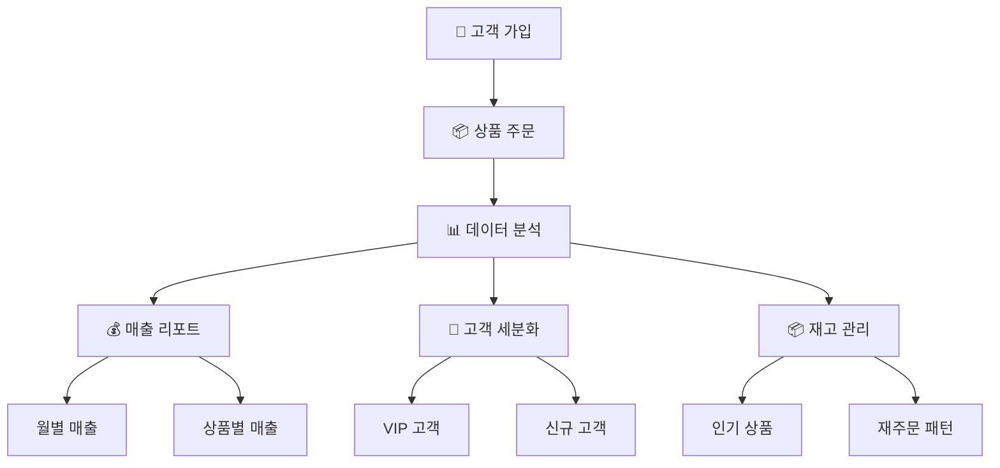

# 🗄️ SQL 완벽 가이드 - 기초부터 실무까지

 🚀  DDL, DML, DQL 등 복습


---

## 📋 목차

- [🎯 SQL이란 무엇인가?](#️-sql이란-무엇인가)
- [🏗️ 데이터베이스 기본 구조](#️-데이터베이스-기본-구조)  
- [📐 DDL - 데이터 정의어](#️-ddl---데이터-정의어)
- [✏️ DML - 데이터 조작어](#️-dml---데이터-조작어)
- [🔍 DQL - 데이터 질의어](#️-dql---데이터-질의어)
- [⚠️ 실무 치명적 실수들](#️-실무에서-주의해야-할-치명적-실수들)
- [🎮 실습 시나리오](#️-실습-시나리오)
- [🗺️ 학습 로드맵](#️-학습-로드맵)

---

## 🎯 SQL이란 무엇인가?

**SQL(Structured Query Language)**은 데이터베이스와 대화하는 언어입니다.

> 💡 **쉬운 비유**: 외국인과 대화할 때 영어를 사용하듯이, 데이터베이스와 대화할 때는 SQL을 사용해요!

### 📊 SQL의 3가지 분류



| 분류 | 역할 | 비유 | 주요 명령어 |
|------|------|------|-------------|
| **DDL** | 데이터베이스 구조 설계 | 🏗️ 건물 설계도 그리기 | CREATE, ALTER, DROP |
| **DML** | 데이터 조작 | ✏️ 엑셀에 데이터 입력/수정 | INSERT, UPDATE, DELETE |
| **DQL** | 데이터 조회 | 🔍 도서관에서 책 찾기 | SELECT, WHERE, GROUP BY |

---

## 🏗️ 데이터베이스 기본 구조

### 📊 엑셀과 데이터베이스 비교

| 엑셀 | 데이터베이스 | 설명 |
|------|--------------|------|
| 📁 **엑셀 파일** | 🗄️ **데이터베이스** | 전체 데이터 저장소 |
| 📋 **시트** | 📊 **테이블** | 실제 데이터가 저장되는 공간 |
| 📈 **열** | 🏷️ **컬럼(필드)** | 데이터의 속성 |
| ➡️ **행** | 📝 **로우(레코드)** | 실제 데이터 한 건 |

### 🎨 실습용 테이블 설계



---

## 📐 DDL - 데이터 정의어

> **DDL은 건축가가 건물 설계도를 그리는 것과 같아요!** 🏗️

### 🏠 1. CREATE TABLE - 테이블 생성

```sql
-- 🏢 고객 테이블 생성
CREATE TABLE customers (
    customer_id INT PRIMARY KEY AUTO_INCREMENT,  -- 🔑 고유번호 (자동증가)
    name        VARCHAR(50) NOT NULL,            -- 👤 이름 (필수입력)
    city        VARCHAR(50),                     -- 🏢 도시 (선택입력) 
    join_date   DATE                            -- 📅 가입일
);

-- 🛒 주문 테이블 생성
CREATE TABLE orders (
    order_id    INT PRIMARY KEY AUTO_INCREMENT,  -- 🔑 주문번호
    order_date  DATE NOT NULL,                   -- 📅 주문일
    amount      DECIMAL(10,2) NOT NULL,          -- 💰 주문금액
    customer_id INT NOT NULL,                    -- 👤 고객번호 (외래키)
    FOREIGN KEY (customer_id) REFERENCES customers(customer_id)
);
```

### 📝 데이터 타입 완전 정리

| 타입 | 설명 | 예시 | 용도 |
|------|------|------|------|
| `INT` | 정수 | `123`, `-456` | 번호, 수량 |
| `VARCHAR(n)` | 가변길이 문자 | `'홍길동'` (최대 n글자) | 이름, 제목 |
| `CHAR(n)` | 고정길이 문자 | `'A001'` (항상 n글자) | 코드, ID |
| `DATE` | 날짜 | `'2025-12-31'` | 생일, 주문일 |
| `DECIMAL(m,d)` | 정밀 소수 | `1234.56` | 금액, 비율 |

### 🔒 제약조건 완전 정리

| 제약조건 | 의미 | 실생활 비유 | 예시 |
|----------|------|-------------|------|
| `PRIMARY KEY` | 🔑 기본키 | 주민등록번호 (유일무이) | `customer_id INT PRIMARY KEY` |
| `NOT NULL` | ❗ 필수입력 | 필수항목 체크 | `name VARCHAR(50) NOT NULL` |
| `AUTO_INCREMENT` | 🔢 자동증가 | 번호표 자동발행 | `order_id INT AUTO_INCREMENT` |
| `FOREIGN KEY` | 🔗 외래키 | 회원카드 번호 | `FOREIGN KEY (customer_id)...` |

---

## ✏️ DML - 데이터 조작어

> **DML은 엑셀에서 데이터를 입력하고 수정하는 것과 똑같아요!** 📊

### ➕ 1. INSERT - 데이터 삽입

```sql
-- 👥 고객 데이터 한 번에 여러 건 입력
INSERT INTO customers (name, city, join_date) VALUES
    ('🎯 오타니', '🏢 서울', '2025-01-01'),
    ('🎨 손흥민', '🏢 대전', '2025-05-05'),
    ('🎵 박지성', '🏢 대구', '2025-07-07'),
    ('🎭 차범근', '🏢 부산', '2025-09-09'),
    ('🎪 메시', '🏢 인천', '2025-11-11'),
    ('🎬 호날두', '🏢 서울', '2025-02-02'),
    ('🎤 홀란드', '🏢 서울', '2025-04-04');

-- 🛒 주문 데이터 입력
INSERT INTO orders (customer_id, order_date, amount) VALUES
    (1, '2026-01-01', 1000.00),   -- 쇼타로의 첫 주문
    (1, '2026-01-02', 2000.15),   -- 쇼타로의 두 번째 주문
    (2, '2026-02-01', 3000.10),   -- 이안의 주문
    (2, '2026-02-02', 3000.12),   -- 이안의 두 번째 주문
    (3, '2026-03-01', 12345.67),  -- 지우의 대량 주문
    (5, '2026-05-05', 10000.00);  -- 예은의 주문
```

### ✏️ 2. UPDATE - 데이터 수정

```sql
-- 🏠 특정 고객의 도시 변경 (이사)
UPDATE customers 
SET city = '🏢 광주' 
WHERE name = '🎵 박지성';

-- 💸 2월 주문 10% 할인 이벤트
UPDATE orders 
SET amount = amount * 0.9 
WHERE order_date >= '2026-02-01';

-- 📊 여러 컬럼 동시 수정
UPDATE customers 
SET city = '🏢 세종', join_date = '2025-12-25'
WHERE customer_id = 1;
```

### ➖ 3. DELETE - 데이터 삭제

```sql
-- 🗑️ 특정 주문 취소
DELETE FROM orders 
WHERE order_id = 6;

-- 🏢 특정 도시 고객 모두 삭제 (사업 철수)
DELETE FROM customers 
WHERE city = '🏢 인천';

-- ⚠️ 조건 없으면 모든 데이터 삭제! (절대 주의!)
-- DELETE FROM customers;  -- 😱 위험!
```

---

## 🔍 DQL - 데이터 질의어

> **DQL은 도서관에서 원하는 책을 찾는 것과 같아요!** 📚

### 👀 1. 기본 SELECT 문법

```sql
-- 📋 모든 고객 조회
SELECT * FROM customers;

-- 🎯 특정 컬럼만 선택 조회
SELECT name, city FROM customers;

-- 🔄 중복 제거하여 조회 (유니크한 도시만)
SELECT DISTINCT city FROM customers;

-- 🏷️ 별칭(Alias) 사용하여 조회
SELECT 
    name AS 고객명,
    city AS 거주도시,
    join_date AS 가입일
FROM customers;
```

### 🎯 2. WHERE 조건절

```sql
-- 🏢 서울 거주 고객만 조회
SELECT * FROM customers WHERE city = '서울';

-- 📅 2025년 5월 이후 가입 고객
SELECT * FROM customers WHERE join_date >= '2025-05-01';

-- 💰 주문금액이 3000원 이상인 주문
SELECT * FROM orders WHERE amount >= 3000;

-- 🔗 여러 조건 조합 (AND, OR, NOT)
SELECT * FROM customers 
WHERE city = '서울' AND join_date >= '2025-02-01';

-- 📝 범위 조건 (BETWEEN)
SELECT * FROM orders 
WHERE amount BETWEEN 1000 AND 5000;

-- 📋 목록 조건 (IN)
SELECT * FROM customers 
WHERE city IN ('서울', '부산', '대구');

-- 🔍 패턴 검색 (LIKE)
SELECT * FROM customers 
WHERE name LIKE '%란%';  -- 이름에 '안'이 포함된 고객
```

### 📊 3. GROUP BY와 집계함수

```sql
-- 🏢 도시별 고객 수 집계
SELECT 
    city AS 도시,
    COUNT(*) AS 고객수
FROM customers 
GROUP BY city;

-- 👤 고객별 총 주문금액과 주문횟수
SELECT 
    customer_id AS 고객번호,
    COUNT(*) AS 주문횟수,
    SUM(amount) AS 총주문금액,
    AVG(amount) AS 평균주문금액,
    MAX(amount) AS 최대주문금액,
    MIN(amount) AS 최소주문금액
FROM orders 
GROUP BY customer_id;

-- 📅 월별 매출 분석
SELECT 
    DATE_FORMAT(order_date, '%Y-%m') AS 주문월,
    COUNT(*) AS 주문건수,
    SUM(amount) AS 총매출,
    AVG(amount) AS 평균주문금액
FROM orders 
GROUP BY DATE_FORMAT(order_date, '%Y-%m')
ORDER BY 주문월;
```

### 🎨 4. HAVING - 그룹 조건

```sql
-- 💰 총 주문금액이 5000원 이상인 고객만
SELECT 
    customer_id,
    SUM(amount) AS 총주문금액
FROM orders 
GROUP BY customer_id
HAVING SUM(amount) >= 5000;

-- 🏢 고객이 2명 이상인 도시만
SELECT 
    city,
    COUNT(*) AS 고객수
FROM customers 
GROUP BY city
HAVING COUNT(*) >= 2;
```

### 🔢 5. ORDER BY 정렬

```sql
-- 📅 가입일 오름차순 정렬
SELECT * FROM customers ORDER BY join_date;

-- 💰 주문금액 내림차순 정렬 (큰 것부터)
SELECT * FROM orders ORDER BY amount DESC;

-- 🏢 도시별, 가입일 순 다중 정렬
SELECT * FROM customers 
ORDER BY city, join_date;

-- 🎯 NULL 값 처리
SELECT * FROM customers 
ORDER BY city DESC NULLS LAST;  -- NULL을 마지막에
```

### ⏭️ 6. LIMIT으로 개수 제한

```sql
-- 🥇 상위 3개 주문만 조회 (TOP 3)
SELECT * FROM orders 
ORDER BY amount DESC 
LIMIT 3;

-- 📄 페이징 처리 (2번째부터 3개씩)
SELECT * FROM orders 
ORDER BY order_date 
LIMIT 3 OFFSET 3;  -- 또는 LIMIT 3, 3

-- 🎯 각 고객의 최신 주문 1건씩
SELECT DISTINCT customer_id, 
       FIRST_VALUE(order_date) OVER (PARTITION BY customer_id ORDER BY order_date DESC) as 최신주문일
FROM orders;
```

### 🔗 7. JOIN 맛보기

```sql
-- 👥 고객정보와 주문정보 함께 조회
SELECT 
    c.name AS 고객명,
    c.city AS 거주도시,
    o.order_date AS 주문일,
    o.amount AS 주문금액
FROM customers c
INNER JOIN orders o ON c.customer_id = o.customer_id
ORDER BY o.order_date DESC;

-- 🏢 도시별 총 매출 (JOIN + GROUP BY)
SELECT 
    c.city AS 도시,
    COUNT(o.order_id) AS 주문건수,
    SUM(o.amount) AS 총매출
FROM customers c
INNER JOIN orders o ON c.customer_id = o.customer_id
GROUP BY c.city
ORDER BY 총매출 DESC;
```

---

## ⚠️ 실무에서 주의해야 할 치명적 실수들

> **20년차 DBA가 실제로 겪거나 목격한 실무 사고들입니다** 😱

### 🔥 1. DML 관련 치명적 실수

#### ❌ WHERE 절 없는 UPDATE/DELETE

```sql
-- 😱 절대 하지 말 것! 전체 주문 데이터 삭제
DELETE FROM orders;

-- 😱 모든 고객 이름이 '홍길동'으로 변경
UPDATE customers SET name = '홍길동';

-- ✅ 올바른 방법 - 반드시 WHERE 조건 추가
DELETE FROM orders WHERE order_id = 5;
UPDATE customers SET name = '홍길동' WHERE customer_id = 1;
```

#### 💡 **실무 팁: 안전한 UPDATE/DELETE 방법**

```sql
-- 1️⃣ 먼저 SELECT로 확인
SELECT * FROM customers WHERE city = '대구';

-- 2️⃣ 확인 후 DELETE 실행  
DELETE FROM customers WHERE city = '대구';

-- 3️⃣ 트랜잭션 사용 (안전장치)
START TRANSACTION;
DELETE FROM orders WHERE order_date < '2025-01-01';
-- 확인 후 COMMIT 또는 ROLLBACK
COMMIT;
```

#### 🔒 트랜잭션 없이 중요한 작업

```sql
-- 😱 계좌이체 시 트랜잭션 미사용 (중간에 오류나면 돈 증발!)
UPDATE accounts SET balance = balance - 100000 WHERE account_id = 1;  -- A계좌 출금
UPDATE accounts SET balance = balance + 100000 WHERE account_id = 2;  -- B계좌 입금

-- ✅ 트랜잭션으로 안전하게
START TRANSACTION;
    UPDATE accounts SET balance = balance - 100000 WHERE account_id = 1;
    UPDATE accounts SET balance = balance + 100000 WHERE account_id = 2;
    -- 모든 작업이 성공했을 때만 COMMIT
COMMIT;
-- 오류 발생시 ROLLBACK으로 모든 작업 취소
```

### 🗑️ 2. DDL 관련 치명적 실수

#### 💥 운영 중인 테이블 DROP

```sql
-- 😱 절대 금지! 테이블과 데이터가 영구 삭제
DROP TABLE customers;  

-- 😱 데이터베이스 전체 삭제 (회사 망함)
DROP DATABASE production_db;

-- ✅ 데이터만 삭제하고 구조는 유지
TRUNCATE TABLE temp_customers;  -- 임시 테이블만!

-- ✅ 안전한 삭제 순서
-- 1. 백업 생성
-- 2. 테스트 환경에서 검증  
-- 3. 점검시간에 운영환경 적용
```

#### 📋 백업 없이 스키마 변경

```sql
-- 😱 위험! 컬럼 삭제시 데이터 영구 손실
ALTER TABLE customers DROP COLUMN email;

-- 😱 데이터 타입 변경으로 데이터 손실
ALTER TABLE orders MODIFY COLUMN amount INT;  -- 소수점 손실

-- ✅ 안전한 스키마 변경 절차
-- 1. 전체 DB 백업
-- 2. 새 컬럼 추가 후 데이터 마이그레이션
-- 3. 검증 완료 후 기존 컬럼 삭제
ALTER TABLE customers ADD COLUMN new_email VARCHAR(100);
-- 데이터 복사 및 검증 과정...
-- ALTER TABLE customers DROP COLUMN email;  -- 나중에 삭제
```

### 🐌 3. 성능 관련 치명적 실수

```sql
-- 😱 인덱스 무시하는 쿼리 (느려터짐)
SELECT * FROM orders 
WHERE YEAR(order_date) = 2026;  -- 함수 사용으로 인덱스 타지 않음

-- 😱 전체 테이블 스캔 유발
SELECT * FROM customers 
WHERE name LIKE '%김%';  -- 앞에 %가 있으면 인덱스 못 씀

-- ✅ 인덱스 활용 가능한 조건
SELECT * FROM orders 
WHERE order_date >= '2026-01-01' AND order_date < '2027-01-01';

SELECT * FROM customers 
WHERE name LIKE '김%';  -- 뒤에만 %가 있으면 인덱스 활용 가능
```

### 🚨 **실무 사고 사례들**

| 사고 유형 | 실제 사례 | 결과 | 예방법 |
|----------|----------|------|--------|
| **WHERE 절 누락** | `DELETE FROM users` | 😱 전체 회원정보 삭제 | ✅ 항상 SELECT로 먼저 확인 |
| **잘못된 JOIN** | `UPDATE A, B SET A.status = 'D'` | 😱 모든 데이터 상태 변경 | ✅ JOIN 조건 필수 확인 |
| **운영DB 접속** | 개발용 스크립트를 운영DB에 실행 | 😱 실서비스 중단 | ✅ 접속 정보 이중 확인 |
| **인덱스 삭제** | 성능 튜닝 중 인덱스 DROP | 😱 서비스 응답시간 폭증 | ✅ 실행계획 사전 분석 |

---

## 🎮 실습 시나리오

### 📈 시나리오 1: 전자상거래 데이터 분석



#### 🎯 **레벨 1: 기본 조회 연습**

```sql
-- 🏢 서울 거주 고객 목록
SELECT name, join_date 
FROM customers 
WHERE city = '서울'
ORDER BY join_date;

-- 📅 2026년 1월 주문 내역  
SELECT order_id, customer_id, order_date, amount
FROM orders
WHERE order_date >= '2026-01-01' AND order_date < '2026-02-01'
ORDER BY order_date;

-- 💰 주문금액 상위 5건
SELECT customer_id, order_date, amount
FROM orders
ORDER BY amount DESC
LIMIT 5;
```

#### 🎯 **레벨 2: 집계 분석 연습**

```sql
-- 🏢 도시별 고객 수와 평균 주문금액
SELECT 
    c.city AS 도시,
    COUNT(DISTINCT c.customer_id) AS 고객수,
    COUNT(o.order_id) AS 총주문건수,
    ROUND(AVG(o.amount), 2) AS 평균주문금액
FROM customers c
LEFT JOIN orders o ON c.customer_id = o.customer_id
GROUP BY c.city
ORDER BY 평균주문금액 DESC;

-- 📊 월별 매출 추이
SELECT 
    DATE_FORMAT(order_date, '%Y-%m') AS 월,
    COUNT(*) AS 주문건수,
    SUM(amount) AS 총매출,
    ROUND(AVG(amount), 2) AS 평균주문금액
FROM orders
GROUP BY DATE_FORMAT(order_date, '%Y-%m')
ORDER BY 월;

-- 👤 고객별 주문 현황
SELECT 
    c.name AS 고객명,
    c.city AS 거주도시,
    COUNT(o.order_id) AS 주문횟수,
    COALESCE(SUM(o.amount), 0) AS 총주문금액,
    COALESCE(MAX(o.order_date), '주문없음') AS 최근주문일
FROM customers c
LEFT JOIN orders o ON c.customer_id = o.customer_id
GROUP BY c.customer_id, c.name, c.city
ORDER BY 총주문금액 DESC;
```

#### 🎯 **레벨 3: 실무 응용 연습**

```sql
-- 🌟 VIP 고객 (총 주문금액 5000원 이상)
SELECT 
    c.customer_id,
    c.name AS VIP고객명,
    c.city AS 거주도시,
    COUNT(o.order_id) AS 주문횟수,
    SUM(o.amount) AS 총주문금액,
    ROUND(AVG(o.amount), 2) AS 평균주문금액
FROM customers c
INNER JOIN orders o ON c.customer_id = o.customer_id
GROUP BY c.customer_id, c.name, c.city
HAVING SUM(o.amount) >= 5000
ORDER BY 총주문금액 DESC;

-- 😢 휴면 고객 (한 번도 주문하지 않은 고객)
SELECT 
    c.customer_id,
    c.name AS 휴면고객,
    c.city AS 거주도시,
    c.join_date AS 가입일,
    DATEDIFF(CURDATE(), c.join_date) AS 가입후일수
FROM customers c
LEFT JOIN orders o ON c.customer_id = o.customer_id
WHERE o.customer_id IS NULL
ORDER BY c.join_date;

-- 📈 고객 생애가치 분석 (CLV - Customer Lifetime Value)
SELECT 
    c.name AS 고객명,
    DATEDIFF(MAX(o.order_date), MIN(o.order_date)) + 1 AS 활동기간일,
    COUNT(o.order_id) AS 총주문횟수,
    SUM(o.amount) AS 총구매액,
    ROUND(SUM(o.amount) / COUNT(o.order_id), 2) AS 평균주문금액,
    CASE 
        WHEN SUM(o.amount) >= 10000 THEN '🥇 플래티넘'
        WHEN SUM(o.amount) >= 5000 THEN '🥈 골드'  
        WHEN SUM(o.amount) >= 1000 THEN '🥉 실버'
        ELSE '🔰 브론즈'
    END AS 고객등급
FROM customers c
INNER JOIN orders o ON c.customer_id = o.customer_id
GROUP BY c.customer_id, c.name
ORDER BY 총구매액 DESC;
```

### 🔧 시나리오 2: 데이터 품질 관리

```sql
-- 🔍 중복 데이터 탐지
SELECT 
    name, 
    city, 
    COUNT(*) AS 중복건수
FROM customers 
GROUP BY name, city 
HAVING COUNT(*) > 1;

-- ⚠️ 데이터 이상치 검증
SELECT '주문금액 이상' AS 검증항목, COUNT(*) AS 이상건수
FROM orders WHERE amount <= 0 OR amount IS NULL
UNION ALL
SELECT '미래 주문일' AS 검증항목, COUNT(*) AS 이상건수  
FROM orders WHERE order_date > CURDATE()
UNION ALL
SELECT '가입일 이상' AS 검증항목, COUNT(*) AS 이상건수
FROM customers WHERE join_date > CURDATE();

-- 🔗 참조 무결성 검사 (존재하지 않는 고객의 주문)
SELECT 
    o.order_id AS 문제주문번호,
    o.customer_id AS 존재하지않는고객번호,
    o.order_date,
    o.amount
FROM orders o
LEFT JOIN customers c ON o.customer_id = c
