# 멋쟁이사자처럼 13일차 - SQL 데이터베이스 마스터 🗃️
*JOIN과 데이터 분석의 세계로* 

---

## 📅 학습 정보
- **날짜**: 2025년 8월 14일
- **주제**: SQL JOIN과 데이터 분석
- **난이도**: ⭐⭐⭐⭐

---

## 🎯 오늘의 핵심 학습 목표

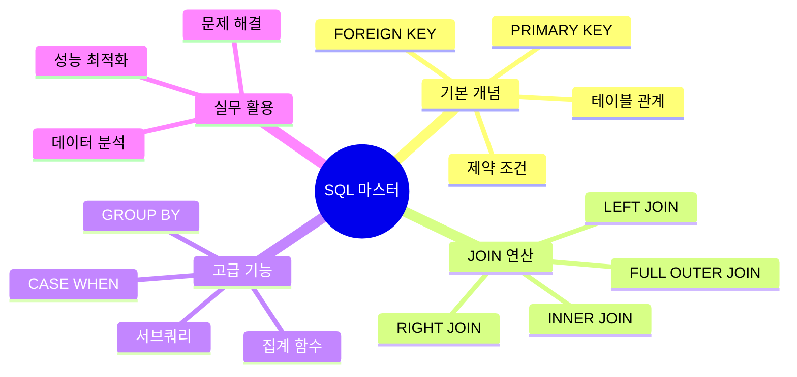

---

## 📚 주요 학습 내용

### 🏗️ **데이터베이스 구조 설계**

#### 테이블 관계 설계
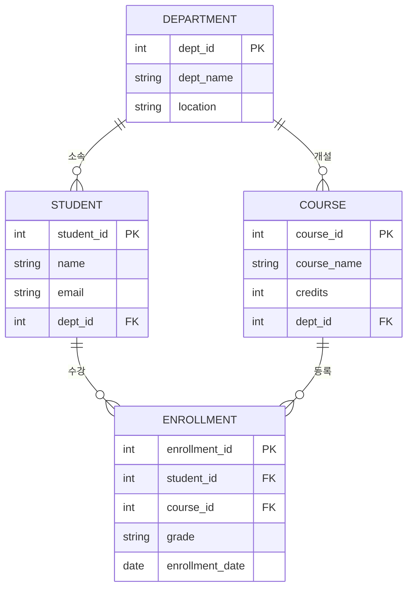

### 🔗 **JOIN 연산의 이해**

#### JOIN의 종류와 특징
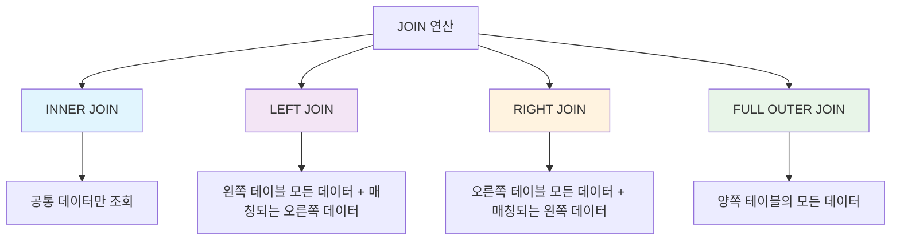

#### 실전 JOIN 예제
```sql
-- LEFT JOIN을 활용한 사용자 확인률 계산
SELECT user_id,
       ROUND(AVG(CASE WHEN action = 'confirmed' THEN 1 ELSE 0 END), 2) 
       AS confirmation_rate
FROM Signups s
LEFT JOIN Confirmations c
USING (user_id)
GROUP BY user_id;
```

### 📊 **집계 함수와 조건부 로직**

#### CASE WHEN 문의 활용
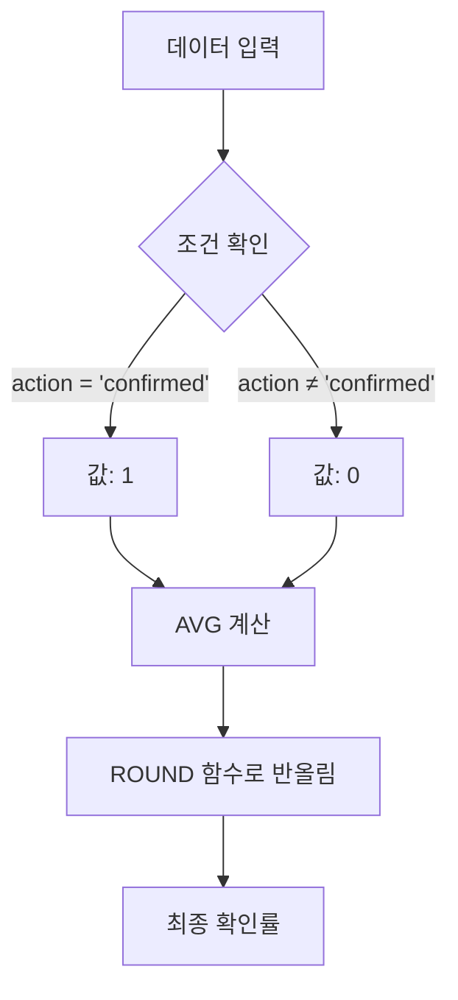

---

## 🛠️ 실습 프로젝트

### 🔍 **SQL Murder Mystery**
- **링크**: [SQL Murder Mystery](https://mystery.knightlab.com/walkthrough.html)
- **목표**: SQL 쿼리를 활용한 범인 찾기
- **학습 효과**: 복합 쿼리 작성 능력 향상

### 📈 **사용자 확인률 분석 프로젝트**

#### 문제 상황
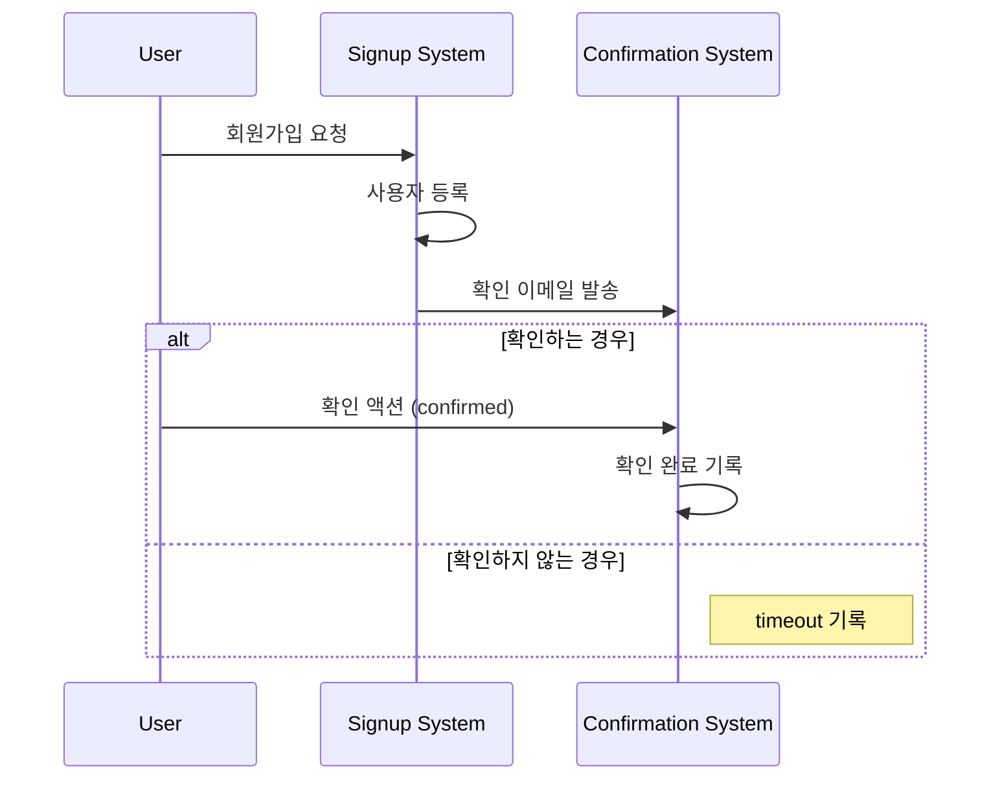

#### 해결 과정
1. **테이블 분석**: Signups와 Confirmations 테이블 구조 파악
2. **JOIN 전략**: LEFT JOIN으로 모든 사용자 포함
3. **조건부 계산**: CASE WHEN으로 확인률 계산
4. **결과 정리**: ROUND 함수로 소수점 처리

---

## 🎨 디자인 리소스 탐색

### 🖼️ **아이콘 및 에셋 사이트**

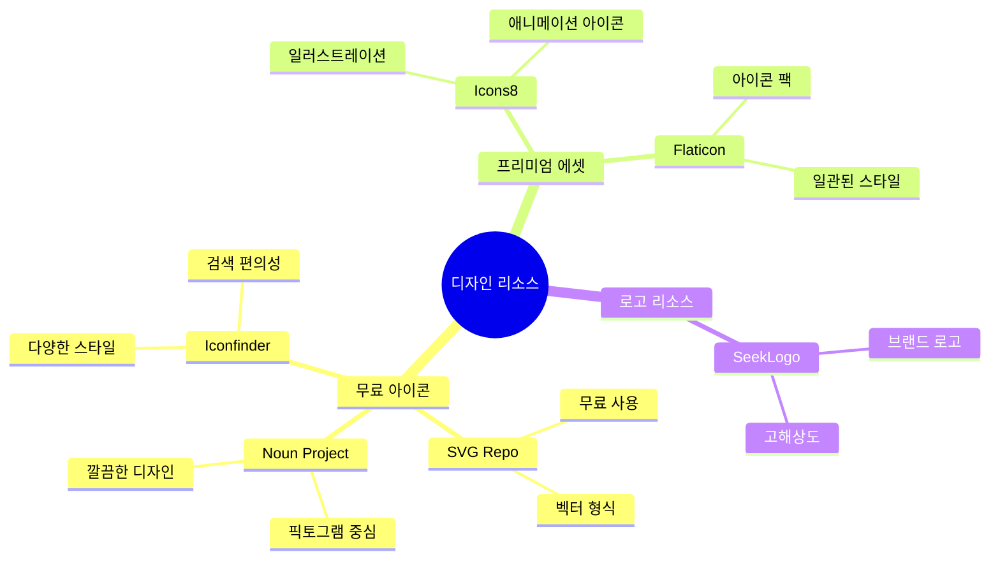

### 📱 **UI/UX 디자인 트렌드**
- **미니멀리즘**: 깔끔하고 직관적인 인터페이스
- **아이콘 중심**: 텍스트보다는 시각적 요소 강조
- **일관성**: 통일된 디자인 시스템 구축

---

## 🤖 AI를 활용한 학습 최적화

### 📝 **초심자용 AI 보강**
- **링크**: [Gemini 초심자 가이드](https://g.co/gemini/share/a795ff183188)
- **활용법**: 복잡한 SQL 개념을 쉬운 예제로 설명

### 💼 **면접 준비용 AI 보강**
- **링크**: [Gemini 면접 대비](https://g.co/gemini/share/a80a9c123d11)
- **활용법**: 실무 시나리오 기반 SQL 문제 연습

### 🔄 **회고 시스템**
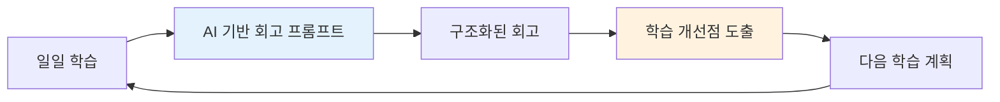

---

## 🚨 문제 해결 경험

### ⚠️ **외래키 제약조건 오류**
```sql
-- 오류 발생
-- Cannot drop table 'department' referenced by a foreign key constraint

-- 해결 방법: 순서대로 테이블 삭제
DROP TABLE IF EXISTS enrollment;
DROP TABLE IF EXISTS student;
DROP TABLE IF EXISTS course;
DROP TABLE IF EXISTS department;
```

#### 해결 과정 시각화
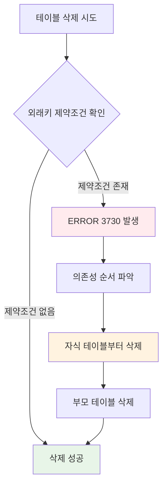

---

## 📈 학습 성과 및 분석

### 🎯 **오늘의 성취도**
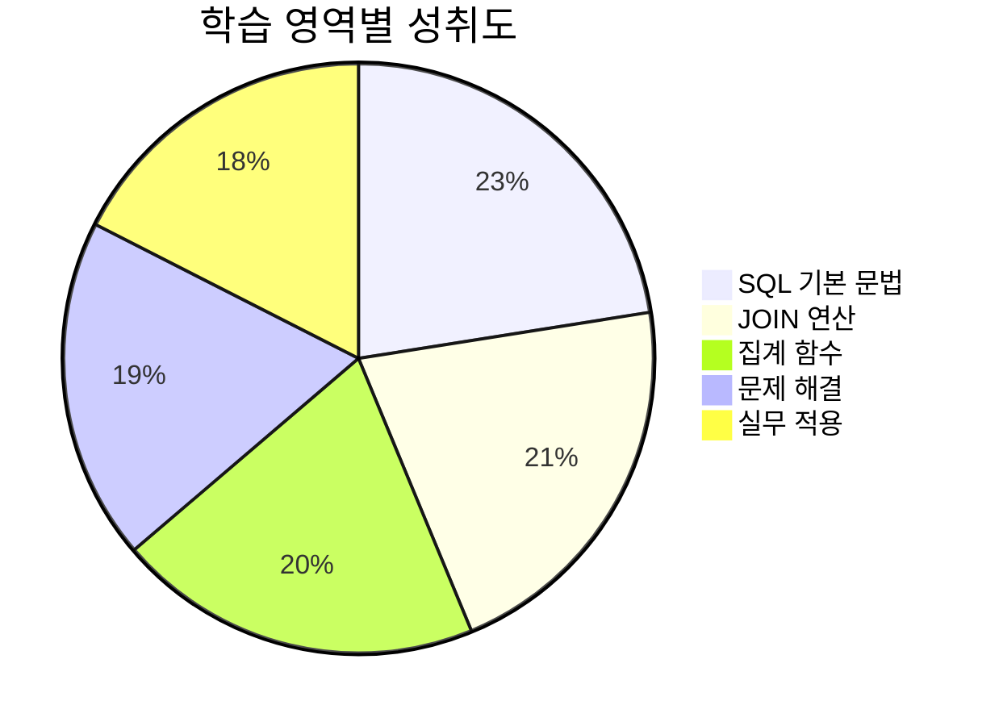

### 📊 **시간별 학습 분포**
```mermaid
gantt
    title 13일차 학습 일정
    dateFormat HH:mm
    axisFormat %H:%M
    
    section 오전 세션
    기본 개념 복습     :09:00, 10:00
    테이블 설계        :10:00, 11:00
    JOIN 실습         :11:00, 12:00
    
    section 오후 세션
    고급 쿼리 작성     :13:00, 14:30
    문제 해결 실습     :14:30, 16:00
    프로젝트 실습      :16:00, 17:30
```

---

## 💡 핵심 깨달음

### 🧠 **개념적 이해**
> **"데이터는 관계를 통해 의미를 갖는다"**

SQL의 진정한 힘은 단순한 데이터 조회가 아니라, **테이블 간의 관계를 통해 의미있는 정보를 추출하는 것**임을 깨달았습니다.

### 🔍 **실무적 인사이트**
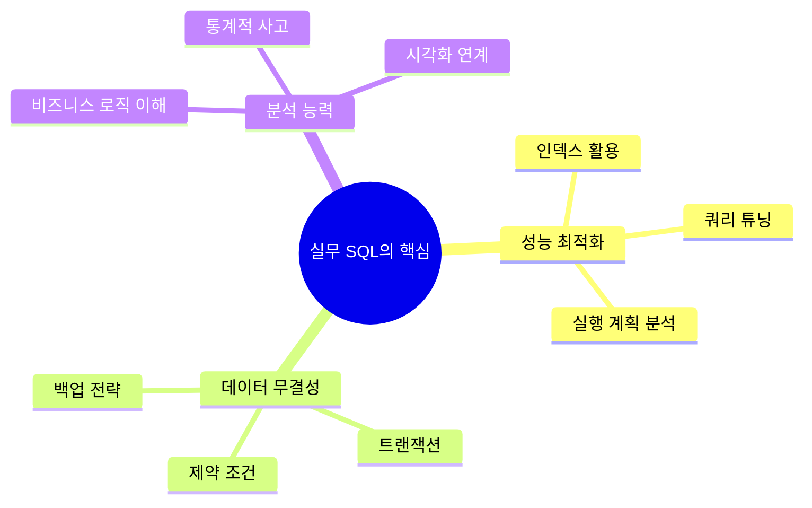

---

## 📚 추가 학습 리소스

### 📖 **온라인 학습 플랫폼**
- [Wikidocs](https://wikidocs.net/) - 한국어 SQL 가이드
- [Programiz SQL](https://www.programiz.com/sql) - 기초부터 고급까지
- [Kaggle Learn SQL](https://www.kaggle.com/learn/intro-to-sql) - 실전 데이터 분석

### 🎮 **실습 플랫폼**
- [SQL Murder Mystery](https://mystery.knightlab.com/) - 게임형 학습
- [HackerRank SQL](https://www.hackerrank.com/domains/sql) - 단계별 문제 해결
- [LeetCode Database](https://leetcode.com/problemset/database/) - 면접 대비 문제

---

## 🎯 내일의 학습 목표

### 🚀 **우선순위 높음**
- [ ] **서브쿼리와 CTE** 마스터
- [ ] **윈도우 함수** 학습
- [ ] **인덱스 최적화** 실습
- [ ] **트랜잭션 관리** 이해

### 📋 **추가 학습 계획**
- [ ] **NoSQL vs SQL** 비교 분석
- [ ] **데이터베이스 설계 패턴** 학습
- [ ] **실제 프로젝트 데이터** 분석 경험

---

## 🏁 오늘의 마무리

13일차는 **"데이터의 연결고리를 찾는 탐정"**이 된 기분이었습니다. 

SQL JOIN을 통해 흩어진 데이터들이 하나의 의미있는 이야기를 만들어가는 과정에서, 데이터베이스의 진정한 가치를 체험할 수 있었습니다. 특히 외래키 제약조건 오류를 해결하면서 **데이터 무결성의 중요성**을 몸소 느꼈습니다.

앞으로는 더 복잡한 쿼리 작성과 성능 최적화에 도전하여 **실무에서 바로 활용할 수 있는 SQL 전문가**로 성장하겠습니다! 

---

*"데이터 속에서 인사이트를 찾아내는 SQL 마스터가 되자!"* 🗃️✨

---

**작성일**: 2025년 8월 14일  
**태그**: `#SQL` `#데이터베이스` `#JOIN` `#데이터분석` `#멋쟁이사자처럼`