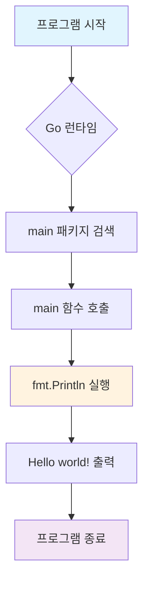
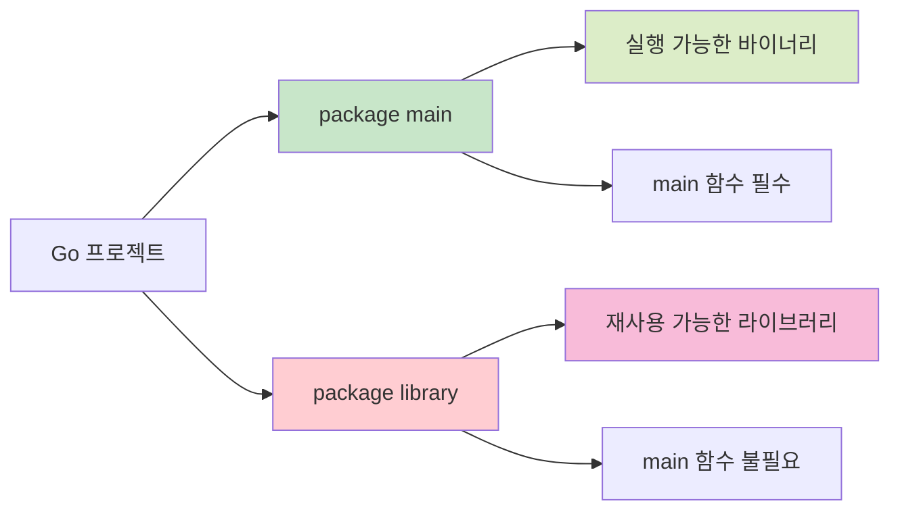
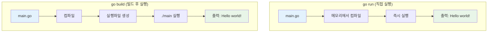
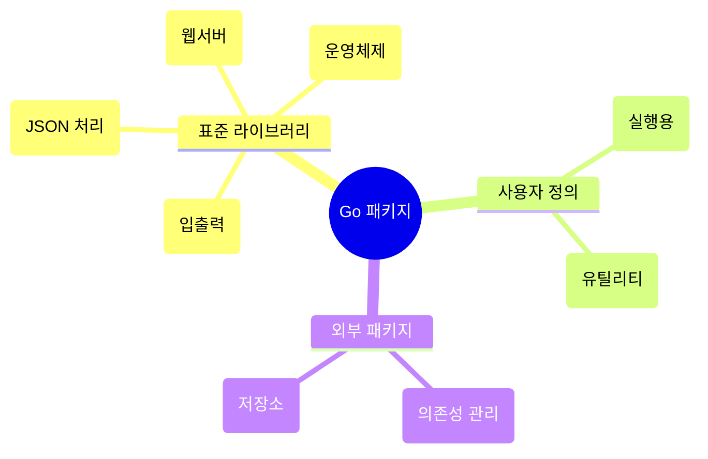
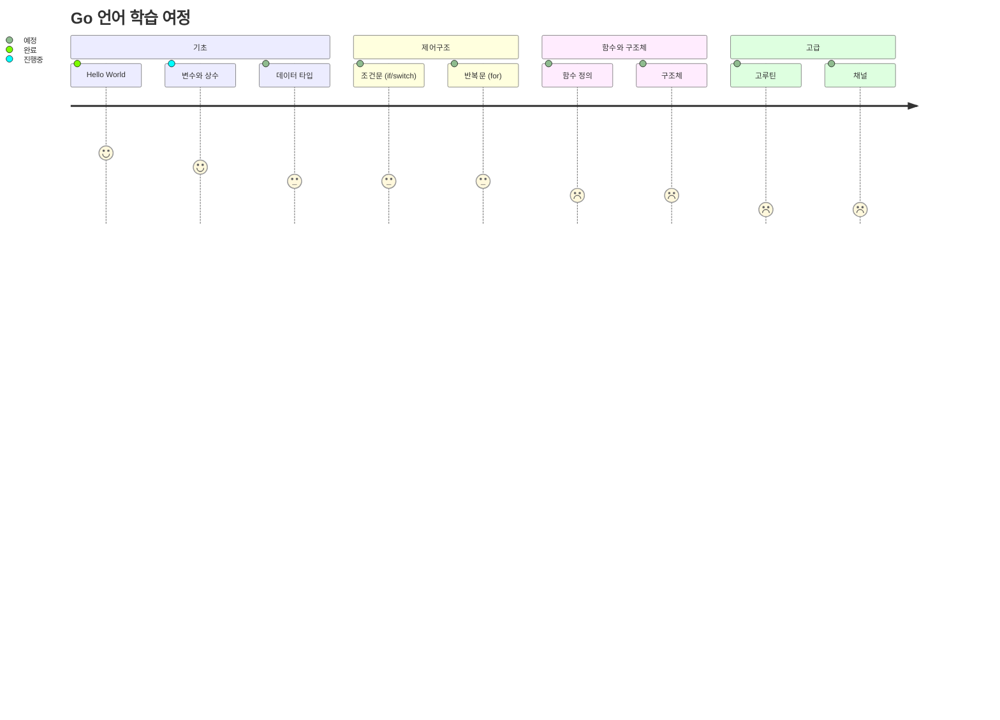

# Go 언어 Hello World 완벽 가이드 🚀

## 📝 기본 코드 분석

```go
package main

import "fmt"

func main() {
    fmt.Println("Hello world!")
}
```

### 🔍 코드 구성 요소 상세 분석

#### 1. `package main`
- **역할**: 패키지 선언부
- **중요성**: Go 프로그램의 **진입점(Entry Point)**
- **특징**: `main` 패키지만이 실행 가능한 바이너리 파일을 생성
- **다른 패키지**: 라이브러리 형태로만 동작

#### 2. `import "fmt"`
- **역할**: 패키지 임포트
- **fmt**: **Formatted I/O** 표준 라이브러리
- **기능**: 콘솔 입출력 함수들 제공 (`Print`, `Println`, `Printf` 등)

#### 3. `func main()`
- **역할**: 메인 함수 (프로그램 실행 시작점)
- **특징**: Go 런타임이 자동으로 호출
- **반환값**: 없음 (void)

#### 4. `fmt.Println("Hello world!")`
- **역할**: 문자열 출력 + 자동 줄바꿈
- **다른 옵션**: 
  - `fmt.Print()`: 줄바꿈 없음
  - `fmt.Printf()`: 포맷 문자열 사용

---

## 🏃‍♂️ 실행 방법

### ✅ 사전 준비: Go 설치 확인

```bash
go version
```

### 📁 파일 생성
`main.go` 파일에 코드 저장

### 🚀 실행 방법 2가지

#### 방법 1: 직접 실행 (개발 중 추천)
```bash
go run main.go
```
- 컴파일 + 실행을 한 번에 처리
- 개발/테스트 단계에서 편리

#### 방법 2: 빌드 후 실행 (배포용)
```bash
# 1단계: 빌드
go build main.go

# 2단계: 실행
./main        # macOS/Linux
main.exe      # Windows
```

### 💡 추가 실행 팁
```bash
# 현재 디렉토리의 모든 Go 파일 실행
go run .

# 특정 이름으로 빌드
go build -o myprogram main.go
```

---

## 📊 프로그램 실행 흐름



---

## 🏗️ Go 언어 프로젝트 구조



---

## 🔄 컴파일 vs 실행 프로세스 비교



---

## 🎯 Go 언어의 핵심 특징

### ✨ 문법적 특징
- **세미콜론 불필요**: 자동으로 삽입
- **강타입 언어**: 컴파일 시 타입 검사
- **가비지 컬렉션**: 자동 메모리 관리
- **동시성 지원**: 고루틴(Goroutine)으로 쉬운 병렬 처리

### 📦 패키지 시스템


---

## 🚀 다음 단계 학습 로드맵



---

## 💻 실습 예제

### 확장된 Hello World
```go
package main

import (
    "fmt"
    "time"
)

func main() {
    fmt.Println("Hello world!")
    fmt.Printf("현재 시간: %v\n", time.Now())
    
    name := "Go 언어"
    fmt.Printf("안녕하세요, %s!\n", name)
}
```

### 실행 결과
```
Hello world!
현재 시간: 2025-08-16 15:30:45 +0900 KST
안녕하세요, Go 언어!
```

---

## 📚 참고 자료

- [Go 공식 문서](https://golang.org/doc/)
- [Go Tour](https://tour.golang.org/)
- [Go by Example](https://gobyexample.com/)

---

> 🎉 **축하합니다!** Go 언어의 첫 걸음을 성공적으로 완료했습니다!
