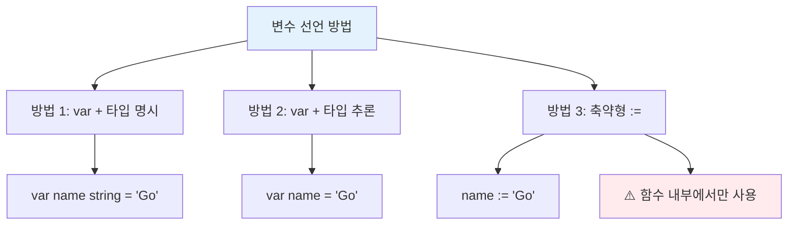
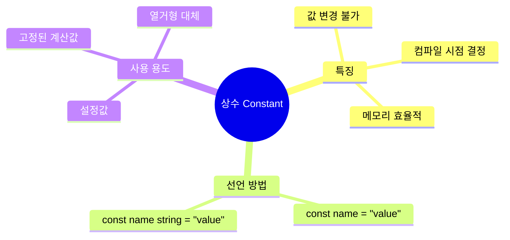
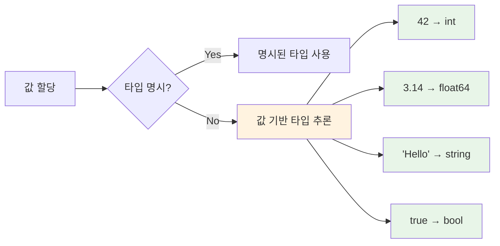
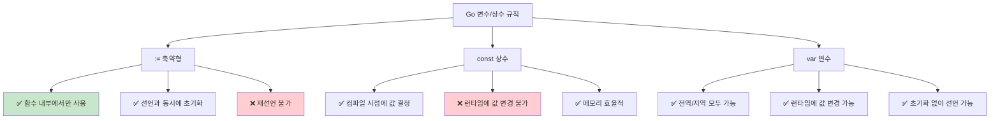
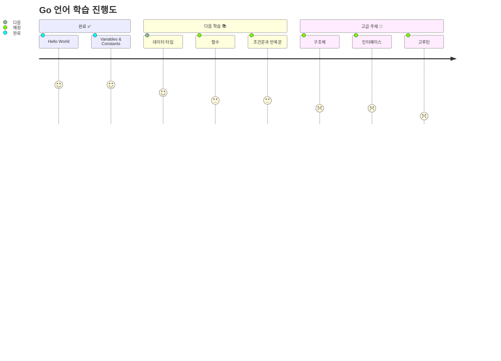

v# 📚 Go 언어 - Variables & Constants 완벽 가이드

> 🎯 **목표**: Go 언어의 변수와 상수를 완벽하게 이해하고 실무에서 활용할 수 있도록 학습

---

## 1️⃣ 기본 개념 정리

### 📊 변수 vs 상수 비교표

| 구분 | 변수 (Variable) | 상수 (Constant) |
|------|----------------|-----------------|
| **정의** | 값을 저장하는 공간 | 변경 불가능한 값 |
| **값 변경** | ✅ 가능 | ❌ 불가능 |
| **키워드** | `var` 또는 `:=` | `const` |
| **타입 지정** | 명시적/추론 가능 | 명시적/추론 가능 |
| **사용 시점** | 런타임에 값 할당 가능 | 컴파일 시점에 값 결정 |

---

## 2️⃣ 변수 (Variables) 완벽 가이드

### 🔍 변수 선언 방법 3가지



### 💻 코드 예제: 변수 선언 방법들

```go
package main

import "fmt"

// 전역 변수 (패키지 레벨)
var globalVar string = "전역 변수"

func main() {
    // 방법 1: var + 타입 명시
    var name string = "nico"
    var age int = 25
    var isStudent bool = true
    
    // 방법 2: var + 타입 추론
    var city = "Seoul"        // string으로 추론
    var temperature = 25.5    // float64로 추론
    
    // 방법 3: 축약형 := (함수 내부에서만 사용 가능)
    country := "Korea"        // string으로 추론
    score := 95              // int로 추론
    
    // 값 변경 가능 ✅
    name = "Lynn"
    age = 30
    
    fmt.Println("이름:", name)
    fmt.Println("나이:", age)
    fmt.Println("학생 여부:", isStudent)
    fmt.Println("도시:", city)
    fmt.Println("온도:", temperature)
    fmt.Println("국가:", country)
    fmt.Println("점수:", score)
}
```

### 🚀 실행 결과
```
이름: Lynn
나이: 30
학생 여부: true
도시: Seoul
온도: 25.5
국가: Korea
점수: 95
```

---

## 3️⃣ 상수 (Constants) 완벽 가이드

### 🔒 상수의 특징



### 💻 코드 예제: 상수 사용법

```go
package main

import "fmt"

const (
    // 타입 없는 상수 (추천)
    AppName = "My Go App"
    Version = "1.0.0"
    MaxUsers = 1000
    Pi = 3.14159
    
    // 타입 명시 상수
    DatabaseURL string = "localhost:5432"
    Port int = 8080
    Debug bool = true
)

func main() {
    fmt.Println("앱 이름:", AppName)
    fmt.Println("버전:", Version)
    fmt.Println("최대 사용자:", MaxUsers)
    fmt.Println("파이:", Pi)
    fmt.Println("DB URL:", DatabaseURL)
    fmt.Println("포트:", Port)
    fmt.Println("디버그 모드:", Debug)
    
    // ❌ 상수 값 변경 시도 (컴파일 에러)
    // AppName = "New App"  // cannot assign to AppName
}
```

### ❌ 상수 변경 시도 - 컴파일 에러

```go
package main

import "fmt"

func main() {
    const name string = "nico"
    
    // ❌ 컴파일 에러 발생
    name = "Lynn" // Error: cannot assign to name
    
    fmt.Println(name)
}
```

**에러 메시지:**
```
cannot assign to name (declared const)
```

---

## 4️⃣ 변수 vs 상수 실행 흐름 비교

```mermaid
flowchart TD
    subgraph "변수 (Variable) 흐름"
        A1[var name := "Go"] --> B1[메모리에 공간 할당]
        B1 --> C1[값 저장: "Go"]
        C1 --> D1[값 변경 가능 ✅]
        D1 --> E1[name = "Golang"]
        E1 --> F1[새로운 값으로 업데이트]
    end
    
    subgraph "상수 (Constant) 흐름"
        A2[const name = "Go"] --> B2[컴파일 시점에 값 결정]
        B2 --> C2[프로그램에 값 임베딩]
        C2 --> D2[값 변경 시도 ❌]
        D2 --> E2[컴파일 에러 발생]
    end
    
    style D1 fill:#c8e6c9
    style E2 fill:#ffcdd2
```

---

## 5️⃣ 타입 시스템과 추론

### 🔍 Go의 타입 추론 메커니즘



### 💻 타입 추론 예제

```go
package main

import "fmt"

func main() {
    // 타입 추론 예제
    var number = 42          // int로 추론
    var price = 99.99        // float64로 추론
    var message = "Hello"    // string으로 추론
    var active = true        // bool로 추론
    
    // 축약형도 동일하게 추론
    count := 100            // int
    rate := 0.85           // float64
    
    // 타입 확인 (%T 포맷터 사용)
    fmt.Printf("number 타입: %T, 값: %v\n", number, number)
    fmt.Printf("price 타입: %T, 값: %v\n", price, price)
    fmt.Printf("message 타입: %T, 값: %v\n", message, message)
    fmt.Printf("active 타입: %T, 값: %v\n", active, active)
    fmt.Printf("count 타입: %T, 값: %v\n", count, count)
    fmt.Printf("rate 타입: %T, 값: %v\n", rate, rate)
}
```

### 🚀 실행 결과
```
number 타입: int, 값: 42
price 타입: float64, 값: 99.99
message 타입: string, 값: Hello
active 타입: bool, 값: true
count 타입: int, 값: 100
rate 타입: float64, 값: 0.85
```

---

## 6️⃣ 실무 활용 패턴

### 🏗️ 프로젝트에서 상수 활용하기

```go
package main

import "fmt"

// 설정 관련 상수
const (
    // 서버 설정
    DefaultPort = 8080
    MaxConnections = 1000
    TimeoutSeconds = 30
    
    // 비즈니스 규칙
    MaxUsernameLength = 50
    MinPasswordLength = 8
    MaxFileSize = 10 * 1024 * 1024  // 10MB
)

// 에러 메시지 상수
const (
    ErrInvalidInput = "입력값이 올바르지 않습니다"
    ErrUserNotFound = "사용자를 찾을 수 없습니다"
    ErrPermissionDenied = "권한이 없습니다"
)

func main() {
    // 변수로 동적 데이터 관리
    var (
        currentUsers int = 0
        serverStatus string = "running"
        lastUpdate = "2025-08-16"
    )
    
    fmt.Println("=== 서버 설정 ===")
    fmt.Printf("포트: %d\n", DefaultPort)
    fmt.Printf("최대 연결: %d\n", MaxConnections)
    fmt.Printf("타임아웃: %d초\n", TimeoutSeconds)
    
    fmt.Println("\n=== 현재 상태 ===")
    fmt.Printf("현재 사용자: %d명\n", currentUsers)
    fmt.Printf("서버 상태: %s\n", serverStatus)
    fmt.Printf("마지막 업데이트: %s\n", lastUpdate)
    
    // 상수를 이용한 유효성 검사 예제
    username := "user123"
    if len(username) > MaxUsernameLength {
        fmt.Println(ErrInvalidInput)
    } else {
        fmt.Printf("사용자명 '%s'가 등록되었습니다.\n", username)
    }
}
```

---

## 7️⃣ 주요 특징 및 주의사항

### ⚠️ 중요한 규칙들



### 💡 베스트 프랙티스

1. **상수 사용 권장 상황**:
   - 설정값 (포트, 타임아웃 등)
   - 에러 메시지
   - 고정된 계산값
   - 열거형 값들

2. **변수 사용 권장 상황**:
   - 사용자 입력값
   - 계산 결과
   - 상태 정보
   - 동적으로 변경되는 데이터

3. **축약형(`:=`) 사용 팁**:
   - 함수 내부에서 짧고 명확한 변수명에 사용
   - 타입이 명확할 때 사용
   - 초기값이 있을 때만 사용

---

## 8️⃣ 학습 체크리스트

- [ ] 변수와 상수의 차이점 이해
- [ ] `var`, `const`, `:=` 각각의 사용법 숙지
- [ ] 타입 추론 메커니즘 이해
- [ ] 축약형(`:=`)의 제한사항 파악
- [ ] 실무에서 상수 활용 방법 이해
- [ ] 컴파일 에러와 런타임 에러 구분

---

## 9️⃣ 다음 학습 주제



---

## 📚 참고 자료

- [Go 공식 문서 - Variables](https://golang.org/ref/spec#Variables)
- [Go 공식 문서 - Constants](https://golang.org/ref/spec#Constants)
- [Effective Go - Constants](https://golang.org/doc/effective_go#constants)

---

> 🎉 **축하합니다!** Go 언어의 변수와 상수를 완벽하게 마스터했습니다!  
> 다음 단계로 데이터 타입을 학습해보세요! 🚀
