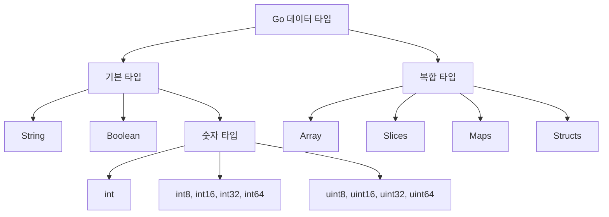
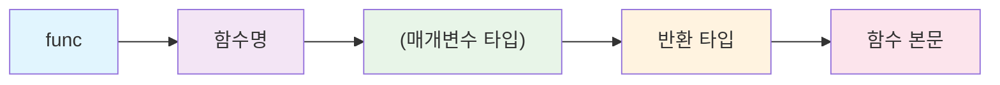
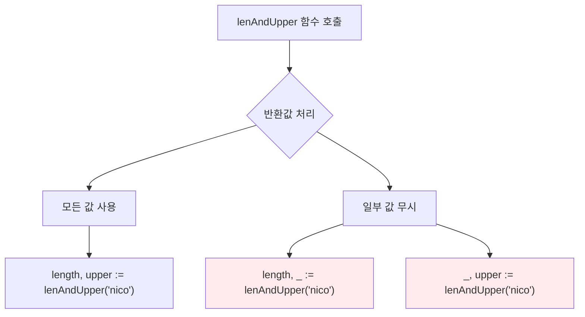
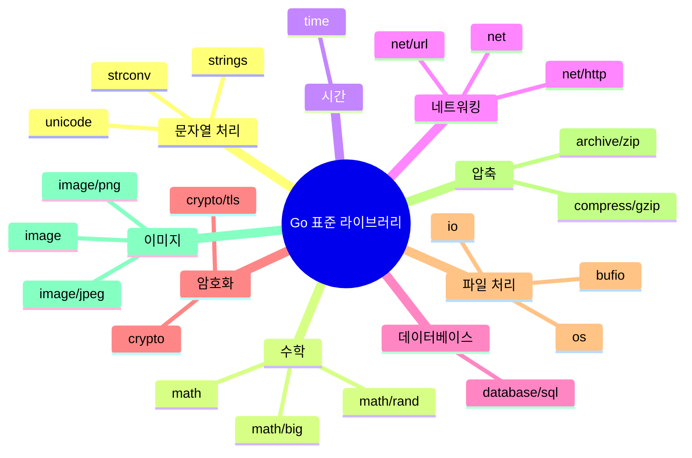
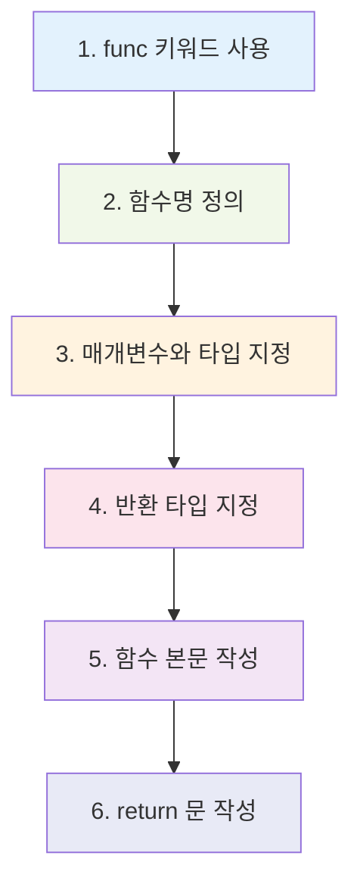

# Go 언어 함수 완전 정복 가이드 🚀

> Go Functions Part One 강의 내용 정리

## 📊 Go 언어의 기본 타입 시스템



### 주요 데이터 타입
- **String**: 문자열 데이터
- **Boolean**: true/false 값
- **int**: 정수 (기본적으로 사용)
- **int8, int16, int32, int64**: 다양한 크기의 정수
- **uint**: 부호 없는 정수
- **Array & Slices**: 배열과 슬라이스

> 💡 **초보자 팁**: Computer Science 배경지식이 없어도 걱정하지 마세요! 기본적으로는 String, Boolean, int만 알면 시작할 수 있습니다.

## 🔧 Go 함수의 기본 구조

### 1. 기본 함수 선언

```go
// 잘못된 예시 (타입 미지정)
func multiply(a, b) {
    return a * b  // ❌ 컴파일 에러 발생
}

// 올바른 예시 (타입 지정)
func multiply(a int, b int) int {
    return a * b  // ✅ 올바른 함수
}

// 간결한 표현 (같은 타입일 때)
func multiply(a, b int) int {
    return a * b  // ✅ 더 간단한 표현
}
```

### 2. 함수 선언 규칙



**Go 함수의 특징:**
- 매개변수의 타입을 **반드시** 명시해야 함
- 반환값의 타입도 **반드시** 명시해야 함
- 컴파일러가 타입을 체크해서 안전성 보장

## 🎯 Go만의 특별한 기능: 다중 반환값

### 다중 반환값 함수 예시

```go
// 문자열의 길이와 대문자 변환을 동시에 반환
func lenAndUpper(name string) (int, string) {
    return len(name), strings.ToUpper(name)
}

// 사용 예시
func main() {
    totalLength, upperName := lenAndUpper("nico")
    fmt.Println(totalLength)  // 출력: 4
    fmt.Println(upperName)    // 출력: NICO
}
```

### 값 무시하기 (언더스코어 활용)

```go
// 하나의 값만 필요할 때
totalLength, _ := lenAndUpper("nico")  // upperName 무시
fmt.Println(totalLength)  // 출력: 4

// 또는
_, upperName := lenAndUpper("nico")  // totalLength 무시
fmt.Println(upperName)   // 출력: NICO
```



## 🌟 가변 인자 함수 (Variadic Functions)

### 무제한 매개변수 받기

```go
// 여러 개의 문자열을 받는 함수
func repeatMe(words ...string) {
    fmt.Println(words)
}

// 사용 예시
func main() {
    repeatMe("hello", "world", "go", "programming")
    // 출력: [hello world go programming]
}
```

**가변 인자 함수의 특징:**
- 타입 앞에 `...` 을 붙여서 선언
- 내부적으로 slice로 처리됨
- 원하는 만큼 인자를 전달할 수 있음

## 📦 Go 표준 라이브러리의 강력함



**Go 표준 라이브러리 살펴보기:**
- [Go 공식 패키지 문서](https://golang.org/pkg/)
- 데이터베이스, 암호화, 이미지 처리, 네트워킹 등 모든 것 포함
- 별도 설치 없이 바로 사용 가능

## 🎓 학습 포인트 정리

### 1. 함수 정의 단계별 가이드



### 2. Go 함수의 핵심 규칙

| 규칙 | 설명 | 예시 |
|------|------|------|
| 타입 명시 필수 | 모든 매개변수와 반환값의 타입을 반드시 지정 | `func add(a, b int) int` |
| 다중 반환 가능 | 여러 개의 값을 동시에 반환할 수 있음 | `func getData() (int, string)` |
| 가변 인자 지원 | 개수가 정해지지 않은 매개변수 처리 가능 | `func print(args ...string)` |
| 미사용 변수 금지 | 선언하고 사용하지 않으면 컴파일 에러 | `_`로 무시 처리 |

### 3. 일반적인 실수와 해결법

#### ❌ 흔한 실수들
```go
// 1. 타입 미지정
func multiply(a, b) {  // 에러!
    return a * b
}

// 2. 반환 타입 미지정
func multiply(a, b int) {  // 에러!
    return a * b
}

// 3. 다중 반환값 처리 실수
length := lenAndUpper("nico")  // 에러! 2개 값 반환하는데 1개만 받음
```

#### ✅ 올바른 해결법
```go
// 1. 타입 명시
func multiply(a, b int) int {
    return a * b
}

// 2. 다중 반환값 올바른 처리
length, upper := lenAndUpper("nico")  // 모두 받기
length, _ := lenAndUpper("nico")      // 일부만 받기
```

## 🚀 실습 예제

### 기본 함수 연습

```go
package main

import (
    "fmt"
    "strings"
)

// 1. 단순 계산 함수
func add(a, b int) int {
    return a + b
}

// 2. 다중 반환값 함수
func divideAndRemainder(a, b int) (int, int) {
    return a / b, a % b
}

// 3. 가변 인자 함수
func sum(numbers ...int) int {
    total := 0
    for _, num := range numbers {
        total += num
    }
    return total
}

func main() {
    // 기본 함수 사용
    result := add(10, 5)
    fmt.Println("10 + 5 =", result)
    
    // 다중 반환값 함수 사용
    quotient, remainder := divideAndRemainder(17, 5)
    fmt.Println("17 ÷ 5 =", quotient, "나머지", remainder)
    
    // 가변 인자 함수 사용
    total := sum(1, 2, 3, 4, 5)
    fmt.Println("1+2+3+4+5 =", total)
}
```

## 💡 추가 학습 가이드

### 다음 단계 학습 내용
- 함수형 프로그래밍 개념
- 고차 함수 (Higher-order functions)
- 클로저 (Closures)
- 메서드와 리시버
- 인터페이스와 함수

### 권장 연습 문제
1. 팩토리얼 계산 함수 만들기
2. 피보나치 수열 생성 함수 만들기
3. 문자열 처리 유틸리티 함수 모음 만들기
4. 계산기 함수 모음 만들기

---

**핵심 메시지:**
- Go는 타입을 명확히 지정해야 하는 **강타입 언어**
- **다중 반환값**은 Go만의 독특한 장점
- **표준 라이브러리**가 매우 풍부함
- **가변 인자 함수**로 유연한 함수 작성 가능

> 🎯 **Next Step**: 함수 Part Two에서는 더 고급 함수 개념들을 다룰 예정입니다!
