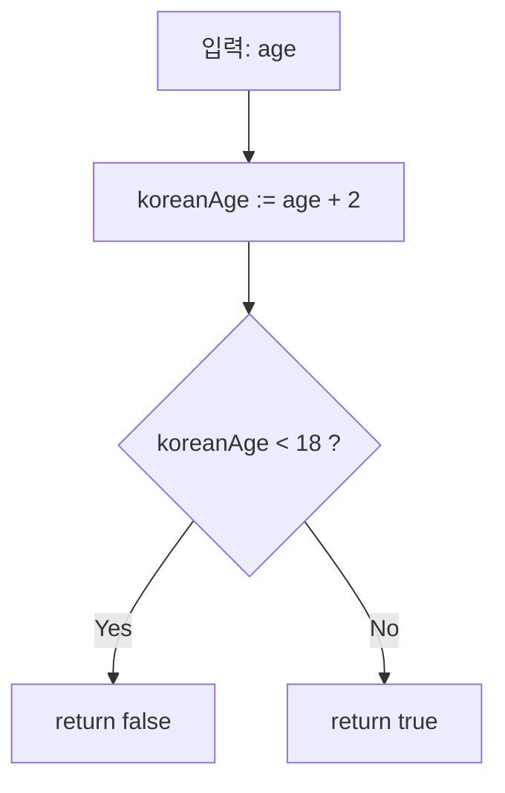

# 🌟 Go 언어 기초: `if`, `else`, 그리고 Variable Expression

> 📺 강의 영상: [#1 6 If with a Twist](https://www.youtube.com/watch?v=ed5E-8GbEZo)  
> 📝 대상: Go 언어를 처음 배우는 초보자

---

## 📌 강의 개요
- 이번 강의에서는 Go 언어의 `if`, `else` 문법을 다룹니다.
- JavaScript, Python 등 다른 언어와 비교해 **Go만의 깔끔한 문법**을 이해할 수 있습니다.
- 특히 **variable expression**이라는 Go의 특별한 기능을 소개합니다.

---

## 🧩 핵심 포인트 정리

### 1️⃣ 기본 `if` 사용법 (00:00~)
- Go의 `if` 문은 괄호 `()`가 필요 없음.
- Python처럼 콜론(`:`)도 필요 없음.
- 직관적이고 간결하게 작성 가능.

---

### 2️⃣ 예시 함수: `canIDrink` (00:42~)

```go
func canIDrink(age int) bool {
    if age < 18 {
        return false
    }
    return true
}
```
나이가 18 미만이면 false, 아니면 true를 반환.

else 없이도 코드 작성 가능 → 더 깔끔한 구조.

3️⃣ Go의 특별한 기능: Variable Expression (01:48~)

```go
func canIDrink(age int) bool {
    if koreanAge := age + 2; koreanAge < 18 {
        return false
    }
    return true
}
```
if 조건문 앞에서 변수를 선언하고, 해당 변수로 조건 검사 가능.

koreanAge := age + 2 → 한국식 나이 계산 예시.

이렇게 선언한 변수는 해당 if 블록에서만 사용 가능.

✅ 장점:

코드 가독성 향상.

“이 변수는 if 조건에서만 사용된다”는 의도를 분명히 전달.

4️⃣ else는 꼭 필요할까?
```go
if age < 18 {
    return false
} else {
    return true
}
```
⬇️ Go 스타일로 더 깔끔하게 작성:

```go
if age < 18 {
    return false
}
return true
```
if 블록에서 return으로 끝나면 else는 생략해도 무방.

불필요한 중첩을 줄여 코드가 단순해짐.

## 📊 동작 흐름 (Mermaid 다이어그램)



## 🎯 정리 (03:35~)
Go의 if는 단순하면서도 강력한 문법.

다른 언어와 달리 if 안에서 변수를 선언하고 활용 가능.

else는 선택 사항 → 코드가 더 깔끔해짐.

다음 강의에서는 Switch 문을 다룸.

## 📚 더 알아보기
Glasp에서 Go 언어와 관련된 학습 노트를 더 찾아보세요:

👉 Learn more on Glasp
