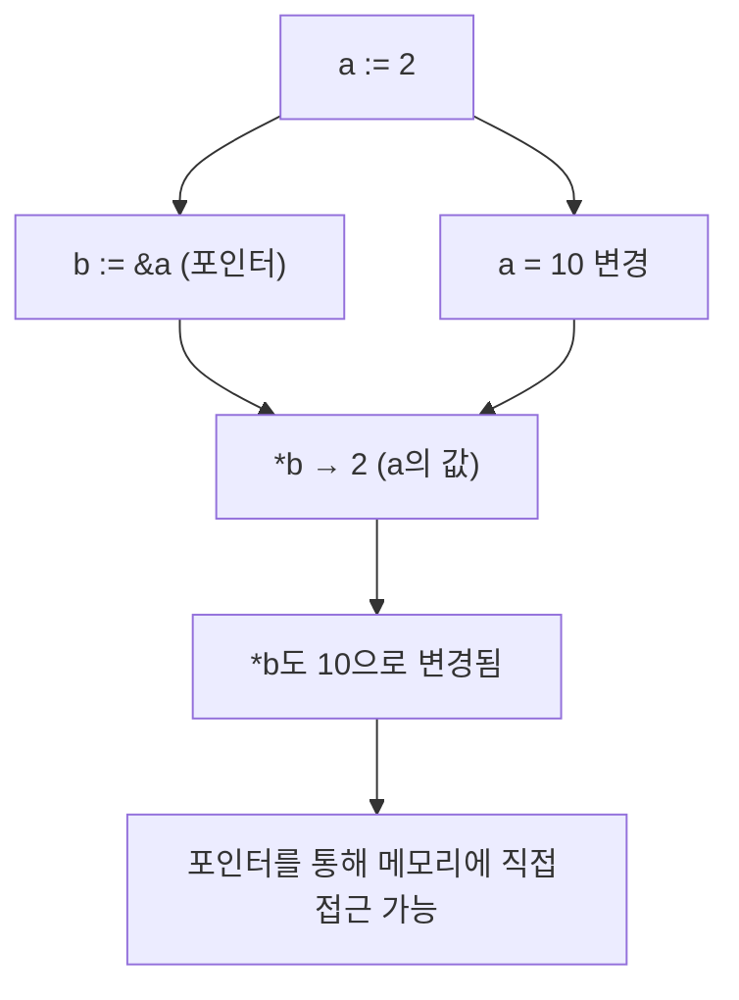
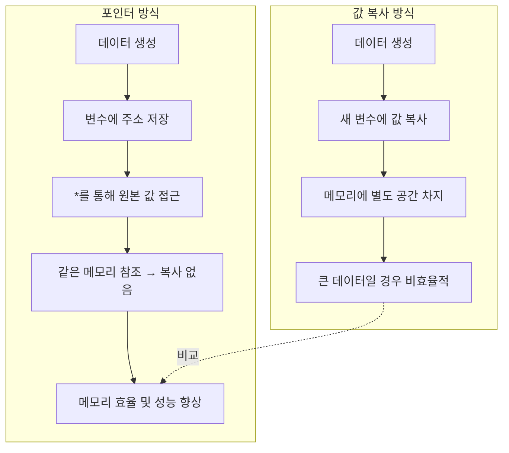

# 🔎 Go 언어에서의 Low-Level Programming (포인터 기초)

Go는 고수준 언어이지만, &(주소 연산자)와 *(포인터/역참조 연산자)를 통해
메모리 주소에 직접 접근하고 값을 변경하는 Low-Level Programming을 지원합니다.
이는 JavaScript, Python에서는 할 수 없는 부분이고, C 언어와 유사한 기능입니다.

## 📌 1. 값 복사(Value Copy) vs 메모리 참조(Memory Reference)

```
package main

import "fmt"

func main() {
    a := 2
    b := a // 값 복사
    fmt.Println(a, b) // 2 2

    a = 10
    fmt.Println(a, b) // 10 2 → b는 영향을 받지 않음
}
```

## ✅ 설명

b := a 는 값을 복사하는 것

따라서 a 값을 변경해도 b에는 영향이 없음

##  📌 2. 메모리 주소 확인하기
```
package main

import "fmt"

func main() {
    a := 2
    b := 2
    fmt.Println(&a, &b) // 각 변수의 메모리 주소 출력
}
```

## ✅ 출력 예시

0xc0000140a8 0xc0000140b0


&a : 변수 a의 메모리 주소

&b : 변수 b의 메모리 주소

서로 다른 메모리 공간에 저장되어 있음을 알 수 있음

## 📌 3. 포인터 변수(pointer) 선언
```
package main

import "fmt"

func main() {
    a := 2
    b := &a // b는 a의 메모리 주소를 저장
    fmt.Println(a, *b) // 2 2

    a = 10
    fmt.Println(a, *b) // 10 10
}
```

## ✅ 설명

b := &a → b는 a의 주소를 저장 (포인터 변수)

*b → b가 가리키는 메모리 주소에 저장된 실제 값을 가져옴

따라서 a와 *b는 항상 같은 값을 가짐

## 📌 4. 포인터를 통한 값 변경
```
package main

import "fmt"

func main() {
    a := 2
    b := &a // b는 a의 주소

    *b = 20 // b가 가리키는 메모리의 값을 변경
    fmt.Println(a) // 20 → a의 값이 바뀜
}
```

## ✅ 설명

*b = 20 은 b가 가리키는 주소(a)의 값을 20으로 변경

결과적으로 a의 값도 바뀜

## 📊 Mermaid 시각화


## 📝 핵심 요약

& : 변수의 메모리 주소를 반환

* : 해당 메모리 주소에 저장된 값을 조회/변경

### 🎯 포인터 사용 이유

1. 불필요한 값 복사 방지

- 변수를 그대로 넘기면 값이 복사되지만, 포인터를 사용하면 원본을 직접 참조할 수 있음.

2. 큰 데이터 구조 공유

- 배열, 구조체처럼 큰 데이터를 함수로 전달할 때 복사 비용이 큼.

- 포인터를 사용하면 같은 메모리 주소를 바라보므로 효율적임.

3. 메모리 효율 및 성능 향상

- 불필요한 메모리 낭비를 줄이고, 빠른 실행을 가능하게 함.

- 특히 대규모 데이터 처리에서 큰 장점이 됨.


### 📌 해설

- 값 복사 방식 → 새로운 공간에 값이 복제됨 → 메모리 낭비 & 성능 저하

포인터 방식 → 기존 데이터의 주소만 공유 → 효율적이고 빠름

👉 정리하면, Go는 안전하면서도 포인터를 제공해서 C처럼 메모리를 다루되
복잡하지 않고 간단하게 Low-Level Programming을 할 수 있는 게 장점입니다.
