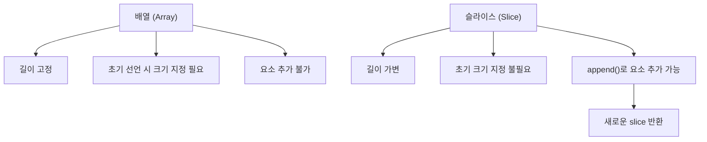

# Go 언어 강의 #1: Arrays & Slices

## 🧠 학습 목표
- Go 언어의 배열(Array)과 슬라이스(Slice)의 차이 이해
- 배열 선언, 사용법, 한계 파악
- 슬라이스의 유연성 및 `append()` 함수 활용법 익히기

---

## ⏱️ 요약 타임라인

### ✅ (00:01) Go의 배열 (Array)
- 배열은 **고정된 길이**를 가짐
- 선언 시, 길이와 타입을 명시해야 함
  ```go
  var names [5]string
  names[0] = "nico"
  names[1] = "lynn"
  ```
길이를 초과하면 에러 발생

```go
names[5] = "error" // ❌ Index out of range
```
✅ (01:33) 슬라이스 (Slice)의 소개
배열과 유사하지만 길이를 정하지 않아도 됨

동적 확장 가능한 구조

```go
names := []string{"nico", "lynn"}
```
✅ (02:30) append() 함수 사용법
슬라이스에 요소 추가는 append() 사용

```go
names = append(names, "dal")
```
원본 slice는 변경되지 않으며, 새로운 slice 반환

✅ (03:20) 출력 확인
```go
fmt.Println(names)로 현재 slice 확인
```

## 🔍 Array vs Slice

| 항목    | 배열 (Array)         | 슬라이스 (Slice)          |
| ----- | ------------------ | --------------------- |
| 길이    | 고정                 | 가변                    |
| 선언 방식 | `[5]string`        | `[]string`            |
| 요소 추가 | 불가능 (고정 크기 초과시 에러) | 가능 (`append()` 함수 사용) |
| 메모리   | 고정 크기만큼 미리 할당      | 필요 시 메모리 자동 확장        |


## 📊 Mermaid 다이어그램: Array와 Slice 비교


## Code Review

```
package main // 이 파일이 실행 가능한 프로그램(패키지의 시작점)임을 Go에게 알림

import (
	"fmt" // fmt는 출력(print)을 도와주는 기본 제공 기능 (package)
)

func main() { // main 함수는 Go 프로그램이 실행될 때 가장 먼저 호출되는 부분
	names := []string{"nico", "lynn", "dal"} 
	// names라는 이름의 "슬라이스"를 선언함
	// 슬라이스는 문자열(string)들의 목록(리스트)임
	// 지금은 "nico", "lynn", "dal" 이라는 3개의 이름이 들어있음

	names = append(names, "flynn")
	// append 함수는 슬라이스에 새로운 요소를 추가할 때 사용됨
	// 여기서는 "flynn"이라는 이름을 기존 슬라이스에 추가하고
	// 그 결과를 다시 names에 저장함 (원래 슬라이스를 직접 수정하지 않기 때문)

	fmt.Println(names)
	// 최종적으로 names 슬라이스의 모든 요소를 출력함
	// 결과: [nico lynn dal flynn]
}
```
### 🧠 참고 포인트 (비전공자를 위한 쉬운 설명)

슬라이스(slice): 여러 개의 데이터를 한꺼번에 담을 수 있는 "그릇". 파이썬의 리스트(list), 자바스크립트의 배열(array)과 비슷함.

append(): 그릇에 새로운 걸 "붙인다"는 의미. 기존에 있던 데이터는 그대로 두고, 새로운 데이터를 추가하는 함수.

fmt.Println(): 현재 그릇 안에 뭐가 들어 있는지 화면에 보여주는 역할.

--- 

## 💡 개발 팁

배열은 특별한 상황이 아니라면 거의 사용하지 않음

실무에서는 대부분 슬라이스(slice) 를 사용함

append() 함수는 기존 slice를 변경하지 않고, 새로운 slice를 반환하는 점 유의


## 📚 추가 참고

- [Glasp: Arrays vs Slices 개념 정리](https://read.glasp.co)
- [Go 공식 문서 - Slices](https://go.dev/blog/slices)
- [Go 언어 슬라이스 심화 설명 (Dev.to)](https://dev.to/shrsv/mastering-go-slices-a-deep-dive-from-zero-to-hero-1n97)
