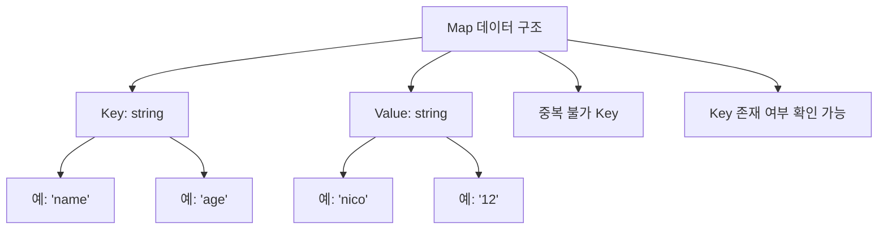

# 📘 Go 언어 – Map 데이터 구조 정리

Go에서의 **map**은 Python의 `dict`나 JavaScript의 `object`와 유사하지만, **타입이 명확히 정의되어야 하는** 특징이 있어요.  
아래 정리를 통해 map의 개념을 이해해봅시다.

---

## 🗝️ Map 기본 개념
- **Key-Value** 구조로 데이터를 저장.
- Key와 Value의 **타입을 반드시 명시**해야 함.
- Key는 중복될 수 없으며, 고유해야 함.

```go
// map 생성 기본 형태
nico := map[string]string{
    "name": "nico",
    "age":  "12",
}
fmt.Println(nico)
// 출력: map[age:12 name:nico]
```


## 🔄 Map 순회 (range 활용)

range 키워드를 활용하면 map을 순회할 수 있어요.

```
for key, value := range nico {
    fmt.Println(key, value)
}
```

key와 value 모두 출력


key만 출력하고 싶다면 value는 _ (언더스코어)로 무시 가능
```
for key := range nico {
    fmt.Println(key)
}
```
➕ 요소 추가 & 확인

```
// 요소 추가
nico["hobby"] = "coding"

// 존재 여부 확인
value, exists := nico["age"]
if exists {
    fmt.Println("나이:", value)
} else {
    fmt.Println("해당 key 없음")
}
```

## 🎨 Mermaid 시각화



## ⏱️ 영상 요약 (타임스탬프 포함)

(00:00) Go에서 map은 Python의 dict나 JS object와 유사.

(00:10) map[string]string 형식으로 key-value 타입 명시.

(00:54) fmt.Println으로 출력 확인 (map[age:12 name:nico]).

(01:00) struct와의 차이도 언급 (추후 학습 예정).

(01:42) map은 key와 value 구조로 동작.

(02:00) 프로젝트에서 map, struct, slice 등을 종합적으로 활용 예정.

(02:20) range로 반복문 순회, key만/ value만 출력 가능.

(02:48) 요소 추가 및 존재 여부 확인 기능 있음.

## ✨ 핵심 포인트

Map은 Key-Value 저장소.

Key와 Value의 타입을 꼭 지정해야 함.

반복문(range) 활용, 추가/존재 확인 가능.

앞으로의 학습에서 struct, slice와 함께 활용하면 더 강력해짐.
