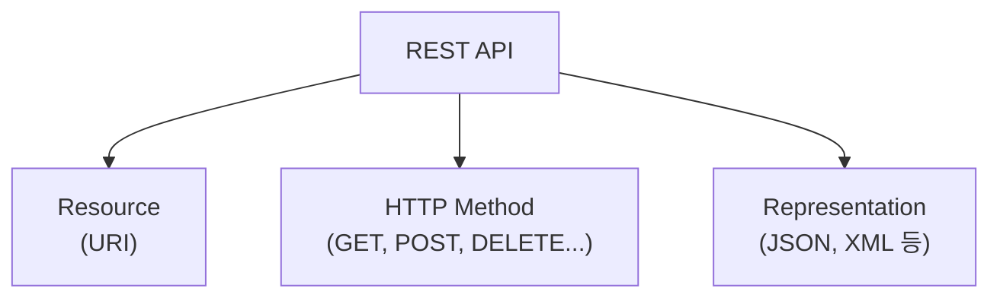
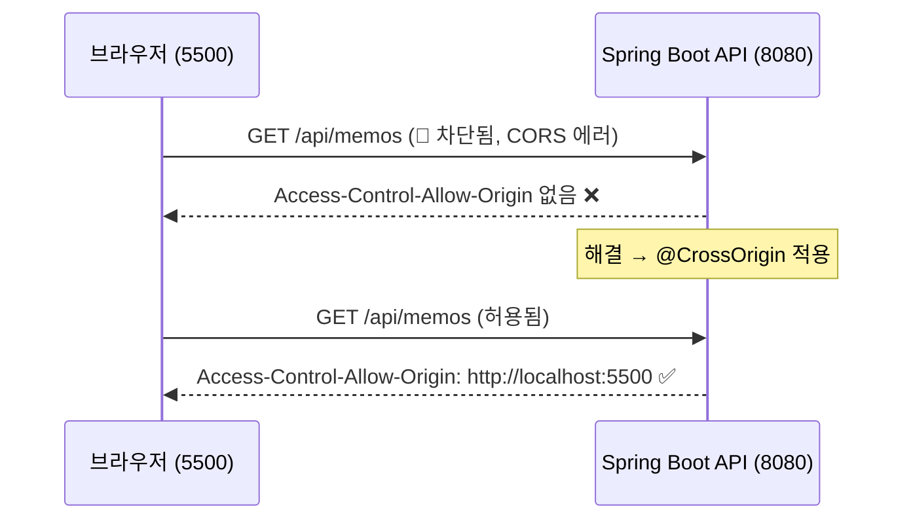
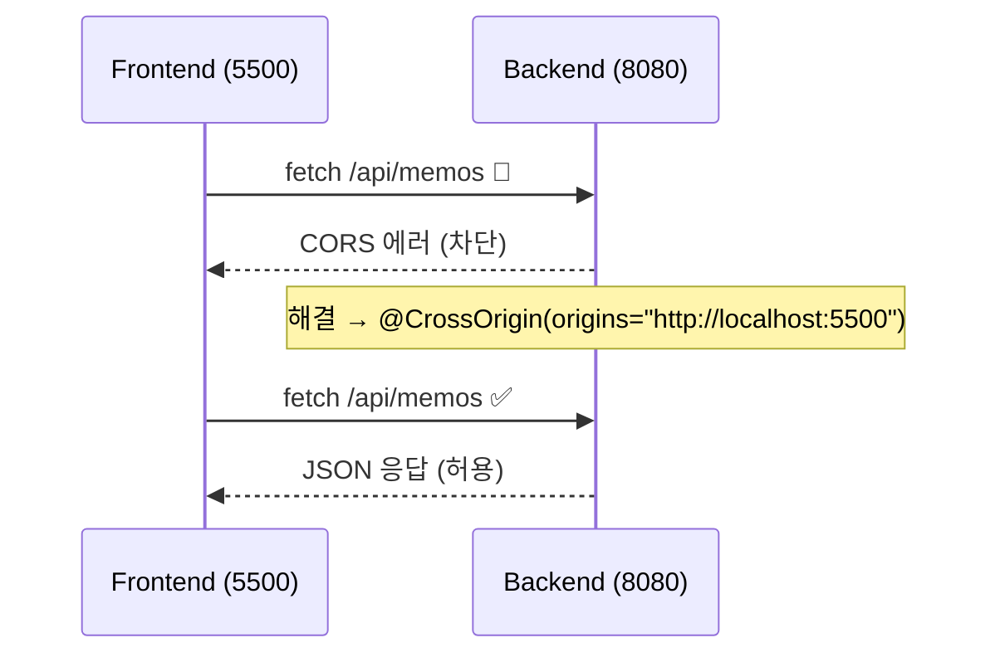

# 🌐 REST API와 CORS 정리
## 📌 학습 목표

Spring Boot로 REST API 구현

JavaScript fetch API 활용

CORS 문제 이해 및 재현

@CrossOrigin을 통한 해결

## 📝 REST API 기본 개념



자원(Resource): URI로 식별 (/api/memos)

행위(Verb): HTTP Method로 표현

표현(Representation): JSON, XML로 상태 전달

## ⚡ Memo API 구현 (Spring Boot)
Memo.java (DTO)
```java
package com.example.memo;

// record: Java 16+에서 추가된 불변 객체.
// 자동으로 생성자, getter, toString 등을 제공
public record Memo(Long id, String content) {
}


record: 불변 데이터 객체 → 현업에서 DTO(Data Transfer Object)로 자주 사용

Lombok 없이도 자동 코드 생성

MemoController.java (REST Controller)
package com.example.memo;

import org.springframework.http.ResponseEntity;
import org.springframework.web.bind.annotation.*;

import java.util.ArrayList;
import java.util.List;
import java.util.concurrent.ConcurrentHashMap;
import java.util.concurrent.atomic.AtomicLong;

@RestController // REST API 제공 컨트롤러
public class MemoController {

    private final ConcurrentHashMap<Long, Memo> memos = new ConcurrentHashMap<>();
    private final AtomicLong counter = new AtomicLong(); // 고유 ID 생성기

    // (1) 모든 메모 조회
    @GetMapping("/api/memos")
    public List<Memo> getMemos() {
        return new ArrayList<>(memos.values());
    }

    // (2) 새 메모 생성
    @PostMapping("/api/memos")
    public Memo createMemo(@RequestBody Memo memo) {
        long newId = counter.incrementAndGet();   // ID 자동 증가
        Memo newMemo = new Memo(newId, memo.content()); // 새로운 메모 객체 생성
        memos.put(newId, newMemo);               // 저장
        return newMemo;                          // JSON 응답
    }

    // (3) 특정 메모 삭제
    @DeleteMapping("/api/memos/{id}")
    public ResponseEntity<Void> deleteMemo(@PathVariable Long id) {
        memos.remove(id);                        // 삭제
        return ResponseEntity.noContent().build(); // 상태코드 204 반환
    }
}
```

## 🔑 주석 설명

ConcurrentHashMap: 동시성 안전 (멀티스레드 환경 대비)

AtomicLong: thread-safe한 ID 생성기

@RequestBody: 요청 JSON → Java 객체 변환

ResponseEntity: HTTP 상태코드 세밀한 제어 가능

## 🖥️ Frontend (Same-Origin)

memo.html (Spring Boot 서버 안에서 실행 → CORS 문제 없음)
```html
<!-- HTML 기본 구조 -->
<h1>메모 앱</h1>
<form id="memo-form">
  <input type="text" id="memo-content" placeholder="메모 입력" required>
  <button type="submit">추가</button>
</form>
<ul id="memo-list"></ul>

<script>
  // (1) 메모 불러오기
  async function fetchMemos() {
    const res = await fetch('/api/memos');  // 같은 출처 요청 → OK
    const memos = await res.json();
  }

  // (2) 메모 추가하기
  memoForm.addEventListener('submit', async (e) => {
    e.preventDefault();
    await fetch('/api/memos', {
      method: 'POST',
      headers: {'Content-Type': 'application/json'},
      body: JSON.stringify({ content: memoContent.value })
    });
  });

  // (3) 메모 삭제하기
  async function deleteMemo(id) {
    await fetch(`/api/memos/${id}`, { method: 'DELETE' });
  }
</script>
```

## ❌ CORS 문제 재현

index.html (Live Server :5500에서 실행 → API는 :8080 호출)
```html
const API_BASE_URL = "http://localhost:8080"; 

async function fetchMemos() {
  // 🚨 다른 출처 요청 (5500 → 8080)
  const response = await fetch(`${API_BASE_URL}/api/memos`);
}
```

> 브라우저 콘솔 에러:
> Access to fetch at 'http://localhost:8080/api/memos'
> from origin 'http://localhost:5500' has been blocked by CORS policy

## ✅ CORS 해결 방법
```
// MemoController.java
@CrossOrigin(origins = "http://localhost:5500") // 허용할 출처 지정
@RestController
public class MemoController {
    // ...
}
```

## 📊 흐름 정리 (Mermaid)


## 🏢 현업에서는?

로컬 개발: @CrossOrigin 단순 적용

운영 환경:

Spring Security + CORS 설정

API Gateway(AWS API Gateway, Nginx)에서 CORS 헤더 설정

와일드카드(*)보다는 특정 도메인만 허용 (보안 강화)

## 📝 통합 실습 시나리오

Spring Boot 프로젝트 생성

Memo DTO + MemoController 작성

memo.html (Same-Origin 테스트)

index.html (CORS 에러 재현)

@CrossOrigin 적용 후 정상 동작 확인


<details> <summary>📌 REST API & CORS Cheat Sheet (펼치기/접기)</summary>

--- 

# 🚀 REST API & CORS Cheat Sheet

## 1️⃣ REST API 기본

```mermaid
flowchart TD
    A[REST API] --> B[Resource (URI)]
    A --> C[HTTP Method (GET, POST, DELETE)]
    A --> D[Representation (JSON)]
```

- **Resource**: `/api/memos`
    
- **Method**: GET / POST / DELETE
    
- **JSON 응답**: 상태를 표현
    

---

## 2️⃣ Spring Boot API


```java
@RestController
public class MemoController {
    private final ConcurrentHashMap<Long, Memo> memos = new ConcurrentHashMap<>();
    private final AtomicLong counter = new AtomicLong();

    @GetMapping("/api/memos")  // 메모 목록 조회
    public List<Memo> getMemos() { return new ArrayList<>(memos.values()); }

    @PostMapping("/api/memos") // 메모 추가
    public Memo createMemo(@RequestBody Memo memo) {
        long id = counter.incrementAndGet();
        Memo newMemo = new Memo(id, memo.content());
        memos.put(id, newMemo);
        return newMemo;
    }

    @DeleteMapping("/api/memos/{id}") // 메모 삭제
    public ResponseEntity<Void> deleteMemo(@PathVariable Long id) {
        memos.remove(id);
        return ResponseEntity.noContent().build();
    }
}
```

---

## 3️⃣ CORS 개념



- **Same-Origin Policy**: Protocol + Host + Port 모두 같아야 허용
    
- **CORS (Cross-Origin Resource Sharing)**: 서버에서 예외 허용
    

---

## 4️⃣ 해결 방법

```
@CrossOrigin(origins = "http://localhost:5500") @RestController public class MemoController { ... }
```
---

## 5️⃣ 현업 Best Practice

- 로컬 개발: `@CrossOrigin` 간단히 사용
    
- 운영 환경:
    
    - Spring Security에서 전역 CORS 설정
        
    - API Gateway / Nginx에서 처리
        
    - `*`(모든 출처 허용) ❌ → 특정 도메인 지정 ✅
        

---

## 🔥 핵심 정리

- REST API = 리소스를 URI로 관리 + HTTP 메서드로 동작 정의
    
- `fetch` → 다른 출처 요청 시 CORS 문제 발생
    
- 해결 = 서버에서 **허용 헤더**(`Access-Control-Allow-Origin`) 추가


</details>
