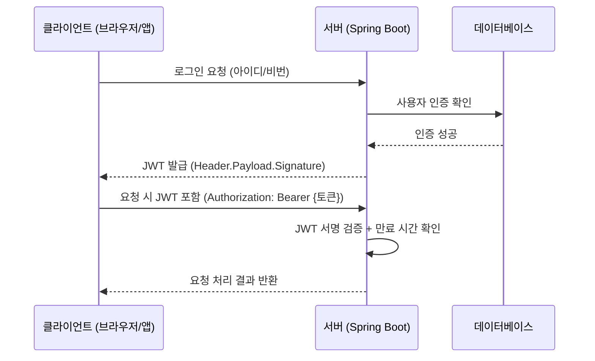

## 1️⃣ JWT란?

JSON 객체를 안전하게 주고받기 위한 토큰(Token) 형식.

사용자가 로그인하면 서버가 JWT를 만들어서 사용자에게 줍니다.

이후 사용자가 서버에 요청할 때마다 이 JWT를 함께 보내면, 서버는 그 안에 담긴 정보를 확인하고 사용자를 인증합니다.

즉, 세션/쿠키 방식 대신 토큰으로 인증하는 것.

## 2️⃣ JWT 구조 (3부분으로 나뉨)

JWT는 보통 이렇게 생겼습니다 👇

> aaaaaa.bbbbbb.cccccc


세 부분을 . 으로 구분해요:

Header (헤더)

토큰의 타입(JWT)과 서명(Signature)에 어떤 알고리즘을 쓸지 정의.
```code
{
  "alg": "HS256",
  "typ": "JWT"
}
```

Payload (페이로드)

실제 데이터(클레임, Claim)가 담깁니다.

보통 유저 ID, 권한(role), 토큰 만료 시간(exp) 같은 정보.
```code
{
  "sub": "user123",       // 사용자 ID
  "role": "ROLE_USER",    // 권한
  "exp": 1735977600       // 만료 시간 (Unix time)
}
```

Signature (서명)

Header + Payload + 서버 비밀키(secret key)를 이용해 만든 암호화 값.

누군가 Payload를 위조하면 이 서명이 맞지 않기 때문에 변조 여부를 검증할 수 있습니다.

### 👉 그래서 JWT는 위조 방지 기능이 있습니다. (단, 내용 자체는 Base64로 인코딩되므로 누구나 볼 수 있어요 → 민감한 정보는 넣으면 안 됨!)

## 3️⃣ JWT 인증 로직 (흐름도)


## 4️⃣ JWT의 장단점

### ✅ 장점

서버가 별도로 세션을 저장하지 않아도 됨 → 확장성이 좋음 (무상태, Stateless).

다른 서비스(마이크로서비스, 외부 API)와 쉽게 연동 가능.

### ❌ 단점

토큰 안에 정보가 많으면 길이가 길어져서 요청마다 전송 시 성능 저하.

발급된 토큰은 중간에 무효화(revoke) 하기 어렵습니다 (보통 Redis 같은 별도 저장소로 관리).

## 5️⃣ Spring Boot에서 JWT 인증 구조 (흔한 패턴)

사용자가 /login 요청 → 서버에서 아이디/비번 확인.

인증 성공 시 JWT 발급 → 클라이언트에게 응답.

클라이언트는 이후 요청마다 Authorization: Bearer <JWT> 헤더에 토큰 넣음.

서버는 매 요청마다 JWT 검증 필터를 통과시켜 유저 인증 후 Controller 로직 실행.

토큰 만료되면 재발급(refresh token) 로직을 사용.

## 🚀 정리

JWT는 Header.Payload.Signature 로 구성된 인증 토큰.

서버가 토큰을 발급하고, 클라이언트는 매 요청 시 토큰을 들고 옴.

서버는 서명 검증을 통해 변조 여부를 확인하고, 사용자 인증을 처리.

세션을 저장하지 않아도 돼서 확장성이 좋지만, 토큰 폐기 어려움이 단점.
