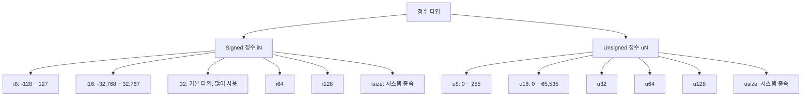
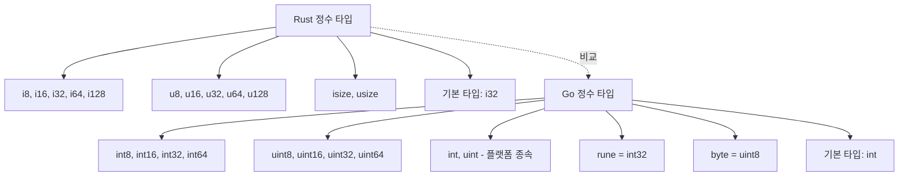

# 🔢 Rust 정수 타입 (Integer Types)

Rust는 다른 언어(Java, Python, JavaScript 등)와 달리 정수 타입(Integer Types) 을 매우 세분화해서 제공합니다.
이 덕분에 프로그램에서 메모리 크기, 음수 허용 여부 등을 명확히 지정할 수 있습니다.

## 1️⃣ 정수 타입 구분
| 구분                   | 설명              | 예시                                         |
| -------------------- | --------------- | ------------------------------------------ |
| **Signed 정수 (iN)**   | 음수/양수 모두 표현 가능  | `i8`, `i16`, `i32`, `i64`, `i128`, `isize` |
| **Unsigned 정수 (uN)** | 음수 없음, 0 이상만 표현 | `u8`, `u16`, `u32`, `u64`, `u128`, `usize` |


## 2️⃣ 비트 크기와 범위
| 타입        | 크기     | 값의 범위                            |
| --------- | ------ | -------------------------------- |
| **i8**    | 8비트    | -128 \~ 127                      |
| **u8**    | 8비트    | 0 \~ 255                         |
| **i16**   | 16비트   | -32,768 \~ 32,767                |
| **u16**   | 16비트   | 0 \~ 65,535                      |
| **i32**   | 32비트   | -2,147,483,648 \~ 2,147,483,647  |
| **u32**   | 32비트   | 0 \~ 4,294,967,295               |
| **i64**   | 64비트   | -2^63 \~ 2^63 - 1                |
| **u64**   | 64비트   | 0 \~ 2^64 - 1                    |
| **i128**  | 128비트  | 매우 큰 범위                          |
| **u128**  | 128비트  | 매우 큰 범위                          |
| **isize** | 시스템 종속 | 32비트 시스템 = i32<br>64비트 시스템 = i64 |
| **usize** | 시스템 종속 | 32비트 시스템 = u32<br>64비트 시스템 = u64 |


## 3️⃣ Signed vs Unsigned

Signed (i) : +와 - 모두 허용
예) i32 → -10, 0, 42

Unsigned (u) : - 불가능, 0 이상만 허용
예) u32 → 0, 10, 255

예를 들어 나이(age) 같은 값은 음수가 될 수 없으므로 u8이나 u16을 쓰는 게 적절합니다.

## 4️⃣ 기본 타입 (Default)
fn main() {
    let x = 42; // 타입 지정 안 하면 i32가 기본
    let y: u8 = 200; // 명시적으로 타입 지정
    println!("x = {}, y = {}", x, y);
}


Rust에서 정수를 선언할 때 기본 타입은 i32

타입을 명시하지 않으면 i32로 컴파일됨

## 5️⃣ 시스템 종속 타입

isize, usize 는 컴퓨터 아키텍처(32bit / 64bit)에 따라 크기가 달라짐

주로 메모리 주소, 포인터 크기 등과 관련된 연산에서 사용

## 📊 Mermaid 시각화



## 📝 핵심 요약

Rust는 정수 타입을 세분화하여 메모리 효율성을 높임

Signed(i) : 음수/양수 모두 가능

Unsigned(u) : 음수 불가능, 0 이상만 가능

기본 정수 타입은 i32

isize/usize 는 시스템 아키텍처(32bit/64bit)에 따라 달라짐


## 📊 Rust vs Go 정수 타입 비교

| 항목              | Rust                                       | Go                                                   |
| --------------- | ------------------------------------------ | ---------------------------------------------------- |
| **Signed 정수**   | `i8`, `i16`, `i32`, `i64`, `i128`, `isize` | `int8`, `int16`, `int32`, `int64`, `int`             |
| **Unsigned 정수** | `u8`, `u16`, `u32`, `u64`, `u128`, `usize` | `uint8`(=byte), `uint16`, `uint32`, `uint64`, `uint` |
| **기본 타입**       | `i32`                                      | `int` (32bit 또는 64bit)                               |
| **플랫폼 종속 타입**   | `isize`, `usize` (아키텍처에 따라 크기 결정)          | `int`, `uint` (아키텍처에 따라 크기 결정)                       |
| **최대 크기 지원**    | 128비트 (`i128`, `u128`)                     | 64비트 (`int64`, `uint64`)                             |
| **문자 관련 타입**    | `char` (4바이트 유니코드)                         | `rune`(=int32), `byte`(=uint8)                       |
| **타입 안정성**      | 엄격, 암묵적 변환 불가                              | 비교적 단순, 변환 필요 시 명시적 처리                               |


##📌 코드 예시 비교
✅ Rust
```
fn main() {
    let a: i32 = -10;
    let b: u8 = 200;
    let c = 100; // 기본 i32
    println!("a = {}, b = {}, c = {}", a, b, c);
}
```
✅ Go
```
package main
import "fmt"

func main() {
    var a int32 = -10
    var b uint8 = 200
    c := 100 // 기본 int
    fmt.Println("a =", a, "b =", b, "c =", c)
}
```

## 📊 Mermaid 시각화 – Rust vs Go 정수 타입 비교


## 📝 핵심 요약

Rust → 더 다양한 정수 타입 제공 (i128, u128까지 지원)

Go → 단순한 타입 체계, 기본적으로 int와 uint 중심

Rust는 엄격한 타입 안전성, Go는 실용적 단순성에 초점


## ⚖️ Rust vs Go 정수 타입 – 실무 선택 가이드
### ✅ Rust가 더 적절한 경우

#### 시스템 프로그래밍 / 임베디드 개발

Rust는 i8 ~ i128, u8 ~ u128, isize/usize까지 세분화된 타입 제공

메모리 제어와 성능 최적화가 필요한 저수준 프로그래밍에 강함

#### C/C++ 대체재로 적합

#### 안전성 중심 개발

Rust는 타입 혼합 연산 불가, 반드시 명시적 변환 필요

런타임 에러보다 컴파일 타임 안전성 보장

금융, 블록체인, 보안 소프트웨어에 유리

#### 대규모 데이터 처리

초대형 숫자(i128, u128) 지원 → 고정밀 연산 가능

과학 계산, 암호학 등 큰 정수 계산에 적합

### ✅ Go가 더 적절한 경우

#### 백엔드 서버 / 웹 서비스

Go의 정수 타입은 단순 (int, uint, int64 중심)

대부분의 웹 서비스 로직에 64비트 정수면 충분

오히려 Rust처럼 타입이 많으면 복잡도가 증가

#### 빠른 개발 사이클

Go는 개발자 경험(DX) 중시 → 타입 고민 줄이고 빠르게 코딩 가능

스타트업, 프로토타입, 마이크로서비스 개발에 적합

#### 클라우드/분산 시스템

Go는 goroutine + 채널 기반 동시성 지원

#### 정수 타입 단순화로 네트워크, 분산 환경 코드 작성이 더 수월

📊 정리 비교
| 상황                 | Rust            | Go                    |
| ------------------ | --------------- | --------------------- |
| **시스템 프로그래밍**      | ✅ 저수준 메모리 제어 필요 | ❌                     |
| **임베디드 / IoT**     | ✅ 세밀한 타입 제어     | ❌                     |
| **금융 / 보안 / 블록체인** | ✅ 정밀 연산, 안전성    | ❌                     |
| **웹 서비스 / API 서버** | ❌               | ✅ 단순 int로 충분          |
| **클라우드 / 분산 처리**   | ❌               | ✅ goroutine, 단순 타입 구조 |
| **프로토타입 / 빠른 개발**  | ❌               | ✅ 빠른 개발 사이클           |


## 📝 핵심 요약

Rust → “성능 + 안전성 + 세밀한 타입 제어”가 필요할 때 최적

Go → “생산성 + 단순성 + 네트워크/분산 처리”가 필요할 때 최적
