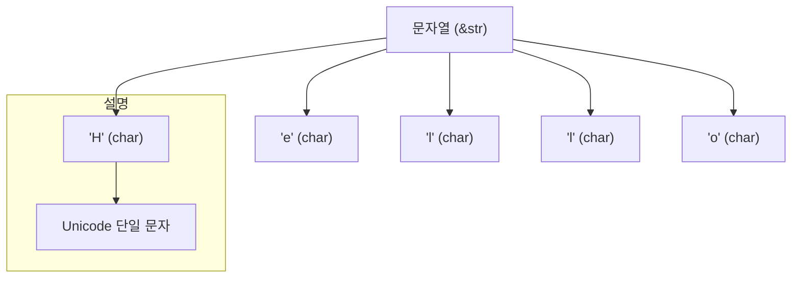

# 📚 Rust 배우기 – Chars (문자)

영상: 프로그래밍 언어 러스트를 배웁시다! 004 Easy Rust in Korean: Chars

주제: Rust에서 char 타입을 이해하고 사용하는 방법

## ✨ 핵심 정리

🟢 char 타입은 Rust에서 문자(Unicode 단일 문자) 를 저장하는 타입

🟢 문자 리터럴은 'a', '한', '字' 와 같이 작은 따옴표 ' 를 사용

🟢 char는 사실 4바이트 (UTF-32) 크기를 가지며, 모든 유니코드 문자를 표현 가능

🟢 문자열 "Hello"는 여러 개의 char가 모여 있는 &str 타입

🟢 반복문 for c in "Hello".chars() 와 같이 .chars() 메서드를 사용해 문자열을 한 글자씩 순회 가능

🟢 char와 u8(바이트)은 다르며, char는 한 글자를 의미하고 u8은 1바이트 정수

## 🛠️ Rust 코드 예제
```
fn main() {
    // 문자 (char) 타입
    let ch: char = 'A';  
    println!("문자: {}", ch);

    // 다양한 유니코드 문자 저장 가능
    let korean = '한';
    let chinese = '字';
    let emoji = '😊';

    println!("한글: {}, 한자: {}, 이모지: {}", korean, chinese, emoji);

    // 문자열에서 chars()로 순회
    for c in "Hello".chars() {
        println!("{}", c);
    }
}
```

## 💡 출력 결과

```text
문자: A
한글: 한, 한자: 字, 이모지: 😊
H
e
l
l
o
```

## 🛠️ Rust 실습 코드

### ✅ 핵심 요약

char는 유니코드 단일 문자를 담는 타입이며 4바이트 크기예요. (이모지 포함 🥳)

문자열은 여러 char이 모인 텍스트 조각으로, 항상 큰따옴표 " 를 사용합니다.

char 리터럴은 작은따옴표 ' 를 사용합니다. ('A', '한', '😊')

'a' as u8 같이 정수형으로 캐스팅하면 유니코드 코드 포인트(ASCII 범위는 그대로) 값을 얻을 수 있어요.

println! 매크로로 출력할 때, 문자열은 반드시 큰따옴표가 필요합니다.

```
fn main() {                                      // 프로그램의 시작점: main 함수

    // println!('Hello, world!');                // (잘못된 예시) 문자열에 작은따옴표 사용 → 컴파일 에러
    // string은 무조건 ""으로 ''으로 입력하면 에러 발생
    // help: if you meant to write a string literal, use double quotes
    // error[E0762]: unterminated character literal

    println!("Hello, world!");                   // (정상) 문자열은 큰따옴표(")를 사용해 출력

    let first_letter = 'A';                      // char 리터럴: 작은따옴표(') 사용, 단일 문자 저장
    // char 타입은 Rust에서 문자(Unicode 단일 문자)로 이모지도 됨
    // char size = 4 bytes
    println!("문자: {}", first_letter);          // 포맷 문자열에 {}로 값 삽입하여 출력

    // 다양한 유니코드 문자 저장 가능
    let korean = '한';                           // 한글 1글자 (유니코드)
    let chinese = '字';                          // 한자 1글자 (유니코드)
    let emoji = '😊';                            // 이모지 1개 (유니코드)

    println!("한글: {}, 한자: {}, 이모지: {}",  // 여러 값을 한 번에 출력
             korean, chinese, emoji);

    // casting = simple type change using 'as'
    let my_number = 'a' as u8;                   // 'a'의 유니코드(ASCII) 값(97)으로 캐스팅
    println!("Hello, world! My number is {}",    // 숫자값 출력
             my_number);

    /*
    // 결과 코드 :
    Hello, world!
    문자: A
    한글: 한, 한자: 字, 이모지: 😊
    Hello, world! My number is 97
    */
}
```


## 📊 Mermaid 시각화 – Rust 문자열과 문자 관계



## 🧩 초보자 이해 포인트

✅ char는 한 글자만 담을 수 있음 → 'A', '한', '😊'

✅ &str (문자열)은 여러 char의 묶음 → "Hello"

✅ 문자열을 다룰 때 .chars()를 사용하면 글자를 하나씩 꺼낼 수 있음

✅ Rust의 char는 단순히 ASCII 문자만 담는 게 아니라 모든 유니코드 문자를 담을 수 있음

## 📌 요약

Rust의 char는 4바이트 유니코드 문자

작은 따옴표 '로 표현 ('A', '😊')

문자열은 여러 개의 char 모음 ("Hello")

.chars() 메서드로 문자열을 한 글자씩 다룰 수 있음

👉 Learn more on Glasp: https://glasp.co/reader?url=https://www.youtube.com/watch?v=yR33X2Ik9W0
