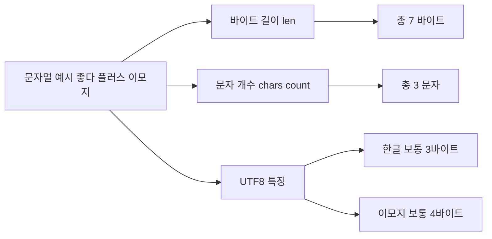

# 🦀 Rust 문자열과 바이트/문자 개수 이해하기

Rust에서는 문자열을 다룰 때 **바이트 단위 길이**와 **문자 단위 길이**가 다를 수 있어요.  
특히 유니코드 문자는 **1바이트가 아닌 여러 바이트로 표현**되기 때문에 주의가 필요합니다.

---

## 🗝️ 핵심 개념

- **바이트(Byte)**: 메모리에서 실제 차지하는 크기. (`len()` 메서드로 확인)
- **문자(Char)**: 사람이 인식하는 글자 수. (`chars().count()` 메서드로 확인)
- Rust의 `String`은 **UTF-8 인코딩**을 사용 → 한글, 이모지 등은 여러 바이트로 저장됨.

---

## 🔍 예제 코드

```rust
fn main() {
    let d2 = "좋다😊"; // 한글 2글자 + 이모지 1개
    println!("바이트 길이: {}", d2.len());          // 출력: 7
    println!("문자 개수: {}", d2.chars().count()); // 출력: 3
}
```

## 📌 설명:

"좋" → 3바이트

"다" → 3바이트

"😊" → 1바이트 이상 (UTF-8에서 4바이트)

총합 = 7바이트

하지만 사람이 보는 문자는 총 3개

## 🎨 Mermaid 시각화


## ✨ 핵심 요약

```
len() → 메모리 기준 바이트 수 반환
chars().count() → 사람이 보는 글자 수 반환
한글/이모지는 바이트 수가 크므로 len()과 chars().count() 값이 다를 수 있음
문자열 처리 시 어떤 기준(바이트 vs 문자)을 쓸지 주의해야 함
```
