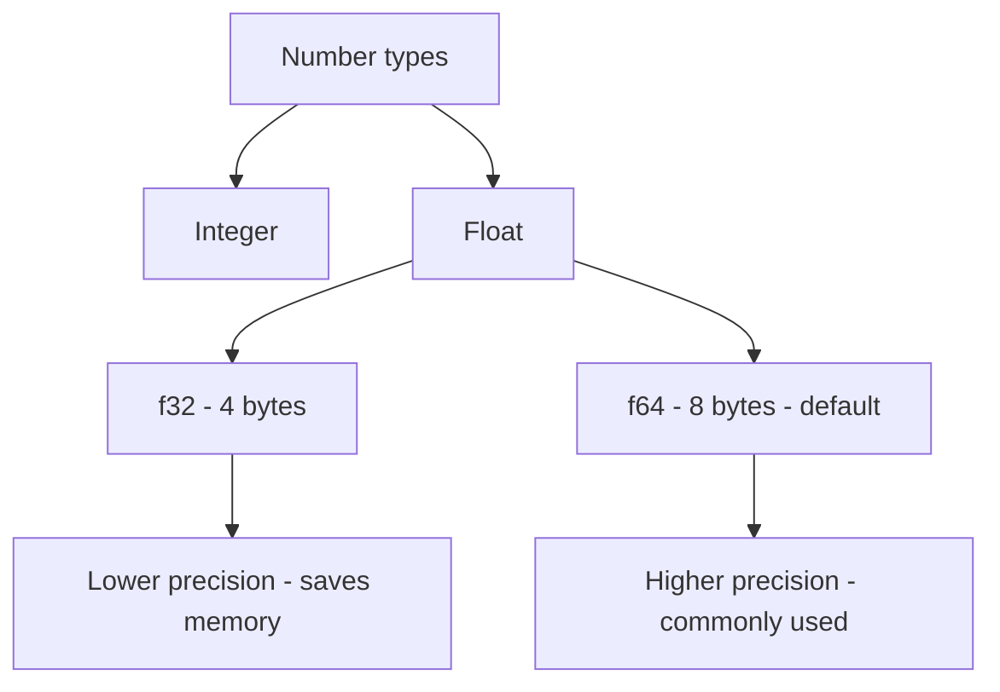

# 🦀 Rust Easy Rust 006 — Floats (실수형)

## 📌 Floats란?
- **Floats(부동소수점 수)**: 소수점을 포함한 숫자를 표현할 수 있는 자료형  
- Rust에서는 대표적으로 두 가지 타입 제공:
  - **f32** → 32비트(4바이트), 단정밀도
  - **f64** → 64비트(8바이트), 배정밀도 (기본)

---

## 🎬 학습 타임라인 요약

- **(00:01)** Rust에서 숫자 타입을 다루는 기본 개념 소개
- **(01:05)** 큰 수를 다룰 경우 `f64` 같은 큰 범위 실수가 필요
- **(02:08)** `f32` vs `f64` 비교  
  → `f64`가 두 배의 바이트를 사용하지만 정확도와 안정성이 높음
- **(03:17)** 실수를 정수로 변환 시, 소수점 절삭/반올림 때문에 예상치 못한 결과 발생 가능

---

## 🧮 Rust 코드 예시

```rust
fn main() {
    // f64: 기본 실수형 (더 정밀)
    let x = 9.9_f64;
    let y = 9.2_f64;
    println!("x: {}, y: {}", x, y);

    // f32: 메모리는 적지만 정확도는 낮음
    let a: f32 = 3.1415926535;
    println!("a (f32): {}", a);

    // 정수 변환 주의
    let b = 9.6_f64 as i32; // 결과: 9
    println!("9.6을 정수로 변환: {}", b);
}
```

## 🔍 Mermaid 시각화 – Float 타입 비교



## 💡 초보자를 위한 쉬운 설명

정수(i32, i64)는 소수점 없는 숫자만 저장

실수(f32, f64)는 소수점 있는 숫자를 저장

기본적으로 f64가 자동 선택됨 → 정확도가 더 필요하기 때문

정수로 변환할 땐 소수점 이하가 잘려나감 → 꼭 주의!

## 🏢 현업에서는 어떻게 쓸까?

f64 →

과학/공학 계산 (물리 시뮬레이션, 금융 서비스 이자율 계산 등)

정밀한 계산이 필요한 머신러닝, 데이터 분석

f32 →

메모리 최적화가 필요한 환경 (게임 그래픽, 임베디드 시스템)

GPU 연산에서 속도를 높이기 위해 사용됨

## 📌 핵심 정리

Rust 실수 기본 타입은 f64 (정확성 중시)

f32는 메모리를 줄일 수 있지만 오차 발생 가능

정수 변환 시 값이 잘려서 예상치 못한 결과가 나올 수 있음

현업에서는 정확도와 성능의 균형에 따라 f32/f64를 선택함
