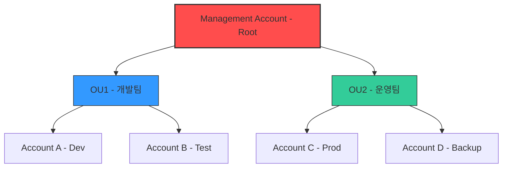

# 🌐 AWS Organizations 정리

---

## 1️⃣ AWS Organizations란?

AWS Organizations는 여러 AWS 계정을 중앙에서 관리할 수 있는 서비스예요.
조직 내의 모든 계정을 통합 관리하여 보안, 비용, 정책 적용을 손쉽게 할 수 있습니다.

👉 쉽게 말해, 회사에서 여러 부서/팀이 각각 AWS 계정을 쓰더라도, 본사는 한 곳에서 통제할 수 있게 해주는 서비스입니다.

---

## 2️⃣ 주요 기능

* 👥 멀티 계정 관리 → 여러 AWS 계정을 하나의 조직 단위로 묶어서 관리
* 🛡️ 서비스 제어 정책(SCP) → 특정 서비스·리전 사용 제한
* 💰 통합 청구(Consolidated Billing) → 모든 계정 비용을 한 번에 관리
* 🗂️ OU(Organizational Unit) → 계정을 그룹화해 정책을 계층적으로 적용
* 🔒 보안 강화 → 루트 계정 최소화 + IAM 결합으로 안전한 운영

---

## 3️⃣ 아키텍처 시각화


Management Account: 조직 전체를 관리하는 최상위 계정

OU (Organizational Unit): 부서/팀 단위 그룹

Member Accounts: 실제로 리소스를 운영하는 계정들

---

4️⃣ 예시 정책 (SCP, Service Control Policy)

```json
{
  "Version": "2012-10-17",
  "Statement": [
    {
      "Effect": "Deny", 
      "Action": "ec2:RunInstances",   // EC2 인스턴스 생성 제한
      "Resource": "*",
      "Condition": {
        "StringNotEquals": {
          "aws:RequestedRegion": "ap-northeast-2" // 서울 리전만 허용
        }
      }
    }
  ]
}
```

**### **➡️ 위 정책은 서울 리전(ap-northeast-2) 외에서는 EC2 인스턴스를 생성할 수 없도록 차단합니다.

## 5️⃣ 현업 활용 사례

* 🛡️ 보안팀 → 특정 리전만 사용하도록 강제 (예: GDPR 때문에 EU 리전만 허용)
* 💰 재무팀 → 모든 계정 비용을 통합 청구로 관리 + 부서별 비용 태깅
* ⚙️ 운영팀 → 신규 계정 생성 시 보안 설정, IAM Role, CloudTrail 자동 적용
* 🚀 Control Tower 연계 → 멀티 계정 환경에서 표준 보안·거버넌스 체계 구축

## 6️⃣ 정리

### AWS Organizations는 멀티 계정 환경에서 중앙 관리를 가능하게 해주는 핵심 서비스

SCP를 통해 강력한 보안 통제 가능

통합 청구로 비용 최적화

### 현업에서는 보안·비용·운영 효율성을 높이기 위해 반드시 사용됨

## ✅ 요약

AWS Organizations는 멀티 계정 환경에서 보안, 비용, 거버넌스를 한 번에 관리할 수 있는 핵심 서비스입니다.

* 🔒 보안 강화 (SCP 정책)
* 💰 비용 최적화 (Consolidated Billing)
* 🛠️ 운영 효율성 (OU 구조로 계정 관리)
### 👉 현업에서는 AWS Control Tower와 함께 쓰여서 기업 단위 클라우드 운영의 표준이 됩니다.


* 참고 블로그 : https://velog.io/@yjshin/AWS-AWS-Organizations


