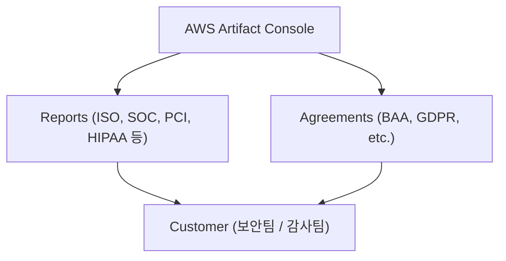

# 📑 AWS Artifact 정리

---

## 1️⃣ AWS Artifact란?

AWS Artifact는 AWS에서 제공하는 규정 준수(Compliance)와 보안 관련 문서 관리 서비스입니다.

👉 쉽게 말해,
기업이 보안 감사, 규제 준수(ISO, SOC, GDPR 등)에 대응할 수 있도록
AWS가 직접 제공하는 보안·컴플라이언스 문서를 다운로드하고 관리할 수 있는 서비스입니다.

## 2️⃣ 주요 기능

📜 보고서(Reports) 제공

SOC, ISO, PCI DSS, HIPAA 등 각종 인증 보고서를 다운로드

🤝 계약(Agreements) 관리

BAA(Business Associate Agreement), GDPR 관련 계약 등

🔒 규제 준수 지원

고객이 컴플라이언스 요구사항에 대응할 수 있도록 문서화된 증적 제공

🌍 셀프 서비스

콘솔에서 클릭 몇 번으로 필요한 문서를 즉시 다운로드

## 3️⃣ 아키텍처 시각화

## 4️⃣ 현업 활용 사례

🏦 금융/의료 기관

PCI DSS, HIPAA 규제 준수를 위한 보고서 확보

🛡️ 보안팀

감사(Audit) 시 증적 자료로 활용

🌍 글로벌 서비스 기업

GDPR, ISO 등 지역별/국제 규정 준수 증빙

📂 계약 관리

BAA, 데이터 처리 계약(DPA) 등을 Artifact 콘솔에서 직접 체결 및 관리

## ✅ 정리

> AWS Artifact = 보안·규제 준수 문서 관리 서비스

> Reports: SOC, ISO, PCI DSS, HIPAA 등 다운로드

> Agreements: GDPR, BAA 등 규제 관련 계약 관리

현업에서는 감사 대응, 규정 준수 증적 확보, 계약 관리에 활용

👉 한마디로, “AWS 컴플라이언스 문서 보관함” 이라고 이해하면 쉽습니다.
