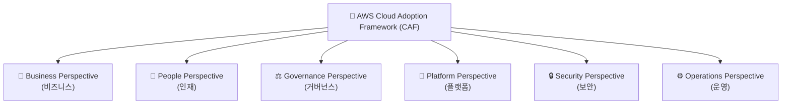

# ☁️ AWS CAF (Cloud Adoption Framework) 정리

--- 

## 1️⃣ AWS CAF란?

AWS Cloud Adoption Framework (CAF) 는
기업이 클라우드 도입(Cloud Adoption) 을 체계적으로 수행할 수 있도록 돕는 전략적 프레임워크입니다.

👉 쉽게 말해,
“기업이 클라우드로 전환할 때 무엇을, 어떻게 준비해야 하는지 알려주는 로드맵” 이라고 할 수 있습니다.

---

## 2️⃣ AWS CAF의 목적

AWS CAF는 다음을 목표로 합니다:

### 🚀 클라우드 전환 가속화

### 🧭 조직의 IT 전략과 비즈니스 목표 정렬

### 🧱 리스크 최소화 및 거버넌스 강화

### 🔄 조직 전체의 클라우드 역량 향상

---

## 3️⃣ AWS CAF의 6가지 관점 (Perspectives)

---

| 관점                    | 주요 초점                       | 담당 부서/역할     |
| --------------------- | --------------------------- | ------------ |
| **Business (비즈니스)**   | 클라우드가 비즈니스 목표 달성에 어떻게 기여하는가 | 경영진, 전략팀     |
| **People (인재)**       | 클라우드 운영에 필요한 인력과 기술 역량      | HR, 교육팀      |
| **Governance (거버넌스)** | 위험 관리, 규제 준수, 재무 관리         | 보안팀, 감사팀     |
| **Platform (플랫폼)**    | 클라우드 인프라 설계 및 운영            | IT 인프라팀      |
| **Security (보안)**     | 데이터 보호, 접근 제어, 규정 준수        | 보안팀, IAM 담당자 |
| **Operations (운영)**   | 서비스 모니터링, 자동화, 지속 개선        | DevOps, 운영팀  |

---

## 4️⃣ AWS CAF 시각화 다이어그램

### 💡 구성요소 설명
---
| 관점                       | 설명                         |
| ------------------------ | -------------------------- |
| 💼 **Business (비즈니스)**   | 비즈니스 목표, ROI, 가치 실현 전략 수립  |
| 👥 **People (인재)**       | 조직 구조, 역할, 클라우드 역량 강화      |
| ⚖️ **Governance (거버넌스)** | 정책, 규정, 비용 및 위험 관리 체계 수립   |
| 🧱 **Platform (플랫폼)**    | 클라우드 인프라 설계 및 배포 전략        |
| 🔒 **Security (보안)**     | 보안 정책, IAM, 데이터 보호 및 규정 준수 |
| ⚙️ **Operations (운영)**   | 운영 모니터링, 변경 관리, 자동화 프로세스   |

---

## 5️⃣ 각 관점별 주요 질문 예시

---

| 관점         | 핵심 질문                                   |
| ---------- | --------------------------------------- |
| Business   | 클라우드 도입이 수익, 비용 절감, 고객 만족도에 어떤 영향을 주는가? |
| People     | 우리 조직의 클라우드 기술 역량은 충분한가? 필요한 교육은 무엇인가?  |
| Governance | 예산, 정책, 위험 관리를 어떻게 표준화할 수 있을까?          |
| Platform   | 어떤 인프라 구조로 클라우드를 설계할까? (VPC, EC2, S3 등) |
| Security   | 데이터 보호 및 접근 제어를 어떻게 강화할까?               |
| Operations | 운영 효율화, 자동화, 모니터링 시스템은 어떻게 구축할까?        |

---

## 6️⃣ 현업 적용 예시

---

| 시나리오                  | 적용 방식                                       |
| --------------------- | ------------------------------------------- |
| 🏢 **공공기관 클라우드 전환**   | Governance와 Security 관점 중심으로 보안 정책 정립       |
| 🧑‍💻 **스타트업 인프라 구축** | Platform, Operations 중심으로 빠른 배포 자동화         |
| 💰 **금융사 클라우드 도입**    | Governance + Security + Business 균형 중심으로 운영 |

---

## ✅ 정리

AWS CAF = 클라우드 도입을 위한 체계적 로드맵

6가지 관점: Business, People, Governance, Platform, Security, Operations

목표: 비즈니스 정렬 + 위험 최소화 + 클라우드 전환 가속화

현업에서는 전략 수립, 보안 강화, 인프라 설계, 운영 자동화 등에 활용

👉 한마디로,
“AWS CAF는 기업의 클라우드 여정을 성공으로 이끄는 나침반이다.”
