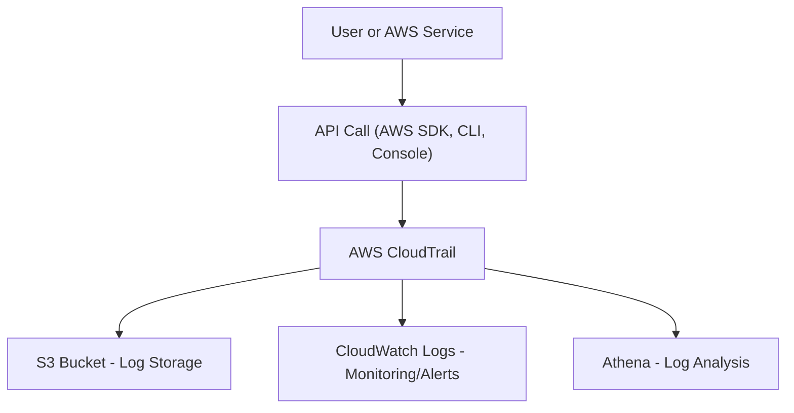

# 📜 AWS CloudTrail 정리

---

## 1️⃣ AWS CloudTrail이란?
AWS CloudTrail은
AWS 계정 내에서 발생하는 API 호출 이력(누가, 언제, 무엇을 했는지) 을 기록하고 추적하는 서비스입니다.

👉 쉽게 말해,
“AWS 계정의 CCTV” 역할을 하는 서비스입니다.

---

## 2️⃣ 주요 기능

---

### 👤 사용자 활동 기록
IAM 사용자, Root 계정, 서비스가 어떤 작업을 했는지 기록

### 🛡️ 보안 감사(Security Audit)
보안팀이 변경 이력을 추적해 이상 행위 탐지 가능

### 🔄 문제 해결(Troubleshooting)
서비스 중단/장애 원인 파악

### 📂 로그 저장
S3 버킷에 이벤트 로그 저장

Athena/CloudWatch와 연동해 분석 가능

---

## 3️⃣ 아키텍처 시각화




---

## 4️⃣ CloudTrail 이벤트 예시

```
{
  "eventVersion": "1.08",
  "userIdentity": {
    "type": "IAMUser",
    "userName": "admin"
  },
  "eventTime": "2025-09-10T12:34:56Z",
  "eventSource": "ec2.amazonaws.com",
  "eventName": "StartInstances",
  "awsRegion": "ap-northeast-2",
  "sourceIPAddress": "192.168.1.1"
}
```

## 📝 해석:

admin 사용자가 서울 리전(ap-northeast-2)에서 
EC2 인스턴스를 시작(StartInstances) 
언제(2025-09-10) 어떤 IP에서 실행했는지 기록

## 5️⃣ 현업 활용 사례
### 🛡️ 보안팀 → Root 계정 사용 여부 모니터링, S3 퍼블릭 변경 이벤트 감시

### 🏢 운영팀 → 장애 원인 분석 (누가 보안 그룹 규칙 변경했는지 확인)

### 💰 컴플라이언스 → PCI-DSS, HIPAA 같은 규제 감사 대응

### 🔍 포렌식 조사 → 계정 침해 사고 시 행동 추적

## ✅ 정리

CloudTrail = AWS 계정의 모든 활동 기록 서비스

기록 대상: API 호출 (Console, CLI, SDK, 서비스 간 호출)

로그 저장: S3, CloudWatch, Athena

주요 활용: 보안 감사, 장애 분석, 규제 준수, 포렌식 조사

👉 한마디로, “누가 AWS에서 무엇을 했는지” 반드시 알려주는 서비스입니다.


* 참고 블로그 : https://velog.io/@yjshin/AWS-AWS-CloudTrail
