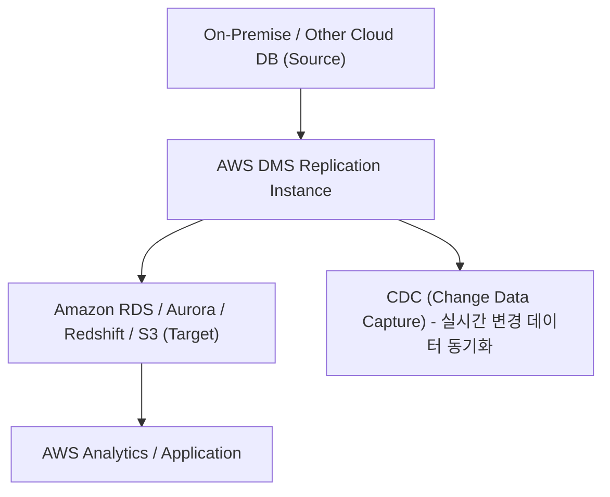
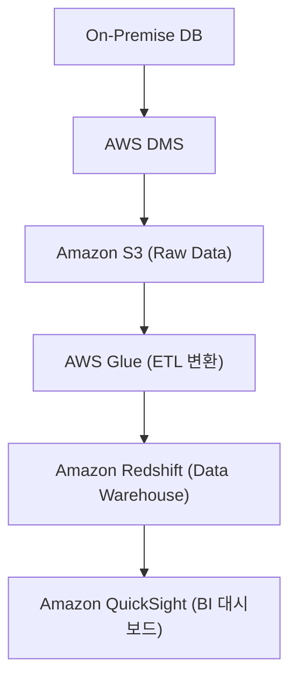

# 🔄 AWS DMS (Database Migration Service) 정리

---

## 1️⃣ AWS DMS란?

AWS DMS (Database Migration Service) 는
온프레미스나 클라우드 환경에 있는 데이터베이스를
AWS로 손쉽게 이전(Migration) 하도록 도와주는 서비스입니다.

👉 쉽게 말해,
“운영 중인 DB를 중단하지 않고, AWS로 안전하게 옮겨주는 이사 도우미 서비스” 입니다.

---

## 2️⃣ 주요 특징
| 특징                                   | 설명                                                                 |
| ------------------------------------ | ------------------------------------------------------------------ |
| 🚀 **무중단 마이그레이션 (Minimal Downtime)** | 기존 DB를 계속 사용하면서 실시간으로 데이터 복제                                       |
| 🔁 **동종 및 이기종 간 마이그레이션 지원**          | Oracle → Oracle 뿐 아니라, Oracle → Aurora / PostgreSQL 등 이기종 간 이전도 가능 |
| ⚙️ **자동화된 복제 관리**                    | 데이터 추출, 변환, 적재(ETL) 과정 자동 수행                                       |
| 💾 **CDC (Change Data Capture)**     | 변경된 데이터만 지속적으로 동기화                                                 |
| ☁️ **안정성 & 복구 지원**                   | 실패 시 자동 재시작, 오류 로그 추적                                              |
| 🛡 **보안 통합**                         | KMS 암호화, IAM 인증, VPC/Subnet 보안 그룹 연동                               |

---

## 3️⃣ 지원 소스(Source) & 대상(Target)
| 소스 DB         | 대상 DB                 |
| ------------- | --------------------- |
| Oracle        | Aurora, RDS, Redshift |
| MySQL         | MySQL, PostgreSQL     |
| SQL Server    | S3, DynamoDB          |
| PostgreSQL    | Snowflake, Redshift   |
| MongoDB       | DocumentDB            |
| On-Premise DB | AWS 클라우드 DB 전체 지원     |

---

## 4️⃣ 아키텍처 시각화

🧠 설명:

Replication Instance: DMS의 핵심 컴퓨팅 리소스 (데이터 추출·변환·복제 담당)

CDC(Change Data Capture): 소스 DB의 변경 사항을 지속적으로 추적 및 반영

Target: RDS, S3, Redshift 등 AWS 내 데이터 저장소

---

## 5️⃣ DMS 동작 과정
| 단계                            | 설명                     |
| ----------------------------- | ---------------------- |
| ① **소스/타깃 연결 설정**             | 온프레미스 DB와 AWS DB 연결 구성 |
| ② **Replication Instance 생성** | 마이그레이션 담당 EC2 역할 수행    |
| ③ **테이블 매핑 및 변환 규칙 설정**       | 복사할 데이터 및 변환 규칙 지정     |
| ④ **Full Load 수행**            | 기존 데이터 전체 복제           |
| ⑤ **CDC 수행 (실시간 변경 동기화)**     | 소스 DB의 변경사항을 지속 반영     |
| ⑥ **Cutover (전환)**            | 새 DB로 전환 후 운영 환경 전환 완료 |

---

## 6️⃣ 현업 활용 사례
| 산업                | 활용 예시                                    |
| ----------------- | ---------------------------------------- |
| 🏢 **금융 / 공공기관**  | Oracle → Amazon Aurora PostgreSQL 이전     |
| 🏭 **제조 / IoT**   | 공장 DB를 S3로 이전해 Athena/Glue로 분석           |
| 🛒 **이커머스 / 리테일** | 실시간 CDC로 주문 데이터 Redshift로 동기화            |
| 🧠 **데이터 분석 플랫폼** | RDS → S3 → Glue → QuickSight 분석 파이프라인 구성 |

---

## 7️⃣ AWS DMS + SCT 조합

DMS 단독으로도 마이그레이션 가능하지만, DB 스키마 변환이 필요한 경우
함께 쓰이는 도구가 바로 AWS SCT (Schema Conversion Tool) 입니다.

도구	역할
AWS SCT	스키마 변환 (예: Oracle → PostgreSQL 구조 변환)
AWS DMS	실제 데이터 복제 및 전송 담당

🧩 둘을 함께 사용하면 완전 자동화된 마이그레이션 가능!

---

## 8️⃣ AWS DMS + Analytics 통합 예시

📊 설명:
온프레미스 데이터베이스 → DMS로 AWS S3에 저장 → Glue로 정제 → Redshift에서 분석 → QuickSight로 시각화

💡 단계별 설명

| 단계                       | 구성 요소                                          | 
| ------------------------ | ---------------------------------------------- | 
| 🏠 **On-Premise DB**     | 내부 서버나 타 클라우드의 원본 데이터 저장소                      | 
| ⚙️ **AWS DMS**           | 데이터를 안전하게 AWS로 복제 및 이전                         |  
| 🪣 **Amazon S3**         | 수집된 Raw 데이터를 저장하는 Data Lake 영역                 |   
| 🧩 **AWS Glue**          | ETL(Extract, Transform, Load) 작업으로 데이터 정제 및 변환 |    
| 🏢 **Amazon Redshift**   | 정제된 데이터를 분석용으로 저장하는 Data Warehouse             |  
| 📊 **Amazon QuickSight** | Redshift의 데이터를 시각화해 BI 대시보드로 제공                |    

---

## 9️⃣ ✅ 정리

AWS DMS = 데이터베이스 마이그레이션 및 복제 서비스

장점:

무중단 데이터 이전

동종/이기종 간 마이그레이션 지원

CDC로 실시간 변경 반영

주요 구성: Source → DMS Replication Instance → Target

현업 활용: DB 이전, 데이터 분석 파이프라인, 클라우드 통합

👉 한마디로,
“AWS DMS는 데이터베이스를 중단 없이 클라우드로 이사시키는 자동 복제 도구” 입니다.
