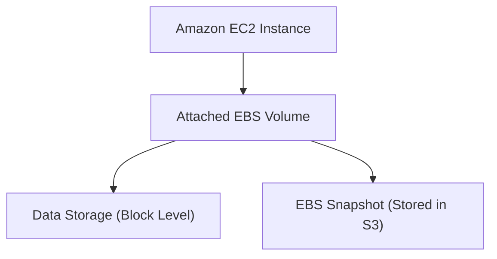

# 💾 AWS EBS (Elastic Block Store) 정리

## 1️⃣ AWS EBS란?

**Amazon EBS (Elastic Block Store)** 는  
Amazon EC2 인스턴스에서 사용하는 **블록 수준의 스토리지 서비스**입니다.

👉 쉽게 말해,  
**“EC2에 붙여 쓰는 가상 하드디스크”** 라고 이해하면 됩니다.

---

## 2️⃣ 주요 특징

- 📂 **블록 스토리지**
    
    - 일반적인 하드디스크처럼 파일 시스템을 올려 사용
        
- 🔄 **탄력성**
    
    - 필요에 따라 크기 확장/축소 가능
        
- 🛡️ **내구성 & 가용성**
    
    - 동일 AZ(가용영역) 내에서 자동 복제 → 데이터 손실 방지
        
- 🚀 **성능 옵션 다양**
    
    - 범용 SSD (gp3), 프로비저닝 IOPS SSD (io2), HDD (st1, sc1) 등 워크로드에 맞게 선택
        
- 💾 **스냅샷(Snapshot)**
    
    - S3에 저장되는 백업 기능 제공
        
    - 다른 AZ/리전으로 복제 가능
        

---

## 3️⃣ 아키텍처 시각화

---

## 4️⃣ EBS 볼륨 유형

1. **SSD 계열**
    
    - `gp3` (범용 SSD): 대부분의 워크로드에 적합, 가격/성능 균형
        
    - `io2` (프로비저닝 IOPS SSD): 높은 성능/일관된 IOPS, DB용
        
2. **HDD 계열**
    
    - `st1` (처리량 최적화 HDD): 빅데이터, 로그 처리
        
    - `sc1` (Cold HDD): 잘 쓰지 않는 데이터 아카이빙
        

---

## 5️⃣ 현업 활용 사례

- 🛠 **운영 DB 스토리지** → RDS, EC2 기반 DB 서버에 고성능 io2 EBS 사용
    
- 📊 **로그/데이터 처리** → st1 HDD로 대규모 로그 저장
    
- 🛡️ **백업 & 복구** → 스냅샷으로 자동 백업/재해 복구(DR) 활용
    
- 🚀 **테스트 환경 복제** → 스냅샷으로 동일한 개발/테스트 환경 생성
    

---

## ✅ 정리

- **EBS = EC2 인스턴스에 붙이는 블록 스토리지**
    
- 특징: **고성능, 내구성, 스냅샷, 다양한 볼륨 타입**
    
- 현업 활용: **DB, 로그 저장, 백업/복구, 테스트 환경 복제**
    

👉 한마디로, **“EC2 전용 가상 하드디스크”** 입니다.
