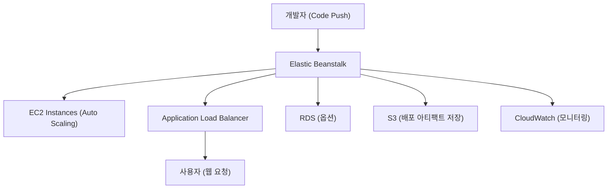

# 🌱 AWS Elastic Beanstalk 정리

---

## 1️⃣ AWS Elastic Beanstalk이란?

AWS Elastic Beanstalk은
애플리케이션 배포와 관리를 자동으로 처리해주는 PaaS(Platform as a Service) 형태의 서비스입니다.

👉 쉽게 말해,
“서버 인프라 신경 안 쓰고, 코드를 올리면 AWS가 알아서 배포해주는 서비스” 입니다.

---

## 2️⃣ 주요 특징

### 🚀 자동 인프라 프로비저닝

EC2, Auto Scaling, Load Balancer, Security Group 등을 자동으로 생성

### 🧩 멀티 언어 지원

Java, Python, Node.js, Go, PHP, Ruby, .NET 등

### ⚙️ 자동 배포 & 롤백

새 버전 배포 시 자동 트래픽 전환 및 장애 발생 시 롤백

### 📈 모니터링 통합

CloudWatch, Health Dashboard로 상태 확인 가능

### 💾 환경 구성 자동화

환경별(개발/운영) 설정, 버전 관리, 환경 변수 관리

---

## 3️⃣ 아키텍처 시각화

---

---

## 4️⃣ 구성 요소
---

| 구성 요소                      | 설명                              |
| -------------------------- | ------------------------------- |
| **Application**            | Beanstalk에서 관리하는 전체 앱 단위        |
| **Environment**            | 개발/운영 환경 (예: dev, prod)         |
| **Version**                | 애플리케이션 배포 버전                    |
| **Configuration Template** | EC2 타입, Auto Scaling 설정 등 환경 구성 |
| **Platform**               | 실행 언어 및 런타임 (Python, Node.js 등) |

---

## 5️⃣ 장점

### 🧑‍💻 개발 중심 환경

인프라 관리 부담 최소화 (DevOps 자동화)

### 📦 AWS 서비스와 통합

RDS, S3, CloudWatch, CodePipeline 등과 연동

### 💰 비용 효율성

사용하는 리소스(EC2, RDS 등)에 대해서만 과금

### ♻️ 유연성

EC2, VPC, 보안 그룹 등 하위 인프라 직접 수정 가능

---

## 6️⃣ 현업 활용 사례

### 🌐 웹 애플리케이션 배포

Python Django, Node.js, Java Spring 앱을 Beanstalk으로 자동 배포

### 🏢 스타트업 초기 서비스 구축

인프라 구성 없이 빠른 MVP 배포

### 🧩 CI/CD 파이프라인 통합

CodePipeline + Beanstalk 연동으로 자동 배포 파이프라인 구현

### 🧠 교육/실습용 플랫폼

AWS 학습 및 테스트 환경으로 자주 활용

---

## ✅ 정리

AWS Elastic Beanstalk = 자동화된 애플리케이션 배포 플랫폼 (PaaS)

자동으로 EC2, ALB, Auto Scaling, RDS 구성

언어/플랫폼 지원: Java, Node.js, Python, Go 등

현업에서는 웹 서비스 운영, 자동 배포 파이프라인, 스타트업 MVP 배포 등에 활용

👉 한마디로, “코드만 올리면 자동으로 인프라를 구성해주는 AWS의 배포 마법사” 입니다.
