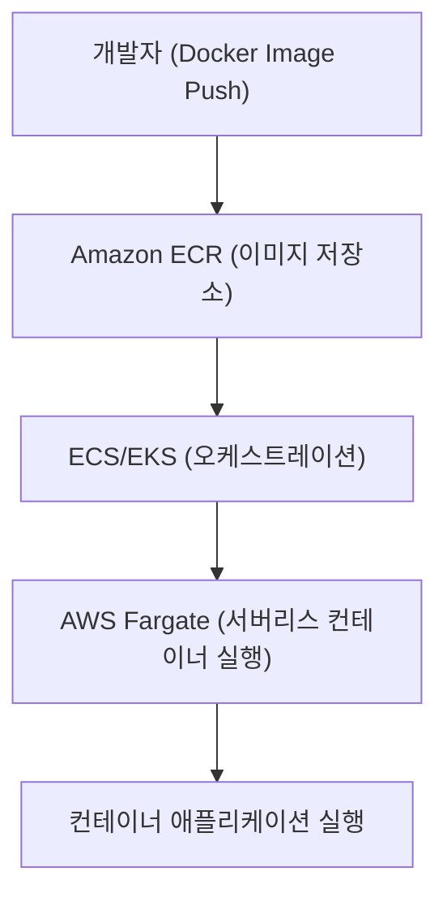

# 🐳 AWS Fargate 정리

---

## 1️⃣ AWS Fargate란?

AWS Fargate는 컨테이너를 실행하기 위한 서버리스 컴퓨팅 엔진입니다.
사용자가 서버(EC2)를 직접 관리하지 않고도, ECS(Elastic Container Service) 또는 EKS(Elastic Kubernetes Service) 에서 컨테이너를 실행할 수 있게 해줍니다.

👉 쉽게 말해,
“도커 컨테이너를 실행하는데 서버 관리가 필요 없는 서비스” 입니다.

---

## 2️⃣ 주요 특징

### 🚀 서버리스(Container 전용)

인프라(EC2 클러스터) 관리 불필요

### 📈 자동 확장

워크로드에 따라 컨테이너 리소스 자동 할당

### 💰 비용 효율성

CPU/메모리 사용량 기준으로 과금 (Pay-as-you-go)

### 🛡️ 보안 격리

컨테이너 단위의 격리 환경 제공

### ⚡ ECS/EKS 통합

ECS 태스크 정의 또는 EKS 파드(Pod)로 실행

---

## 3️⃣ 아키텍처 시각화

---

## 4️⃣ Fargate vs EC2 기반 컨테이너
구분	EC2 기반	Fargate 기반
서버 관리	직접 관리 필요 (EC2 프로비저닝, 패치 등)	관리 불필요 (서버리스)
확장성	Auto Scaling 필요	자동 확장
과금 방식	EC2 인스턴스 단위	CPU/메모리 단위
보안	EC2 보안 패치 책임	AWS가 인프라 보안 관리

---

## 5️⃣ 현업 활용 사례

### 🏢 마이크로서비스 아키텍처

서비스별 컨테이너를 독립적으로 실행하고 확장

### 📊 데이터 처리 파이프라인

배치 잡, ETL 처리, 로그 수집

### 🌐 웹 애플리케이션

API 서버, 백엔드 컨테이너 실행

### 🧪 개발/테스트 환경

빠르게 컨테이너 실행 후 종료 (테스트 자동화)

---

## ✅ 정리

AWS Fargate = 서버리스 컨테이너 실행 엔진

ECS/EKS와 함께 사용 → EC2 관리 없이 컨테이너 실행 가능

장점: 자동 확장, 보안 강화, 비용 효율성

현업 활용: 마이크로서비스, 데이터 처리, 웹서비스, 테스트 환경

### 👉 한마디로, “컨테이너 전용 서버리스 컴퓨팅 서비스” 입니다.
