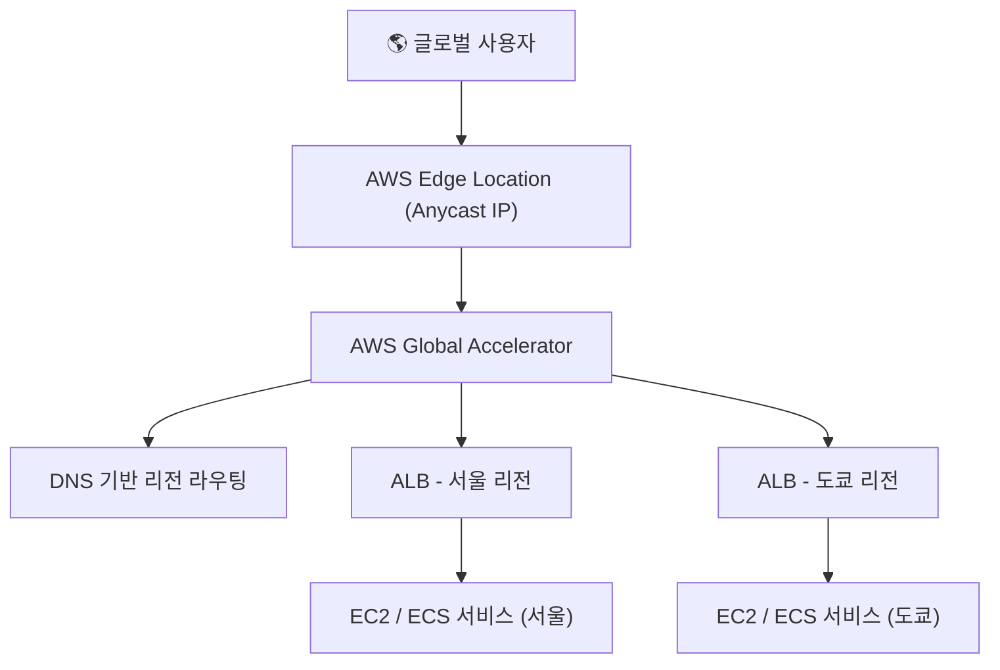

# 🌍 AWS Global Accelerator 정리

---

## 1️⃣ AWS Global Accelerator란?

AWS Global Accelerator는
AWS 글로벌 네트워크를 활용해 사용자 트래픽을 가장 가까운 리전으로 라우팅하고, 네트워크 성능을 최적화하는 서비스입니다.

### 👉 쉽게 말해, “전 세계 어디서 접속해도, 가장 빠른 경로로 트래픽을 전달해주는 글로벌 가속기” 입니다.

---

## 2️⃣ 주요 특징

### ⚡ 지연 시간(Latency) 최소화

사용자의 위치에 따라 가장 가까운 AWS 엣지 네트워크로 연결

### 🌐 글로벌 IP 제공

고정된 2개의 Anycast IP를 통해 전 세계 어디서나 동일한 엔드포인트 접근 가능

### 🔁 자동 장애 조치 (Failover)

백엔드 리전(예: 서울 ↔ 도쿄) 중 하나가 장애 시 자동으로 다른 리전으로 트래픽 전환

### 📈 고가용성 및 안정성

AWS 백본 네트워크를 사용하여 패킷 손실 및 지연 감소

---

## 3️⃣ 아키텍처 시각화

---

---

## 4️⃣ Global Accelerator vs CloudFront

| 구분        | **Global Accelerator** | **CloudFront**         |
| --------- | ---------------------- | ---------------------- |
| **용도**    | TCP/UDP 트래픽 최적화        | 정적 콘텐츠 캐싱 (CDN)        |
| **프로토콜**  | L4 (TCP/UDP)           | L7 (HTTP/HTTPS)        |
| **대상**    | ALB, NLB, EC2 등 엔드포인트  | S3, ALB, API Gateway 등 |
| **지연 시간** | 전 세계 네트워크 최적화          | 콘텐츠 캐시로 빠른 응답          |
| **활용 예시** | 게임, API, 글로벌 서비스 백엔드   | 웹 콘텐츠, 이미지, 동영상 제공     |

---

## 5️⃣ 현업 활용 사례

### 🎮 글로벌 게임 서비스

플레이어가 전 세계 어디서 접속해도 가장 가까운 리전으로 빠르게 연결

### 🌐 멀티 리전 웹서비스

서울 리전 장애 시 자동으로 도쿄 리전으로 트래픽 전환

### 🏢 기업 글로벌 애플리케이션

본사/지사 간 API 통신 속도 개선

### 📊 금융 서비스

네트워크 지연이 민감한 트랜잭션 처리

---

## ✅ 정리

AWS Global Accelerator = 글로벌 트래픽 가속 서비스

고정 IP 제공 + 리전 간 트래픽 자동 전환

지연 시간 최소화, 장애 복구 자동화, 글로벌 사용자 경험 개선

현업에서는 글로벌 웹 서비스, 게임, 금융/IoT 백엔드 등에서 많이 사용

### 👉 한마디로, “전 세계 어디서나 빠르고 안정적인 네트워크 연결을 보장하는 서비스” 입니다.
