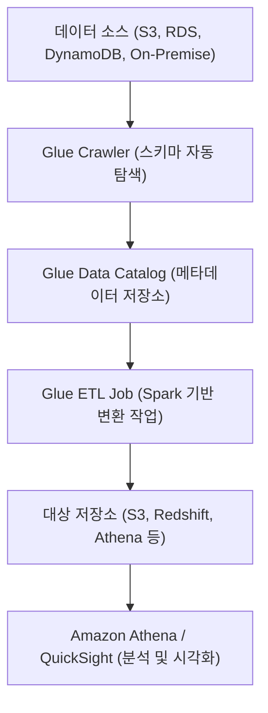
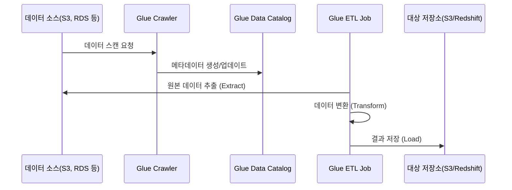

# 🧩 AWS Glue 정리

---

## 1️⃣ AWS Glue란?

AWS Glue는
데이터를 수집, 정제, 변환, 통합(ETL) 하는 과정을 자동화해주는
서버리스 데이터 통합 서비스 (Serverless ETL Service) 입니다.

👉 쉽게 말해,
“S3, RDS, Redshift 등에 흩어진 데이터를 자동으로 정리해주는 AWS의 데이터 파이프라인 도우미” 입니다.

---

## 2️⃣ 주요 기능
| 기능                                    | 설명                                          |
| ------------------------------------- | ------------------------------------------- |
| 📦 **ETL (Extract, Transform, Load)** | 데이터를 추출 → 변환 → 대상 저장소로 로드                   |
| 🧠 **데이터 카탈로그 (Glue Data Catalog)**   | 데이터의 메타데이터(스키마, 테이블 구조) 자동 관리               |
| 🔄 **Glue Crawler**                   | S3, RDS, DynamoDB 등의 데이터 소스를 자동 스캔하여 스키마 생성 |
| ⚙️ **서버리스 실행**                        | 인프라 관리 없이 자동 확장되는 Spark 기반 클러스터로 처리         |
| 🧱 **Job / Trigger 관리**               | 정기 실행, 조건부 실행, 이벤트 기반 자동 실행 가능              |
| 🔍 **Glue Studio / DataBrew**         | GUI 기반 데이터 시각화 및 정제 도구 (비개발자도 사용 가능)        |

---

## 3️⃣ 아키텍처 시각화

---

---

## 4️⃣ 주요 구성 요소
| 구성 요소                 | 설명                                      |
| --------------------- | --------------------------------------- |
| **Glue Data Catalog** | 데이터베이스와 테이블 메타데이터를 저장하는 중앙 저장소          |
| **Glue Crawler**      | 원본 데이터를 스캔해 자동으로 카탈로그 생성                |
| **Glue Job**          | ETL 스크립트를 실행하는 단위 (Python / PySpark 기반) |
| **Trigger**           | Job을 예약 실행하거나 이벤트 기반으로 실행               |
| **Glue Studio**       | GUI 기반 ETL 설계 도구                        |
| **Glue DataBrew**     | 코드 없이 시각적으로 데이터 정제 및 분석 준비              |

---

## 5️⃣ Glue 동작 과정 (ETL 프로세스)

---

## 6️⃣ 현업 활용 사례
| 산업             | 활용 예시                                     |
| -------------- | ----------------------------------------- |
| 🏦 **금융**      | 거래 로그 정제 및 Redshift 분석용 데이터로 변환           |
| 🏭 **제조/IoT**  | 공장 센서 데이터 정제 후 S3에 저장 → Athena 분석         |
| 🛒 **이커머스**    | 고객 행동 로그 → 분석용 테이블 자동 생성                  |
| 🧠 **데이터 분석팀** | Glue DataBrew로 데이터 전처리 후 SageMaker 학습에 활용 |

---

## 7️⃣ Glue와 관련 서비스 비교
| 서비스                    | 주요 기능    | 특징                         |
| ---------------------- | -------- | -------------------------- |
| **AWS Glue**           | ETL 자동화  | 서버리스, Spark 기반, 대규모 데이터 처리 |
| **AWS Data Pipeline**  | 배치 워크플로우 | EC2 기반, 관리형 스케줄러           |
| **AWS Lambda**         | 실시간 처리   | 이벤트 기반 데이터 변환 (소규모)        |
| **AWS Step Functions** | 워크플로우 관리 | Glue Job 간 순서 제어 및 상태 관리   |

---

## ✅ 정리

AWS Glue = 서버리스 데이터 ETL 서비스

구성요소: Crawler, Data Catalog, Job, Trigger, DataBrew

핵심기능: 데이터 정제·통합·자동화

현업활용: 로그 분석, 데이터 파이프라인 구축, 머신러닝 데이터 준비

👉 한마디로,
“AWS Glue는 데이터를 자동으로 정리해주는 클라우드 기반 데이터 청소기” 입니다.
