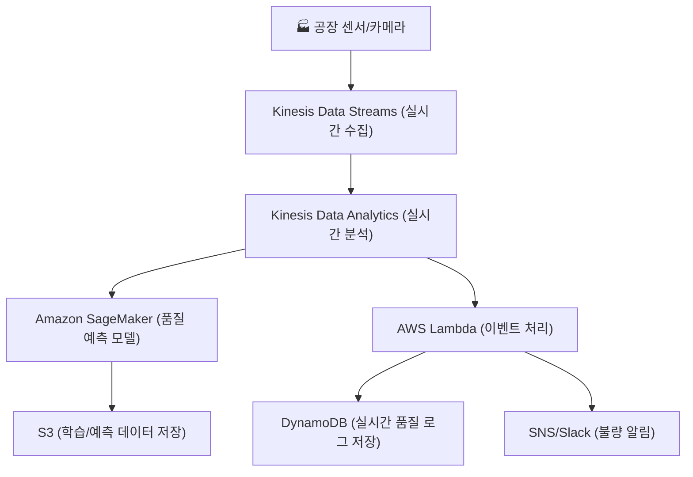
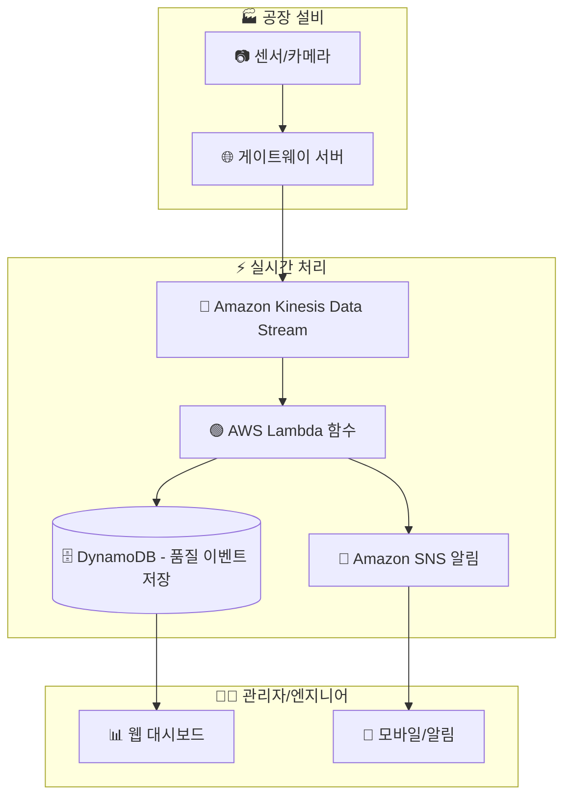
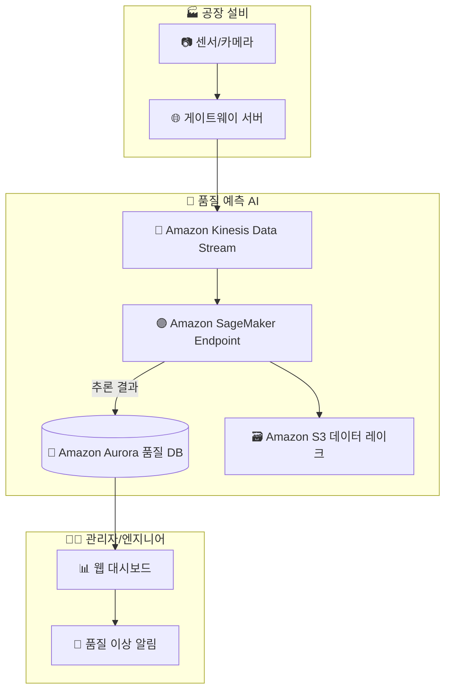

# 📡 AWS Kinesis 정리

--- 

## 1️⃣ AWS Kinesis란?

Amazon Kinesis는 AWS에서 제공하는 실시간 데이터 스트리밍 서비스입니다.
대규모의 데이터를 실시간으로 수집·처리·분석할 수 있습니다.

👉 쉽게 말해,
“들어오는 데이터를 실시간으로 흘려보내고 가공할 수 있는 파이프라인” 입니다.

--- 

## 2️⃣ Kinesis 구성 요소

### Kinesis Data Streams

초당 TB급 데이터 스트리밍 수집 가능

IoT 센서, 로그, 클릭스트림 등 이벤트 수집

### Kinesis Data Firehose

스트리밍 데이터를 자동으로 S3, Redshift, OpenSearch 등에 저장

실시간 데이터 → 저장소 연계

### Kinesis Data Analytics

SQL 기반 실시간 데이터 분석

품질 이상 탐지, 알람 처리 가능

### Kinesis Video Streams

실시간 비디오 스트리밍 수집/처리

--- 

## 3️⃣ 자동화 공장 품질 예측 시나리오

시나리오:
공장의 카메라/센서 데이터를 Kinesis로 수집하고, 실시간 분석을 통해 불량품 발생을 예측합니다.

공장 센서 → Kinesis Data Streams → Lambda/SageMaker → 품질 예측 → 알람/DB 저장

--- 

## 4️⃣ 아키텍처 다이어그램 (Mermaid)

### Kinesis + Lambda (실시간 이벤트 기반 처리)

4️⃣-1️⃣ Kinesis + Lambda 아키텍처

### 특징

Lambda가 Kinesis 스트림을 실시간으로 읽고 품질 이벤트를 빠르게 가공

단순 규칙 기반 품질 판정, 알림 발송에 적합

지연 시간이 매우 낮음 (ms~초 단위)

---

### Kinesis + SageMaker (실시간/배치 AI 모델 추론)

4️⃣-2️⃣ Kinesis + SageMaker 아키텍처

### 특징

SageMaker Endpoint에서 실시간 추론 수행 → 고급 AI 품질 예측

RDS(Aurora) 및 S3에 결과 저장 → 통계/이력 관리

지연 시간은 Lambda보다 길지만 정밀한 예측 모델 활용 가능

---

### 🔎 비교 정리

| 항목        | Kinesis + Lambda     | Kinesis + SageMaker |
| --------- | -------------------- | ------------------- |
| **처리 속도** | 매우 빠름 (ms~초)         | 상대적으로 느림 (초 단위)     |
| **주요 목적** | 단순 규칙 기반 알림, 이벤트 필터링 | AI 기반 고급 품질 예측      |
| **확장성**   | 이벤트 폭주 대응에 적합        | 대규모 AI 추론 확장 가능     |
| **사용 사례** | 즉시 알림, 라인 중지 트리거     | 품질 이상 예측, 통계 분석     |

--- 

## 5️⃣ 현업 활용 포인트

📡 센서 데이터 수집 → Kinesis Data Streams

⚡ 실시간 분석/이상 감지 → Kinesis Data Analytics

🤖 AI 예측 모델 적용 → SageMaker

📂 데이터 저장/백업 → S3, DynamoDB

🔔 불량품 알림 → SNS/Slack

--- 

## ✅ 정리

AWS Kinesis = 실시간 데이터 스트리밍 플랫폼

Data Streams / Firehose / Analytics / Video Streams 네 가지 구성 요소

자동화 공장 시나리오에서 실시간 데이터 수집 → AI 분석 → 불량품 예측 → 알림까지 가능

👉 한마디로, “데이터를 실시간으로 모아 분석하는 AWS의 파이프라인” 입니다.
