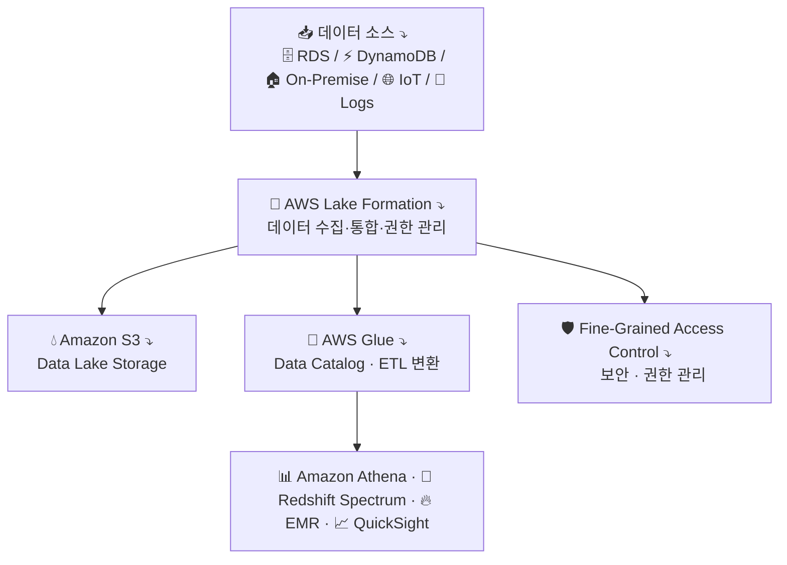
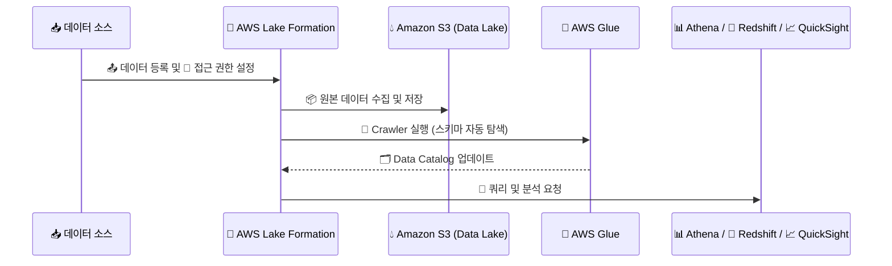
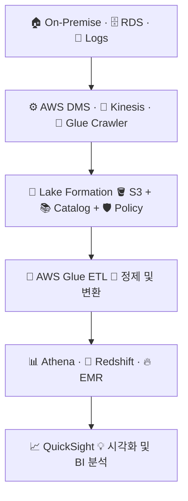

# 💧 AWS Lake Formation 정리

---

## 1️⃣ AWS Lake Formation이란?

AWS Lake Formation은
기업이 데이터를 중앙 집중형 데이터 레이크(Data Lake) 로 손쉽게 구축·관리할 수 있도록
데이터 수집, 정제, 카탈로그 등록, 권한 제어를 자동화해주는 완전관리형 서비스입니다.

👉 쉽게 말해,
“AWS에서 클릭 몇 번으로 안전하고 체계적인 데이터 레이크를 만드는 서비스” 입니다.

---

## 2️⃣ 데이터 레이크(Data Lake)란?

여러 출처(데이터베이스, 로그, IoT 등)의 원시 데이터를 그대로 저장하는 중앙 저장소

형식 있는 데이터(Structured) + 비정형 데이터(Unstructured)를 함께 저장

나중에 ETL, 분석, 머신러닝, BI 용도로 활용

🧠 즉,
데이터 웨어하우스(Redshift)가 “정제된 데이터 분석용”이라면,
데이터 레이크는 “모든 데이터를 한 곳에 저장해 나중에 가공 가능한 원천 저장소”입니다.

---

## 3️⃣ 주요 기능
| 기능                                              | 설명                                          |
| ----------------------------------------------- | ------------------------------------------- |
| ☁️ **데이터 레이크 구축 자동화**                           | S3 기반 데이터 레이크를 자동으로 생성 및 구성                 |
| 🧭 **데이터 카탈로그 통합**                              | Glue Data Catalog와 통합되어 메타데이터 관리            |
| 🔒 **보안 및 권한 관리 (Fine-grained Access Control)** | 사용자별·테이블별 접근 제어                             |
| 🧹 **데이터 정제(ETL) 자동화**                          | Glue ETL과 연동하여 데이터 변환 및 준비 작업 수행            |
| 📊 **다양한 분석 서비스 통합**                            | Athena, Redshift Spectrum, QuickSight 등과 연동 |
| ⚙️ **거버넌스 및 감사**                                | CloudTrail, IAM과 통합된 접근 로그 및 정책 관리          |

---

## 4️⃣ 아키텍처 시각화

🧠 설명:

S3가 데이터 저장소 역할

Glue가 데이터 탐색 및 정제(ETL) 담당

Lake Formation이 보안/거버넌스/권한 관리 통합

Athena·Redshift·QuickSight에서 분석 및 시각화 수행

---

## 5️⃣ Lake Formation 구성 요소
| 구성 요소                      | 설명                                |
| -------------------------- | --------------------------------- |
| **Data Lake Storage (S3)** | 모든 데이터의 중앙 저장소                    |
| **Data Catalog (Glue)**    | 데이터 메타데이터를 저장 (테이블 구조, 경로, 스키마 등) |
| **Data Access Policies**   | 사용자 및 IAM 역할별 세분화된 접근 제어          |
| **Blueprints**             | 데이터 파이프라인 생성 자동화 템플릿              |
| **Data Filter / Tagging**  | 데이터 자산 분류 및 검색 용이성 향상             |

---

6️⃣ Lake Formation과 Glue의 관계
| 구분          | AWS Glue                     | AWS Lake Formation          |
| ----------- | ---------------------------- | --------------------------- |
| **주요 역할**   | 데이터 탐색, ETL, 카탈로그 관리         | 데이터 보안, 권한, 거버넌스 관리         |
| **데이터 저장소** | S3 (Data Lake)               | S3 (Glue와 공유)               |
| **ETL 작업**  | Glue Job, Crawler            | Glue 기반으로 자동 실행             |
| **보안 모델**   | IAM 정책 기반                    | Row/Column 수준의 세밀한 접근 제어    |
| **통합 서비스**  | Athena, Redshift, QuickSight | Glue, IAM, CloudTrail, S3 등 |

📌 정리:
Lake Formation은 Glue를 포함한 상위 개념의 데이터 레이크 통합 플랫폼입니다.

---

## 7️⃣ 데이터 레이크 구축 단계

---

## 8️⃣ 현업 활용 사례
| 산업                | 활용 예시                                         |
| ----------------- | --------------------------------------------- |
| 🏦 **금융기관**       | 거래 로그, 고객 데이터 통합 저장 → BI 분석 자동화               |
| 🏭 **제조 / IoT**   | 센서 데이터 레이크 구축 → Glue ETL → SageMaker 예측 모델 학습 |
| 🧠 **데이터 분석 조직**  | 부서별 접근 권한 제어, Athena로 쿼리 분석                   |
| 🛒 **이커머스 / 마케팅** | 웹 로그 + CRM 데이터 통합 → QuickSight 대시보드 시각화       |

---

## 9️⃣ Lake Formation 기반 데이터 분석 파이프라인 예시

---

## ✅ 정리

AWS Lake Formation = 데이터 레이크 구축, 관리, 보안 자동화 서비스

구성요소: S3, Glue, IAM, Data Catalog

핵심기능:

데이터 수집/정제 자동화

접근 제어 및 거버넌스

Glue 통합 및 Athena 분석 지원

현업활용:

데이터 분석 파이프라인, BI 시각화, 머신러닝 학습 데이터 관리

👉 한마디로,
“AWS Lake Formation은 AWS의 데이터 관리 플랫폼의 중심 —
데이터 레이크 구축부터 보안·분석까지 한 번에 해결하는 서비스” 입니다.
