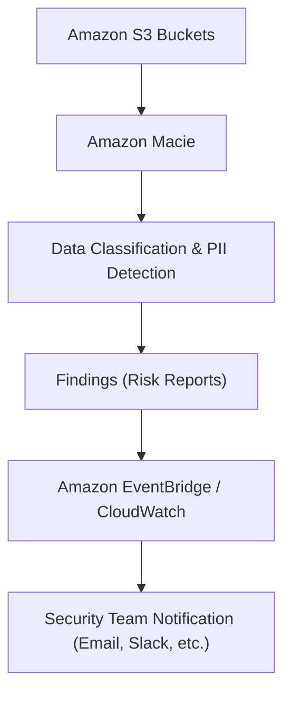

# 🔎 Amazon Macie 정리

---

## 1️⃣ Amazon Macie란?

Amazon Macie는 AWS에서 제공하는 데이터 보안 및 개인 정보 보호 서비스입니다.
특히 Amazon S3에 저장된 민감 데이터(PII, 개인정보, 금융정보 등) 를 자동으로 식별·분류·보호합니다.

👉 쉽게 말해,
“S3 안에 중요한 개인정보가 들어 있는지 자동으로 찾아내는 보안 탐지기” 입니다.

---

## 2️⃣ 주요 기능

### 📂 데이터 검색 & 분류

S3 버킷 내 데이터를 스캔하여 개인정보, 신용카드번호, 주민등록번호 등 자동 탐지

### 🛡️ 민감 데이터 보호

PII(개인 식별 정보), 금융 데이터, 헬스케어 데이터 등 감지 가능

### 📊 대시보드 제공

민감 데이터의 위치, 위험 수준, 액세스 권한을 시각적으로 표시

### 🔔 알림 연동

Amazon EventBridge, CloudWatch와 연결해 보안 경고 자동화

---

## 3️⃣ 아키텍처 시각화

---

## 4️⃣ 특징

AI/ML 기반 분석 → 패턴 매칭 + 기계학습으로 데이터 식별

자동화된 스케일링 → 대규모 S3 버킷에도 적용 가능

보안 규정 준수 지원 → GDPR, HIPAA, PCI DSS 등 규제 준수에 활용

AWS 보안 서비스와 연동 → Security Hub, EventBridge, CloudWatch

---

## 5️⃣ 현업 활용 사례

### 🏦 금융기관 → 고객 신용카드/계좌 정보가 잘못된 버킷에 저장되지 않았는지 점검

### 🏥 의료기관 → 환자 의료기록(PII/PHI) 자동 탐지 및 규제(HIPAA) 준수

### 🛒 이커머스 → 고객 이름, 주소, 결제 정보가 퍼블릭 S3 버킷에 저장되지 않도록 감시

### 🛡️ 보안팀 → S3 접근 권한이 과도하게 열려 있는 버킷과 민감 데이터 포함 여부 점검

---

## ✅ 정리

Amazon Macie = S3 민감 데이터 탐지 & 보호 서비스

기능: 데이터 분류, PII 탐지, 위험 보고, 알림 연동

현업 활용: 규제 준수, 개인정보 보호, 데이터 보안 강화

👉 한마디로, “S3 안의 중요한 데이터를 자동으로 찾아주는 보안 감사관” 입니다.
