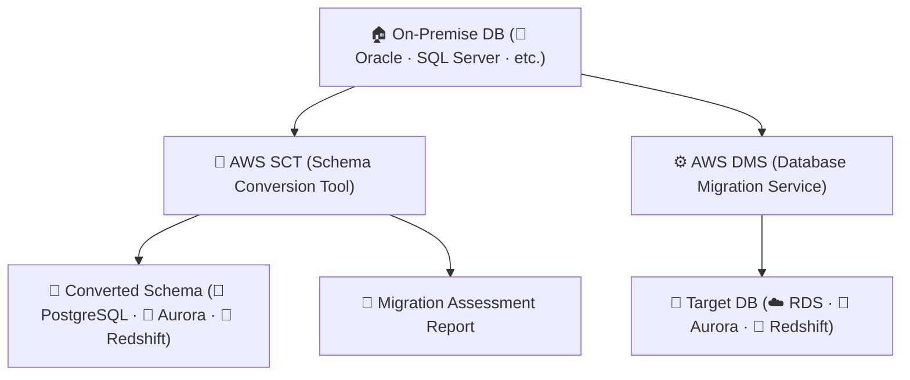

# 🧠 AWS SCT (Schema Conversion Tool) 정리

---

## 1️⃣ AWS SCT란?

AWS Schema Conversion Tool (SCT) 는
온프레미스나 타사 클라우드의 데이터베이스 스키마(테이블 구조, SQL, 뷰, 함수 등) 를
AWS 데이터베이스 형식으로 자동 변환해주는 무료 도구입니다.

👉 쉽게 말해,
“Oracle, SQL Server 같은 DB 구조를 AWS RDS나 Aurora용으로 자동 바꿔주는 도구” 입니다.

---

## 2️⃣ 주요 역할
| 기능                                | 설명                                                     |
| --------------------------------- | ------------------------------------------------------ |
| 🧩 **스키마 변환 (Schema Conversion)** | 기존 DB의 테이블 구조, 인덱스, 프로시저 등을 대상 DB 포맷으로 자동 변환           |
| ⚙️ **데이터베이스 호환성 분석**              | 변환 가능 여부 및 수동 수정이 필요한 항목 자동 분석                         |
| 📊 **변환 리포트 제공**                  | 변환 성공률, 비호환 객체, SQL 수정 제안 리포트 생성                       |
| 🔄 **DMS와 통합 연동**                 | DMS(Database Migration Service)와 함께 데이터까지 자동 마이그레이션 가능 |
| ☁️ **데이터 웨어하우스 변환 지원**            | OLTP DB → Amazon Redshift로 변환 지원                       |

---

## 3️⃣ 주요 사용 시나리오
| 시나리오                                       | 예시                                           |
| ------------------------------------------ | -------------------------------------------- |
| ✅ **이기종 마이그레이션 (Heterogeneous Migration)** | Oracle → Amazon Aurora (PostgreSQL/MySQL 호환) |
| ✅ **데이터 웨어하우스 이전**                         | Teradata / Netezza → Amazon Redshift         |
| ✅ **클라우드 통합 마이그레이션**                       | SQL Server (On-Premise) → AWS RDS            |
| ✅ **Hybrid 환경 마이그레이션**                     | 일부만 AWS로 이전, 나머지 온프레미스 유지                    |

---

## 4️⃣ AWS SCT + DMS 아키텍처 시각화

🧠 설명:

AWS SCT로 스키마를 변환하고,

AWS DMS로 데이터를 복제(이전) 하며,

AWS에서 최종 운영 환경으로 이전 완료.

---

## 5️⃣ 지원되는 변환 유형
| 소스 DB              | 대상 DB                                         |
| ------------------ | --------------------------------------------- |
| Oracle             | Amazon Aurora / PostgreSQL / MySQL / Redshift |
| SQL Server         | Amazon Aurora / PostgreSQL / Redshift         |
| MySQL              | Amazon Aurora / PostgreSQL / Redshift         |
| Db2 / Sybase       | Amazon RDS / Redshift                         |
| Teradata / Netezza | Amazon Redshift                               |

---

## 6️⃣ AWS SCT 변환 단계
| 단계                | 설명                                  |
| ----------------- | ----------------------------------- |
| ① **소스 DB 연결**    | 온프레미스 DB에 연결                        |
| ② **대상 DB 연결**    | RDS / Aurora / Redshift 등 AWS DB 연결 |
| ③ **스키마 분석**      | 변환 가능 여부 및 비호환 요소 탐지                |
| ④ **자동 변환 수행**    | 테이블, 뷰, 인덱스, 함수, 프로시저 변환            |
| ⑤ **검토 및 수동 수정**  | 일부 SQL 구문은 수동으로 조정                  |
| ⑥ **AWS DMS와 연동** | 데이터 복사(ETL) 진행                      |

---

## 7️⃣ 변환 리포트 예시 (Assessment Report)

✅ Conversion Success Rate: 변환 가능한 객체 비율

⚠️ Action Items: 수동 변환 필요 SQL / Stored Procedure

📄 Recommendations: AWS DB 엔진별 최적화 제안

🧠 예시

Oracle DB의 PL/SQL → PostgreSQL의 PL/pgSQL로 변환
일부 패키지 함수(DBMS_OUTPUT.PUT_LINE)는 수동 수정 필요

---

## 8️⃣ 현업 활용 사례
| 산업                | 활용 예시                                         |
| ----------------- | --------------------------------------------- |
| 🏦 **금융권**        | Oracle → Amazon Aurora PostgreSQL 마이그레이션      |
| 🏭 **제조 / IoT**   | 온프레미스 SQL Server → RDS MySQL 변환               |
| 🧠 **데이터 분석 플랫폼** | Teradata → Redshift 이전 후 Glue + QuickSight 분석 |
| 🏢 **공공기관**       | 상용 DB → 오픈소스 Aurora PostgreSQL로 비용 절감 전환      |

---

## 9️⃣ AWS DMS와의 연계 요약
| 항목    | AWS SCT           | AWS DMS                |
| ----- | ----------------- | ---------------------- |
| 역할    | 스키마 및 코드 변환       | 데이터 마이그레이션             |
| 대상    | 테이블 구조, SQL, 프로시저 | 실제 데이터                 |
| 실행 시점 | 사전 변환 단계          | 변환 후 실시간 복제            |
| 통합 방식 | DMS 프로젝트와 연계 가능   | SCT 변환 스키마 기반으로 데이터 복제 |

---

## ✅ 정리

AWS SCT (Schema Conversion Tool) = 데이터베이스 스키마 변환 도구

주요 기능: 스키마 변환, 호환성 분석, 리포트 생성, DMS 연동

장점:

이기종 DB 간 구조 변환 자동화

변환 리포트로 위험도 사전 파악 가능

DMS와 함께 사용 시 완전 자동화된 마이그레이션 구현

활용: Oracle → Aurora, Teradata → Redshift, SQL Server → PostgreSQL

👉 한마디로,
“AWS SCT는 데이터베이스 마이그레이션의 설계자(Structure Transformer)” 입니다.
