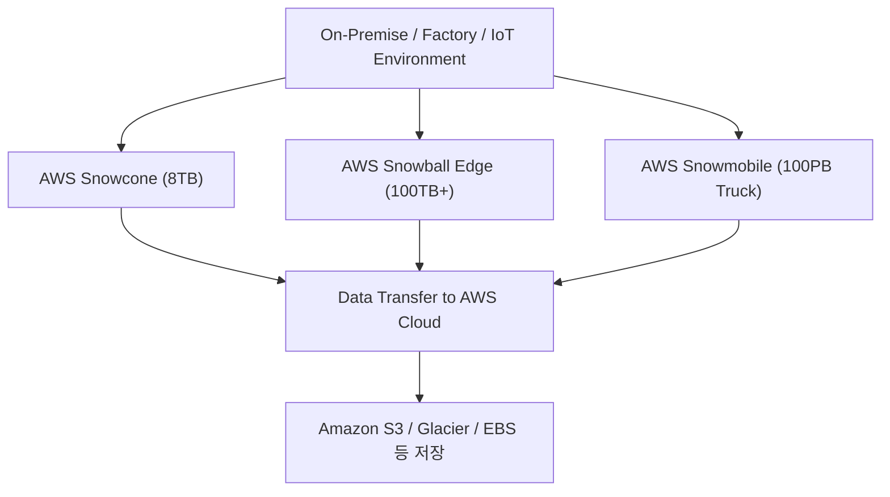

# ❄️ AWS Snow Family 정리

---

## 1️⃣ AWS Snow Family란?

AWS Snow Family는
네트워크 대역폭이 부족하거나 오프라인 환경에서도 대용량 데이터를 안전하게 이동할 수 있도록 돕는
물리적 데이터 전송 장치(Edge Device) 시리즈입니다.

👉 쉽게 말해,
“데이터를 인터넷으로 옮길 수 없을 때, AWS가 직접 하드웨어 장비를 보내주는 서비스” 입니다.

---

## 2️⃣ AWS Snow Family의 구성

---

| 서비스                   | 설명                                   | 용도                    |
| --------------------- | ------------------------------------ | --------------------- |
| **AWS Snowcone**      | 가장 작고 가벼운 장치 (8TB 스토리지, Edge 컴퓨팅 가능) | 소규모 데이터 수집, 엣지 디바이스용  |
| **AWS Snowball Edge** | 중간 크기 (80TB~210TB), 컴퓨팅 기능 포함        | 대규모 데이터 마이그레이션, 현장 분석 |
| **AWS Snowmobile**    | 초대형 트럭형 스토리지 (100PB까지)               | 데이터센터 전체 이전(엑사바이트급)   |

---

## 3️⃣ 시각적 구성도

---

## 4️⃣ 주요 기능

### 🚛 물리적 데이터 마이그레이션

AWS가 실제 장치를 고객에게 배송 → 데이터 적재 후 반납 → AWS가 업로드

### 🧠 Edge 컴퓨팅 지원

인터넷이 끊긴 환경에서도 Lambda, EC2 인스턴스 로컬 실행 가능

### 🔐 보안 강화

데이터 암호화(AES-256) + KMS 통합 + 하드웨어 보안 모듈 내장

### ⚙️ 내구성과 견고함

충격, 먼지, 온도 변화 등 극한 환경에서도 사용 가능

---

## 5️⃣ 서비스별 비교

---

| 항목      | **Snowcone**         | **Snowball Edge** | **Snowmobile** |
| ------- | -------------------- | ----------------- | -------------- |
| 용량      | 8TB                  | 80TB ~ 210TB      | 100PB (트럭 단위)  |
| 크기      | 초소형 (2kg 이하)         | 휴대용 박스형           | 트레일러 트럭        |
| 네트워크 연결 | Wi-Fi / 이더넷          | 10Gbps / 40Gbps   | 전용 연결          |
| 엣지 컴퓨팅  | 가능 (EC2 / Lambda 지원) | 가능                | 불가능            |
| 사용 시나리오 | IoT, 소규모 오프라인 환경     | 대규모 현장 데이터 처리     | 데이터센터 전체 이전    |

---

## 6️⃣ 현업 활용 사례

### 🏭 스마트 팩토리 (공장 자동화)

Snowcone으로 현장 IoT 센서 데이터를 수집 후 AWS로 업로드

### 🎥 미디어 산업

고용량 영상 데이터를 Snowball Edge에 저장 → S3 업로드

### 🏢 기업 데이터센터 이전

수백 PB 규모의 데이터 → Snowmobile 트럭으로 물리적 전송

### 🌍 원격지 분석 환경 (군사, 광산, 해양 등)

인터넷이 없는 환경에서 Edge 컴퓨팅 + 로컬 분석 수행

---

## ✅ 정리

AWS Snow Family = 물리 장비를 통한 데이터 전송 및 엣지 컴퓨팅 서비스

구성 제품: Snowcone, Snowball Edge, Snowmobile

활용 목적:

### 💾 대규모 데이터 이관

### ⚙️ 오프라인 환경에서의 분석/처리

### 🔒 안전한 물리적 데이터 마이그레이션

### 👉 한마디로, “AWS가 직접 하드웨어를 보내서 데이터를 클라우드로 옮겨주는 서비스” 입니다.
