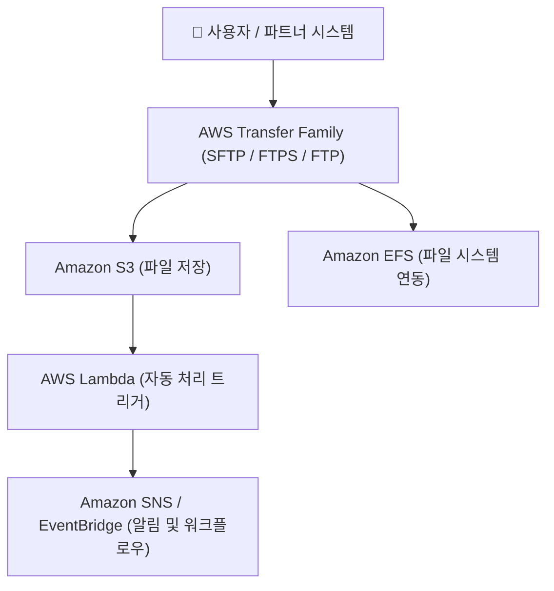
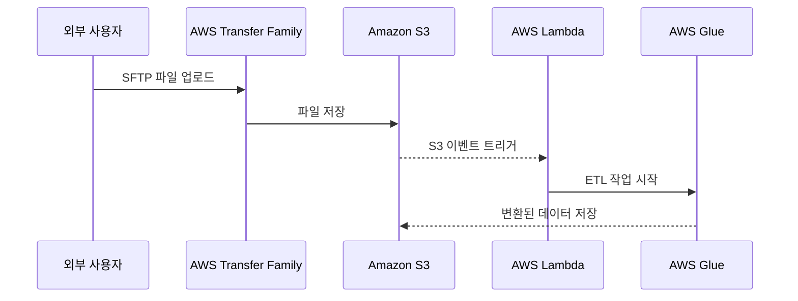

# 🔁 AWS Transfer Family 정리

---

## 1️⃣ AWS Transfer Family란?

AWS Transfer Family는
기존의 SFTP, FTPS, FTP 같은 파일 전송 프로토콜을 AWS 클라우드(S3, EFS) 와 직접 연결해주는 관리형 파일 전송 서비스입니다.

👉 쉽게 말해,
“기존 기업 시스템의 FTP 서버를 AWS로 옮길 수 있게 해주는 서비스” 입니다.

---

## 2️⃣ 주요 특징
| 특징                 | 설명                                   |
| ------------------ | ------------------------------------ |
| ☁️ **완전관리형 서비스**   | FTP 서버 구축, 보안 설정, 네트워킹 관리 불필요        |
| 🔐 **보안 통합**       | IAM, KMS, VPC, Security Group과 연동 가능 |
| 🧩 **프로토콜 호환성**    | SFTP(SSH), FTPS(TLS), FTP 지원         |
| 📂 **AWS 스토리지 통합** | 전송된 파일을 Amazon S3 또는 EFS에 자동 저장      |
| 🕹 **운영 자동화**      | 파일 업로드/다운로드 이벤트 트리거로 Lambda 자동 실행    |
| 💰 **비용 효율적**      | 서버 유지보수 없이 사용량 기반 과금                 |

---

## 3️⃣ 아키텍처 시각화

🧠 설명:
사용자는 기존의 SFTP 클라이언트로 접속하지만,
실제 파일은 AWS 내부의 S3 또는 EFS에 안전하게 저장됩니다.

---

## 4️⃣ 주요 사용 사례
| 시나리오                  | 설명                                           |
| --------------------- | -------------------------------------------- |
| 🏢 **레거시 시스템 연동**     | 기존 온프레미스 FTP 서버를 AWS로 이전                     |
| 📦 **파트너 간 데이터 교환**   | 외부 협력사와 SFTP로 파일 주고받기                        |
| 🧾 **회계/금융 데이터 송수신**  | 거래 데이터, 보고서 등 민감한 데이터 전송                     |
| 🧠 **자동화된 데이터 파이프라인** | S3에 파일 업로드 → Lambda → Glue ETL → Redshift 분석 |

---

## 5️⃣ Transfer Family + S3/Lambda 자동화 흐름

---

## 6️⃣ 보안 통합 포인트
| 보안 항목                   | 설명                              |
| ----------------------- | ------------------------------- |
| **IAM**                 | 사용자 인증 및 접근 제어                  |
| **VPC**                 | 내부망 전송 구성 (Private Endpoint 지원) |
| **KMS**                 | 데이터 암호화 관리                      |
| **CloudWatch Logs**     | 전송 이벤트 로그 및 모니터링                |
| **AWS Secrets Manager** | 자격 증명(비밀번호, 키) 안전 관리            |

---

## 7️⃣ 현업 활용 사례

### 🏦 금융권 / 공공기관

내부망 기반 SFTP 서버를 AWS로 이전해 보안성 강화

### 🏭 제조업 / IoT 데이터 교환

공장 데이터 로그를 SFTP로 전송 → AWS Glue 분석

### 🧩 미디어 업로드 파이프라인

협력사 영상 업로드 → S3 저장 → Lambda로 자동 처리

---

## ✅ 정리

AWS Transfer Family = AWS용 관리형 파일 전송 서비스 (SFTP/FTPS/FTP)

저장 대상: Amazon S3 또는 EFS

특징: 보안 통합, 서버 관리 불필요, 이벤트 기반 자동화 지원

현업 활용: 데이터 교환, 자동 파이프라인, 레거시 시스템 마이그레이션

👉 한마디로,
“AWS Transfer Family는 기존 FTP 서버를 AWS 클라우드로 옮겨주는 보안 강화형 파일 전송 서비스” 입니다.
